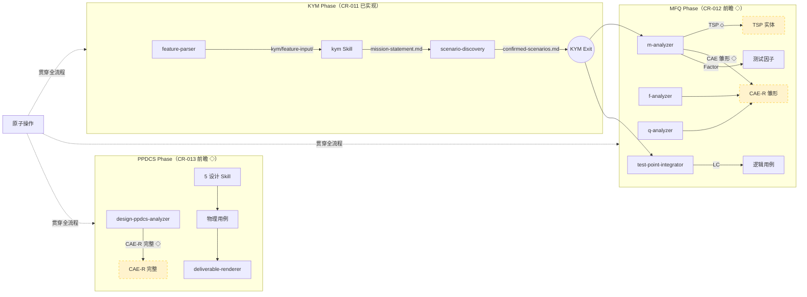

# ptm-tde 数据实体信息流规格

> **定位**：永久设计参考，覆盖 ptm-tde 三阶段（KYM / MFQ / PPDCS）中全部数据实体的生产→消费链路。
> **标注约定**：每个字段和消费关系必须标注实现状态——`[已实现]` 表示当前基线已存在，`[前瞻 CR-XXX]` 表示归属后续 CR。
> **状态基线**：CR-010（三阶段框架）+ CR-011（KYM 阶段）已实现；CR-012（MFQ 阶段）、CR-013（PPDCS 阶段）、后续因子库增强 CR 为设计前瞻。

---

## 修订记录

| 版本 | 日期 | 修订人 | 变更要点 |
|------|------|--------|----------|
| 1.0 | 2026-06-02 | meta-se | 初始版本，覆盖 8 个数据实体的完整生产→消费链路 |

---

## 概述

### 三阶段数据流总览



> **图例**：实线框 = 已实现；虚线框 + ◇ = 设计前瞻。

### 追踪链与数据实体映射

```
当前 ptm-tde 追踪链:
  SR → TP(C/A/E) → LC → 组合方案 → PC

v2 追踪链（前瞻 ◇）:
  SR → M → TSP → Model(LC) → Factor → CAE-R → PC → 原子操作
  ★     ★   ◇      ★          ★       ◇

KYM 前置（CR-011 已实现）:
  需求文档 → KYM(mission-statement.md) → 场景发现(confirmed-scenarios.md) → ...
  ★           ★                              ★
```

**图例**：★ = 已实现；◇ = 设计前瞻。

### 文件路径约定

| 阶段 | 产物根目录 | 说明 |
|------|-----------|------|
| KYM | `kym/` | CR-011 完成后，feature-parser 和 scenario-discovery 路径已迁至 `kym/` |
| MFQ | `mfq/` | CR-012 将迁至 `mfq/`；当前仍用 `analysis/`（m-analyzer 等） |
| PPDCS | `ppdcs/` | CR-013 将迁至 `ppdcs/`；当前仍用 `design/` 和 `analysis/coverage/` |

> **注意**：本文档中路径引用以最终目标路径为准。`[前瞻 CR-012]` / `[前瞻 CR-013]` 标注的路径在对应 CR 完成后生效。

---

## 实体 1：KYM 产出（mission-statement.md）

### 1.1 谁生产

| 属性 | 值 |
|------|-----|
| 生产方 | **kym Skill** `[已实现 CR-011]` |
| 所属阶段 | **KYM Phase**，步骤 1.2（feature-parser 之后、scenario-discovery 之前） |
| 定义源文件 | `skills/kym/SKILL.md` §执行流程 |
| 输出路径 | `kym/mission-understanding/mission-statement.md` `[已实现 CR-011]` |

### 1.2 何时生产

kym Skill 五阶段流程的**阶段四（文档化）**产出，在全流程中的时序位置：

```
GATE-1 Entry Gate（自动）→
  Step 1.1: feature-parser（输出 kym/feature-input/）→
  Step 1.2: kym Skill（五阶段）:
    阶段零：上下文预加载（读取 feature-parser 产物，自动预填 I/T 维度）
    阶段一：初始化
    阶段二：维度扫描
    阶段三：深度访谈（逐维度一问一答）
    阶段四：文档化 → 产出 mission-statement.md ← 本实体
  → Step 1.3: scenario-discovery
→ GATE-2 KYM Exit Gate（自检 + 人工确认）
```

### 1.3 生产格式

CIDTESTD 8 维度结构化 Markdown 文档。数据结构定义参见 `skills/kym/SKILL.md` §阶段四和 HLD-CR-011 §9.1，核心字段摘要：

| 字段组 | 关键字段 | 状态 |
|--------|---------|------|
| `customers` | `users[]`、`priority`、`concerns`、`usage_scenarios` | `[已实现 CR-011]` |
| `information` | `key_docs[]`、`change_scope`、`requirements_version` | `[已实现 CR-011]` |
| `developers` | `team`、`complexity`、`known_issues`、`code_language` | `[已实现 CR-011]` |
| `equipment` | `env_type`、`platform`、`topology_requirements` | `[已实现 CR-011]` |
| `schedule` | `delivery_date`、`test_cycle`、`milestones` | `[已实现 CR-011]` |
| `test_items` | `items[]`、`dont_test[]`、`scope`、`boundary_notes` | `[已实现 CR-011]` |
| `risks` | `{area, likelihood, impact, action}[]` | `[已实现 CR-011]` |
| `deliverables` | `required[]`、`format`、`audience` | `[已实现 CR-011]` |
| `confirmation_gaps` | `{gap_id, dimension, description, status}[]` | `[已实现 CR-011]` |
| `downstream_guidance` | `scenario_generation.focus_areas`、`mfq.suggested_m_granularity`、`ppdcs.suggested_coverage_depth` | `[已实现 CR-011]` |
| `skipped_dimensions` | 被用户跳过未讨论的维度列表 | `[已实现 CR-011]` |
| `deferred_ideas` | 范畴守卫捕获的测试设计讨论线索 | `[已实现 CR-011]` |

### 1.4 谁消费

| 消费方 | 消费阶段 | 消费状态 |
|--------|---------|---------|
| **scenario-discovery** | KYM Phase，步骤 1.3 | `[已实现 CR-011]` |
| **feature-parser** | KYM Phase，步骤 1.1 | N/A — 时序在前，不消费 |
| **kym Skill（上下文预加载）** | KYM Phase，步骤 1.2 阶段零 | `[已实现 CR-011]`（消费 feature-parser 产物而非自己的输出） |
| **m-analyzer** | MFQ Phase，步骤 2.1 | `[前瞻 CR-012]` |
| **f-analyzer** | MFQ Phase，步骤 2.2 | `[前瞻 CR-012]` |
| **q-analyzer** | MFQ Phase，步骤 2.3 | `[前瞻 CR-012]` |
| **design-planner** | MFQ Phase，步骤 2.5 | `[前瞻 CR-012]` |
| **design-ppdcs-analyzer** | PPDCS Phase，步骤 3.1 | `[前瞻 CR-013]` |
| **deliverable-renderer** | PPDCS Phase，步骤 3.4 | `[前瞻 CR-013]` |

### 1.5 如何消费（字段级消费卡片）

#### scenario-discovery 消费 `[已实现 CR-011]`

| 消费字段 | 用途 | 消费效果 |
|---------|------|---------|
| `customers[].priority` | 场景优先级排序 | 高优先级用户的场景排在 `confirmed-scenarios.md` 前列 |
| `test_items.items` | 限定 Scene Seed 选择范围 | 超出 KYM test_items 的种子标记为 `out_of_kym_scope`（建议性） |
| `downstream_guidance.scenario_generation.focus_areas` | 优先展开聚焦区域 | focus_areas 中场景获更详细分析 |
| `risks[].area` | 高风险区域场景增加异常路径 | 涉及风险区域的场景多展开 1-2 条异常路径 |
| `test_items.dont_test` | 排除场景生成范围 | dont_test 中模块不生成场景 |

#### m-analyzer 消费 `[前瞻 CR-012]`

| 消费字段 | 用途 | 消费状态 |
|---------|------|---------|
| `test_items.items` + `dont_test` | 确定 M 识别边界——items 作为候选单功能清单 | `[前瞻 CR-012]` |
| `risks[].area` + `likelihood` + `impact` | 通过 area→M 名称模糊匹配，为 CAE-R 雏形预填 `risk_level` | `[前瞻 CR-012]` |
| `customers[].concerns` | 关注点辅助判断测试重点 | `[前瞻 CR-012]`，可选 |
| `downstream_guidance.mfq.suggested_m_granularity` | 建议的 M 拆分粒度 | `[前瞻 CR-012]`，可选 |

#### PPDCS 阶段消费 `[前瞻 CR-013]`

| 消费字段 | 消费方 | 用途 |
|---------|--------|------|
| `developers.complexity` + `test_team.familiarity` | design-ppdcs-analyzer | 决定覆盖深度和测试设计方法选择 |
| `schedule.test_cycle` + `risks` | design-ppdcs-analyzer | 基于风险排优先级，紧张周期优先高风险 M |
| `equipment.env_type` | PC 生成 | 确定执行环境配置 |
| `deliverables.required` + `format` | deliverable-renderer | 确定输出格式和交付物类型 |
| `downstream_guidance.ppdcs.suggested_coverage_depth` | PPDCS 全部 Skill | 建议的覆盖深度（可选） |

### 1.6 消费时机

| 消费方 | 在消费方流程的哪个步骤读取 |
|--------|--------------------------|
| scenario-discovery | **步骤 1.3 启动时**：在场景生成前读取，用于优先级排序和范围限定 |
| m-analyzer | **步骤 2.1 步骤 1（加载输入）**：与 `kym/scenarios/confirmed-scenarios.md` 和 `kym/feature-input/` 一起加载，为 M 分析提供边界和风险数据 |
| design-ppdcs-analyzer | **步骤 3.1 启动时**：在设计计划消费之前读取，确定覆盖深度和设计方法 |
| deliverable-renderer | **步骤 3.4**：在生成交付物时读取，获取交付格式和环境信息 |

### 1.7 缺失行为

| 消费方 | 如果 mission-statement.md 不存在 |
|--------|-------------------------------|
| scenario-discovery | 不阻断。场景优先级使用默认逻辑判定；所有种子正常参与场景生成，无 `out_of_kym_scope` 标记 |
| m-analyzer（前瞻） | 不阻断。`test_items` 边界无来源，需用户手动提供；`risks` 无法预填 risk_level，CAE-R 的 R 字段中 risk_level 留空 |
| design-ppdcs-analyzer（前瞻） | 不阻断。覆盖深度和设计方法使用默认策略；执行环境和交付格式使用默认值 |
| deliverable-renderer（前瞻） | 不阻断。交付格式和内容使用默认模板 |

> **GATE-2 强制检查** `[已实现 CR-011]`：GATE-2 N1 检查 mission-statement.md 存在性；不存在时 **BLOCKING**，需先完成 kym Skill 访谈。此 Gate 是缺失行为的第一道防线。

---

## 实体 2：用户场景（confirmed-scenarios.md）

### 2.1 谁生产

| 属性 | 值 |
|------|-----|
| 生产方 | **scenario-discovery Skill** `[已实现 CR-010]` |
| 所属阶段 | **KYM Phase**，步骤 1.3 |
| 定义源文件 | `skills/scenario-discovery/SKILL.md` |
| 输出路径 | `kym/scenarios/confirmed-scenarios.md` `[已实现 CR-010/011]` |
| 路径迁移 | CR-011 将路径从 `analysis/scenarios/` 迁至 `kym/scenarios/` |

### 2.2 何时生产

在全流程中，scenario-discovery 是 KYM 阶段的最后一步：

```
Step 1.1: feature-parser → Step 1.2: kym Skill → Step 1.3: scenario-discovery
                                                      │
                                                      ├── 消费 kym/feature-input/
                                                      ├── 消费 kym/mission-understanding/（可选）
                                                      ├── 场景生成 + 优先级排序
                                                      └── 输出: kym/scenarios/confirmed-scenarios.md ← 本实体
```

### 2.3 生产格式

结构化 Markdown，包含场景链、拓扑目录和确认缺口。数据结构定义参见 `skills/scenario-discovery/SKILL.md`，核心组成：

| 组成部分 | 关键内容 | 状态 |
|---------|---------|------|
| `input_document_classification` | 输入文档类型分类（raw requirement / functional scenario seed / deployment scenario draft / confirmed scenario artifact） | `[已实现 CR-010]` |
| Scenario Chain | 每个场景的目标、原理、前置条件、原子操作、观察点、预期状态、最小逻辑链、退出动作 | `[已实现 CR-010]` |
| `normal_path` | 正常路径步骤序列：`step_id / sub_step_ids / operation / necessity / description` | `[已实现 CR-010]` |
| `abnormal_path` | 异常路径条目：`abnormal_item / related_normal_steps / input_or_state / expected_handling` | `[已实现 CR-010]` |
| `topology_ref` | 依赖组网的场景附 Mermaid 图 + 设备/端口/链路表 | `[已实现 CR-010]` |
| `action_source_ref` | 引用全局 atomic-ops 的 `op_id` | `[已实现 CR-010]` |
| `knowledge_ref` | 知识引用：`resolved / missing / unavailable` 三态 | `[已实现 CR-010]` |
| `scope_constraints` + `out_of_scope_candidates` | 范围收敛：用户约束和排除项 | `[已实现 CR-010]` |
| `confirmation_gaps` | 待确认缺口（区分可下传和必须先确认） | `[已实现 CR-010]` |
| `tool_abstraction_draft` | 未满足 atomic-ops 进入的 Tool Abstraction Draft | `[已实现 CR-010]` |

### 2.4 谁消费

| 消费方 | 消费阶段 | 消费状态 |
|--------|---------|---------|
| **m-analyzer** | MFQ Phase，步骤 2.1 | `[已实现 CR-010]` |
| **f-analyzer** | MFQ Phase，步骤 2.2 | `[已实现 CR-010]` |
| **q-analyzer** | MFQ Phase，步骤 2.3 | `[已实现 CR-010]` |
| **test-point-integrator** | MFQ Phase，步骤 2.4 | `[已实现 CR-010]` |
| **design-planner** | MFQ Phase，步骤 2.5 | `[已实现 CR-010]` |
| **design-ppdcs-analyzer + 5 设计 Skill** | PPDCS Phase | `[已实现 CR-010]` |
| **coverage-verifier** | PPDCS Phase，步骤 3.3 | `[已实现 CR-010]` |
| **deliverable-renderer** | PPDCS Phase，步骤 3.4 | `[已实现 CR-010]` |

### 2.5 如何消费（字段级消费卡片）

#### m-analyzer 消费 `[已实现 CR-010]`

| 消费字段 | 用途 |
|---------|------|
| Scenario Chain | 生成 TP 的场景上下文与最小逻辑链骨架 |
| `precondition_operations` | 生成 C 条件与前置动作 trace |
| `atomic_operations` | 生成 A 动作、动作顺序和 `scenario_chain_refs` |
| `action_source_ref`（atomic-ops `op_id`） | 识别 atomic-ops 依赖 |
| `knowledge_ref` | 记录需求/场景依据来源，`missing/unavailable` 保留原状态 |
| `confirmation_gaps` | 显式透传不确定事实 |
| `topology_ref` / 组网实例 | 为 CAE 拓扑角色提供可回链的真实绑定依据 |

#### test-point-integrator 消费 `[已实现 CR-010]`

| 消费字段 | 用途 |
|---------|------|
| `topology_ref` / 组网实例 | 为本 LC 涉及的拓扑角色绑定真实组网对象，生成 `topology_bindings` |
| `confirmation_gaps` | 透传到 LC 的 `confirmation_gap_refs` 中 |
| 场景链（Scenario Chain） | 在覆盖矩阵中保留 `SR → Scenario → TP → LC → TD` 追踪链 |
| `minimal_logic_chain` | 校验每个关键原子操作是否映射到 TP |

#### PC 生成阶段消费 `[已实现 CR-010]`

| 消费字段 | 用途 |
|---------|------|
| `topology_ref` / 设备/端口/链路表 | PC 物化回链——PC 中任何真实端口必须能回链到 `confirmed-scenarios.md` |
| `topology_bindings`（来自 LC） | PC 的组网描述、组网约束和测试步骤中的具体设备/端口引用 |

### 2.6 消费时机

| 消费方 | 读取时机 |
|--------|---------|
| m-analyzer | **步骤 2.1 步骤 1（加载输入）**：与 `kym/feature-input/` 一起加载，建立场景到测试逻辑的追溯 |
| f-analyzer / q-analyzer | **步骤 2.2 / 2.3 启动时**：读取场景链获取耦合/Q 分析的场景上下文 |
| test-point-integrator | **步骤 2.4 步骤 3.5（组网绑定）**：回查 confirmed-scenarios.md 为每个 LC 生成 `topology_bindings` |
| design-planner | **步骤 2.5**：消费 LC 的 topology bindings 状态，评估设计方法推荐 |
| PC 生成 | **步骤 3.2**：每次 PC 物化时回链 confirmed-scenarios.md 验证真实端口来源 |
| coverage-verifier | **步骤 3.3**：校验 PC 中拓扑绑定状态，不把 `needs-confirmation` 提升为 `confirmed` |

### 2.7 缺失行为

| 消费方 | 如果 confirmed-scenarios.md 不存在 |
|--------|----------------------------------|
| m-analyzer | **BLOCKING**：m-analyzer 前置条件要求该文件存在。无场景链时无法生成 CAE 测试点的场景上下文 |
| test-point-integrator | **BLOCKING**：无法完成拓扑绑定（`topology_bindings` 唯一数据来源） |
| PC 生成 | 无法验证真实端口回链——PC 中端口来源标记为 `unbound` |
| coverage-verifier | 无法验证拓扑绑定状态保持 |

> **GATE-2 强制检查** `[已实现 CR-010]`：GATE-2 Entry Criteria 要求 `kym/scenarios/confirmed-scenarios.md` 存在；缺失时 GATE-2 不执行。

---

## 实体 3：TSP（Topic / Scope / Purpose）

### 3.1 谁生产

| 属性 | 值 |
|------|-----|
| 生产方 | **m-analyzer Skill** `[前瞻 CR-012]` |
| 所属阶段 | **MFQ Phase**，M 分析步骤 2.5（插入在"逐模块功能分析"之后、"PPDCS 特征标注"之前） |
| 定义源文件 | `skills/m-analyzer/SKILL.md`（CR-012 将新增步骤 2.5） |
| 输出路径 | `mfq/m-analysis/tsp/` `[前瞻 CR-012]` |
| 参考设计 | HLD-CR-011 §11.1 TSP 实体设计 |

### 3.2 何时生产

M 分析改造后流程（◇ CR-012）：

```
步骤 2.1: m-analyzer
  1. 输入解析（消费 kym/feature-input/ + kym/scenarios/）
  2. 逐模块功能分析（提取单功能、场景关联、测试点）
  2.5. TSP 描述 ← 本实体插入点
  3. PPDCS 特征标注（消费 TSP purpose 引导特征判断）
  4. CAE-R 雏形生成
```

### 3.3 生产格式

结构化三元组（HLD-CR-011 §11.1）：

```yaml
tsp:                              # [前瞻 CR-012]
  id: "TSP-M<M编号>-NNN"          # TSP 唯一标识
  m_id: "M2"                      # 所属单功能
  topic: "根据优惠规则计算价格并输出购物清单"  # 一句话描述被测功能
  scope: "接收校验后商品数据 + 价格 + 优惠配置" # 输入输出边界
  purpose: "验证买二赠一/95折/冲突处理规则计算正确" # 测试意图
```

| 字段 | 类型 | 说明 |
|------|------|------|
| `id` | string | 唯一标识，格式 `TSP-M<N>-NNN` |
| `m_id` | string | 回链到所属单功能的 M 编号 |
| `topic` | string | 一句话被测功能描述 |
| `scope` | string | 输入输出边界（数据/配置/环境的限定范围） |
| `purpose` | string | 测试意图，用于引导 PPDCS 特征选择 |

### 3.4 谁消费

| 消费方 | 消费阶段 | 消费状态 |
|--------|---------|---------|
| **m-analyzer（步骤 3 — PPDCS 特征标注）** | MFQ Phase，同 Skill 内后续步骤 | `[前瞻 CR-012]` |
| **design-planner** | MFQ Phase，步骤 2.5 | `[前瞻 CR-012]`，可选 |
| **test-point-integrator** | MFQ Phase，步骤 2.4 | `[前瞻 CR-012/013]`（LC 组装时附着 TSP） |
| **design-ppdcs-analyzer** | PPDCS Phase，步骤 3.1 | `[前瞻 CR-013]` |

### 3.5 如何消费（字段级消费卡片）

#### PPDCS 特征标注消费 `[前瞻 CR-012]`

| Purpose 关注点 | 倾向 PPDCS 特征 | 理由 |
|---------------|----------------|------|
| 步骤顺序/流程协调 | P-Process | 多步骤有序约束 |
| 规则的输入输出正确性 | P-Parameter | 参数参与业务规则判定 |
| 数据本身的合法性 | D-Data | 独立取值验证 |
| 状态间的转换一致性 | S-State | 对象有多状态可互转 |
| 参数太多需要压缩组合 | C-Combination | 因子组合爆炸 |

> m-analyzer 在步骤 3（PPDCS 特征标注）时读取 TSP 的 `purpose` 字段辅助判断主特征。

#### design-planner 消费 `[前瞻 CR-012]`

| 消费字段 | 用途 |
|---------|------|
| `scope` | 确认 PPDCS 设计方法的输入/输出边界 |
| `purpose` | 交叉校验 CAE→PPDCS 推断是否与 TSP 意图一致 |

#### test-point-integrator 消费 `[前瞻 CR-012/013]`

| 消费字段 | 用途 |
|---------|------|
| TSP 整体 | LC 组装时将 TSP 附着到 LC（类似 PPDCS 特征标注的附着方式），供后续 PPDCS 阶段参考 |

### 3.6 消费时机

| 消费方 | 读取时机 |
|--------|---------|
| m-analyzer（PPDCS 特征标注） | **步骤 2.1 步骤 3**：TSP 生成后立即在 PPDCS 特征标注中使用 |
| design-planner | **步骤 2.5**：在 CAE→PPDCS 推断中交叉引用 TSP |
| test-point-integrator | **步骤 2.4 步骤 4（LC 结构化输出）**：将 TSP 作为 LC 元数据附着 |

### 3.7 缺失行为

| 消费方 | 如果 TSP 不存在 |
|--------|---------------|
| m-analyzer（PPDCS 特征标注） | 不阻断。PPDCS 特征标注按现有规则执行（基于需求描述 + 功能分析判断），无 TSP 辅助引导 |
| design-planner | 不阻断。CAE→PPDCS 推断仅基于 CAE 的 C/A/E 信号，无 TSP 交叉校验 |
| test-point-integrator | 不阻断。LC 中 TSP 字段留空 |

> TSP 是**增强性实体**，缺失不阻断流程，但会降低 PPDCS 特征标注的准确性和设计计划的一致性。当前 ptm-tde 基线无 TSP（归属 CR-012）；v2 追踪链 `SR → M → TSP → Model(LC)` 先以注释标注方向。

---

## 实体 4：测试因子（Factor）

### 4.1 谁生产

| 属性 | 值 |
|------|-----|
| 生产方 | **m-analyzer Skill**（提取/定义） + **公共因子库** `[已实现 CR-010]` |
| 所属阶段 | **MFQ Phase**，M 分析步骤 3（测试对象 / 测试因子 / 拓扑角色提取） |
| 定义源文件 | `skills/m-analyzer/SKILL.md` §步骤 3；`resource/factor-libraries/` |
| 输出路径（项目级） | `mfq/factor-usage/factor-bindings.md` + `mfq/m-analysis/test-objects-factors.md` `[已实现 CR-010]` |
| 公共库路径 | `resource/factor-libraries/` → 安装到 `~/.ptm-team/resource/factor-libraries/` |

### 4.2 何时生产

两类来源：

1. **从公共因子库复用**：m-analyzer 步骤 3 启动时，先读取公共因子库（`factor-library-lock.yaml`），按 `factor_id / factor_name / aliases / owner_object` 检索，命中 `active` 因子时复用
2. **从需求中新提取**：对公共库未覆盖的因子，m-analyzer 从单功能分析中提取，写入 `test-objects-factors.md`，未命中时写入 `candidate-factor-proposals.yaml` `[已实现 CR-010]`

### 4.3 生产格式

每个因子至少包含（参见 `skills/m-analyzer/SKILL.md` §步骤 3 + public factor library schema）：

```yaml
# 项目级因子记录（test-objects-factors.md）
- factor_id: FAC-IP
  factor_name: IP地址
  source_section: action-input
  data_domain: IPv4合法/非法边界
  related_object_id: OBJ-LOG-SERVER
  scenario_refs: [SCN-LOG-001]
  confirmation_gap_refs: []             # 待确认边界

# 公共因子库格式（factor-library.yaml）
- factor_id: FAC-L3-EGRESS-MODE         # [已实现 CR-010]
  factor_name: 三层转发出口选择模式
  factor_kind: control                  # control/data/constraint/state/condition/oracle
  design_role: driver                   # driver/constraint/oracle/precondition
  owner_object: OBJ-PR-EGRESS
  domain_model: enum
  value_type: enum
  values: [next-hop, out-interface]
  display_values: {next-hop: 下一跳, out-interface: 出接口}
  aliases: [出口模式, 转发出口类型]
  applicable_when: always
  downstream_methods: [P-Parameter, C-Combination]
  reuse_policy: must_reuse
  status: active
  sample_definitions: [...]            # 配置/功能样本定义
  usage_profiles: {...}                # 规定样本用途
  constraints: [...]                   # require/forbid/allowed_values

  # ◇ v2 增强（后续因子库增强 CR 前瞻）
  # factor_type: equivalence           # equivalence/boundary/bool/state/process
  # tags: [转发, 出口, 策略路由]        # 自由标签
```

| 字段 | 说明 | 状态 |
|------|------|------|
| `factor_id / factor_name` | 唯一标识 + 人类可读名称 | `[已实现 CR-010]` |
| `factor_kind` | 因子性质（control/data/constraint/state/condition/oracle） | `[已实现 CR-010]` |
| `design_role` | 设计角色（driver/constraint/oracle/precondition） | `[已实现 CR-010]` |
| `owner_object` | 隶属测试对象 | `[已实现 CR-010]` |
| `domain_model / value_type / values` | 值域模型和取值 | `[已实现 CR-010]` |
| `downstream_methods` | 映射 PPDCS 设计方法 | `[已实现 CR-010]` |
| `sample_definitions / usage_profiles` | 样本定义和用途规则 | `[已实现 CR-010]` |
| `constraints` | 因子间约束（require/forbid/allowed_values） | `[已实现 CR-010]` |
| `factor_type` | 测试设计视角类型（equivalence/boundary/bool/state/process） | `[前瞻 后续因子库 CR]` |
| `tags` | 自由标签，增强检索 | `[前瞻 后续因子库 CR]` |

### 4.4 谁消费

| 消费方 | 消费阶段 | 消费状态 |
|--------|---------|---------|
| **test-point-integrator** | MFQ Phase，步骤 2.4 | `[已实现 CR-010]` |
| **f-analyzer** | MFQ Phase，步骤 2.2 | `[已实现 CR-010]` |
| **q-analyzer** | MFQ Phase，步骤 2.3 | `[已实现 CR-010]` |
| **design-planner** | MFQ Phase，步骤 2.5 | `[已实现 CR-010]` |
| **5 PPDCS 设计 Skill** | PPDCS Phase，步骤 3.1-3.2 | `[已实现 CR-010]` |
| **coverage-verifier** | PPDCS Phase，步骤 3.3 | `[已实现 CR-010]` |
| **CAE-R（m-analyzer — 雏形）** | MFQ Phase，步骤 2.1 | `[前瞻 CR-012]`（因子域引用 → 具体值） |
| **PC 生成** | PPDCS Phase，步骤 3.2 | `[已实现 CR-010]` |

### 4.5 如何消费（字段级消费卡片）

#### test-point-integrator 消费 `[已实现 CR-010]`

| 消费对象/字段 | 用途 |
|-------------|------|
| `factor_bindings`（主契约） | LC 因子-取值表的数据来源；每个 LC 必须包含 `factor_bindings`（含 `library_id / factor_id_or_group_id / role / binding_mode / usage_context / sample_id / expr / materialized_stage / gap`） |
| `factor_refs`（兼容摘要） | 保留为兼容字段，不覆盖 `factor_bindings` |
| `sample_definitions` + `usage_profiles` | 在 TD 中决定哪些样本用于配置正向/反向、功能正向/反向 |

#### 5 PPDCS 设计 Skill 消费 `[已实现 CR-010]`

| Skill | 消费方式 |
|-------|---------|
| parameter-design | 消费 `downstream_methods` 命中 P-Parameter 的因子，提取规则约束和参数组合 |
| data-design | 消费 `downstream_methods` 命中 D-Data 的因子，使用 `domain_model` + `values` 划分等价类 |
| combination-design | 消费 `downstream_methods` 命中 C-Combination 的因子，使用 `constraints` 裁剪组合空间 |
| state-design | 消费 `factor_kind=state` 的因子，构建状态迁移表 |
| process-design | 消费因子作为流程节点的触发条件和数据输入 |

#### CAE-R 消费 `[前瞻 CR-012/013]`

| 消费阶段 | 消费方式 |
|---------|---------|
| CAE 雏形（MFQ） | C 字段引用因子域（如 `@domain.普通`），非具体值 |
| CAE-R 完整（PPDCS） | C 字段从 Model 规则实例化为因子具体值；`R.coverage` 记录 `factor_id → covered[]` |

#### coverage-verifier 消费 `[已实现 CR-010]`

| 消费内容 | 用途 |
|---------|------|
| `factor_bindings` 中全部因子 | 逐因子检查 PC 中是否有覆盖 |
| `constraints.require` / `factor_groups` | 检查必选因子和因子组是否完整覆盖 |
| `sample_definitions.usage_profiles` | 检查 config_test / function_test 样本是否有对应 PC |

### 4.6 消费时机

| 消费方 | 读取时机 |
|--------|---------|
| m-analyzer（自身 — 公共库检索） | **步骤 2.1 步骤 3 启动时**：先读公共库，再提取新因子 |
| test-point-integrator | **步骤 2.4 步骤 4（LC 结构化输出）**：生成因子-取值表 |
| design-planner | **步骤 2.5**：根据 `downstream_methods` 推荐 PPDCS 方法 |
| 5 设计 Skill | **步骤 3.1-3.2**：每个 LC 按 PPDCS 特征选择对应 Skill，消费因子进行设计 |
| coverage-verifier | **步骤 3.3**：逐因子逐样本检查覆盖 |

### 4.7 缺失行为

| 消费方 | 如果测试因子不存在 |
|--------|------------------|
| test-point-integrator | 无法生成 LC 因子-取值表；LC 中因子列留空，标记 `factor_coverage=missing` |
| 5 PPDCS 设计 Skill | 无因子时只能使用直接分析法（应极少使用）；设计方法选择受限 |
| coverage-verifier | 无法执行因子级覆盖检查；覆盖率报告只包含需求覆盖和测试点覆盖 |
| CAE-R（前瞻） | CAE C 字段无因子域可引用；R.coverage 字段为空 |

> **公共因子库缺失** `[已实现 CR-010]`：GATE-1 #7 检查公共因子库可解析性；不可访问时警告但不阻断。m-analyzer 可在项目中从零提取因子，但复用度低。

---

## 实体 5：CAE-R（Condition / Action / Effect / Reason）

### 5.1 谁生产

CAE-R 采用**渐进式超集**演进，分两个阶段生产：

| 阶段 | 生产方 | 形态 | 状态 |
|------|--------|------|------|
| MFQ（M 分析） | **m-analyzer** | **CAE 雏形**：C=因子域引用、A=动词、E=待定/期望、R=部分可填（risk_level 从 KYM 预填、intent 候选描述） | `[前瞻 CR-012]` |
| PPDCS（建模） | **design-ppdcs-analyzer** + 5 设计 Skill | **CAE-R 完整**：C=因子具体值、A=动词、E=具体期望、R=全字段填充 | `[前瞻 CR-013]` |

定义源文件：HLD-CR-011 §11.2 CAE-R 实体设计。

> **当前基线** `[已实现 CR-010]`：ptm-tde 已有 CAE 三元组（C/A/E），但无 R 追溯字段。CAE 由 m-analyzer（M）、f-analyzer（F）、q-analyzer（Q）各自产出。

### 5.2 何时生产

```
MFQ Phase（CR-012 前瞻 ◇）:
  m-analyzer 步骤 4: CAE-R 雏形生成
    ├── 从 KYM risks 预填 R.risk_level（area → M 名称模糊匹配）
    ├── 从 KYM test_items 生成 R.intent 候选描述
    └── R.rule_id / model_type / coverage 不可得（Model 未建立）

PPDCS Phase（CR-013 前瞻 ◇）:
  design-ppdcs-analyzer + 5 设计 Skill: CAE-R 完整填充
    ├── C: 因子域引用 → 因子具体值（从 Model 规则实例化）
    ├── E: 待定/期望 → 具体期望值（从 Model 规则输出）
    └── R: 全字段填充（rule_id / model_type / coverage / intent / risk_level）
```

### 5.3 生产格式

完整 CAE-R 结构（HLD-CR-011 §11.2）：

```yaml
cae_r:                                    # [前瞻 CR-012/013]
  id: "TP-M-001"
  m_id: "M2"
  lc_id: "LC-M2-001"                     # 关联 LC

  # ── C: 前置条件 = 因子值集合 ──
  condition:
    factors:
      - factor_id: "F-M2-01"
        value: "普通"                     # 雏形期: @domain.普通（因子域引用）
      - factor_id: "F-M2-03"
        value: "Y"

  # ── A: 执行动作 ──
  action:
    verb: "执行打印小票"

  # ── E: 预期效果 ──
  effect:
    - output: "receipt.total"
      check: 6.00

  # ── R: 追溯与意图 ──
  reason:
    rule_id: "R3"                        # 来自判定表规则 → 失败追溯
    model_type: "P-Parameter"            # 来自 PPDCS 特征 → 覆盖率报告
    coverage:                            # 因子域值覆盖记录 → 覆盖矩阵
      - factor_id: "F-M2-01"
        covered: ["普通"]
    intent: "验证普通商品买二赠一优惠的价格计算是否正确"
    risk_level: "high"                   # 来自 KYM risks（impact + likelihood）
```

| 字段组 | 字段 | 说明 | 雏形可得？（CR-012） | 完整可得？（CR-013） |
|--------|------|------|:---:|:---:|
| `condition` | `factors[].factor_id` | 关联因子 | 是（域引用） | 是（具体值） |
| `condition` | `factors[].value` | 因子取值 | 域引用（如 `@domain.普通`） | 具体值 |
| `action` | `verb` | 执行动作 | 是 | 是 |
| `effect` | `output / check` | 预期结果 | 待定/期望 | 具体期望值 |
| `reason` | `rule_id` | Model 规则 ID | 不可得 | 是 |
| `reason` | `model_type` | PPDCS 特征 | 不可得 | 是 |
| `reason` | `coverage` | 因子覆盖记录 | 不可得 | 是 |
| `reason` | `intent` | 测试意图 | 候选描述 | 完整 |
| `reason` | `risk_level` | 风险等级 | **是**（从 KYM 预填） | 可修正 |

### 5.4 谁消费

| 消费方 | 消费阶段 | 消费状态 |
|--------|---------|---------|
| **test-point-integrator** | MFQ Phase，步骤 2.4 | `[已实现 CR-010]`（消费 CAE 三元组，不含 R） |
| **design-planner** | MFQ Phase，步骤 2.5 | `[已实现 CR-010]` |
| **design-ppdcs-analyzer** | PPDCS Phase，步骤 3.1 | `[前瞻 CR-013]`（消费 CAE-R 完整） |
| **5 PPDCS 设计 Skill** | PPDCS Phase，步骤 3.1-3.2 | `[已实现 CR-010]`（消费 CAE）+ `[前瞻 CR-013]`（消费 R） |
| **coverage-verifier** | PPDCS Phase，步骤 3.3 | `[前瞻 CR-013]`（消费 R.coverage） |
| **PC 生成** | PPDCS Phase，步骤 3.2 | `[已实现 CR-010]` |
| **ptm-te / ptm-tae（执行层）** | 执行阶段 | `[前瞻 CR-013]`（消费 R.intent） |

### 5.5 如何消费（字段级消费卡片）

#### R 字段消费方（前瞻设计）

| R 字段 | 消费方 | 用途 | 从 KYM 可预填？ |
|--------|--------|------|:---:|
| `rule_id` | 失败追溯 | 从失败 PC → CAE-R → Model 规则，定位根因 | 否 |
| `model_type` | coverage-verifier | 按 Model 类型统计覆盖分布（如 "P-Parameter 覆盖率 85%"） | 否 |
| `coverage` | coverage-verifier | 累加为因子覆盖矩阵 | 否 |
| `intent` | ptm-te/ptm-tae | 失败时提供人类可读的测试意图描述 | 部分（候选描述） |
| `risk_level` | ptm-tm 风险管理 | 风险跟踪和优先级排序 | **是** |

#### KYM risks → CAE-R risk_level 预填契约 `[前瞻 CR-012]`

kym Skill 输出的 `risks` 使用 `{area, likelihood, impact, action}` 格式，M 分析阶段通过 `area` 字段与 M 的 `name` 字段模糊匹配：

| risks.impact + risks.likelihood | → CAE-R risk_level |
|--------------------------------|-------------------|
| impact=高 + likelihood=高/中 | `high` |
| impact=高 + likelihood=低 | `medium` |
| impact=中 + likelihood=高 | `medium` |
| 其余 | `low` |

### 5.6 消费时机

| 消费方 | 读取时机 |
|--------|---------|
| test-point-integrator | **步骤 2.4 步骤 1（测试点归集）**：收集 M/F/Q 来源的全部 CAE |
| design-planner | **步骤 2.5**：根据 CAE 的 C/A/E 信号推断 PPDCS 特征 |
| 5 PPDCS 设计 Skill | **步骤 3.1-3.2**：基于 CAE 三元组展开具体设计 |
| coverage-verifier | **步骤 3.3**：消费 CAE-R 的 R.coverage 执行因子域值覆盖检查 |

### 5.7 缺失行为

| 消费方 | 如果 CAE-R 不存在（当前基线：CAE 存在但无 R） |
|--------|---------------------------------------------|
| test-point-integrator | 正常工作——当前基线消费 CAE 三元组（C/A/E），不依赖 R 字段 |
| 5 PPDCS 设计 Skill | 正常工作——当前基线消费 CAE 三元组 |
| coverage-verifier | `[前瞻 CR-013]` 无 R.coverage → 无法按 model_type 分类统计；只能做需求覆盖 + 测试点覆盖两层 |
| ptm-te/ptm-tae | `[前瞻 CR-013]` 无 R.intent → 失败时无人类可读意图；只能输出 TP-ID 和 E 字段 |

> **当前基线 CAE 缺失行为**：CAE 是 ptm-tde 核心追踪链节点。CAE 不存在时，test-point-integrator 无数据源（BLOCKING），后续全部 PPDCS 设计 Skill 无输入。

---

## 实体 6：逻辑用例（LC）

### 6.1 谁生产

| 属性 | 值 |
|------|-----|
| 生产方 | **test-point-integrator Skill** `[已实现 CR-010]` |
| 所属阶段 | **MFQ Phase**，步骤 2.4（测试点整合） |
| 定义源文件 | `skills/test-point-integrator/SKILL.md` §步骤 3-4 |
| 输出路径 | `mfq/integration/logic-cases.md` `[已实现 CR-010]` |

### 6.2 何时生产

test-point-integrator 按以下步骤产出 LC：

```
步骤 2.4: test-point-integrator
  1. 测试点归集（M+F+Q 全量 CAE 按四/五级目录归集）
  2. 覆盖检查（需求层 + 场景层 + atomic-ops 覆盖）
  3. CAE 聚合规则与逻辑用例生成
     ├── 规则3（步骤序列）> 规则2（状态变体）> 规则1（参数化）> 规则0（直接）
     └── 合并后输出 LC ← 本实体
  3.5. 组网绑定（回查 confirmed-scenarios.md）
  4. 逻辑用例结构化输出（因子-取值表 + 动作路径 + 组网绑定 + trace refs + 覆盖 TP 表）
```

### 6.3 生产格式

每个 LC 包含以下结构化内容（`skills/test-point-integrator/SKILL.md` §步骤 4）：

```markdown
#### LC-<模块缩写>-<子模块缩写>-001：<逻辑用例标题>  [已实现 CR-010]

**测试逻辑**：<简述验证什么功能以及覆盖哪类场景>
**PPDCS 特征**：P-Parameter（来自 ppdcs-annotation.md）
**CAE 聚合规则**：规则1-参数化（来源TP：...）
**fact_status**：confirmed / needs-confirmation

**因子-取值表（来自 C 条件）**：
| 因子 | 取值列表 | 因子类型 | 等价类 |
|------|---------|---------|--------|
| ... | ... | ... | ... |

**动作路径**：
- 路径 P1: 进入配置页面 → 填写参数 → 点击确定 → 观测响应

**组网绑定（来自 confirmed-scenarios.md）**：
| topology_binding_id | topology_role_ref | role_expression | topology_ref | bound_object | binding_source | binding_status | confirmation_gap_refs |
| ... | ... | ... | ... | ... | ... | ... | ... |

**trace refs**：source_tp_ids / scenario_refs / action_source_refs / factor_refs / topology_bindings / ...
**覆盖测试点**：[TP 明细表]
**关联 SR**：SR-001, SR-002
```

| 组成部分 | 说明 | 状态 |
|---------|------|------|
| `source_tp_ids` | 聚合来源的 TP-ID 列表 | `[已实现 CR-010]` |
| 因子-取值表 | 从 `factor_bindings` 提取的因子×取值矩阵 | `[已实现 CR-010]` |
| 动作路径 | 操作步骤序列（含拓扑角色占位） | `[已实现 CR-010]` |
| `topology_bindings` | 从 confirmed-scenarios.md 绑定的真实组网对象 | `[已实现 CR-010]` |
| `trace_refs` | 全量追踪字段（`scenario_refs / action_source_refs / factor_refs / topology_role_refs / knowledge_refs / confirmation_gap_refs`） | `[已实现 CR-010]` |
| 覆盖 TP 表 | 每个来源 TP 的 C/A/E 关键信息 | `[已实现 CR-010]` |
| PPDCS 特征 | 来自 m-analyzer 的 ppdcs-annotation | `[已实现 CR-010]` |
| CAE 聚合规则 | 规则0-直接 / 规则1-参数化 / 规则2-状态变体 / 规则3-步骤序列 | `[已实现 CR-010]` |
| TSP 附着 | `[前瞻 CR-012/013]` — LC 组装时将 TSP 作为元数据附着 | `[前瞻 CR-012/013]` |

### 6.4 谁消费

| 消费方 | 消费阶段 | 消费状态 |
|--------|---------|---------|
| **design-planner** | MFQ Phase，步骤 2.5 | `[已实现 CR-010]` |
| **design-ppdcs-analyzer** | PPDCS Phase，步骤 3.1 | `[已实现 CR-010]` |
| **process-design** | PPDCS Phase | `[已实现 CR-010]` |
| **parameter-design** | PPDCS Phase | `[已实现 CR-010]` |
| **data-design** | PPDCS Phase | `[已实现 CR-010]` |
| **combination-design** | PPDCS Phase | `[已实现 CR-010]` |
| **state-design** | PPDCS Phase | `[已实现 CR-010]` |
| **PC 生成** | PPDCS Phase，步骤 3.2 | `[已实现 CR-010]` |
| **coverage-verifier** | PPDCS Phase，步骤 3.3 | `[已实现 CR-010]` |
| **deliverable-renderer** | PPDCS Phase，步骤 3.4 | `[已实现 CR-010]` |
| **case-retriever** | 交付后回查 | `[已实现 CR-010]` |

### 6.5 如何消费（字段级消费卡片）

#### design-planner 消费 `[已实现 CR-010]`

| 消费字段 | 用途 |
|---------|------|
| `source_tp_ids` + 因子-取值表 | 评估每个 LC 的复杂度，推荐 PPDCS 设计方法 |
| `topology_bindings[].binding_status` | 若存在 `needs-confirmation`，降低该 LC 的设计推荐置信度 |
| PPDCS 特征 | 交叉验证 CAE→PPDCS 推断 |
| `confirmation_gap_refs` | 若存在未决 gap，标记为"待确认后再设计" |

#### 5 PPDCS 设计 Skill 消费 `[已实现 CR-010]`

| Skill | 消费的 LC 组件 |
|-------|--------------|
| process-design | 动作路径（流程步骤）+ PPDCS 特征=P-Process + 因子-取值表（触发数据） |
| parameter-design | 因子-取值表（参数取值）× 动作路径 + PPDCS 特征=P-Parameter |
| data-design | 因子-取值表（数据值域）+ PPDCS 特征=D-Data |
| combination-design | 因子-取值表（多因子）× `constraints` + PPDCS 特征=C-Combination |
| state-design | 因子-取值表（状态值）× 动作路径 + PPDCS 特征=S-State |

#### PC 生成消费 `[已实现 CR-010]`

| 消费字段 | 用途 |
|---------|------|
| `topology_bindings` | PC 组网描述、组网约束和设备/端口引用——PC 中真实端口必须回链到 LC topology_bindings |
| 因子-取值表 | PC 预置条件和测试步骤的数据输入 |
| 动作路径 | PC 测试步骤的骨架 |
| `trace_refs` | PC 中保留回链到 SR → TP → LC 的追踪 |

#### coverage-verifier 消费 `[已实现 CR-010]`

| 消费内容 | 用途 |
|---------|------|
| `source_tp_ids` | 构建 SR→LC→PC 覆盖矩阵，检查每个 TP 是否有 PC |
| `topology_bindings[].binding_status` | 不把 `needs-confirmation` 提升为 `confirmed` |
| `confirmation_gap_refs` | 未决 gap 标记为覆盖例外 |

### 6.6 消费时机

| 消费方 | 读取时机 |
|--------|---------|
| design-planner | **步骤 2.5**：读取全部 LC 输出设计计划 |
| design-ppdcs-analyzer | **步骤 3.1 启动时**：读取 plan + 全部 LC，协调设计任务分配 |
| 5 设计 Skill | **步骤 3.1-3.2**：逐一处理分配给本方法的 LC |
| PC 生成 | **步骤 3.2**：每个 LC 设计完成后立即生成对应 PC |
| coverage-verifier | **步骤 3.3**：全部 PC 生成后，逐 LC 逐 TP 验证覆盖 |

### 6.7 缺失行为

| 消费方 | 如果 LC 不存在 |
|--------|--------------|
| design-planner | **BLOCKING**：无 LC 则无设计计划输入 |
| design-ppdcs-analyzer | **BLOCKING**：无 LC 则无设计任务 |
| 5 PPDCS 设计 Skill | **BLOCKING**：无 LC 则无设计对象 |
| PC 生成 | **BLOCKING**：每个 PC 对应一个 LC，不存在则无 PC |
| coverage-verifier | **BLOCKING**：无 LC→PC 链路则无法建立覆盖矩阵 |

> LC 是 ptm-tde 追踪链的核心聚合节点。缺失时整个 PPDCS 阶段无法启动。GATE-3（MFQ Exit Gate）M4 检查 `mfq/integration/logic-cases.md` 存在性 `[前瞻 CR-012]`。

---

## 实体 7：物理用例（PC）

### 7.1 谁生产

| 属性 | 值 |
|------|-----|
| 生产方 | **design-ppdcs-analyzer**（协调）+ **5 PPDCS 设计 Skill**（执行） `[已实现 CR-010]` |
| 所属阶段 | **PPDCS Phase**，步骤 3.1-3.2 |
| 定义源文件 | `skills/design-ppdcs-analyzer/SKILL.md` + 各设计 Skill `SKILL.md` |
| 输出路径 | `ppdcs/pc/<三级目录>-<四级目录>-<五级目录>-<逻辑用例名>.md` `[已实现 CR-010]` |
| 输出格式 | Markdown 表格，16 列（参见 `agents/ptm-tde.md` §物理用例字段规范） |

### 7.2 何时生产

PPDCS 阶段每个 LC 按 PPDCS 特征匹配设计 Skill，完成后立即生成 PC：

```
步骤 3.1-3.2: design-ppdcs-analyzer + 5 设计 Skill
  对每个 LC:
    1. 匹配 PPDCS 设计 Skill（P-Process → process-design, P-Parameter → parameter-design, ...）
    2. 执行设计（流程建模/规则提取/等价类划分/组合压缩/状态建模）
    3. 设计结果收敛为 PC ← 本实体
    4. PC 物化回链验证（真实端口 → topology_bindings → confirmed-scenarios.md）
```

### 7.3 生产格式

Markdown 表格，每行一个物理用例。字段规范参见 `agents/ptm-tde.md` §物理用例字段规范：

| 字段 | 说明 | 必填 | 状态 |
|------|------|:---:|------|
| 三级目录 | 特性名称 | — | `[已实现 CR-010]` |
| 四级目录 | 模块名称 | — | `[已实现 CR-010]` |
| 五级目录 | 子模块名称 | — | `[已实现 CR-010]` |
| 用例名称* | 简明描述测试目的 | ✅ | `[已实现 CR-010]` |
| 用例编号 | `PC-<模块>-<子模块>-NNN` | — | `[已实现 CR-010]` |
| 用例级别* | P0（冒烟）/ P1（基本）/ P2（重要）/ P3（一般）/ P4（生僻） | ✅ | `[已实现 CR-010]` |
| 组网描述* | 测试所需的网络拓扑和设备组网方式 | ✅ | `[已实现 CR-010]` |
| 组网约束 | 组网的限制条件（如特定接口、VLAN 等） | — | `[已实现 CR-010]` |
| 预置条件 | 执行前的环境和配置要求（多条用 `<br>` 分隔） | — | `[已实现 CR-010]` |
| 测试步骤* | 由 `case_steps` 渲染，格式为 `步骤名称<br>执行对象：<target><br>原子操作：<op_id> <args>` | ✅ | `[已实现 CR-019]` |
| 预期结果* | 与步骤对应的预期行为（多条用 `<br>` 分隔） | ✅ | `[已实现 CR-010]` |
| 首次创建版本* | 用例首次创建的版本号 | ✅ | `[已实现 CR-010]` |
| 最后变更版本 | 最近一次修改的版本号 | — | `[已实现 CR-010]` |
| 关键词 | 便于搜索的关键标签（逗号分隔） | — | `[已实现 CR-010]` |
| 测试类型* | 功能 / 性能 / 安全 / 可靠性 / 兼容性 等 | ✅ | `[已实现 CR-010]` |
| 是否自动化* | 是 / 否 | ✅ | `[已实现 CR-010]` |

### 7.4 谁消费

| 消费方 | 消费阶段 | 消费状态 |
|--------|---------|---------|
| **coverage-verifier** | PPDCS Phase，步骤 3.3 | `[已实现 CR-010]` |
| **deliverable-renderer** | PPDCS Phase，步骤 3.4 | `[已实现 CR-010]` |
| **ptm-te / ptm-tae**（执行层 — 原子操作映射） | 执行阶段 | `[已实现 CR-010]` |
| **case-retriever** | 交付后回查 | `[已实现 CR-010]` |

### 7.5 如何消费（字段级消费卡片）

#### coverage-verifier 消费 `[已实现 CR-010]`

| 消费字段 | 用途 |
|---------|------|
| 全部 PC | 构建 SR→LC→PC 覆盖矩阵；检查每个 TP 是否有对应 PC |
| `case_steps` | 校验每个步骤包含 `step_name / atomic_op.op_id / expected_result` |
| `action_source_refs` | 校验每个 `case_steps[].atomic_op.op_id` 已回链 |
| 用例级别 | 统计各优先级用例分布 |
| 测试类型 | 按测试类型维度统计覆盖 |
| 组网描述 + 组网约束 | 验证组网描述中真实端口可回链到 LC `topology_bindings` |
| 是否自动化 | 统计自动化覆盖率 |

#### deliverable-renderer 消费 `[已实现 CR-010]`

| 消费字段 | 用途 |
|---------|------|
| 全部 PC 表格 | 汇总到 `<特性名>特性测试用例.md` 总表 |
| `case_steps` | 作为 `测试步骤*` 的源契约，渲染步骤名称、执行对象和原子操作 |
| 三级/四级/五级目录 | 按目录层级组织交付文档结构 |
| 关键词 | 生成用例索引和标签检索 |
| 组网描述 + `topology_bindings` 回链 | 在交付物中保留 `topology_bindings / topology_role / source / fact_status`，不可丢弃 |

#### ptm-te / ptm-tae 消费 `[已实现 CR-010]`

| 消费字段 | 用途 |
|---------|------|
| `case_steps[].atomic_op` | 映射为可执行的原子操作序列（`execute_ops`） |
| 预置条件 | 执行前环境准备脚本 |
| 预期结果 | 断言和校验逻辑 |
| 组网描述 + 组网约束 | 确定测试拓扑配置 |
| `R.intent`（前瞻） | `[前瞻 CR-013]` 失败时展示人类可读测试意图 |

### 7.6 消费时机

| 消费方 | 读取时机 |
|--------|---------|
| coverage-verifier | **步骤 3.3**：全部 PC 生成后，逐文件逐行扫描 |
| deliverable-renderer | **步骤 3.4**：覆盖率验证通过后，汇总全部 PC 到交付文档 |
| ptm-te/ptm-tae | **执行阶段**：按 PC 编号逐一执行，映射测试步骤到原子操作 |

### 7.7 缺失行为

| 消费方 | 如果 PC 不存在 |
|--------|--------------|
| coverage-verifier | **BLOCKING**：无 PC 则无覆盖验证对象 |
| deliverable-renderer | **BLOCKING**：无 PC 则无法生成测试用例总表 |
| ptm-te/ptm-tae | **BLOCKING**：无 PC 则无可执行用例 |

> PC 是 ptm-tde 追踪链的最终交付节点，缺失时全流程无意义。GATE-4（PPDCS Exit Gate）P2 检查 PC 文件完整性 `[前瞻 CR-013]`。

---

## 实体 8：原子操作（Atomic Ops）

### 8.1 谁生产

| 属性 | 值 |
|------|-----|
| 生产方 | **全局 atomic-ops 命令**（外部定义，非 ptm-tde Skill 产出） `[已实现 CR-010]` |
| 所属阶段 | **贯穿全流程**（KYM / MFQ / PPDCS / 执行） |
| 定义源 | wiki 原子操作描述 或 全局命令 `atomic-ops` |
| 形态 | 预定义的 `op_id` + 操作语义集合 |

### 8.2 何时生产

原子操作是**静态知识库**，在 ptm-tde 启动前已存在，不随特性项目运行而动态生成。GATE-1 #3 检查其可用性 `[已实现 CR-010]`。

### 8.3 生产格式

预定义操作集合，每个操作包含：

| 属性 | 说明 | 状态 |
|------|------|------|
| `op_id` | 全局唯一操作标识（如 `fw_config_log_server`、`fw_config_policy_route`） | `[已实现 CR-010]` |
| 操作语义 | 操作的具体行为描述 | `[已实现 CR-010]` |
| 适用对象 | 操作可作用的测试对象类型 | `[已实现 CR-010]` |

### 8.4 谁消费

| 消费方 | 消费阶段 | 消费状态 |
|--------|---------|---------|
| **scenario-discovery** | KYM Phase，步骤 1.3 | `[已实现 CR-010]` |
| **m-analyzer** | MFQ Phase，步骤 2.1 | `[已实现 CR-010]` |
| **f-analyzer** | MFQ Phase，步骤 2.2 | `[已实现 CR-010]` |
| **q-analyzer** | MFQ Phase，步骤 2.3 | `[已实现 CR-010]` |
| **test-point-integrator** | MFQ Phase，步骤 2.4 | `[已实现 CR-010]` |
| **CAE（A 字段）** | MFQ Phase，步骤 2.1-2.3 | `[已实现 CR-010]` |
| **PC（测试步骤）** | PPDCS Phase，步骤 3.2 | `[已实现 CR-010]` |
| **ptm-te / ptm-tae（执行层）** | 执行阶段 | `[已实现 CR-010]` |

### 8.5 如何消费（字段级消费卡片）

#### scenario-discovery 消费 `[已实现 CR-010]`

| 消费方式 | 用途 |
|---------|------|
| `action_source_ref` 引用 `op_id` | 场景链中每个操作步骤关联到标准原子操作；`source_type=atomic-ops` |
| `GATE-2 #6` 检查 | 所有 `action_source_ref` 必须是真实 atomic-ops `op_id`，旧口径阻断 |

#### m-analyzer / f-analyzer / q-analyzer 消费 `[已实现 CR-010]`

| 消费字段 | 用途 |
|---------|------|
| `action_source_refs`（atomic-ops `op_id`） | CAE 的 A 字段引用标准原子操作；`action_source_refs` 只保留原子操作映射 |
| 场景链中的 `atomic_operations` | 生成 CAE 的 A 动作和动作顺序 |

#### CAE 消费（A 字段）`[已实现 CR-010]`

CAE 的 A（Action）字段约束：
- A 必须是可执行的操作，不能是"验证..."等描述性文字
- 优先使用 atomic-ops `op_id` 作为 `action_source_refs`
- 若 A 依赖 atomic-ops 但契约不完整，只写已确认部分，并在 `confirmation_gap_refs` 中注明缺口

#### PC 消费（测试步骤）`[已实现 CR-010]`

| 消费方式 | 用途 |
|---------|------|
| `case_steps[].atomic_op.op_id` | PC 的每个测试步骤显式引用 atomic-ops，并回链到 `action_source_refs` |

#### ptm-te / ptm-tae 消费 `[已实现 CR-010]`

| 消费方式 | 用途 |
|---------|------|
| `execute_ops` | 将 PC 测试步骤映射为原子操作序列，按顺序执行 |

### 8.6 消费时机

| 消费方 | 读取时机 |
|--------|---------|
| scenario-discovery | **步骤 1.3**：场景链构建时，每个操作步骤关联到标准原子操作 |
| m-analyzer | **步骤 2.1 步骤 1（加载输入）**：从 confirmed-scenarios.md 读取 `atomic_operations`，建立 `action_source_refs` 关联 |
| PC 生成 | **步骤 3.2**：生成 `case_steps[].atomic_op.op_id` 并同步回链 `action_source_refs`，确保可执行性 |
| ptm-te/ptm-tae | **执行阶段**：逐 PC 解析测试步骤，映射为原子操作序列 |

### 8.7 缺失行为

| 消费方 | 如果原子操作不可用 |
|--------|------------------|
| scenario-discovery | 无法建立 `action_source_ref`；场景链操作无标准化引用；GATE-2 #6 检查 **BLOCKING** |
| m-analyzer | CAE 的 A 字段无法引用标准操作；只能用自然语言描述动作，缺少 `action_source_refs` 映射 |
| PC 生成 | **BLOCKING**：缺少标准化 `atomic_op.op_id` 或无法回链 `action_source_refs` 时，不得通过 GATE-4 |
| ptm-te/ptm-tae | **BLOCKING**：无原子操作则无法执行测试 |

> **GATE-1 强制检查** `[已实现 CR-010]`：GATE-1 #3 检查原子操作可用性（全局命令或 wiki 可找到）；不可用时提示用户补充，不阻断（用户可继续分析，但执行阶段受阻）。

### 8.8 CLI 查询语义匹配（CR-016 新增）

> m-analyzer v3.0+ 通过 Step 1.6 运行 `atomic-ops list --format json` 获取全部操作的完整元数据（op_id / description / tags / parameters_summary），构建内存索引供 Step 2C 执行加权分词语义匹配。

**CLI 查询字段**：

| 字段 | 类型 | 语义匹配权重 | 说明 |
|------|------|:--:|------|
| `op_id` | string | 3.0 | 操作 ID，主匹配维度 |
| `description` | string | 1.0 | 操作描述，辅助匹配 |
| `aliases` | list[string] | 1.5 | 操作别名（如 subinterface/trunk/lag），由 atomic-ops 仓库定义和维护 |
| `parameters_summary` | list[{name,type,required}] | 1.5 | 参数名列表，辅助区分同类操作 |

**匹配级别**：

| 级别 | 条件 | 说明 |
|------|------|------|
| L1 strong-exact-match | action_source_ref 精确命中 | 无需语义匹配 |
| L2 strong-semantic-match | 加权总分 ≥ 6.0 | 直接复用 |
| L3 weak-semantic-match | 3.0 ≤ 总分 < 6.0 | 记录最佳匹配，人工审查 |
| L4 no-match | 总分 < 3.0 或 CLI 不可用 | 生成候选 |

**CLI 不可用降级**：Step 1.6 降级输出 WARNING，Step 2C 仅执行 L1 精确匹配 + L4 候选生成。不阻断流程。

**新增输出**：`mfq/atomic-op-usage/atomic-op-lock.yaml`（CLI 版本快照）、`mfq/atomic-op-usage/atomic-op-bindings.yaml`（匹配绑定）、`mfq/atomic-op-usage/atomic-op-resolution-report.md`（匹配统计）。

---

## 附录：实体生产消费矩阵（总表）

### A.1 全量生产→消费关系

| 实体 | 生产方 | 生产阶段 | 直接消费方（已实现） | 直接消费方（前瞻） |
|------|--------|---------|-------------------|-------------------|
| KYM 产出 | kym Skill | KYM: Step 1.2 | scenario-discovery, GATE-2 | m-analyzer, f-analyzer, q-analyzer, design-planner, design-ppdcs-analyzer, deliverable-renderer |
| 用户场景 | scenario-discovery | KYM: Step 1.3 | m-analyzer, f-analyzer, q-analyzer, test-point-integrator, design-planner, 5 设计 Skill, coverage-verifier, deliverable-renderer | — |
| TSP | m-analyzer | MFQ: Step 2.1 Step 2.5 | —（不存在于当前基线） | m-analyzer (PPDCS 标注), design-planner, test-point-integrator, design-ppdcs-analyzer |
| 测试因子 | m-analyzer + 公共因子库 | MFQ: Step 2.1 Step 3 | test-point-integrator, f-analyzer, q-analyzer, design-planner, 5 设计 Skill, coverage-verifier, PC 生成 | CAE-R (m-analyzer 雏形 → design-ppdcs-analyzer 完整) |
| CAE-R | m-analyzer (雏形) → design-ppdcs-analyzer (完整) | MFQ → PPDCS | test-point-integrator (CAE), design-planner (CAE), 5 设计 Skill (CAE), PC 生成 (CAE) | coverage-verifier (R.coverage), ptm-te/ptm-tae (R.intent) |
| 逻辑用例 | test-point-integrator | MFQ: Step 2.4 | design-planner, design-ppdcs-analyzer, 5 设计 Skill, PC 生成, coverage-verifier, deliverable-renderer, case-retriever | — |
| 物理用例 | 5 设计 Skill + design-ppdcs-analyzer | PPDCS: Step 3.1-3.2 | coverage-verifier, deliverable-renderer, ptm-te/ptm-tae, case-retriever | — |
| 原子操作 | 全局 atomic-ops 命令 | 贯穿全流程 | scenario-discovery, m-analyzer, f-analyzer, q-analyzer, test-point-integrator, CAE (A), PC (steps), ptm-te/ptm-tae | — |

### A.2 实体间依赖关系

```
原子操作（贯穿全流程，被所有阶段消费）
    │
    ▼
KYM 产出 ──→ 用户场景 ──→ TSP（前瞻）──→ 测试因子 ──→ CAE-R（前瞻）
    │              │              │              │              │
    ▼              ▼              ▼              ▼              ▼
scenario-      m-analyzer    design-planner  test-point-     5 PPDCS
discovery      f/q-analyzer  design-ppdcs-   integrator      Design
(#优先排序)    (#场景上下文)   analyzer       (#LC 组装)      Skills
                                              │
                                              ▼
                                          逻辑用例 (LC)
                                              │
                              ┌───────────────┼───────────────┐
                              ▼               ▼               ▼
                         5 PPDCS          coverage-        deliverable-
                         Design           verifier         renderer
                         Skills
                              │
                              ▼
                          物理用例 (PC)
                              │
                              ▼
                         ptm-te/ptm-tae
                         (原子操作执行)
```

### A.3 Gate 检查项与实体关联

| Gate | 检查项 | 关联实体 |
|------|--------|---------|
| GATE-1 #3 | 原子操作可用 | 原子操作 |
| GATE-1 #7 | 公共因子库可解析 | 测试因子 |
| GATE-1 #8 | KYM 产物目录就绪 `[已实现 CR-011]` | KYM 产出 |
| GATE-2 N1 | mission-statement.md 存在 `[已实现 CR-011]` | KYM 产出 |
| GATE-2 #5 | Topology Catalog | 用户场景 |
| GATE-2 #13 | Confirmation Gaps 分类 | 用户场景、KYM 产出 |
| GATE-2 #6 | atomic-ops 唯一口径 | 原子操作、用户场景 |
| GATE-3 M4 | LC 包含 factor_bindings + topology_bindings `[前瞻 CR-012]` | 逻辑用例、测试因子、用户场景 |
| GATE-3 M7 | 拓扑链路连续 `[前瞻 CR-012]` | 用户场景、逻辑用例 |
| GATE-3 W1 | KYM 场景覆盖 Warning `[前瞻 CR-012]` | 用户场景 |
| GATE-4 P2 | PC 文件完整 `[前瞻 CR-013]` | 物理用例 |
| GATE-4 P3 | PC 拓扑绑定回链 `[前瞻 CR-013]` | 物理用例、逻辑用例、用户场景 |
| GATE-4 P5 | 因子覆盖验证 `[前瞻 CR-013]` | 测试因子、物理用例 |
| GATE-5 #2 | 交付字段保留 `[已实现 CR-010]` | 物理用例（topology_bindings） |

### A.4 前瞻设计状态速查

| 实体/字段 | 当前基线 | CR-011 | CR-012 | CR-013 | 后续因子库 CR |
|-----------|:-------:|:------:|:------:|:------:|:----------:|
| KYM 产出 (mission-statement.md) | — | **已实现** | 消费 | 消费 | — |
| 用户场景 (confirmed-scenarios.md) | 已实现 | 路径迁移 | 消费 | 消费 | — |
| TSP 实体 | — | 仅 HLD 设计 | **实现** | 消费 | — |
| CAE 三元组 (C/A/E) | 已实现 | — | CAE→CAE-R 雏形 | CAE-R 完整 | — |
| CAE-R 完整 (含 R 字段) | — | 仅 HLD 设计 | R 部分可填 | **R 全字段填充** | — |
| 测试因子 (当前格式) | 已实现 | — | 消费 | 消费 | — |
| 测试因子 (factor_type + tags) | — | — | — | — | **实现** |
| 逻辑用例 (LC) | 已实现 | — | TSP 附着 | CAE-R 附着 | — |
| 物理用例 (PC) | 已实现 | — | — | 消费 CAE-R | — |
| 原子操作 | 已实现 | — | — | — | — |
| v2 追踪链 (SR→M→TSP→Model→Factor→CAE-R→PC) | 注释标注 | 注释标注 | **更新** | 无变化 | — |
| `analysis/` → `kym/` / `mfq/` / `ppdcs/` 路径迁移 | 部分 | KYM 完成 | **MFQ 完成** | **PPDCS 完成** | — |

---

## 引用源

| 源文件 | 用途 |
|--------|------|
| `agents/ptm-tde.md` | 三阶段框架、追踪链、运行时目录、物理用例字段规范、Skill 触发词映射 |
| `process/HLD-CR-011.md` | 完整三阶段数据流（§8）、集成契约与信息消费链路（§10）、前瞻设计（§11）、门控设计（§12） |
| `docs/ptm-tde/gate-spec.md` | GATE-1 至 GATE-5 检查项、人工确认项、跨阶段拓扑绑定检查 |
| `skills/kym/SKILL.md` | KYM 产出格式（CIDTESTD 8 维度 + risks 结构化格式） |
| `skills/m-analyzer/SKILL.md` | CAE 格式、测试因子提取格式、PPDCS 特征标注、拓扑角色契约 |
| `skills/test-point-integrator/SKILL.md` | LC 结构化格式、因子-取值表、组网绑定、CAE 聚合规则、追踪矩阵 |
| `resource/factor-libraries/` | 公共因子库 schema（factor_id / factor_kind / design_role / sample_definitions / constraints） |
| `process/changes/CR-011-ptm-tde-kym-phase.md` | KYM 阶段已实现范围 |
| `process/changes/CR-012-ptm-tde-mfq-phase.md` | MFQ 阶段前瞻范围（TSP 实体、CAE→CAE-R 雏形、因子格式演进） |
| `process/changes/CR-013-ptm-tde-ppdcs-phase.md` | PPDCS 阶段前瞻范围（CAE-R 完整填充、PC 生成、旧目录清理） |
