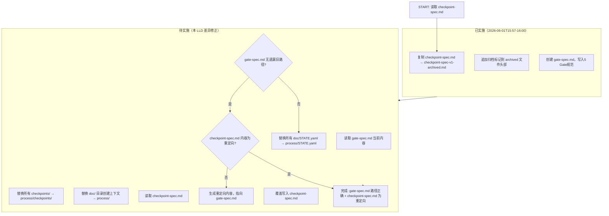

# LLD: STORY-010-01 — 归档旧 checkpoint-spec + 创建 gate-spec

> 文件名格式：`STORY-010-01-archive-and-gate-spec-LLD.md`
>
> 本文档是 `STORY-010-01` 的低层设计（Low-Level Design），需纳入全部目标 Story 的 LLD 统一确认，并满足当前 Wave 的 `dev_gate` 后方可进入实现。
>
> **注意**：本 Story 为**补写 LLD**——部分内容已在 CR-010 实施中先行完成（归档文件 + gate-spec 创建），本 LLD 记录已完成部分、标注待完成差异，并为剩余实现提供执行指导。

## 修订记录

| 版本 | 日期 | 修订人 | 变更要点 |
|------|------|--------|----------|
| 1.0 | 2026-06-01 | meta-dev | 初始版本。记录已实施内容（checkpoint-spec-v1-archived.md 归档 + gate-spec.md 创建），标注待补充差异（checkpoint-spec.md 替换为重定向、gate-spec.md 路径更新：`doc/STATE.yaml`→`process/STATE.yaml`、`checkpoints/`→`process/checkpoints/`） |
| 1.1 | 2026-06-01 | meta-dev | [P0-B2] 修正 §4「gate-spec.md 路径替换详细清单」L69 行：移除替换后重复的 `、process/`（原 `doc/` 替换为 `process/` 导致列表中 `process/` 出现两次）。更新「替换规则」说明增加 L69 特殊处理规则。 |

---

## 1. Goal

将 ptm-tde 的旧检查点规范 `docs/ptm-tde/checkpoint-spec.md`（CP01-CP12 检查点体系）归档为 `checkpoint-spec-v1-archived.md`，创建新的 `gate-spec.md`（5 Gate 门控体系）作为替代规范。同时处理原 `checkpoint-spec.md` 的去留，并更新 `gate-spec.md` 中的路径引用以符合最新目录结构决策（`doc/STATE.yaml`→`process/STATE.yaml`、`checkpoints/`→`process/checkpoints/`）。

完成后的工程效果：`docs/ptm-tde/` 下同时存在归档副本（`checkpoint-spec-v1-archived.md`，保留旧 CP01-CP12 规范用于历史追溯）、新规范（`gate-spec.md`，5 Gate 体系真相源）和原文件重定向（`checkpoint-spec.md`，指向 `gate-spec.md` 的简短索引），不再有两套规范并行混淆的风险。

---

## 2. Requirements（Functional / Non-Functional）

### 2.1 Functional

- **FR-01**：将 `docs/ptm-tde/checkpoint-spec.md` 的内容完整复制为 `docs/ptm-tde/checkpoint-spec-v1-archived.md`，保留历史追溯（已实施）
- **FR-02**：创建 `docs/ptm-tde/gate-spec.md`，包含 5 个 Gate（GATE-1 至 GATE-5）的完整规范，每个 Gate 含 Entry Criteria / Checklist / Exit Criteria / Deliverables，以及 CP↔Gate 映射表和跨阶段拓扑绑定检查（已实施）
- **FR-03**：将 `docs/ptm-tde/checkpoint-spec.md` 原文件替换为指向 `gate-spec.md` 的简短重定向说明，禁止保留两套规范并行（待实施）
- **FR-04**：更新 `docs/ptm-tde/gate-spec.md` 中的运行时路径引用，将 `doc/STATE.yaml` 改为 `process/STATE.yaml`，将 `checkpoints/` 改为 `process/checkpoints/`（待实施）

### 2.2 Non-Functional

- **NFR-01（可追溯性）**：归档文件 `checkpoint-spec-v1-archived.md` 必须在文件头部标注归档日期、归档原因和替代规范路径
- **NFR-02（原子性）**：`checkpoint-spec.md` 重定向替换与 `gate-spec.md` 路径更新应在同一变更中完成，避免中间状态
- **NFR-03（可发现性）**：`checkpoint-spec.md` 重定向内容必须包含明确的链接指向 `gate-spec.md`，使通过旧文件名访问的用户能在 5 秒内找到新规范

---

## 3. 模块拆分与职责

| 模块 / 文件组 | 职责 | 说明 |
|---|---|---|
| `docs/ptm-tde/checkpoint-spec-v1-archived.md` | 旧 CP01-CP12 检查点规范的**历史归档**，仅用于追溯，不作为当前工作流引用 | 已创建（2026-06-01T15:57），内容为 `checkpoint-spec.md` 的完整副本，文件头部已标注归档标记 |
| `docs/ptm-tde/gate-spec.md` | **新 Gate 规范真相源**，包含 5 个 Gate 的 Entry Criteria / Checklist / Exit Criteria / Deliverables、CP↔Gate 映射表、跨阶段拓扑绑定检查 | 已创建（2026-06-01T16:00），309 行。被 checkpoint-manager 和主 Agent 消费 |
| `docs/ptm-tde/checkpoint-spec.md` | **原文件**，当前仍保留旧 CP01-CP12 完整内容，与 gate-spec.md 形成两套规范并行 | 待替换为重定向说明（本 Story 待实施差异） |

**模块边界规则**：
- `gate-spec.md` 是当前版本 ptm-tde 检查体系的**唯一真相源**；其他文件（主 Agent、checkpoint-manager SKILL.md、文档）必须引用 `gate-spec.md` 而非旧 `checkpoint-spec.md`
- `checkpoint-spec-v1-archived.md` 仅供历史查阅，不得被任何当前工作流引用
- `checkpoint-spec.md` 替换为重定向后，不再保留任何旧 CP01-CP12 实质性内容

---

## 4. 代码结构与文件影响范围

| 动作 | 文件路径 | 变更内容 |
|---|---|---|
| 创建 | `docs/ptm-tde/checkpoint-spec-v1-archived.md` | **已实施**。`checkpoint-spec.md` 的完整归档副本，文件头部追加归档标记（归档日期、归档原因、替代规范路径） |
| 创建 | `docs/ptm-tde/gate-spec.md` | **已实施**。5 个 Gate（GATE-1 至 GATE-5）的完整规范，含 CP↔Gate 映射表、跨阶段拓扑绑定检查。初始版本 309 行 |
| 修改 | `docs/ptm-tde/checkpoint-spec.md` | **待实施**。将原有 160 行 CP01-CP12 检查点规范内容替换为简短重定向说明（约 20 行），指向 `gate-spec.md` |
| 修改 | `docs/ptm-tde/gate-spec.md` | **待实施**。批量替换运行时路径引用：`doc/STATE.yaml`→`process/STATE.yaml`、`checkpoints/`→`process/checkpoints/`、`doc/`（在 STATE.yaml 和目录创建的上下文中）→`process/` |

### gate-spec.md 路径替换详细清单

以下为 `gate-spec.md` 中需要替换的具体位置：

| 行号范围 | 当前文本 | 替换后文本 | 上下文 |
|---------|---------|-----------|--------|
| L58 | `doc/` 可创建，状态写入 `doc/STATE.yaml` | `process/` 可创建，状态写入 `process/STATE.yaml` | GATE-1 Entry Criteria |
| L69 | `kym/`、`mfq/`、`ppdcs/`、`process/`、`checkpoints/`、`doc/` | `kym/`、`mfq/`、`ppdcs/`、`process/`、`process/checkpoints/` | GATE-1 Checklist #6 |
| L76 | `checkpoints/GATE-1-Entry.md` 已生成 | `process/checkpoints/GATE-1-Entry.md` 已生成 | GATE-1 Exit Criteria |
| L77 | `doc/STATE.yaml` 记录 `current_phase: kym` | `process/STATE.yaml` 记录 `current_phase: kym` | GATE-1 Exit Criteria |
| L83 | `checkpoints/GATE-1-Entry.md` | `process/checkpoints/GATE-1-Entry.md` | GATE-1 Deliverables |
| L85 | `doc/STATE.yaml` | `process/STATE.yaml` | GATE-1 Deliverables |
| L95 | `checkpoints/GATE-2-KYM-Exit-auto.md` 已生成 | `process/checkpoints/GATE-2-KYM-Exit-auto.md` 已生成 | GATE-2 Exit Criteria |
| L96-97 | `checkpoints/GATE-2-KYM-Exit-auto.md`、`checkpoints/GATE-2-KYM-Exit-manual.md` | `process/checkpoints/GATE-2-KYM-Exit-auto.md`、`process/checkpoints/GATE-2-KYM-Exit-manual.md` | GATE-2 Exit Criteria |
| L98 | `doc/STATE.yaml` 记录 `current_phase: mfq` | `process/STATE.yaml` 记录 `current_phase: mfq` | GATE-2 Exit Criteria |
| L101-102 | `checkpoints/GATE-2-KYM-Exit-auto.md`、`checkpoints/GATE-2-KYM-Exit-manual.md` | `process/checkpoints/GATE-2-KYM-Exit-auto.md`、`process/checkpoints/GATE-2-KYM-Exit-manual.md` | GATE-2 Deliverables |
| L135 | `checkpoints/GATE-3-MFQ-Exit-auto.md` 已生成 | `process/checkpoints/GATE-3-MFQ-Exit-auto.md` 已生成 | GATE-3 Exit Criteria |
| L136-137 | 同上，含 `-manual.md` | 同上 | GATE-3 Exit Criteria |
| L139 | `doc/STATE.yaml` 记录 `current_phase: ppdcs` | `process/STATE.yaml` 记录 `current_phase: ppdcs` | GATE-3 Exit Criteria |
| L142-146 | `checkpoints/GATE-3-MFQ-Exit-auto.md`、`-manual.md` | `process/checkpoints/GATE-3-MFQ-Exit-auto.md`、`-manual.md` | GATE-3 Deliverables |
| L198-200 | GATE-4 的同结构路径引用 | 同上模式替换 | GATE-4 Exit Criteria |
| L202-207 | GATE-4 的 Deliverables 路径引用 | 同上模式替换 | GATE-4 Deliverables |
| L248 | `doc/STATE.yaml` 记录 `current_phase: exit` | `process/STATE.yaml` 记录 `current_phase: exit` | GATE-4 Exit Criteria |
| L250-256 | GATE-4 Deliverables 路径引用 | 同上模式替换 | GATE-4 Deliverables |
| L266 | `checkpoints/GATE-5-Exit.md` 已生成 | `process/checkpoints/GATE-5-Exit.md` 已生成 | GATE-5 Exit Criteria |
| L283 | `doc/STATE.yaml` 记录 `current_phase: completed` | `process/STATE.yaml` 记录 `current_phase: completed` | GATE-5 Exit Criteria |
| L285-290 | GATE-5 Deliverables 路径引用 | 同上模式替换 | GATE-5 Deliverables |

> **替换规则**：
> - `doc/STATE.yaml` → `process/STATE.yaml`（全局替换，共 7 处）
> - `doc/`（后跟"可创建"）→ `process/`（1 处，L58：`doc/` 可创建 → `process/` 可创建）
> - `checkpoints/` → `process/checkpoints/`（当出现在目录列表或后跟 `GATE-` 时，涉及约 20+ 处）
> - L69 特殊处理：`doc/` 从目录列表中**移除**而非替换，因为 `process/` 已在列表中（原列表含 `process/`，替换后避免 `process/` 重复出现）

---

## 5. 数据模型与持久化设计

无新增数据模型或持久化变更。本 Story 仅涉及 Markdown 文档文件的创建和修改，不涉及数据库、配置文件格式变更或序列化逻辑。

**唯一相关状态变更**：`gate-spec.md` 中 `process/STATE.yaml` 的 `current_phase` 取值从旧 11 步命名（`input`、`scenario`、`m-analysis` 等）改为新的阶段命名（`kym`、`mfq`、`ppdcs`、`exit`、`completed`），但此变更由主 Agent 在运行时写入，本 Story 仅在 gate-spec 中声明。

---

## 6. API / Interface 设计

本 Story 不涉及 API 或程序化接口。产物为纯 Markdown 文档文件，接口契约如下：

| 接口 / 入口 | 输入 | 输出 | 调用方 | 说明 |
|---|---|---|---|---|
| `docs/ptm-tde/gate-spec.md` | 无（纯规范文件） | 5 个 Gate 的完整规范（Entry Criteria / Checklist / Exit Criteria / Deliverables） | `skills/checkpoint-manager/SKILL.md`（读取 Gate 定义）、`agents/ptm-tde.md`（主 Agent 读取 Gate 流程） | 作为 ptm-tde 检查体系的唯一真相源，所有 Gate 检查逻辑以此文件为准 |
| `docs/ptm-tde/checkpoint-spec.md`（重定向后） | 无 | 指向 `gate-spec.md` 的重定向说明 | 通过旧文件名访问的用户 | 兼容性入口，不包含实质规范内容 |
| `docs/ptm-tde/checkpoint-spec-v1-archived.md` | 无 | 旧 CP01-CP12 规范的历史副本 | 仅人类查阅 | 归档文件，禁止被程序化消费 |

> **契约消费方影响**：checkpoint-manager SKILL.md 和主 Agent 在当前或后续 Story 中需要读取 `gate-spec.md` 以获取 Gate 定义。本 Story 确保 `gate-spec.md` 存在且路径引用正确，为消费方提供稳定的契约基础。

---

## 7. 核心处理流程

本 Story 的处理流程是纯文件操作序列，不涉及跨模块调用或异步路径：



1. **已实施步骤**（归档 + 创建）：
   - 复制 `docs/ptm-tde/checkpoint-spec.md` 完整内容到 `docs/ptm-tde/checkpoint-spec-v1-archived.md`
   - 在 archived 文件头部追加归档标记（归档日期、归档原因、替代规范路径）
   - 创建 `docs/ptm-tde/gate-spec.md`，写入 5 个 Gate 完整规范、CP↔Gate 映射表、跨阶段拓扑绑定检查

2. **待实施步骤**（差异修正）：
   - 在 `gate-spec.md` 中全局替换 `doc/STATE.yaml` → `process/STATE.yaml`（共 7 处）
   - 在 `gate-spec.md` 中全局替换 `checkpoints/` → `process/checkpoints/`（约 20+ 处）
   - 将 `doc/`（目录创建上下文）替换为 `process/`（1 处，GATE-1 Entry Criteria）
   - 生成 `checkpoint-spec.md` 的重定向内容（约 20 行，包含指向 `gate-spec.md` 的链接和说明）
   - 覆盖写入 `checkpoint-spec.md`

3. **验证步骤**：
   - `grep "doc/STATE.yaml" docs/ptm-tde/gate-spec.md` 应返回空
   - `grep "process/STATE.yaml" docs/ptm-tde/gate-spec.md` 应返回 7 行匹配
   - `grep "^checkpoints/" docs/ptm-tde/gate-spec.md` 应返回空
   - `grep "process/checkpoints/" docs/ptm-tde/gate-spec.md` 应返回 20+ 行匹配
   - `head -5 docs/ptm-tde/checkpoint-spec.md` 应显示重定向说明，非旧 CP01-CP12 内容

---

## 8. 技术设计细节

- **关键算法 / 规则**：无算法逻辑。本 Story 是纯文本文件操作，使用精确字符串替换。

- **依赖选择与复用点**：
  - `gate-spec.md` 的 Gate 编号、Checklist 项、CP↔Gate 映射表、拓扑绑定规则全部来自 HLD-CR-010.md §4（推荐方案总览）和 §9（高层模块与职责划分）的设计决策
  - `checkpoint-spec-v1-archived.md` 是 `checkpoint-spec.md` 的字节级副本，追加归档标记后即为完成

- **兼容性处理**：
  - **CP 编号映射保护**：gate-spec.md 包含 CP↔Gate 映射表，旧 CP01-CP12 仍可在文件内找到对应 Gate，保护旧引用
  - **旧文件名保留**：`checkpoint-spec.md` 作为文件名保留，但内容改为重定向，避免外部引用断链
  - **路径变更向后兼容**：gate-spec.md 中的路径引用从 `doc/STATE.yaml` 改为 `process/STATE.yaml`，`checkpoints/` 改为 `process/checkpoints/`。由于 ptm-tde 的初始化流程和目录创建由主 Agent（STORY-010-02）控制，路径的一致性需要在 STORY-010-02 实施时同步验证

- **图示类型选择**：流程图（§7 已提供 Mermaid 流程图，展示已实施/待实施分界）

---

## 9. 安全与性能设计

| 维度 | 设计措施 | 验证方式 |
|------|---------|---------|
| 安全 | 无安全风险。本 Story 仅修改 Markdown 文档文件，不涉及用户输入解析、命令执行、权限提升或敏感数据处理 | `dangerous-command-scan` 无中高风险检出 |
| 性能 | 无性能影响。文件操作涉及 2 个文件（gate-spec.md 局部修改 + checkpoint-spec.md 覆写），总量 < 500 行，毫秒级完成 | `wc -l` 统计行数变化，确认 gate-spec.md 行数变化 < 10 行（仅路径字符串长度差异） |

---

## 10. 测试设计

| 测试场景 | 前置条件 | 操作 | 预期结果 | 验证方式 |
|---------|---------|------|---------|---------|
| T01：gate-spec.md 路径替换完整性 | gate-spec.md 当前包含 `doc/STATE.yaml` 和 `checkpoints/` 引用 | 执行路径替换后，grep `doc/STATE.yaml` 和 `^checkpoints/` | 无匹配结果 | `grep -c "doc/STATE.yaml" gate-spec.md` 返回 0；`grep -c "^checkpoints/" gate-spec.md` 返回 0 |
| T02：gate-spec.md 新路径正确性 | 同上 | grep `process/STATE.yaml` 和 `process/checkpoints/` | `process/STATE.yaml` 出现 7 次（对应 5 个 Gate 的 Exit Criteria/Deliverables + 1 处初始结构声明）；`process/checkpoints/` 出现 ≥ 20 次 | `grep -c "process/STATE.yaml" gate-spec.md` 返回 7；`grep -c "process/checkpoints/" gate-spec.md` 返回 ≥ 20 |
| T03：checkpoint-spec.md 替换为重定向 | checkpoint-spec.md 当前为旧 CP01-CP12 完整内容（160 行） | 覆盖写入重定向内容后，cat 头部 | 文件内容为简短重定向说明（约 20 行），包含指向 `gate-spec.md` 的链接；旧 CP01-CP12 内容不再存在 | `head -5 checkpoint-spec.md` 显示重定向说明；`grep "CP01" checkpoint-spec.md` 返回空 |
| T04：归档文件完整性 | checkpoint-spec-v1-archived.md 存在 | `diff checkpoint-spec-v1-archived.md` 对比原始 checkpoint-spec.md（git 历史） | 归档文件的主体内容（不含追加的归档标记）与原始 checkpoint-spec.md 一致 | `git diff HEAD -- docs/ptm-tde/checkpoint-spec.md \| diff - docs/ptm-tde/checkpoint-spec-v1-archived.md` 仅归档标记行有差异 |
| T05：gate-spec.md 结构完整性 | gate-spec.md 存在 | 验证 5 个 Gate 章节完整 | GATE-1 至 GATE-5 各含 Entry Criteria / Checklist / Exit Criteria / Deliverables（GATE-5 Deliverables 含在 Exit Criteria 中） | `grep -c "^## GATE-" gate-spec.md` 返回 5 |
| T06：CP↔Gate 映射表可解析 | gate-spec.md 存在 | 读取 CP↔Gate 映射表 | 12 个旧 CP 编号全部有对应映射（Gate 或阶段内滚动自检） | `grep -c "^| CP" gate-spec.md` ≥ 12 |

> **T01-T03 对应 §6 接口契约**：验证 gate-spec.md 作为唯一真相源的路径引用正确性。  
> **T03 对应 §7 异常路径**：验证 checkpoint-spec.md 不为空且不再包含旧内容。

---

## 11. 实施步骤

| TASK-ID | 动作 | 目标文件 | 详细描述 | 对应测试 |
|---------|------|---------|---------|---------|
| TASK-010-01-01 | **已实施**：创建归档副本 | `docs/ptm-tde/checkpoint-spec-v1-archived.md` | 将 `checkpoint-spec.md` 内容完整复制为 `checkpoint-spec-v1-archived.md`，在文件头部追加归档标记（标注归档日期：2026-06-01、归档原因：CR-010 三阶段框架改造，由 gate-spec.md 替代、替代规范路径：`docs/ptm-tde/gate-spec.md`） | T04 |
| TASK-010-01-02 | **已实施**：创建 gate-spec | `docs/ptm-tde/gate-spec.md` | 创建 5 个 Gate（GATE-1 至 GATE-5）的完整规范文件，每个 Gate 含 Entry Criteria / Checklist / Exit Criteria / Deliverables，以及 CP↔Gate 映射表和跨阶段拓扑绑定检查。内容基于 HLD-CR-010.md §4 和 §9 的设计决策 | T05, T06 |
| TASK-010-01-03 | **待实施**：更新 gate-spec 路径引用 | `docs/ptm-tde/gate-spec.md` | 全局替换 `doc/STATE.yaml` → `process/STATE.yaml`（7 处）、`checkpoints/` → `process/checkpoints/`（约 20+ 处）、`doc/`（目录创建上下文）→ `process/`（1 处）。详见 §4「gate-spec.md 路径替换详细清单」 | T01, T02 |
| TASK-010-01-04 | **待实施**：替换 checkpoint-spec.md 为重定向 | `docs/ptm-tde/checkpoint-spec.md` | 将原文件内容（约 160 行 CP01-CP12 规范）替换为简短重定向说明，包含：1）说明旧规范已归档为 `checkpoint-spec-v1-archived.md`；2）指向 `gate-spec.md` 作为当前 Gate 规范真相源；3）CP↔Gate 映射的简要说明。建议重定向内容约 20 行 | T03 |
| TASK-010-01-05 | **待实施**：验证 | 全部 3 个文件 | 执行 §10 全部 6 个测试场景（T01-T06），确认 gate-spec.md 路径引用正确、checkpoint-spec.md 为重定向、归档文件完整 | T01-T06 |

> **TASK-ID 与文件影响的对应关系**：
> - TASK-010-01-01 → `checkpoint-spec-v1-archived.md`
> - TASK-010-01-02 → `gate-spec.md`
> - TASK-010-01-03 → `gate-spec.md`
> - TASK-010-01-04 → `checkpoint-spec.md`
> - TASK-010-01-05 → 全部 3 个文件

---

## 12. 风险、难点与预研建议

### 12.1 实现灰区与取舍记录

| Clarification ID | 问题 | 选项与推荐 | 决策 / 答案 | 影响面 | 证据 | 重访条件 |
|---|---|---|---|---|---|---|
| LCQ-STORY-010-01-01 | gate-spec.md 路径更新方向：`doc/STATE.yaml` 和 `checkpoints/` 应改为 `process/STATE.yaml` 和 `process/checkpoints/`？ | **推荐**：改为 `process/STATE.yaml` 和 `process/checkpoints/`。理由：与 meta-flow 的 `process/` 目录体系对齐，且 ptm-tde 运行时目录中的 `process/plan/` 已在同一父目录下。<br>备选 A：保持 `doc/STATE.yaml` 和 `checkpoints/`。理由：与 ptm-tde 当前已 delivered 基线的路径一致，零变更。<br>备选 B：`doc/STATE.yaml` 改为 `process/STATE.yaml`，但 `checkpoints/` 保持不变。理由：状态文件迁入 `process/`，但检查点保留在独立目录便于查找。 | 采用推荐方案。用户指令已明确指定 `doc/STATE.yaml`→`process/STATE.yaml`、`checkpoints/`→`process/checkpoints/` | 接口：影响 gate-spec.md 中约 30+ 处路径引用；文件 owner：gate-spec.md 为本 Story 产物，无冲突；测试：§10 T01/T02 覆盖；跨 Story 契约：STORY-010-02（主 Agent 框架重写）、STORY-010-03（checkpoint-manager SKILL.md）和 STORY-010-04（run_checkpoint.py）需要与 gate-spec.md 的路径声明一致 | 用户指令 | 若 STORY-010-02 实施时发现主 Agent 初始化流程中使用 `doc/` 和 `checkpoints/` 路径且大规模冲突 → 评估统一回退或创建路径交叉映射 |

| 风险 / 难点 | 影响 | 缓解措施 / 预研建议 |
|---|---|---|
| **R1**：gate-spec.md 路径替换不完整（遗漏某些 `checkpoints/` 或 `doc/STATE.yaml` 引用） | gate-spec.md 与主 Agent（STORY-010-02）实际创建的目录不一致，导致 GATE-1 检查通过但 checkpoint-manager 写入失败（路径不存在） | T01/T02 grep 验证全覆盖；路径替换使用显式映射表（§4 路径替换清单），逐行对照执行 |
| **R2**：checkpoint-spec.md 替换为重定向后，存在外部引用（如 wiki、旧项目文档）通过文件名直接访问到重定向而非预期内容 | 外部引用的读者看到重定向后可能困惑，但可通过链接找到 gate-spec.md | 风险接受。重定向内容包含明确的替代路径链接；旧内容已在 `checkpoint-spec-v1-archived.md` 中保留 |
| **R3**：路径替换后 `process/checkpoints/` 与 Meta Flow 的 `process/checks/` 命名相近，可能造成 ptm-tde 用户混淆 | 用户或开发者误将 ptm-tde 运行时检查点写入 Meta Flow 的 `process/checks/` | gate-spec.md 在文件开头新增「注意」段落说明 `process/checkpoints/`（ptm-tde 项目运行时目录）与 `process/checks/`（Meta Flow 工作流目录）的区别。此项由 STORY-010-02 主 Agent 重写时在初始化流程中进一步强化 |

### OPEN / Spike 跟踪

| ID | 类型（OPEN / Spike） | 问题 | 下一动作 | 责任方 |
|---|---|---|---|---|
| O-010-01-01 | OPEN | `gate-spec.md` 路径替换后，是否需要同步更新 HLD-CR-010.md 中引用的 `doc/STATE.yaml` 和 `checkpoints/` 路径？HLD 是设计文档，通常保持设计时的原样，但路径不一致可能引起困惑 | 待 CP5 全量 LLD 确认时由 meta-po 或用户决策：A）HLD 保持设计原样不改（推荐）；B）一并更新 HLD 中的路径引用以保持全文一致 | meta-po / 用户 |

---

## 13. 回滚与发布策略

- **发布方式**：文件修改直接提交到 git 仓库的 `main` 分支。本 Story 的产物（gate-spec.md 修改 + checkpoint-spec.md 重定向替换）与 CR-010 其他 Story 产物一起构成一次完整的 CR 交付。

- **回滚触发条件**：
  - gate-spec.md 路径替换后，STORY-010-02（主 Agent 重写）或 STORY-010-04（run_checkpoint.py 改造）验证时发现路径不一致导致运行时错误
  - checkpoint-spec.md 重定向替换后，下游 Skill 或文档存在对旧 `checkpoint-spec.md` 内容的硬引用且无法快速更新

- **回滚动作**：
  1. `git checkout HEAD~1 -- docs/ptm-tde/gate-spec.md`：恢复 gate-spec.md 到路径替换前状态
  2. `git checkout HEAD~1 -- docs/ptm-tde/checkpoint-spec.md`：恢复 checkpoint-spec.md 到旧 CP01-CP12 完整内容
  3. 归档文件 `checkpoint-spec-v1-archived.md` 不删除（它是纯增量，不影响回退）
  4. 重新评估路径替换策略，修正后重新实施 TASK-010-01-03 和 TASK-010-01-04

---

## 14. Definition of Done

- [ ] 14 个章节全部填写完成
- [ ] `checkpoint-spec-v1-archived.md` 存在且内容与原始 `checkpoint-spec.md` 一致（除归档标记外），文件头部包含归档日期、归档原因和替代路径
- [ ] `gate-spec.md` 包含 5 个 Gate（GATE-1 至 GATE-5）的完整规范，每个 Gate 含 Entry Criteria / Checklist / Exit Criteria / Deliverables
- [ ] `gate-spec.md` 的 CP↔Gate 映射表覆盖全部 12 个旧 CP 编号
- [ ] `gate-spec.md` 中所有 `doc/STATE.yaml` 已替换为 `process/STATE.yaml`（7 处全部替换）
- [ ] `gate-spec.md` 中所有 `checkpoints/` 已替换为 `process/checkpoints/`（约 20+ 处全部替换）
- [ ] `checkpoint-spec.md` 已替换为指向 `gate-spec.md` 的简短重定向说明，不再包含旧 CP01-CP12 规范内容
- [ ] §10 全部 6 个测试场景（T01-T06）通过
- [ ] `grep "doc/STATE.yaml" docs/ptm-tde/gate-spec.md` 返回空
- [ ] `grep "^checkpoints/" docs/ptm-tde/gate-spec.md` 返回空
- [ ] `grep "CP01" docs/ptm-tde/checkpoint-spec.md` 返回空（确认不再是旧规范）
- [ ] 实现灰区与取舍记录已回填所有相关 clarification item（LCQ-STORY-010-01-01 已决策）
- [ ] OPEN / Spike 已清点（O-010-01-01 为 HLD 路径一致性问题，不阻塞本 Story）
- [ ] `confirmed=false` 时不进入实现
- [ ] frontmatter 已填写 `tier: S`
- [ ] 与其他 Story（STORY-010-02 至 STORY-010-06）的接口契约一致：gate-spec.md 作为唯一真相源，路径引用与主 Agent 初始化流程对齐

---

## 人工确认区

> **CP5 — Story LLD 可实现性门**
> meta-dev 先写入 `process/checks/CP5-STORY-010-01-archive-and-gate-spec-LLD-IMPLEMENTABILITY.md` 自动预检结果。
> meta-po 收齐全部目标 Story 的 LLD、CP4 自动预检摘要和 CP5 自动预检后，再生成并提示用户审查 `checkpoints/CP5-ALL-STORIES-LLD-BATCH.md`。
> 用户统一确认全部目标 Story 的 LLD 后，仍需满足当前 Wave、依赖门控与文件所有权门控方可进入实现。

**CP5 checklist 摘要**：

| # | 检查项 | 状态 | 证据 |
|---|--------|------|------|
| 1 | LLD 覆盖 AC | 待检查 | 第 2 / 10 / 14 节 |
| 2 | 与 HLD / ADR 一致 | 待检查 | 第 3 / 8 / 12 节 |
| 3 | 文件影响范围明确 | 待检查 | 第 4 / 11 节 |
| 4 | 接口契约完整 | 待检查 | 第 6 节 |
| 5 | 测试与 dev_gate 可计算 | 待检查 | 第 10 / 14 节 |
| 6 | clarification queue 已收敛 | 待检查 | 第 12.1 节 / `STATE.md.parallel_execution.lld_clarification_queue` |

**人工确认回复**：

请直接回复以下任一整行：

```text
approve
修改: <具体修改点>
reject
```

- `approve`：LLD 设计合理，允许进入实现。
- `修改: <具体修改点>`：指出具体修改点后由 meta-dev 更新重提。
- `reject`：设计方向有根本问题，需重新设计。
- Codex 历史别名 `1/通过`、`2/修改: ...`、`3/不通过` 仅作兼容解析；新提示不得把多个别名混排为主要选项。

**人工审查结果回填**：

- 结论：`approved | changes_requested | rejected`
- 审查人：
- 审查时间：
- 修改意见：
- 风险接受项：
