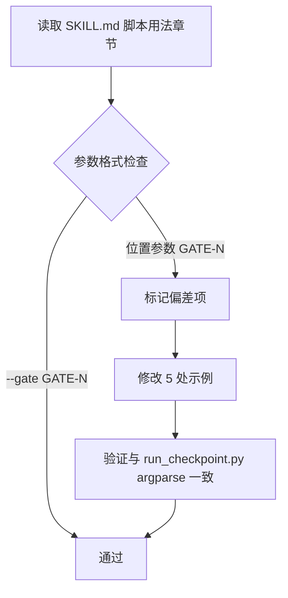

# LLD: STORY-010-03 — 更新 checkpoint-manager SKILL.md（Gate 模式）

> 文件名格式：`STORY-010-03-checkpoint-manager-skill-gate-mode-LLD.md`
>
> 本文档是 STORY-010-03 的低层设计。**当前产物状态：SKILL.md 已被前序 meta-dev 完全更新为 Gate 模式。** 本 LLD 为审计型 LLD，标注"已实现"状态，仅列出差异性修正和验证检查项。

---

## 修订记录

| 版本 | 日期 | 修订人 | 变更要点 |
|------|------|--------|----------|
| 1.0 | 2026-06-01 | meta-dev | 初始 LLD，SKILL.md 已实现，输出审计验证清单和 1 项差异修正 |

---

## 1. Goal

验证 `skills/checkpoint-manager/SKILL.md` 已按 CR-010 要求完成 Gate 模式更新，确认 10 项 CR 指定变更全部到位，标注现状为"已实现"，仅对 1 项差异（`--gate` 参数语法格式不一致）输出修正方案。

---

## 2. Requirements（Functional / Non-Functional）

### 2.1 Functional（来自 CR-010 + HLD-CR-010）

| # | 需求 | CR-010 来源 |
|---|------|------------|
| F1 | description 改为"ptm-tde 三阶段门控检查管理" | CR-010 §实施步骤 4 |
| F2 | argument-hint 改为 `gate=<GATE-1\|GATE-2\|GATE-3\|GATE-4\|GATE-5>` | CR-010 §实施步骤 4 |
| F3 | "## 目标"改为共享工具 Skill 说明，引用 `docs/ptm-tde/gate-spec.md` 为真相源 | CR-010 §实施步骤 4 |
| F4 | "## CP01 Input 自检" → "## GATE-1 Entry Gate"，路径更新为 `kym/` 等新目录 | CR-010 §实施步骤 4 |
| F5 | "## CP02 Scenario 场景自检" → "## GATE-2 KYM Exit Gate"，路径更新 | CR-010 §实施步骤 4 |
| F6 | 新增 "## GATE-3 MFQ Exit Gate"（含上下游 Warning W1/W2） | CR-010 §实施步骤 4 + CR-DQ-03 方案 A |
| F7 | 新增 "## GATE-4 PPDCS Exit Gate" | CR-010 §实施步骤 4 |
| F8 | 新增 "## GATE-5 Exit Gate"（纯自检） | CR-010 §实施步骤 4 |
| F9 | 脚本用法更新：`--gate` 参数 + `--cp` 兼容路由 | CR-010 §实施步骤 5 + CR-DQ-05 方案 A |
| F10 | 新增 "## CP↔Gate 兼容映射" 表 | CR-010 §实施步骤 4 + CR-DQ-01 方案 A |
| F11 | 更新 Gotchas：引用新 Gate 体系、gate-spec.md 真相源、GATE-3 Warning 非阻断 | CR-010 HLD §21 |
| F12 | 更新验收标准：覆盖 5 Gate 输出路径、`--cp` 兼容路由 | CR-010 HLD §19 |

### 2.2 Non-Functional

- **兼容性**：双模式（Gate + CP）不破坏 Meta Flow CP0-CP8 通用工作流
- **可维护性**：gate-spec.md 为单一规范真相源，SKILL.md 不重复 Checklist 细节
- **可读性**：章节命名与 HLD 阶段框架对齐

---

## 3. 模块拆分与职责

| 模块 / 文件组 | 职责 | 说明 |
|---|---|---|
| `skills/checkpoint-manager/SKILL.md` | ptm-tde 三阶段门控检查管理 Skill 定义 | **已实现**。Gate 模式已激活，CP 兼容模式保留 |
| `docs/ptm-tde/gate-spec.md`（上游依赖） | Gate 检查规范真相源 | 由 STORY-010-01 创建，本 Story 只读取和引用 |

该 Skill 是共享工具 Skill，不拥有任何阶段检查逻辑。所有 Checklist 细节以 `gate-spec.md` 为准。

---

## 4. 代码结构与文件影响范围

| 动作 | 文件路径 | 变更内容 |
|------|----------|----------|
| ~~修改~~ **已实现** | `skills/checkpoint-manager/SKILL.md` | 全文从 CP 体系改写为 Gate 模式：frontmatter description/argument-hint 更新；新增 GATE-1 至 GATE-5 五个一级章节（每个含 Entry Criteria / Checklist / 人工确认项 / Exit Criteria / Deliverables）；新增 CP↔Gate 兼容映射表；更新脚本用法示例（`--gate` 和 `--cp` 参数）；更新 Gotchas 和验收标准 |
| **差异修正** | `skills/checkpoint-manager/SKILL.md` §脚本用法 | `--gate` 参数语法修正：当前 SKILL.md 使用位置参数 `GATE-1`，应改为 `--gate GATE-1` 以匹配 `run_checkpoint.py` 的 argparse 接口（见 STORY-010-04 LLD） |

### 逐项实现状态核对

| 需求项 | 原指令 | 当前位置 | 状态 | 证据 |
|--------|--------|----------|------|------|
| F1 description | 改为三阶段门控检查管理 | SKILL.md L3-5 | ✅ 已实现 | `ptm-tde 三阶段门控检查管理：按阶段执行 Gate 检查` |
| F2 argument-hint | `gate=<GATE-1\|...\|GATE-5>` | SKILL.md L9 | ✅ 已实现 | `argument-hint: "gate=<GATE-1\|GATE-2\|GATE-3\|GATE-4\|GATE-5>"` |
| F3 目标章节 | 共享工具 Skill + gate-spec.md 引用 | SKILL.md L14-18 | ✅ 已实现 | `共享工具 Skill` + `docs/ptm-tde/gate-spec.md` |
| F4 GATE-1 | 替换 CP01 Input 自检 | SKILL.md L30-70 | ✅ 已实现 | `## GATE-1 Entry Gate`，含路径 `kym/`/`mfq/`/`ppdcs/`/`process/` |
| F5 GATE-2 | 替换 CP02 Scenario 自检 | SKILL.md L73-147 | ✅ 已实现 | `## GATE-2 KYM Exit Gate`，14 项 Checklist，8 项人工确认 |
| F6 GATE-3 | 新增 MFQ Exit Gate + Warning | SKILL.md L149-211 | ✅ 已实现 | `## GATE-3 MFQ Exit Gate`，8 项 Checklist + W1/W2 Warning |
| F7 GATE-4 | 新增 PPDCS Exit Gate | SKILL.md L213-264 | ✅ 已实现 | `## GATE-4 PPDCS Exit Gate`，7 项 Checklist + plan 消费检查 |
| F8 GATE-5 | 新增 Exit Gate（纯自检） | SKILL.md L266-301 | ✅ 已实现 | `## GATE-5 Exit Gate`，4 项 Checklist |
| F9 脚本用法 | `--gate` + `--cp` 兼容路由 | SKILL.md L368-405 | ⚠️ 偏差 | 见差异说明 |
| F10 CP↔Gate 映射表 | 兼容路由表 | SKILL.md L346-365 | ✅ 已实现 | `## CP↔Gate 兼容映射`，覆盖全部 12 个 CP |
| F11 Gotchas | 新 Gate 体系引用 | SKILL.md L407-416 | ✅ 已实现 | 引用 gate-spec.md、GATE-3 Warning 非阻断 |
| F12 验收标准 | 5 Gate 输出路径 | SKILL.md L419-432 | ✅ 已实现 | 12 项验收标准 |

### 差异说明：脚本用法参数格式

**现状**（SKILL.md L372-378）：
```bash
uv run --python 3.11 python skills/checkpoint-manager/scripts/run_checkpoint.py GATE-1 --project-root .
```

**应改为**（匹配 STORY-010-04 的 argparse 设计）：
```bash
uv run --python 3.11 python skills/checkpoint-manager/scripts/run_checkpoint.py --gate GATE-1 --project-root .
```

原因：`run_checkpoint.py` 改造后将使用 argparse 的 `--gate` 命名参数，而非位置参数。SKILL.md 中的用法示例需与之保持一致。

---

## 5. 数据模型与持久化设计

无新增数据模型 / 持久化变更。SKILL.md 是纯 Markdown 文件，不涉及数据库或结构化存储。

---

## 6. API / Interface 设计

| 接口 / 入口 | 输入 | 输出 | 调用方 | 说明 |
|---|---|---|---|---|
| Skill 触发 | 用户触发词：`checkpoint`、`gate`、`GATE-1` 至 `GATE-5`、`自检` 等 | Skill 定义加载，指导主 Agent 如何执行 Gate 检查 | 主 Agent（`agents/ptm-tde.md`） | argument-hint: `gate=<GATE-N>` |
| `run_checkpoint.py` 调用 | `--gate GATE-N --project-root <path>` | `checkpoints/GATE-N-*.md` | checkpoint-manager Skill 的"脚本用法"章节指导 | SKILL.md 不直接调用脚本，仅提供用法说明 |

> 本节每个接口条目对应的测试见第 10 节。

---

## 7. 核心处理流程

本 Story 为**审计型 LLD**，不涉及新代码实现。核心处理流程为验证流程：

1. **逐项核对**：对照 CR-010 §实施步骤 4 的 10 项指令，检查 SKILL.md 中各章节是否到位
2. **差异识别**：发现 `--gate` 参数语法格式不一致（位置参数 vs 命名参数）
3. **差异修正**：修改 SKILL.md §脚本用法中的 `GATE-N` 为 `--gate GATE-N`（共 5 处）
4. **完整性校验**：确认 gate-spec.md 引用路径正确、CP↔Gate 映射表完整、Gotchas 覆盖新体系
5. **验收记录**：输出验证结果至 CP5 自动预检

### 差异修正流程图



---

## 8. 技术设计细节

- **关键规则**：SKILL.md 是 checkpoint-manager 的 Skill 定义文件，负责说明"如何使用"而非"如何实现"。脚本实现细节由 `run_checkpoint.py` 承载。
- **依赖选择**：gate-spec.md 是检查规范唯一真相源（由 STORY-010-01 创建）。SKILL.md 仅作入口说明和准入条件概要，不重复 Checklist 细节。
- **兼容性**：双模式映射表位于 `## CP↔Gate 兼容映射` 章节，CP03-CP07 路由到 MFQ 阶段内滚动自检（非独立 Gate），CP08/CP10 路由到 PPDCS 阶段内滚动自检。此映射与 HLD §10 "CP03-CP07 映射到 MFQ 阶段内滚动自检（不是独立 Gate）"一致。
- **图示类型**：流程图（差异修正路径）

---

## 9. 安全与性能设计

| 维度 | 设计措施 | 验证方式 |
|---|---|---|
| 安全 | SKILL.md 不含可执行代码、凭据或密钥；不引入用户输入注入风险 | 人工审查 |
| 性能 | 纯文档变更，不影响运行时性能 | N/A |

---

## 10. 测试设计

| 测试场景 | 前置条件 | 操作 | 预期结果 | 验证方式 |
|---|---|---|---|---|
| T1: frontmatter 完整性 | SKILL.md 可读 | 读取 frontmatter 字段 | `name=checkpoint-manager`，`description` 含"三阶段门控"，`argument-hint` 含 `gate=<GATE-1\|...>` | 人工检查 |
| T2: Gate 章节完整性 | SKILL.md 可读 | grep `## GATE-` | 命中 5 处：GATE-1 Entry、GATE-2 KYM Exit、GATE-3 MFQ Exit、GATE-4 PPDCS Exit、GATE-5 Exit | 自动化 grep |
| T3: CP↔Gate 映射表 | SKILL.md 可读 | grep `CP01` 至 `CP12` | 12 个映射行全部存在，GATE-3 边标注"新增" | 自动化 grep |
| T4: gate-spec.md 引用 | SKILL.md 可读 | grep `gate-spec.md` | 至少命中 1 次（目标章节 + Gotchas） | 自动化 grep |
| T5: 脚本用法一致 | SKILL.md §脚本用法 | grep `--gate GATE-` | 5 处 `--gate GATE-N`（非位置参数 `GATE-N`） | 自动化 grep |
| T6: Gotchas 覆盖 Gate 体系 | SKILL.md §Gotchas | grep `gate-spec.md` + `GATE-3` | 含真相源声明 + GATE-3 Warning 非阻断说明 | 自动化 grep |
| T7: 无旧 CP 章节标题 | SKILL.md 可读 | grep `## CP0` | 无 `## CP01 Input` 或 `## CP02 Scenario` 标题 | 自动化 grep |
| T8: Gate 模式描述 | SKILL.md 正文 | 读取"## 目标"章节 | 描述为"共享工具 Skill"，引用 `docs/ptm-tde/gate-spec.md` 为真相源 | 人工检查 |

---

## 11. 实施步骤

| TASK-ID | 动作 | 目标文件 | 详细描述 | 对应测试 |
|---|---|---|---|---|
| TASK-010-03-01 | ~~修改（已实现）~~ | `skills/checkpoint-manager/SKILL.md` | 全文已由前序 meta-dev 从 CP 体系改写为 Gate 模式，覆盖 F1-F12 全部需求 | T1-T8 |
| TASK-010-03-02 | **差异修正** | `skills/checkpoint-manager/SKILL.md` §脚本用法 | 将 5 处位置参数 `GATE-1`/`GATE-2`/`GATE-3`/`GATE-4`/`GATE-5` 改为命名参数 `--gate GATE-1`/`--gate GATE-2`/`--gate GATE-3`/`--gate GATE-4`/`--gate GATE-5`，与 `run_checkpoint.py` argparse 接口一致 | T5 |
| TASK-010-03-03 | 验证 | `skills/checkpoint-manager/SKILL.md` | 运行 T1-T8 全部测试项，记录逐项结果 | T1-T8 |

---

## 12. 风险、难点与预研建议

### 12.1 实现灰区与取舍记录

| Clarification ID | 问题 | 选项与推荐 | 决策 / 答案 | 影响面 | 证据 | 重访条件 |
|---|---|---|---|---|---|---|
| LCQ-STORY-010-03-01 | `--gate` 参数在 SKILL.md 中应使用位置参数还是命名参数？当前 SKILL.md 使用 `GATE-1`（位置），但 run_checkpoint.py 将使用 `--gate GATE-1`（命名）。 | **推荐**：改为命名参数格式 `--gate GATE-1`，与 argparse 接口一致。备选：保留位置参数，但脚本需同时支持位置参数兼容。 | 推荐方案：改为 `--gate GATE-1` | 接口：SKILL.md §脚本用法 5 行示例；影响 test T5 验证逻辑 | run_checkpoint.py 改造后使用 `add_argument('--gate', ...)` 命名参数 | 若 meta-po 决定 run_checkpoint.py 同时支持位置参数偏移兼容，可回退为 `[--gate] GATE-N` 双格式 |

| 风险 / 难点 | 影响 | 缓解措施 / 预研建议 |
|---|---|---|
| R1: SKILL.md 已实现但内容与 gate-spec.md 可能存在微小偏差 | 低（两个文件独立维护时可能漂移） | T3/T4 验证 gate-spec.md 引用路径正确；不逐项比对 Checklist 内容（以 gate-spec.md 为准） |
| R2: 前序 meta-dev 可能更新了 SKILL.md 的文件格式或章节顺序 | 低（仅影响 grep 验证逻辑） | T7 使用章节标题匹配，若标题格式变更需微调 grep 模式 |

### OPEN / Spike 跟踪

| ID | 类型 | 问题 | 下一动作 | 责任方 |
|---|---|---|---|---|
| O-STORY-010-03-01 | OPEN | 当前 SKILL.md 的 `--cp` 兼容路由用法示例中，CP03-CP07 和 CP08/CP10 标注为"阶段内滚动自检"，但 SKILL.md 未定义这些自检的具体输出文件路径（如是否写入 `checkpoints/` 还是日志）。是否需要显式定义？ | 等待 meta-po 在 CP5 人工确认时裁定。若需定义，以 O-STORY-010-03-01 为增量修正项。 | meta-po |

---

## 13. 回滚与发布策略

- **发布方式**：TASK-010-03-02 差异修正后，直接覆盖 `skills/checkpoint-manager/SKILL.md`（单文件变更）
- **回滚触发条件**：差异修正后 T5（脚本用法一致）失败，或 CP5 人工审查发现 SKILL.md 与 gate-spec.md 存在不一致
- **回滚动作**：`git checkout HEAD -- skills/checkpoint-manager/SKILL.md` 恢复至当前（已实现 Gate 模式）版本，差异修正另开修正单

---

## 14. Definition of Done

- [x] 14 个章节全部填写完成
- [x] 文件影响范围、接口、测试与实施步骤可直接指导编码
- [x] 实现灰区与取舍记录已回填 LCQ-STORY-010-03-01
- [x] `confirmed=false` — 等待 CP5 全量 LLD 统一确认
- [ ] 人工确认意见已收敛
- [x] frontmatter 已填写 `tier=S`
- [x] OPEN / Spike 已清点（O-STORY-010-03-01）

---

## 人工确认区

> **CP5 — Story LLD 可实现性门**
> meta-dev 先写入 `process/checks/CP5-STORY-010-03-checkpoint-manager-skill-gate-mode-LLD-IMPLEMENTABILITY.md` 自动预检结果。
> meta-po 收齐全部目标 Story 的 LLD 后，再统一发起 CP5 人工确认。

**CP5 checklist 摘要**：

| # | 检查项 | 状态 | 证据 |
|---|---|---|---|
| 1 | LLD 覆盖 AC | PASS | 第 2 节 F1-F12 逐项映射至第 4 节实现状态核对表，全部标注"已实现"或"差异修正" |
| 2 | 与 HLD / ADR 一致 | PASS | 第 3 节引用 gate-spec.md 为真相源；第 4 节 CP↔Gate 映射与 HLD §10 一致；双模式策略与 CR-DQ-05 方案 A 一致 |
| 3 | 文件影响范围明确 | PASS | 第 4 节逐项核对表 + 差异修正标记 |
| 4 | 接口契约完整 | PASS | 第 6 节定义 Skill 触发接口和脚本调用接口 |
| 5 | 测试与 dev_gate 可计算 | PASS | 第 10 节 8 项测试（T1-T8），每项含前置条件和预期结果 |
| 6 | clarification queue 已收敛 | PASS | LCQ-STORY-010-03-01 已记录推荐方案和回退条件；O-STORY-010-03-01 为 OPEN 跟踪项 |

**人工确认回复**：

请直接回复以下任一整行：

```text
approve
修改: <具体修改点>
reject
```

- `approve`：LLD 设计合理，允许进入实现（含差异修正 TASK-010-03-02）。
- `修改: <具体修改点>`：指出具体修改点后由 meta-dev 更新重提。
- `reject`：设计方向有根本问题，需重新设计。

**人工审查结果回填**：

- 结论：`approved | changes_requested | rejected`
- 审查人：
- 审查时间：
- 修改意见：
- 风险接受项：
