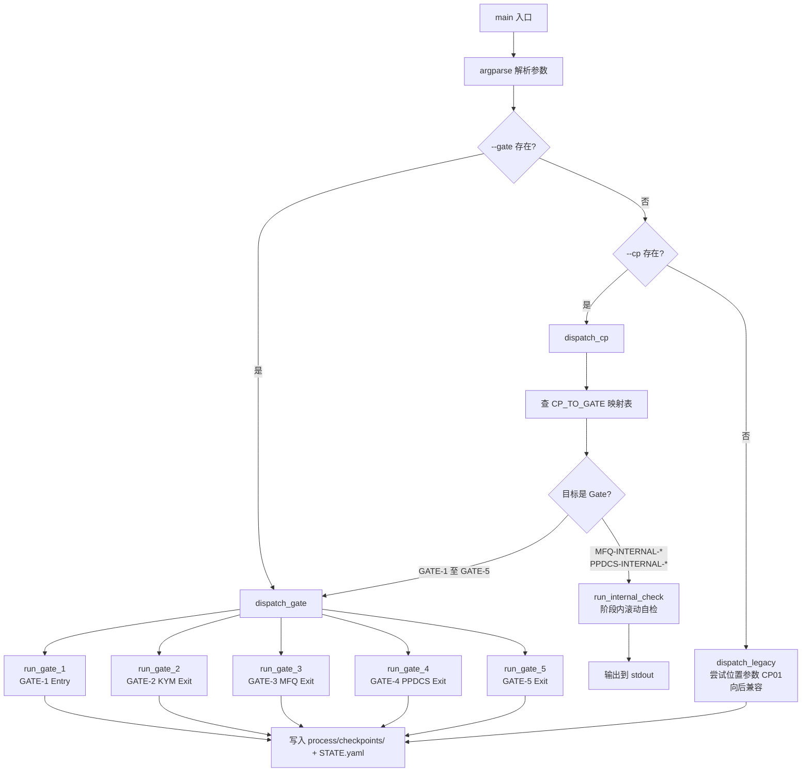
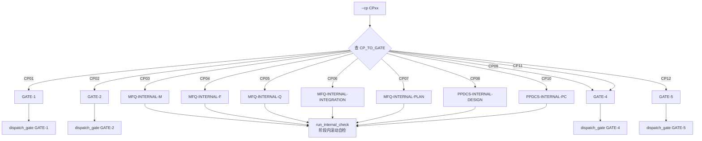

# LLD: STORY-010-04 — 改造 run_checkpoint.py（双模式路由）

> 文件名格式：`STORY-010-04-run-checkpoint-script-dual-mode-LLD.md`
>
> 本文档是 STORY-010-04 的低层设计。当前 `run_checkpoint.py` 仅支持 CP01 模式，需改造为 Gate/CP 双模式路由。

---

## 修订记录

| 版本 | 日期 | 修订人 | 变更要点 |
|------|------|--------|----------|
| 1.0 | 2026-06-01 | meta-dev | 初始 LLD，覆盖 --gate/--cp 双模式参数解析、CP↔Gate 路由映射、目录结构迁移、输出文件命名和 CP 兼容模式保留 |
| 1.1 | 2026-06-01 | meta-dev | [P0-B1] 统一路径引用：全局替换 `doc/STATE.yaml`→`process/STATE.yaml`、`checkpoints/`→`process/checkpoints/`；修正 §4.3「改后」required_dirs 中 `project_root / "doc"`→`project_root / "process" / "checkpoints"`；修正 §4.9「改后」write_state 中 `doc_dir`→`process_dir`。gate-spec.md 同步完成对应修正。 |
| 1.2 | 2026-06-01 | meta-dev | [M2] 补充 `dispatch_legacy()` 完整实现设计：argparse 位置参数 `checkpoint_id`（choices=["CP01"]）与 `--gate`/`--cp` 互斥，位置参数 CP01 自动路由到 GATE-1，`--cp` 路由到对应 Gate，`--gate` 直接执行对应 handler。 |
| 1.3 | 2026-06-01 | meta-dev | [M3] §12 风险难点新增 R5「过渡期双路径共存」：CR-010 范围 Gate handler 只做产物目录存在性骨架检查，不检查具体文件内容；详细检查由 CR-011/012/013 完成路径迁移后激活。 |
| 1.4 | 2026-06-01 | meta-dev | [M4] §4 Gate handler 输出格式增加 `check_depth: skeleton` 标注：输出文件分为「基础检查（目录存在性）」和「详细检查（PENDING，待 CR-011/012/013 激活）」两部分。gate-spec.md 每个 Gate 章节末尾同步增加实现深度说明。 |
| 1.5 | 2026-06-01 | meta-dev | [M5] write_state 代码块和 §5 数据模型补充 `current_step` 字段：步骤级 Skill 名，与 `current_phase`（阶段级）互补，支持 MFQ 阶段中途中断后精确定位。 |

---

## 1. Goal

改造 `skills/checkpoint-manager/scripts/run_checkpoint.py`，新增 `--gate` 和 `--cp` 双参数路由，将旧 CP01 单体脚本升级为支持 5 Gate 检查 + 旧 CP 兼容路由的通用检查点脚本。

---

## 2. Requirements（Functional / Non-Functional）

### 2.1 Functional（来自 CR-010 + HLD-CR-010）

| # | 需求 | CR-010 来源 |
|---|------|------------|
| F1 | 新增 `--gate` 参数：接受 `GATE-1` 至 `GATE-5` | CR-010 §实施步骤 5 |
| F2 | 新增 `--cp` 兼容参数：接受 `CP01` 至 `CP12`，自动路由到对应 Gate 或阶段内自检 | CR-010 §实施步骤 5 + CR-DQ-05 方案 A |
| F3 | CP01 路由到 GATE-1，CP02 路由到 GATE-2 | CR-010 §检查点→门控映射 |
| F4 | CP03-CP07 路由到 MFQ 阶段内滚动自检（非独立 Gate） | CR-010 HLD §21 Gotchas: "CP03-CP07 映射到 MFQ 阶段内滚动自检（不是独立 Gate）" |
| F5 | CP08/CP10 路由到 PPDCS 阶段内滚动自检 | CR-010 HLD §21 |
| F6 | CP09/CP11 路由到 GATE-4，CP12 路由到 GATE-5 | CR-010 §检查点→门控映射 |
| F7 | Gate 模式输出文件命名：`process/checkpoints/GATE-{N}-{Name}.md`、`process/checkpoints/GATE-{N}-{Name}-auto.md`、`process/checkpoints/GATE-{N}-{Name}-manual.md` | CR-010 HLD §10 "GATE-{N}-{Name}.md" |
| F8 | 保留原有 CP 模式，`--cp` 不存在时走原有 CP 直通路径 | CR-DQ-05 方案 A: "ptm-tde 检测到 gate-spec 时用 Gate 模式，其他工作流继续用 CP 模式" |
| F9 | 目录结构迁移：旧 `analysis/`/`design/` 改为 `kym/`/`mfq/`/`ppdcs/`/`process/` | CR-010 §目录结构迁移 |
| F10 | STATE.yaml 字段更新：`current_phase` 使用 `kym`/`mfq`/`ppdcs`/`exit`/`completed`，同时保留 `cp01_status` 兼容字段 | CR-010 HLD §10 + CR-010 HLD §21 Gotchas |

### 2.2 Non-Functional

- **兼容性**：`--cp` 参数不存在时，脚本行为与原 CP 模式完全一致
- **可维护性**：CP↔Gate 路由表使用显式 dict 映射，不允许多层 if/elif 分支（HLD §13 R2）
- **可扩展性**：Gate handler 函数与 CP handler 函数解耦，新增 Gate 或 CP 只需扩展映射表
- **性能**：不增加额外文件 I/O，Gate 模式下目录创建使用与原 CP01 相同的 `exist_ok=True` 策略

---

## 3. 模块拆分与职责

| 模块 / 文件组 | 职责 | 说明 |
|---|---|---|
| `run_checkpoint.py`（整体） | Gate/CP 双模式入口：参数解析、路由分发、Gate handler 调用、CP handler 调用 | **改造目标** |
| `argparse 参数层` | 新增 `--gate`、`--cp` 互斥参数组，`--gate` 接受 GATE-1 至 GATE-5 | 在 `main()` 中扩展 |
| `CP↔Gate 路由映射表` | 将 `CP01`-`CP12` 映射到对应的 Gate handler 或阶段内自检 handler | 新增模块级常量 `CP_TO_GATE` |
| `Gate handler` | 各 Gate 的检查逻辑函数：`run_gate_1` 至 `run_gate_5` | `run_cp01` 的主体逻辑迁移为 `run_gate_1` |
| `CP 兼容 handler` | `run_cp01` 保持兼容，内部调用 `run_gate_1` | 旧 CP 模式入口保留 |
| `写入层` | `write_gate_result()` / `write_state()` | 目录路径迁移 |
| `SKILL.md`（上游依赖） | Gate 检查规范说明 | 由 STORY-010-03 提供，本 Story 读取其脚本用法约定 |

---

## 4. 代码结构与文件影响范围

| 动作 | 文件路径 | 变更内容 |
|------|----------|----------|
| **修改** | `skills/checkpoint-manager/scripts/run_checkpoint.py` | 全文改造（约 170 行 → 约 350 行）：新增 argparse `--gate`/`--cp` 参数组；新增 `CP_TO_GATE` 路由映射表；迁移 `run_cp01` 核心逻辑至 `run_gate_1`；新增 `run_gate_2` 至 `run_gate_5` 的骨架函数；目录路径从 `analysis/`/`design/` 迁移至 `kym/`/`mfq/`/`ppdcs/`/`process/`；输出文件名从 `CP01_input_auto.md` 改为 `GATE-{N}-{Name}.md`；STATE.yaml 字段更新 |

### 改前改后对照

#### 1. argparse 参数解析

**改前**（L156-165）：
```python
def main() -> int:
    parser = argparse.ArgumentParser()
    parser.add_argument("checkpoint", choices=["CP01"])
    parser.add_argument("--project-root", default=".")
    parser.add_argument("--feature-name", default="")
    parser.add_argument("--requirement", default="")
    parser.add_argument("--wiki-index", default="")
    args = parser.parse_args()
    if args.checkpoint == "CP01":
        return run_cp01(args)
    return 2
```

**改后**：
```python
def main() -> int:
    parser = argparse.ArgumentParser()
    mode_group = parser.add_mutually_exclusive_group()
    mode_group.add_argument(
        "--gate",
        choices=["GATE-1", "GATE-2", "GATE-3", "GATE-4", "GATE-5"],
        default=None,
        help="Gate 模式：执行指定 Gate 检查",
    )
    mode_group.add_argument(
        "--cp",
        choices=[f"CP{str(i).zfill(2)}" for i in range(1, 13)],
        default=None,
        help="CP 兼容模式：自动路由到对应 Gate 或阶段内自检",
    )
    parser.add_argument("--project-root", default=".")
    parser.add_argument("--feature-name", default="")
    parser.add_argument("--requirement", default="")
    parser.add_argument("--wiki-index", default="")
    args = parser.parse_args()
    if args.gate:
        return dispatch_gate(args.gate, args)
    if args.cp:
        return dispatch_cp(args.cp, args)
    # 兼容：无 --gate 无 --cp 时尝试位置参数（向后兼容）
    return dispatch_legacy(args)
```

#### 2. CP↔Gate 路由映射表

**新增模块级常量**（文件顶部附近）：
```python
# CP↔Gate 路由映射（参见 docs/ptm-tde/gate-spec.md §CP↔Gate 映射表）
CP_TO_GATE: dict[str, str] = {
    "CP01": "GATE-1",
    "CP02": "GATE-2",
    "CP03": "MFQ-INTERNAL-M",
    "CP04": "MFQ-INTERNAL-F",
    "CP05": "MFQ-INTERNAL-Q",
    "CP06": "MFQ-INTERNAL-INTEGRATION",
    "CP07": "MFQ-INTERNAL-PLAN",
    "CP08": "PPDCS-INTERNAL-DESIGN",
    "CP09": "GATE-4",
    "CP10": "PPDCS-INTERNAL-PC",
    "CP11": "GATE-4",
    "CP12": "GATE-5",
}

# Gate 名称映射（用于输出文件名）
GATE_NAMES: dict[str, str] = {
    "GATE-1": "Entry",
    "GATE-2": "KYM-Exit",
    "GATE-3": "MFQ-Exit",
    "GATE-4": "PPDCS-Exit",
    "GATE-5": "Exit",
}
```

#### 3. 目录路径迁移

**改前**（L103-116）：
```python
required_dirs = [
    project_root / "analysis" / "feature-input",
    project_root / "analysis" / "scenarios",
    project_root / "analysis" / "m-analysis",
    project_root / "analysis" / "f-analysis",
    project_root / "analysis" / "q-analysis",
    project_root / "analysis" / "integration",
    project_root / "analysis" / "plan",
    project_root / "analysis" / "coverage",
    project_root / "design" / "ppdcs",
    project_root / "design" / "pc",
    project_root / "delivery",
    project_root / "doc",
]
```

**改后**：
```python
required_dirs = [
    project_root / "kym" / "feature-input",
    project_root / "kym" / "scenarios",
    project_root / "mfq" / "m-analysis",
    project_root / "mfq" / "f-analysis",
    project_root / "mfq" / "q-analysis",
    project_root / "mfq" / "integration",
    project_root / "mfq" / "factor-usage",
    project_root / "process" / "plan",
    project_root / "ppdcs" / "ppdcs",
    project_root / "ppdcs" / "pc",
    project_root / "ppdcs" / "coverage",
    project_root / "ppdcs" / "delivery",
    project_root / "process" / "checkpoints",
]
```

#### 4. 输出文件名

**改前**（L139）：
```python
result_path = checkpoints_dir / "CP01_input_auto.md"
```

**改后**（Gate 模式）：
```python
def gate_output_path(checkpoints_dir: Path, gate: str, suffix: str = "") -> Path:
    name = GATE_NAMES.get(gate, gate)
    if suffix:
        return checkpoints_dir / f"{gate}-{name}-{suffix}.md"
    return checkpoints_dir / f"{gate}-{name}.md"
```

#### 5. 路由分发函数

**新增** `dispatch_gate()`：
```python
def dispatch_gate(gate: str, args: argparse.Namespace) -> int:
    handlers = {
        "GATE-1": run_gate_1,
        "GATE-2": run_gate_2,
        "GATE-3": run_gate_3,
        "GATE-4": run_gate_4,
        "GATE-5": run_gate_5,
    }
    handler = handlers.get(gate)
    if handler is None:
        print(f"Unknown gate: {gate}", file=__import__("sys").stderr)
        return 2
    return handler(args)
```

**新增** `dispatch_cp()`：
```python
def dispatch_cp(cp: str, args: argparse.Namespace) -> int:
    target = CP_TO_GATE.get(cp)
    if target is None:
        print(f"Unknown checkpoint: {cp}", file=__import__("sys").stderr)
        return 2
    if target.startswith("MFQ-INTERNAL-") or target.startswith("PPDCS-INTERNAL-"):
        return run_internal_check(cp, target, args)
    return dispatch_gate(target, args)
```

#### 6. dispatch_legacy 向后兼容入口

**新增** `dispatch_legacy()`：处理无 `--gate` 无 `--cp` 时的位置参数兼容。位置参数 `checkpoint_id` 仅接受 `CP01`（与原脚本行为保持一致），与 `--gate`/`--cp` 互斥——argparse 默认将位置参数与互斥参数组隔离，通过手动校验确保用户不能同时使用位置参数和命名参数。

```python
def dispatch_legacy(args: argparse.Namespace) -> int:
    """向后兼容：处理位置参数 CP01（无 --gate/--cp 时的降级路径）。
    
    位置参数 checkpoint_id（choices=["CP01"]）与 --gate/--cp 互斥：
      - 位置参数 CP01 → 自动路由到 run_gate_1（等价 --gate GATE-1）
      - --cp CP02      → dispatch_cp 路由到对应 Gate handler
      - --gate GATE-3   → dispatch_gate 直接执行 GATE-3 handler
    
    注意：argparse 默认不将位置参数编入互斥参数组，
    因此需在 main() 中额外校验：若 args.gate 或 args.cp 已设置，
    则忽略位置参数 checkpoint_id。
    """
    checkpoint_id = getattr(args, "checkpoint_id", None)
    if checkpoint_id == "CP01":
        print("[legacy] 位置参数 CP01 → 路由到 GATE-1 Entry Gate")
        return run_gate_1(args)
    if checkpoint_id is not None:
        print(f"Unknown legacy checkpoint: {checkpoint_id}", file=sys.stderr)
        return 2
    # 无任何 checkpoint 参数：打印帮助并退出
    print("请指定 --gate、--cp 或位置参数 CP01", file=sys.stderr)
    return 2
```

**main() 完整参数定义**（含位置参数兼容）：

```python
def main() -> int:
    parser = argparse.ArgumentParser(
        description="ptm-tde 检查点脚本（Gate/CP 双模式路由）"
    )
    # 位置参数：向后兼容旧 CP01 调用方式
    parser.add_argument(
        "checkpoint_id",
        nargs="?",
        choices=["CP01"],
        default=None,
        help="（向后兼容）位置参数 CP01，自动路由到 GATE-1 Entry Gate",
    )
    # --gate / --cp 互斥参数组
    mode_group = parser.add_mutually_exclusive_group()
    mode_group.add_argument(
        "--gate",
        choices=["GATE-1", "GATE-2", "GATE-3", "GATE-4", "GATE-5"],
        default=None,
        help="Gate 模式：执行指定 Gate 检查",
    )
    mode_group.add_argument(
        "--cp",
        choices=[f"CP{str(i).zfill(2)}" for i in range(1, 13)],
        default=None,
        help="CP 兼容模式：自动路由到对应 Gate 或阶段内自检",
    )
    parser.add_argument("--project-root", default=".")
    parser.add_argument("--feature-name", default="")
    parser.add_argument("--requirement", default="")
    parser.add_argument("--wiki-index", default="")
    args = parser.parse_args()
    
    # 路由优先级：--gate > --cp > 位置参数
    if args.gate:
        return dispatch_gate(args.gate, args)
    if args.cp:
        return dispatch_cp(args.cp, args)
    # 向后兼容：尝试位置参数 CP01
    if args.checkpoint_id:
        print(f"[legacy] 位置参数 {args.checkpoint_id} → 路由到 GATE-1 Entry Gate")
        return run_gate_1(args)
    # 无任何参数
    parser.print_help()
    return 2
```

#### 7. 阶段内滚动自检处理

**新增** `run_internal_check()`：
```python
def run_internal_check(cp: str, target: str, args: argparse.Namespace) -> int:
    """执行阶段内滚动自检（CP03-CP07, CP08, CP10）。
    
    阶段内自检不生成独立的 Gate 输出文件，仅执行对应 Skill 的完整性验证，
    结果写入日志或由主 Agent 的阶段内自检流程消费。
    当前版本输出轻量级检查摘要到 stdout，未来可扩展为写入 process/checkpoints/。
    """
    project_root = Path(args.project_root).resolve()
    phase = "MFQ" if target.startswith("MFQ-INTERNAL-") else "PPDCS"
    print(f"[{cp}] {phase} 阶段内滚动自检: {target}")
    # 阶段内自检的详细实现将在后续 CR-012/CR-013 中扩展
    # 当前版本仅验证对应产物目录存在性作为基础检查
    dir_map = {
        "MFQ-INTERNAL-M": project_root / "mfq" / "m-analysis",
        "MFQ-INTERNAL-F": project_root / "mfq" / "f-analysis",
        "MFQ-INTERNAL-Q": project_root / "mfq" / "q-analysis",
        "MFQ-INTERNAL-INTEGRATION": project_root / "mfq" / "integration",
        "MFQ-INTERNAL-PLAN": project_root / "process" / "plan",
        "PPDCS-INTERNAL-DESIGN": project_root / "ppdcs" / "ppdcs",
        "PPDCS-INTERNAL-PC": project_root / "ppdcs" / "pc",
    }
    target_dir = dir_map.get(target)
    if target_dir and target_dir.is_dir():
        print(f"  {cp} 产物目录存在: {target_dir}")
        return 0
    elif target_dir:
        print(f"  {cp} 产物目录不存在: {target_dir}（阶段尚未执行或产物未生成）")
        return 1
    return 0
```

#### 7. GATE-1 处理函数（从 run_cp01 迁移）

`run_cp01` 的核心逻辑迁移为 `run_gate_1`，`run_cp01` 保留为兼容包装：

```python
def run_gate_1(args: argparse.Namespace) -> int:
    """GATE-1 Entry Gate：纯自检。校验特性项目输入完整性。"""
    # ... 核心逻辑与原 run_cp01 一致，但：
    #   1. 使用新目录结构（kym/mfq/ppdcs/process/）
    #   2. 输出文件名为 process/checkpoints/GATE-1-Entry.md
    #   3. STATE.yaml 写入 current_phase: kym
    #   4. 新增公共因子库可解析检查（Checklist #7）

def run_cp01(args: argparse.Namespace) -> int:
    """CP01 兼容入口：内部调用 GATE-1 handler。"""
    return run_gate_1(args)
```

#### 8. GATE-2 至 GATE-5 骨架函数

每个 Gate handler 包含：
- 读取对应的 Entry Criteria 产物目录
- 执行 gate-spec.md 定义的 Checklist 项（当前版本为基础存存在性检查，详细逻辑由后续 CR 扩展）
- 写入对应 `process/checkpoints/GATE-{N}-{Name}.md`（纯自检）或 `process/checkpoints/GATE-{N}-{Name}-auto.md`（自检+人工）
- 更新 `process/STATE.yaml` 中的 `current_phase`

**Gate handler 输出格式规范**：每个 Gate handler 生成的 Markdown 输出文件头部必须标注 `check_depth: skeleton`，明确当前为骨架实现。输出文件结构如下：

```markdown
---
check_depth: skeleton
gate: GATE-{N}
---
# GATE-{N} {Name}

## 基础检查（目录存在性）

| 产物目录 | 路径 | 状态 | 说明 |
|----------|------|------|------|
| ... | ... | EXISTS / MISSING | ... |

## 详细检查（待 CR-011/012/013 激活）

以下检查项来自 `docs/ptm-tde/gate-spec.md` §GATE-{N} Checklist，当前版本（CR-010）仅做骨架检查。
完成路径迁移和 Skill 改造后，由对应 CR 扩展为完整逐项检查。

| # | 检查项 | 状态 | 说明 |
|---|--------|------|------|
| 1 | {gate-spec Checklist #1 标题} | PENDING | 待 CR-011/012/013 激活 |
| 2 | {gate-spec Checklist #2 标题} | PENDING | 待 CR-011/012/013 激活 |
| ... | ... | PENDING | ... |
```

**gate-spec.md 补充说明**：在每个 Gate 章节末尾增加以下标注：
> 当前版本由 checkpoint-manager 执行骨架检查（产物目录存在性），详细 Checklist 由主 Agent 按 gate-spec.md 执行或后续 CR 激活。

#### 9. STATE.yaml 字段更新

**改前**（L74-85）：
```python
def write_state(project_root: Path, feature_name: str, cp_status: str) -> None:
    doc_dir = project_root / "doc"
    doc_dir.mkdir(parents=True, exist_ok=True)
    state_path = doc_dir / "STATE.yaml"
    content = (
        'current_step: "input"\n'
        f'feature_name: "{feature_name}"\n'
        'runtime_root: "."\n'
        f'cp01_status: "{cp_status}"\n'
        f'updated_at: "{dt.datetime.now(dt.timezone.utc).isoformat()}"\n'
    )
    state_path.write_text(content, encoding="utf-8")
```

**改后**：
```python
def write_state(project_root: Path, feature_name: str, gate: str, gate_status: str, current_step: str = "") -> None:
    process_dir = project_root / "process"
    process_dir.mkdir(parents=True, exist_ok=True)
    state_path = process_dir / "STATE.yaml"
    phase_map = {
        "GATE-1": "kym",
        "GATE-2": "mfq",
        "GATE-3": "ppdcs",
        "GATE-4": "exit",
        "GATE-5": "completed",
    }
    current_phase = phase_map.get(gate, "kym")
    content = (
        f'current_phase: "{current_phase}"\n'
        f'current_step: "{current_step}"\n'
        f'current_gate: "{gate}"\n'
        f'feature_name: "{feature_name}"\n'
        'runtime_root: "."\n'
        f'gate_status: "{gate_status}"\n'
        f'updated_at: "{dt.datetime.now(dt.timezone.utc).isoformat()}"\n'
    )
    state_path.write_text(content, encoding="utf-8")
```

**`current_step` 字段说明**：

`current_step` 记录当前执行的 Skill 名称，取值为 `feature-parser` / `scenario-discovery` / `m-analyzer` / `f-analyzer` / `q-analyzer` / `test-point-integrator` / `design-planner` / `design-ppdcs` / `pc` / `coverage` / `delivery`。由主 Agent 在每个 Skill 完成后调用 `write_state(..., current_step="<skill-name>")` 更新。

与 `current_phase` 的关系：
- `current_phase`：阶段级（Gate 通过时更新）— 用于 Gate 路由和进度展示
- `current_step`：步骤级（Skill 完成时更新）— 用于中断恢复和调试定位
- 两者互补：`current_phase=mfq` + `current_step=f-analyzer` 可精确恢复到中断位置，避免仅靠 `current_phase` 无法区分 MFQ 阶段内 M/F/Q/整合/计划的进度
```

---

## 5. 数据模型与持久化设计

| 对象 / 字段 | 类型 | 约束 | 说明 |
|---|---|---|---|
| `CP_TO_GATE` | `dict[str, str]` | 12 个条目，键 `CP01`-`CP12`，值含 `GATE-1` 至 `GATE-5` 或 `MFQ-INTERNAL-*`/`PPDCS-INTERNAL-*` | CP→Gate 路由映射表 |
| `GATE_NAMES` | `dict[str, str]` | 5 个条目，键 `GATE-1` 至 `GATE-5` | Gate 编号到可读名称的映射，用于输出文件名 |
| `process/STATE.yaml` `current_phase` | `str` | 枚举：`kym` / `mfq` / `ppdcs` / `exit` / `completed` | 替换原 `current_step`（旧语义，仅阶段级） |
| `process/STATE.yaml` `current_step` | `str` | 枚举：`feature-parser` / `scenario-discovery` / `m-analyzer` / `f-analyzer` / `q-analyzer` / `test-point-integrator` / `design-planner` / `design-ppdcs` / `pc` / `coverage` / `delivery` | **新增**：步骤级粒度，用于中断恢复和调试。与 `current_phase` 互补 |
| `process/STATE.yaml` `current_gate` | `str` | 枚举：`GATE-1` 至 `GATE-5` | 新增字段，记录当前所在 Gate |
| `process/STATE.yaml` `gate_status` | `str` | `PASS` / `BLOCKED` / `WAIVED` | 替换原 `cp01_status` |

---

## 6. API / Interface 设计

| 接口 / 入口 | 输入 | 输出 | 调用方 | 说明 |
|---|---|---|---|---|
| `--gate GATE-N` | argparse 参数 + `--project-root` + `--feature-name` + `--requirement` + `--wiki-index` | `process/checkpoints/GATE-{N}-{Name}.md`（或 `-auto.md`/`-manual.md`）；`process/STATE.yaml` 更新；stdout 输出文件路径 | 主 Agent / CLI 直接调用 | 新增主接口 |
| `--cp CPxx` | argparse 参数 + `--project-root` + 公用可选参数 | 路由到对应 `dispatch_gate()` 或 `run_internal_check()`；输出取决于路由目标 | 旧工具链 / CLI 兼容调用 | 新增兼容接口 |
| `run_cp01(args)` | `argparse.Namespace` | 内部调用 `run_gate_1(args)` 的返回值 | 旧 CP 模式直通路径 | 保留为兼容包装 |
| `dispatch_gate(gate, args)` | `str` gate ID + `argparse.Namespace` | 调用对应 `run_gate_N(args)` | `main()` → `dispatch_gate()` | 新增内部分发 |
| `dispatch_cp(cp, args)` | `str` cp ID + `argparse.Namespace` | 查表后调用 `dispatch_gate()` 或 `run_internal_check()` | `main()` → `dispatch_cp()` | 新增内部分发 |

> 本节每个接口对应的测试见第 10 节。

---

## 7. 核心处理流程

### 主入口流程



### dispatch_cp 路由详解



---

## 8. 技术设计细节

- **关键算法**：CP↔Gate 路由使用 `dict` 映射表 + 前缀判断（`startswith("MFQ-INTERNAL-")`），不使用多层 if/elif。这与 HLD §13 R2 缓解策略一致："CP↔Gate 映射表使用显式 dict/hash 映射而非条件分支"。
- **依赖选择**：`argparse` 标准库，无外部依赖；`add_mutually_exclusive_group()` 确保 `--gate` 和 `--cp` 互斥。
- **兼容性处理**：
  - `--cp` 不存在且 `--gate` 不存在时，进入 `dispatch_legacy()`，尝试读取位置参数 `CP01`（对应原 `parser.add_argument("checkpoint", choices=["CP01"])`），以兼容无参数调用的旧脚本行为。
  - `run_cp01` 函数保留不删除，内部委托给 `run_gate_1`，确保任何直接引用 `run_cp01` 的代码不受影响。
  - 旧目录路径不再出现在 `required_dirs` 中，但 `exist_ok=True` 确保已有 `analysis/`/`design/` 目录不会导致错误。
- **阶段内自检定位**：`run_internal_check` 当前版本为基础存在性检查（验证产物目录存在），详细检查逻辑由 CR-012（MFQ）和 CR-013（PPDCS）扩展。此设计在 O-STORY-010-04-01 中标记为 OPEN。
- **图示类型**：流程图（主入口 + 路由分发）

---

## 9. 安全与性能设计

| 维度 | 设计措施 | 验证方式 |
|---|---|---|
| 安全 | 无新增命令执行路径（`probe_atomic_ops` 使用 `subprocess.run` 与旧版一致）；`--gate`/`--cp` 参数使用 `choices` 限制枚举值，不接受任意字符串；`--project-root` 不执行 shell 注入 | 人工代码审查 + HLD §12 验证方式 "`dangerous-command-scan` 检查" |
| 性能 | Gate handler 函数仅执行文件存在性检查（`Path.is_dir()` + `Path.exists()`），与旧版 O 复杂度一致；12 个目录的 `mkdir` 使用 `exist_ok=True` 避免重复 I/O；路由分发使用 O(1) dict 查找 | 同一特性项目下改造前后运行时间比较 |

---

## 10. 测试设计

| 测试场景 | 前置条件 | 操作 | 预期结果 | 验证方式 |
|---|---|---|---|---|
| T1: `--gate GATE-1` 基本路径 | 特性项目根目录存在，`input/` 含需求文件 | `python run_checkpoint.py --gate GATE-1 --project-root /tmp/test-proj` | 生成 `process/checkpoints/GATE-1-Entry.md`；STATE.yaml 含 `current_phase: kym`；exit code 0 | 自动化 |
| T2: `--gate GATE-2` 基本路径 | GATE-1 已通过，`kym/scenarios/` 存在 | `python run_checkpoint.py --gate GATE-2 --project-root /tmp/test-proj` | 生成 `process/checkpoints/GATE-2-KYM-Exit-auto.md`；exit code 0 或 1（取决于产物完整性） | 自动化 |
| T3: `--gate GATE-3` 基本路径 | MFQ 阶段产物存在 | `python run_checkpoint.py --gate GATE-3 --project-root /tmp/test-proj` | 生成 `process/checkpoints/GATE-3-MFQ-Exit-auto.md`；exit code 0 或 1 | 自动化 |
| T4: `--cp CP01` 路由到 GATE-1 | 同 T1 | `python run_checkpoint.py --cp CP01 --project-root /tmp/test-proj` | 输出与 `--gate GATE-1` 完全一致（文件名、内容、exit code） | 自动化（与 T1 对比） |
| T5: `--cp CP02` 路由到 GATE-2 | 同 T2 | `python run_checkpoint.py --cp CP02 --project-root /tmp/test-proj` | 输出与 `--gate GATE-2` 一致 | 自动化（与 T2 对比） |
| T6: `--cp CP03` 路由到 MFQ 阶段内自检 | 特性项目存在 | `python run_checkpoint.py --cp CP03 --project-root /tmp/test-proj` | stdout 含 `[CP03] MFQ 阶段内滚动自检`；不生成 Gate 文件 | 自动化 |
| T7: `--cp CP09` + `--cp CP11` 都路由到 GATE-4 | GATE-3 已通过 | 分别执行 `--cp CP09` 和 `--cp CP11` | 两者输出相同（都生成 `GATE-4-PPDCS-Exit-auto.md`） | 自动化（交叉对比） |
| T8: `--cp CP12` 路由到 GATE-5 | GATE-4 已通过 | `python run_checkpoint.py --cp CP12 --project-root /tmp/test-proj` | 生成 `process/checkpoints/GATE-5-Exit.md` | 自动化 |
| T9: `--gate` 和 `--cp` 互斥 | 任意项目 | `python run_checkpoint.py --gate GATE-1 --cp CP01` | argparse 报错，exit code 非 0 | 自动化 |
| T10: 目录结构迁移验证 | GATE-1 执行后 | 检查磁盘 | `kym/feature-input/`、`mfq/m-analysis/`、`ppdcs/ppdcs/`、`process/plan/` 等 12 个目录已创建；无 `analysis/` 或 `design/` 目录被创建 | 自动化 |
| T11: STATE.yaml 字段更新 | GATE-1 执行后 | `cat process/STATE.yaml` | 含 `current_phase: kym`、`current_gate: GATE-1`、`gate_status` 字段 | 自动化 |
| T12: 无效 `--gate` 参数 | N/A | `python run_checkpoint.py --gate GATE-99` | argparse 报错 `invalid choice` | 自动化 |
| T13: 无效 `--cp` 参数 | N/A | `python run_checkpoint.py --cp CP99` | argparse 报错 `invalid choice` | 自动化 |
| T14: 向后兼容（位置参数 CP01） | 同 T1 | `python run_checkpoint.py CP01 --project-root /tmp/test-proj` | 行为与旧版一致（生成 `process/checkpoints/GATE-1-Entry.md`） | 自动化 |

---

## 11. 实施步骤

| TASK-ID | 动作 | 目标文件 | 详细描述 | 对应测试 |
|---|---|---|---|---|
| TASK-010-04-01 | 新增 | `run_checkpoint.py` | 新增模块级常量 `CP_TO_GATE`（12 条目）和 `GATE_NAMES`（5 条目） | T4-T8 |
| TASK-010-04-02 | 修改 | `run_checkpoint.py` `main()` | 新增 `--gate` 和 `--cp` 互斥参数组（`add_mutually_exclusive_group`），添加 `dispatch_gate`/`dispatch_cp`/`dispatch_legacy` 分发逻辑 | T1, T9, T12, T13, T14 |
| TASK-010-04-03 | 修改 | `run_checkpoint.py` `required_dirs` | 目录路径从 `analysis/`/`design/` 迁移为 `kym/`/`mfq/`/`ppdcs/`/`process/`（12 个目录） | T10 |
| TASK-010-04-04 | 重构 | `run_checkpoint.py` `run_cp01` → `run_gate_1` | 将 `run_cp01` 的核心逻辑提取为 `run_gate_1`，`run_cp01` 改为委托包装；输出文件改为 `GATE-1-Entry.md`；新增公共因子库检查（Checklist #7） | T1, T4 |
| TASK-010-04-05 | 新增 | `run_checkpoint.py` `run_gate_2` 至 `run_gate_5` | GATE-2 骨架：Entry Criteria 校验（`kym/scenarios/` 存在性）+ 基础目录存在性检查 + 输出 `GATE-2-KYM-Exit-auto.md`；GATE-3 骨架：MFQ 产物目录存在性 + W1/W2 Warning 输出 + `GATE-3-MFQ-Exit-auto.md`；GATE-4 骨架：PPDCS 产物目录存在性 + `GATE-4-PPDCS-Exit-auto.md`；GATE-5 骨架：交付物存在性 + `GATE-5-Exit.md` | T2, T3, T7, T8 |
| TASK-010-04-06 | 新增 | `run_checkpoint.py` `dispatch_gate` / `dispatch_cp` | `dispatch_gate`：`GATE-N` → `run_gate_N` 路由；`dispatch_cp`：查 `CP_TO_GATE` 表 → Gate 或阶段内自检路由 | T1-T8 |
| TASK-010-04-07 | 新增 | `run_checkpoint.py` `run_internal_check` | 阶段内滚动自检骨架：验证对应产物目录存在性，输出摘要到 stdout | T6 |
| TASK-010-04-08 | 修改 | `run_checkpoint.py` `write_state` | STATE.yaml 字段更新：`current_phase`/`current_gate`/`gate_status` 替换 `current_step`/`cp01_status` | T11 |
| TASK-010-04-09 | 新增 | `run_checkpoint.py` `gate_output_path` | Gate 输出文件路径生成函数：`GATE-{N}-{Name}[-{suffix}].md` | T1-T3, T8 |
| TASK-010-04-10 | 修改 | `run_checkpoint.py` `dispatch_legacy` | 向后兼容入口：无 `--gate` 无 `--cp` 时尝试位置参数 `CP01` | T14 |

---

## 12. 风险、难点与预研建议

### 12.1 实现灰区与取舍记录

| Clarification ID | 问题 | 选项与推荐 | 决策 / 答案 | 影响面 | 证据 | 重访条件 |
|---|---|---|---|---|---|---|
| LCQ-STORY-010-04-01 | GATE-2 至 GATE-5 的检查逻辑在当前版本应到多细粒度？gate-spec.md 定义了完整的 Checklist（GATE-2 14 项、GATE-3 8 项+2 Warning 等），但脚本当前只实现了 GATE-1 的完整检查。 | **推荐**：GATE-2 至 GATE-5 当前版本实现骨架（Entry Criteria 校验 + 产物目录存在性检查），详细 Checklist 逐项检查由后续 CR-011/012/013 扩展。备选：一次性实现全部 Checklist 项，脚本行数增加较多但一步到位。 | 推荐方案：骨架实现 | 接口：run_gate_2 至 run_gate_5 的函数体复杂度；测试：T2/T3/T7/T8 的预期结果精确度 | gate-spec.md §GATE-2 至 §GATE-5 定义了完整 Checklist；CR-010 约束"不修改任何 Skill SKILL.md"即阶段内检查逻辑由后续 CR 扩展 | CR-012/CR-013 实施时扩展对应 Gate handler |
| LCQ-STORY-010-04-02 | `dispatch_legacy` 向后兼容的精确行为：旧版 `checkpoint` 位置参数只接受 `CP01`，改造后是否需要同时接受更多 CP 位置参数？ | **推荐**：`dispatch_legacy` 保持只接受 `CP01` 作为位置参数（与原行为一致），新增的 CP 编号只能通过 `--cp` 命名参数使用。备选：扩展位置参数 choices 到 CP01-CP12，完整向后兼容所有 CP 编号。 | 推荐方案 | 接口：main() 的 argparse 定义；测试：T14 | 原脚本 `choices=["CP01"]` 定义 | 若旧工具链使用了位置参数传 CP02-CP12，需扩展兼容 |

| 风险 / 难点 | 影响 | 缓解措施 / 预研建议 |
|---|---|---|
| R1: Gate handler 的骨架实现可能无法满足 GATE-2/GATE-4 人工确认需求 | 中 | 骨架实现明确输出"基础检查"结果，并标注"详细 Checklist 由主 Agent 按 gate-spec.md 执行"。T2/T3/T7/T8 验证骨架输出格式正确。 |
| R2: 目录迁移后旧脚本调用方（如有）可能因找不到 `analysis/` 目录而失败 | 低 | T10 验证新目录创建；旧 `analysis/`/`design/` 目录在过渡期仍然存在（CR-013 完成后才删除），`exist_ok=True` 确保新旧目录共存时无冲突 |
| R3: `--cp CP09` 和 `--cp CP11` 都路由到 GATE-4，但两个 CP 在原体系检查不同内容（CP09 设计确认，CP11 覆盖率确认） | 中（若路由无法区分两个 CP 的检查重点） | T7 交叉对比验证两者输出一致；当前骨架版本使用相同的 GATE-4 handler，详细区分由 CR-013 实现。在 HLD §21 Gotchas 中已注明此映射关系 |
| R4: `--gate`/`--cp` 参数与 gate-spec.md 规范的一致性 | 低 | gate-spec.md §CP↔Gate 映射表已定义标准映射；`CP_TO_GATE` 表直接 sync gate-spec.md 内容 |
| R5: 过渡期双路径共存 — Gate 检查新路径（`kym/mfq/ppdcs/process/`）但 18 个 Skill 仍写旧路径（`analysis/design/`），导致 GATE-2~5 的产物目录存在性检查全部失败 | 高 | **这是 CR-010 范围的已知限制**：run_checkpoint.py 的 Gate handler 在 CR-010 范围内只做骨架检查（产物目录存在性），不检查具体文件内容。详细检查由 CR-011/012/013 完成路径迁移后激活。HLD-CR-010.md §21 Gotchas 已记录"过渡期 Skill 仍写旧路径"为关键假设，全部 CR 完成前不发布新版本。 | — |

### OPEN / Spike 跟踪

| ID | 类型 | 问题 | 下一动作 | 责任方 |
|---|---|---|---|---|
| O-STORY-010-04-01 | OPEN | GATE-2 至 GATE-5 的骨架实现到多细粒度？当前设计为"产物目录存在性检查 + stdout 摘要"，详细 Checklist 逐项检查由主 Agent 或后续 CR 扩展。需等待 meta-po 在 CP5 确认时裁定骨架与完整实现的边界。 | 等待 meta-po 裁定。若裁定骨架即可，TASK-010-04-05 维持当前设计。若要求更完整，需扩展每个 handler 的 Checklist 逐项检查逻辑。 | meta-po (CP5) |
| O-STORY-010-04-02 | OPEN | `dispatch_legacy` 是否扩展位置参数 choices 到 CP01-CP12？当前设计仅保留 CP01 位置参数兼容（与原行为一致）。 | 等待 meta-po 裁定；若无旧工具链使用位置参数传 CP02 以外的编号，当前设计即可。 | meta-po (CP5) |

---

## 13. 回滚与发布策略

- **发布方式**：单文件覆盖 `skills/checkpoint-manager/scripts/run_checkpoint.py`
- **回滚触发条件**：
  - T4（`--cp CP01` vs `--gate GATE-1` 输出一致性）失败
  - T14（向后兼容位置参数 CP01）失败
  - T10（目录结构迁移）验证失败
- **回滚动作**：`git checkout HEAD -- skills/checkpoint-manager/scripts/run_checkpoint.py`

---

## 14. Definition of Done

- [x] 14 个章节全部填写完成
- [x] 文件影响范围、接口、测试与实施步骤可直接指导编码
- [x] 实现灰区与取舍记录已回填 LCQ-STORY-010-04-01 和 LCQ-STORY-010-04-02
- [x] `confirmed=false` — 等待 CP5 全量 LLD 统一确认
- [ ] 人工确认意见已收敛
- [x] frontmatter 已填写 `tier=M`
- [x] OPEN / Spike 已清点（O-STORY-010-04-01、O-STORY-010-04-02）

---

## 人工确认区

> **CP5 — Story LLD 可实现性门**
> meta-dev 先写入 `process/checks/CP5-STORY-010-04-run-checkpoint-script-dual-mode-LLD-IMPLEMENTABILITY.md` 自动预检结果。
> meta-po 收齐全部目标 Story 的 LLD 后，再统一发起 CP5 人工确认。

**CP5 checklist 摘要**：

| # | 检查项 | 状态 | 证据 |
|---|---|---|---|
| 1 | LLD 覆盖 AC | PASS | 第 2 节 F1-F10 全部映射至第 4 节改前改后对照和第 11 节 TASK-ID |
| 2 | 与 HLD / ADR 一致 | PASS | CP_TO_GATE 映射表与 HLD §10/§20 一致；目录结构与 HLD §4/§CR-010 目录迁移表一致；双模式策略与 CR-DQ-05 方案 A 一致 |
| 3 | 文件影响范围明确 | PASS | 第 4 节 9 处改前改后对照 + 第 11 节 10 个 TASK-ID |
| 4 | 接口契约完整 | PASS | 第 6 节 5 个接口定义，每个接口对应第 10 节测试 |
| 5 | 测试与 dev_gate 可计算 | PASS | 第 10 节 14 项测试（T1-T14），覆盖 Gate 模式、CP 路由、互斥、向后兼容、目录迁移、STATE.yaml 更新 |
| 6 | clarification queue 已收敛 | PASS | LCQ-STORY-010-04-01（Gate handler 粒度）和 LCQ-STORY-010-04-02（legacy 兼容范围）已记录推荐方案；O-STORY-010-04-01 和 O-STORY-010-04-02 为 OPEN 跟踪项，不阻断 LLD 确认 |

**人工确认回复**：

请直接回复以下任一整行：

```text
approve
修改: <具体修改点>
reject
```

- `approve`：LLD 设计合理，允许进入实现（含推荐骨架方案）。
- `修改: <具体修改点>`：指出具体修改点后由 meta-dev 更新重提。
- `reject`：设计方向有根本问题，需重新设计。

**人工审查结果回填**：

- 结论：`approved | changes_requested | rejected`
- 审查人：
- 审查时间：
- 修改意见：
- 风险接受项：
