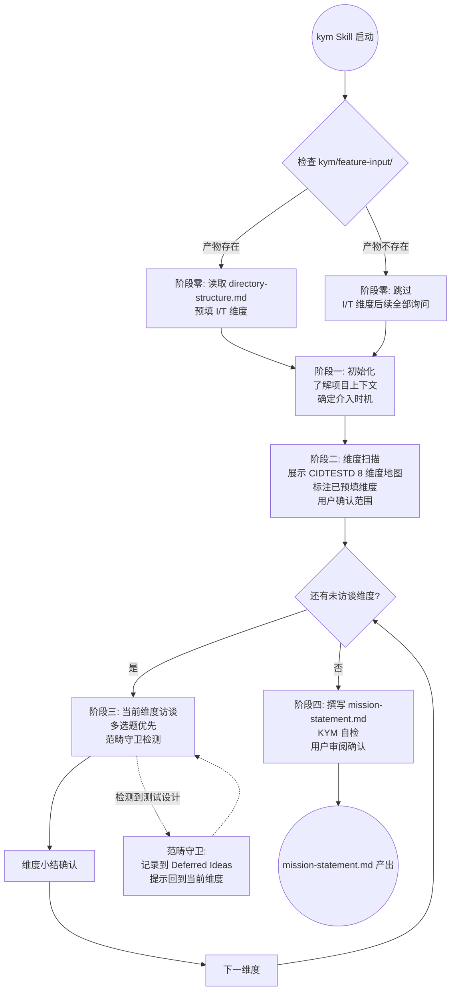

# LLD: STORY-011-01 — 创建 kym Skill 并注册

> 文件名格式：`STORY-011-01-kym-skill-LLD.md`
>
> 本文档是 STORY-011-01 的低层设计（Low-Level Design），需纳入全部目标 Story 的 LLD 统一确认后方可进入实现。

## 1. Goal

创建 `skills/kym/SKILL.md` — 一个使用 CIDTESTD 8 维度框架执行结构化使命理解访谈的独立 Skill，产出 `kym/mission-understanding/mission-statement.md` 供全流程下游消费，并在 `skills/README.md` 和 `docs/ptm-tde/skill-references.md` 中注册。

## 2. Requirements（Functional / Non-Functional）

### 2.1 Functional

- [AC-01] kym Skill 包含五阶段流程：阶段零（上下文预加载）→ 阶段一（初始化）→ 阶段二（维度扫描）→ 阶段三（深度访谈）→ 阶段四（文档化）
- [AC-02] 阶段零从 `kym/feature-input/` 读取 feature-parser 产物，自动预填 I（Information）和 T（Test Items）维度的可用信息
- [AC-03] 阶段二以 CIDTESTD 8 维度地图（🔴重点/🟡补充/⚪跳过）展示给用户，标注已预填维度
- [AC-04] 阶段三逐维度一问一答，多选题优先 + "让我详细描述"自由回答选项；每维度小结确认后进入下一维度
- [AC-05] 阶段四生成 `kym/mission-understanding/mission-statement.md`，包含全部 12 个字段组
- [AC-06] risks 字段使用结构化格式 `{area, likelihood, impact, action}`，在输出说明中标注「供下游 M 分析 CAE-R risk_level 预填消费」
- [AC-07] 包含范畴守卫机制：检测到测试设计话题时，记录到 Deferred Ideas 并提示回到当前维度
- [AC-08] 用户可跳过任意维度（在维度地图和 mission-statement 中标记），后续可恢复
- [AC-09] `skills/README.md` 的 Skill Index 新增 kym 条目（KYM 阶段）
- [AC-10] `docs/ptm-tde/skill-references.md` 的 KYM 阶段表新增 kym 行

### 2.2 Non-Functional

- [NF-01] kym Skill 不调用任何外部工具或 MCP 服务，访谈全部通过自然语言对话完成
- [NF-02] 阶段零依赖 feature-parser 产物，但产物不存在时不阻断——跳过阶段零，I/T 维度全部询问用户
- [NF-03] Skill 描述（description）包含触发词：使命理解、KYM、Know Your Mission、特性访谈
- [NF-04] 文档长度控制在 ~400 行以内，直接可执行，不引用不存在的外部设计文件

## 3. 模块拆分与职责

| 模块 / 文件组 | 职责 | 说明 |
|---|---|---|
| `skills/kym/SKILL.md` | kym Skill 的正身：五阶段流程 + 输出模板 + 范畴守卫 + 反模式 + Gotchas | 新建，核心模块 |
| `skills/README.md` §Skill Index | 在 KYM 阶段 Skill 列表中注册 kym | 修改，+1 行条目 |
| `docs/ptm-tde/skill-references.md` §主流程 Skill | 在 KYM 阶段表新增 kym 行（职责列说明 CIDTESTD 8 维度访谈→mission-statement） | 修改，+1 行条目 |

模块边界：
- kym Skill 只收集信息，不测试设计（范畴守卫）。测试设计归属 MFQ/PPDCS Skill。
- kym Skill 依赖 feature-parser 的输出产物（弱依赖），但不修改 feature-parser 的 SKILL.md。
- README 和 skill-references 的更新只涉及 KYM 阶段行，不修改 MFQ/PPDCS 条目。

## 4. 代码结构与文件影响范围

> 严格遵守确定性动词。

| 动作 | 文件路径 | 变更内容 |
|---|---|---|
| 创建 | `skills/kym/SKILL.md` | 完整新建 ~400 行。frontmatter（name/description/argument-hint/user-invokable/status）+ 五阶段执行流程 + mission-statement 输出模板 + 范畴守卫 + Gotchas + 验收标准 |
| 修改 | `skills/README.md` | 在 Skill Index 的 KYM 段新增 1 行：`- \`kym\`: 执行 Know Your Mission（使命理解），使用 CIDTESTD 8 维度结构化访谈产出 mission-statement.md。` |
| 修改 | `docs/ptm-tde/skill-references.md` | 在 §主流程 Skill 的 KYM 阶段表（checkpoint-manager / feature-parser / scenario-discovery）之后新增 1 行：`\| KYM \| \`kym\` \| 执行使命理解访谈（CIDTESTD 8 维度框架），产出 mission-statement.md（用户画像、测试项、风险等结构化信息）\|` |

## 5. 数据模型与持久化设计

本 Story 不涉及数据库或持久化存储。kym Skill 的运行时输出为文件系统产物 `kym/mission-understanding/mission-statement.md`，数据结构由 kym Skill 的 output template 定义。

### 5.1 输出数据结构（mission-statement.md）

本数据结构完整映射自 HLD v1.1 §9.1 和 data-flow-spec.md §实体 1。

| 对象 / 字段 | 类型 | 约束 | 说明 |
|---|---|---|---|
| `customers.users[]` | string[] | 至少 1 项 | 最终用户画像列表 |
| `customers.priority` | enum | `high` / `medium` / `low` | 测试优先级，供 scenario-discovery 场景排序 |
| `customers.concerns` | string[] | — | 用户关注点和痛点 |
| `customers.usage_scenarios` | string[] | — | 典型使用场景描述 |
| `information.key_docs[]` | string[] | — | 参考文档路径列表（阶段零从 feature-parser 产物预填）|
| `information.change_scope` | string | — | 变更范围描述（阶段零从 feature-parser 产物预填）|
| `information.requirements_version` | string | — | 需求文档版本 |
| `developers.team` | string | — | 开发团队 |
| `developers.complexity` | enum | `high` / `medium` / `low` | 代码复杂度 |
| `developers.known_issues` | string[] | — | 已知问题和限制 |
| `developers.code_language` | string | — | 主要编程语言 |
| `equipment.env_type` | string | — | 测试环境类型 |
| `equipment.platform` | string | — | 目标平台 |
| `equipment.topology_requirements` | string[] | — | 拓扑需求描述 |
| `schedule.delivery_date` | string | — | 计划交付日期 |
| `schedule.test_cycle` | string | — | 测试周期 |
| `schedule.milestones` | string[] | — | 关键里程碑 |
| `test_items.items[]` | string[] | 至少 1 项 | 测试项范围列表（阶段零从 feature-parser 产物预填模块分解）|
| `test_items.dont_test[]` | string[] | — | 明确排除的模块/功能 |
| `test_items.scope` | string | — | 范围总体描述 |
| `test_items.boundary_notes` | string | — | 边界说明（含不确定项）|
| `risks[]` | object[] | — | 风险列表，每个元素为 `{area, likelihood, impact, action}` |
| `risks[].area` | string | 必填 | 风险区域（用于下游 M 分析 area→M 名称模糊匹配）|
| `risks[].likelihood` | enum | `高` / `中` / `低` | 发生概率 |
| `risks[].impact` | enum | `高` / `中` / `低` | 影响程度 |
| `risks[].action` | string | 必填 | 应对措施 |
| `deliverables.required[]` | string[] | — | 必须交付的测试产物 |
| `deliverables.format` | string | — | 交付格式 |
| `deliverables.audience` | string | — | 交付对象 |
| `confirmation_gaps[]` | object[] | — | 待澄清问题，每项 `{gap_id, dimension, description, status}` |
| `downstream_guidance.scenario_generation.focus_areas` | string[] | — | 场景生成聚焦区域 |
| `downstream_guidance.mfq.suggested_m_granularity` | string | — | 建议 M 拆分粒度 |
| `downstream_guidance.ppdcs.suggested_coverage_depth` | string | — | 建议覆盖深度 |
| `skipped_dimensions[]` | string[] | — | 用户跳过的维度缩写列表（如 `["E", "D"]`）|
| `deferred_ideas[]` | string[] | — | 范畴守卫捕获的测试设计讨论线索 |

risks 格式契约说明（必须在 kym SKILL.md 中包含）：
> risks 字段使用结构化格式 `{area, likelihood, impact, action}`，供下游测试设计（如 M 分析阶段 CAE-R 的 risk_level 预填）消费。

### 5.2 输入数据结构（feature-parser 产物消费）

阶段零从 `kym/feature-input/` 读取以下文件：

| 文件 | 提取字段 | 用途 |
|------|---------|------|
| `directory-structure.md` | 模块列表（四级/五级标题）| 预填 `test_items.items[]` |
| `directory-structure.md` | 参考文档路径 | 预填 `information.key_docs[]` |
| `directory-structure.md` | 变更范围描述 | 预填 `information.change_scope` |

若目录不存在或为空，阶段零跳过，不影响 kym Skill 继续执行。

## 6. API / Interface 设计

### 6.1 Skill 触发接口

| 接口 / 入口 | 输入 | 输出 | 调用方 | 说明 |
|---|---|---|---|---|
| 用户手动调用 `/kym` | 特性名称或输入材料路径（可选 argument-hint） | 对话交互 → `kym/mission-understanding/mission-statement.md` | 用户直接调用 | user-invokable=true |
| 主 Agent 自动调度（步骤 1.2） | feature-parser 产物已存在于 `kym/feature-input/` | mission-statement.md | `agents/ptm-tde.md`（STORY-011-04 实现） | 在 feature-parser 之后、scenario-discovery 之前被编排调用 |

### 6.2 kym Skill frontmatter 契约

```yaml
name: kym
description: >-
  Know Your Mission — 通过 CIDTESTD 8 维度结构化访谈理解测试任务的使命、上下文和边界。
  触发词包括：使命理解、KYM、Know Your Mission、特性访谈。
  适用场景：ptm-tde KYM 阶段步骤 1.2（feature-parser 之后、scenario-discovery 之前）。
argument-hint: "特性名称或输入材料路径"
user-invokable: true
status: active
```

### 6.3 跨 Story 接口契约

| 契约 | 提供方 | 消费方 | 说明 |
|------|--------|--------|------|
| `kym/mission-understanding/mission-statement.md` | STORY-011-01 | scenario-discovery（现有）、m-analyzer（CR-012 前瞻）| pull 模式，消费方按需读取 |
| `kym/feature-input/` → kym Skill 阶段零 | feature-parser（STORY-011-02 路径迁移后）| kym Skill | 阶段零从中读取模块分解和参考文档 |

### 6.4 对应测试覆盖

每个接口入口在第 10 节至少有一条对应测试（TC-01 覆盖手动调用，TC-02 覆盖自动调度，TC-08 覆盖 stage 零 feature-parser 消费）。

## 7. 核心处理流程

### 7.1 五阶段主流程

1. **阶段零（上下文预加载）**：检查 `kym/feature-input/` 是否存在 feature-parser 产物。若存在，读取 `directory-structure.md`，提取模块列表（→ `test_items.items[]` 预填）和参考文档路径（→ `information.key_docs[]` 预填）。若不存在，跳过，I/T 维度改为全部询问用户。
2. **阶段一（初始化）**：询问用户项目上下文（已有文档、测试历史、代码库情况），确定介入时机（早期需求阶段 / 中期开发阶段 / 后期补测阶段）。
3. **阶段二（维度扫描）**：展示 CIDTESTD 8 维度地图。每个维度标注：🔴重点 / 🟡补充 / ⚪跳过。I/T 维度已预填信息时标注「已自动预填」。用户确认讨论范围（可调整重点/跳过标注，可新增自定义维度）。
4. **阶段三（深度访谈）**：按用户确认的顺序逐维度访谈。每个维度：提出引导问题（多选题优先，选项 3-5 个 + "让我详细描述"）→ 用户回答 → 小结确认 → 下一维度。I/T 维度仅展示已预填信息并请用户确认/补充。范畴守卫：若用户回答中开始讨论测试方案细节，记录到 Deferred Ideas，提示「这个问题很重要，我记下来放到测试设计阶段。现在我们先继续了解特性本身」。
5. **阶段四（文档化）**：根据访谈结果撰写 `kym/mission-understanding/mission-statement.md` → KYM 自检（维度覆盖是否 ≥2、信息缺口、一致性、粗粒度）→ 提示用户审阅确认。

### 7.2 Mermaid 流程图



### 7.3 异常 / 失败路径

| 异常场景 | 处理 |
|---------|------|
| feature-parser 产物目录不存在 | 阶段零跳过，I/T 维度全部询问用户。不阻断后续流程 |
| 用户跳过所有维度（维度扫描阶段全部设为 ⚪） | 允许执行，但阶段四自检输出 WARNING：覆盖维度数 0，强烈建议至少覆盖 2 个 |
| 用户深度访谈中途退出 | 已完成的维度小结保留在对话上下文中；重新启动 kym Skill 时从阶段零重新开始（当前不设计断点恢复，依赖对话上下文） |
| 用户拒绝确认 mission-statement.md | 回到阶段三补充或修正指定维度，不接受则留存在 confirmation_gaps |

## 8. 技术设计细节

### 8.1 关键算法 / 规则

**CIDTESTD 8 维度定义**：

| 缩写 | 全称 | 关注点 | 引导问题示例 |
|------|------|--------|------------|
| C | Customers | 用户画像、使用场景、关注点 | "谁是最终用户？他们的使用场景是什么？" |
| I | Information | 需求文档、变更范围、版本 | "[已预填] 参考文档为 xxx，是否有遗漏？" |
| D | Developers | 团队、代码复杂度、已知问题 | "开发团队规模如何？代码复杂度评估？" |
| E | Equipment | 测试环境、平台、拓扑 | "测试环境类型？（虚拟化/物理/混合）" |
| S | Schedule | 交付时间、测试周期、里程碑 | "计划交付日期？测试周期有多长？" |
| T | Test Items | 测试范围、排除项、边界 | "[已预填] 以下模块列表是否正确？是否有需排除的？" |
| D | Deliverables | 交付物类型、格式、受众 | "需要产出哪些测试交付物？" |
| R | Risks | 风险区域、概率、影响、措施 | "你认为最大的风险区域是什么？" |

**维度优先级判定**：阶段零预填的 I/T 维度默认设为 🟡补充。其余维度初始全设为 🔴重点，用户可在阶段二调整。

**自定义维度扩展**：用户在阶段二说"新增一个维度：安全合规"时，kym Skill 在维度列表末尾追加 `X1: 安全合规 | 🔴重点（用户自定义）`，阶段三按标准访谈流程处理。

**risks 格式严格约束**：阶段三 R 维度访谈时，kym Skill 引导用户为每个风险提供 `area / likelihood / impact / action` 四个字段。不允许生成非结构化的风险描述段落。

**范畴守卫触发规则**：检测信号包括"测试用例""怎么测""测试方案""等价类""边界值""Pairwise""判定表"等关键词。触发后执行：记录到 Deferred Ideas → 友好提示 → 回到当前维度。

**维度跳过与恢复**：用户说"跳过 E 维度"。kym Skill 在维度地图中标记 E 为 ⚪用户跳过，mission-statement 中 `skipped_dimensions` 追加 "E"。用户说"回到 E"时，恢复为 🔴并进入该维度访谈。

### 8.2 依赖选择与复用点

- **复用 feature-parser 输出格式**：阶段零读取的目录结构直接来自 feature-parser 的 `directory-structure.md`，不引入新的中间格式
- **不依赖外部工具**：kym Skill 的全部访谈通过对话完成，不调用 `file-to-markdown`、`mcp_query_client` 或任何 MCP 服务
- **弱依赖 feature-parser**：产物缺失不阻断，但建议在 kym SKILL.md 中提示「建议先执行 feature-parser 以获得更完整的上下文预填」

### 8.3 兼容性处理

- **文件不存在兼容**：`kym/feature-input/directory-structure.md` 不存在时，阶段零跳过，不清空已收集的上下文
- **对话状态兼容**：不依赖文件系统状态（除 feature-parser 产物读取），中断后重新启动从头执行阶段零
- **维度命名兼容**：8 个核心维度使用英文缩写（C/I/D/E/S/T/D/R）作为内部标识，中文全称用于用户展示

### 8.4 图示类型选择

- 主流程图：Mermaid flowchart（见 §7.2）
- 无时序图需求（kym Skill 不涉及跨模块消息传递）
- 无状态图需求（维度访谈为线性流程，跳过后可恢复但无复杂状态机）

## 9. 安全与性能设计

| 维度 | 设计措施 | 验证方式 |
|---|---|---|
| 安全 | kym Skill 不读取敏感信息（密码、密钥、token 等）。所有引导问题限定在测试领域（用户画像、需求文档、测试项、风险等），不询问凭据、密钥或个人信息 | 审查 kym SKILL.md 全部引导问题，确认无敏感数据收集。AC-11 覆盖 |
| 安全 | 输出 mission-statement.md 写入 `kym/mission-understanding/`，由主 Agent 的 GATE-1 #8 检查目录权限，kym Skill 自身不提升权限 | 不适用（kym Skill 不执行 shell 命令）|
| 性能 | kym Skill 的主要耗时在用户交互（等待回答），无额外 I/O 或计算开销，不引入可感知性能退化 | 不适用（等待用户输入是设计特征，非性能缺陷）|
| 性能 | 阶段零读取 feature-parser 产物（单个 Markdown 文件），读取量 < 10KB，无性能影响 | 不适用 |

## 10. 测试设计

| 测试场景 | 前置条件 | 操作 | 预期结果 | 验证方式 |
|---|---|---|---|---|
| TC-01: 手动触发 kym Skill | ptm-tde 项目已初始化（GATE-1 通过） | 用户说"执行 kym Skill"或"/kym" | kym Skill 启动阶段零（检查 feature-parser 产物） | 对话确认 |
| TC-02: 主 Agent 自动调度 kym Skill | feature-parser 已完成（STORY-011-04 实现后） | 主 Agent 在步骤 1.2 自动调用 kym Skill | kym Skill 正常启动，阶段零读取 feature-parser 产物成功 | 对话确认 + `agents/ptm-tde.md` 流程校验 |
| TC-03: 阶段零预填 I/T 维度 | `kym/feature-input/directory-structure.md` 存在且包含模块列表 | 启动 kym Skill | 阶段二维度地图中 I/T 标注「已自动预填」，预填内容来自 feature-parser 产物 | 对话中检查 I/T 维度展示 |
| TC-04: 阶段零跳过（feature-parser 产物缺失） | `kym/feature-input/` 不存在或为空 | 启动 kym Skill | 阶段零跳过，I/T 维度无预填信息，全部询问用户 | 对话确认 |
| TC-05: 完整五阶段流程 | 启动 kym Skill | 按阶段零→一→二→三→四 走完完整流程，用户正常回答所有维度 | 生成 `kym/mission-understanding/mission-statement.md`，包含全部 8 个维度信息 | 文件内容检查 |
| TC-06: 范畴守卫触发 | 深度访谈中用户说"等价类怎么设计？" | kym Skill 检测到测试设计关键词 | 记录该话题到 Deferred Ideas，输出提示「我记下来放到测试设计阶段」，继续当前维度 | 对话确认 + mission-statement.md 检查 deferred_ideas |
| TC-07: 维度跳过与恢复 | 阶段二用户将 E 设为 ⚪ | 用户说"跳过 E 维度" | E 标记为跳过，`skipped_dimensions` 含 "E"；用户说"回到 E"，E 恢复为 🔴 并进入访谈 | 对话确认 |
| TC-08: 用户提前终止并重启 | 用户深度访谈到一半退出 | 重新启动 kym Skill | 从阶段零重新执行（不依赖文件状态保存），已收集信息丢失 | 对话确认 |
| TC-09: mission-statement.md 完整性验证 | 阶段四完成 | 检查 mission-statement.md | 包含 customers/information/developers/equipment/schedule/test_items/risks/deliverables 至少 4 个维度、confirmation_gaps、skipped_dimensions、deferred_ideas | 文件内容检查 |
| TC-10: risks 结构化格式验证 | 阶段三 R 维度完成 | 检查 mission-statement.md 的 risks 节 | 每个 risk 包含 `{area, likelihood, impact, action}` 四个字段，非纯文本描述 | 文件内容检查 |

## 11. 实施步骤

> 严格使用 TASK-ID + 确定性动词。

| TASK-ID | 动作 | 目标文件 | 详细描述 | 对应测试 |
|---|---|---|---|---|
| TASK-011-01-01 | 创建 | `skills/kym/SKILL.md` | 创建完整 SKILL.md。frontmatter 按 §6.2 契约填写。执行流程按 §7 五阶段编写。输出模板按 §5.1 数据结构定义。包含范畴守卫规则（§8.1）、Gotchas 章节、验收标准。预估 ~400 行 | TC-01~TC-10 |
| TASK-011-01-02 | 修改 | `skills/kym/SKILL.md` | 在阶段四「输出模板」后增加 risks 契约说明：`risks 字段使用结构化格式 {area, likelihood, impact, action}，供下游测试设计（如 M 分析阶段 CAE-R 的 risk_level 预填）消费。` | TC-10 |
| TASK-011-01-03 | 修改 | `skills/kym/SKILL.md` | 在阶段一「了解项目上下文」中增加弱依赖提示：`建议先执行 feature-parser 以获得更完整的上下文预填（阶段零将自动读取 kym/feature-input/ 中的结构化产物）。` | TC-03, TC-04 |
| TASK-011-01-04 | 修改 | `skills/README.md` | 在 Skill Index 的 KYM 段（feature-parser 和 scenario-discovery 之间）新增 1 行：`- \`kym\`: 执行 Know Your Mission（使命理解），使用 CIDTESTD 8 维度结构化访谈产出 mission-statement.md。` | TC-01 |
| TASK-011-01-05 | 修改 | `docs/ptm-tde/skill-references.md` | 在 §主流程 Skill 的 KYM 阶段表，checkpoint-manager 行之后新增：`\| KYM \| \`kym\` \| 执行使命理解访谈（CIDTESTD 8 维度框架），产出 mission-statement.md（用户画像、测试项、风险等结构化信息）\|` | TC-01 |

## 12. 风险、难点与预研建议

### 12.1 实现灰区与取舍记录

| Clarification ID | 问题 | 选项与推荐 | 决策 / 答案 | 影响面 | 证据 | 重访条件 |
|---|---|---|---|---|---|---|
| — | 无 | — | — | — | — | — |

> 本 Story 的实现灰区已在 HLD v1.1 的 Architecture Gray Areas（AGA-01 至 AGA-04）和前瞻决策中全部确认。LLD 阶段无新增灰区需要用户决策。

| 风险 / 难点 | 影响 | 缓解措施 / 预研建议 |
|---|---|---|
| R1: kym SKILL.md 行数超标（>450 行造成维护困难） | 可维护性 | 每个维度的引导问题在独立小节中维护；CIDTESTD 8 个维度的引导问题压缩为表格形式，减少重复描述 |
| R2: 阶段二维度地图可视化在纯文本 Markdown 中效果不佳 | 用户体验 | 使用表格 + Unicode 符号（🔴🟡⚪）表示维度状态，不引入图片依赖 |
| R3: kym Skill 的"范畴守卫"误触发——正常讨论中误判为测试设计 | 用户体验 | 关键词列表保持精确匹配（"测试用例""等价类""边界值""Pairwise""判定表"），不匹配"测试""验证"等通用词 |
| R4: kym Skill 故障恢复能力弱——用户退出后无法从中断点继续 | 数据丢失 | 当前版本不设计断点恢复（复杂度收益比低）。每维度完成后输出小结确认，降低用户退出风险 |

### OPEN / Spike 跟踪

| ID | 类型（OPEN / Spike） | 问题 | 下一动作 | 责任方 |
|---|---|---|---|---|
| — | — | 本 Story 无 OPEN / Spike 项 | — | — |

## 13. 回滚与发布策略

- **发布方式**：`skills/kym/SKILL.md` 为独立新建文件，`skills/README.md` 和 `docs/ptm-tde/skill-references.md` 各增加 1 行注册条目。通过 git 提交后生效。kym Skill 由 ptm-tde Agent 在 `STORY-011-04` 中集成（步骤 1.2 自动调度）。在 STORY-011-04 完成前，用户可通过手动 `/kym` 调用使用。
- **回滚触发条件**：kym SKILL.md 存在严重逻辑错误（如范畴守卫误触发率 >30%、阶段零预填信息与实际 feature-parser 产物不匹配）、或 CP5 全量确认未通过。
- **回滚动作**：`git revert` 回退 STORY-011-01 对应 commit（删除 `skills/kym/SKILL.md`，还原 `skills/README.md` 和 `docs/ptm-tde/skill-references.md`）。回退后 KYM 阶段恢复为无 kym Skill 状态，feature-parser 和 scenario-discovery 正常工作（kym Skill 不存在不阻断它们）。

## 14. Definition of Done

- [ ] 14 个章节全部填写完成
- [ ] `skills/kym/SKILL.md` 已创建，包含完整的五阶段流程、输出模板、范畴守卫、Gotchas
- [ ] risks 字段使用结构化格式 `{area, likelihood, impact, action}`，含下游消费说明
- [ ] `skills/README.md` 的 Skill Index 已注册 kym 条目
- [ ] `docs/ptm-tde/skill-references.md` 的 KYM 阶段表已新增 kym 行
- [ ] 文件影响范围、接口、测试与实施步骤可直接指导编码
- [ ] 实现灰区与取舍记录已回填（本 Story 无新增灰区，已显式写"无"）
- [ ] `confirmed=false` 时不进入实现
- [ ] 人工确认意见已收敛
- [ ] frontmatter 已填写 `tier=M`
- [ ] OPEN / Spike 已清点（已显式写"无"）

## 人工确认区

> **CP5 — Story LLD 可实现性门**
> meta-dev 先写入 `process/checks/CP5-STORY-011-01-kym-skill-LLD-IMPLEMENTABILITY.md` 自动预检结果。
> meta-po 收齐全部目标 Story 的 LLD、CP4 自动预检摘要和 CP5 自动预检后，再生成并提示用户审查 `checkpoints/CP5-ALL-STORIES-LLD-BATCH-CR-011.md`。
> 用户统一确认全部目标 Story 的 LLD 后，仍需满足当前 Wave、依赖门控与文件所有权门控方可进入实现。

**CP5 checklist 摘要**：

| # | 检查项 | 状态 | 证据 |
|---|---|---|---|
| 1 | LLD 覆盖 AC | 待检查 | 第 2 / 10 / 14 节（AC-01~AC-10 + NF-01~NF-04 均有对应测试和实施步骤）|
| 2 | 与 HLD / ADR 一致 | 待检查 | 第 3 / 8 / 12 节（五阶段流程 / CIDTESTD / 范畴守卫 / risks 格式均来自 HLD v1.1 §9/§14/§21）|
| 3 | 文件影响范围明确 | 待检查 | 第 4 / 11 节（3 文件：1 新建 + 2 修改，5 个 TASK-ID）|
| 4 | 接口契约完整 | 待检查 | 第 6 节（frontmatter 契约 / 跨 Story 契约 / 手动+自动两入口）|
| 5 | 测试与 dev_gate 可计算 | 待检查 | 第 10 / 14 节（10 条 TC + DoD checklist）|
| 6 | clarification queue 已收敛 | 待检查 | 第 12.1 节（显式写"无"，无 blocks_lld 项）|

**人工确认回复**：

请直接回复以下任一整行：

```text
approve
修改: <具体修改点>
reject
```

- `approve`：LLD 设计合理，允许进入实现（需全量 CP5 统一确认后方可）。
- `修改: <具体修改点>`：指出具体修改点后由 meta-dev 更新重提。
- `reject`：设计方向有根本问题，需重新设计。

**人工审查结果回填**：

- 结论：`approved | changes_requested | rejected`
- 审查人：
- 审查时间：
- 修改意见：
- 风险接受项：
