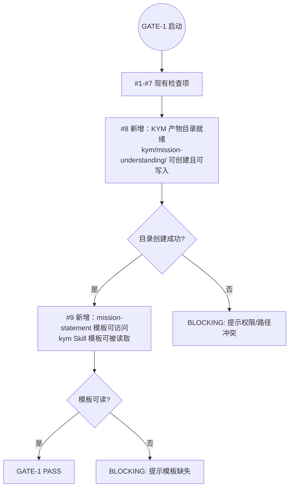
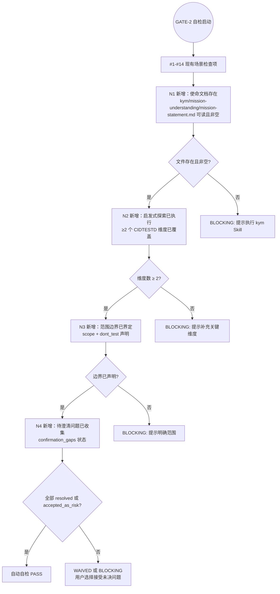

# LLD: STORY-011-03 — Gate 自检增强

> 文件名格式：`STORY-011-03-gate-self-check-enhancement-LLD.md`
>
> 本文档是 STORY-011-03 的低层设计（Low-Level Design），需纳入全部目标 Story 的 LLD 统一确认后方可进入实现。

## 1. Goal

增强 GATE-1 Entry Gate 和 GATE-2 KYM Exit Gate 的检查项：GATE-1 新增 #8（KYM 产物目录就绪）和 #9（mission-statement 模板可访问）两项纯自检项；GATE-2 新增 N1-N4 使命理解专属检查项（自检+人工）和 4 项人工确认项（使命声明、测试关注点优先级、范围边界、启发式探索覆盖）。同步更新 `skills/checkpoint-manager/SKILL.md` 中 GATE-1 和 GATE-2 的描述。

## 2. Requirements（Functional / Non-Functional）

### 2.1 Functional

- [AC-01] `docs/ptm-tde/gate-spec.md` §GATE-1 Checklist 表格新增 #8（KYM 产物目录就绪）和 #9（mission-statement 模板可访问）
- [AC-02] `docs/ptm-tde/gate-spec.md` §GATE-2 Checklist 表格新增 N1-N4（使命文档存在/启发式探索已执行/范围边界已界定/待澄清问题已收集）
- [AC-03] `docs/ptm-tde/gate-spec.md` §GATE-2 人工确认项表格新增 4 项（使命声明/测试关注点优先级/范围边界/启发式探索覆盖）
- [AC-04] `skills/checkpoint-manager/SKILL.md` §GATE-1 Checklist 概要表格新增 #8 和 #9
- [AC-05] `skills/checkpoint-manager/SKILL.md` §GATE-2 Checklist 概要表格新增 N1-N4
- [AC-06] `skills/checkpoint-manager/SKILL.md` §GATE-2 人工确认项表格新增 4 项
- [AC-07] 两份文件对同一 Gate 的检查项描述一致（Checklist 编号、通过条件、失败处理）
- [AC-08] 不修改 GATE-3、GATE-4、GATE-5 的内容

### 2.2 Non-Functional

- [NF-01] gate-spec.md 和 checkpoint-manager SKILL.md 的 GATE-1/GATE-2 表格格式保持一致（列名、列数、对齐方式）
- [NF-02] 新增的 #8/#9 使用与原 #1-#7 相同的表格列结构（# / 检查项 / 通过条件 / 失败处理）
- [NF-03] 新增的 N1-N4 使用与原 #1-#14 相同的表格列结构
- [NF-04] gate-spec.md 的修订记录表新增 v1.3 行

## 3. 模块拆分与职责

| 模块 / 文件组 | 职责 | 说明 |
|---|---|---|
| `docs/ptm-tde/gate-spec.md` | Gate 规范真相源：GATE-1 新增 #8/#9、GATE-2 新增 N1-N4 + 4 人工确认项 | 修改，+40 行 |
| `skills/checkpoint-manager/SKILL.md` | checkpoint-manager 的 Skill 描述：GATE-1/GATE-2 Checklist 和人工确认项与 gate-spec 对齐 | 修改，+20 行 |

模块边界：
- 不修改 GATE-3、GATE-4、GATE-5 的任何检查项
- 不修改 CP 兼容路由规则表、CP↔Gate 映射表
- checkpoint-manager 只维护 GATE-1/GATE-2 的概要描述，详细规范以 gate-spec.md 为准
- 不涉及任何实现代码（run_checkpoint.py 由后续 CR 在 Gate handler 中新增对这些检查项的自动化逻辑）

## 4. 代码结构与文件影响范围

> 使用确定性动词（创建 / 修改 / 删除），不允许使用"可能""也许"等模糊描述。

| 动作 | 文件路径 | 变更内容 |
|---|---|---|
| 修改 | `docs/ptm-tde/gate-spec.md` | §GATE-1 Checklist 表格末尾追加 #8、#9 两行；§GATE-2 Checklist 表格末尾追加 N1-N4 四行；§GATE-2 人工确认项表格末尾追加 4 行；§修订记录 追加 v1.3 行 |
| 修改 | `skills/checkpoint-manager/SKILL.md` | §GATE-1 Checklist 概要表格末尾追加 #8、#9 两行；§GATE-2 Checklist 概要表格末尾追加 N1-N4 四行；§GATE-2 人工确认项表格末尾追加 4 行 |

### 精确修改位置映射

#### gate-spec.md

| 修改点 | 位置 | 插入位置 |
|---|---|---|
| GATE-1 Checklist #8 | 第 97 行后（#7 行末） | #7「公共因子库可解析」行之后，Exit Criteria 表之前 |
| GATE-1 Checklist #9 | #8 行之后 | #8 行之后，Exit Criteria 表之前 |
| GATE-2 Checklist N1-N4 | 第 148 行后（#14 行末） | #14「输出质量检查」行之后，人工确认项表之前 |
| GATE-2 人工确认项 x4 | 第 159 行后（原 8 项确认末尾） | 「Confirmation Gaps」行之后，Exit Criteria 表之前 |
| 修订记录 v1.3 | 文件头部修订记录表 | v1.2 行之后 |

#### checkpoint-manager SKILL.md

| 修改点 | 位置 | 插入位置 |
|---|---|---|
| GATE-1 Checklist #8/#9 | 第 54 行后（#7 行末） | #7 行之后，「### Exit Criteria」节之前 |
| GATE-2 Checklist N1-N4 | 第 105 行后（#14 行末） | #14 行之后，「### 人工确认项」节之前 |
| GATE-2 人工确认项 x4 | 第 118 行后（原 8 项末尾） | 「Confirmation Gaps」行之后，「### Exit Criteria」节之前 |

## 5. 数据模型与持久化设计

无新增数据模型 / 持久化变更。本 Story 只修改两个 Markdown 规范文档的表格内容，不涉及数据结构变更。

## 6. API / Interface 设计

| 接口 / 入口 | 输入 | 输出 | 调用方 | 说明 |
|---|---|---|---|---|
| gate-spec.md §GATE-1 | 项目根目录状态 | 新增 #8（目录存在检查）、#9（模板可访问检查） | checkpoint-manager / 主 Agent | GATE-1 Entry Gate 执行时读取 |
| gate-spec.md §GATE-2 | `kym/mission-understanding/mission-statement.md` | 新增 N1-N4 检查结果 + 4 项人工确认项 | checkpoint-manager / 主 Agent | GATE-2 KYM Exit Gate 执行时读取 |
| checkpoint-manager SKILL.md | 用户调用 `checkpoint-manager gate=GATE-1` 或 `gate=GATE-2` | GATE-1/GATE-2 的自检结果 + 人工确认稿 | 主 Agent / 用户 | checkpoint-manager 按 gate-spec 规范执行 |

**接口契约一致性**：checkpoint-manager SKILL.md 的 GATE-1/GATE-2 描述是 gate-spec.md 的概要镜像，不作为独立真相源。checkpoint-manager 声明「完整 Checklist 见 `docs/ptm-tde/gate-spec.md`」，故二者必须同步更新。

## 7. 核心处理流程

### 7.1 修改流程

```
1. 读取 gate-spec.md §GATE-1 Checklist 表格
2. 在 #7 行后插入 #8、#9
3. 读取 gate-spec.md §GATE-2 Checklist 表格
4. 在 #14 行后插入 N1-N4
5. 读取 gate-spec.md §GATE-2 人工确认项表格
6. 在"Confirmation Gaps"行后插入 4 项
7. 更新 gate-spec.md 修订记录（v1.3）
8. 读取 checkpoint-manager SKILL.md §GATE-1 Checklist 概要
9. 在 #7 行后插入 #8、#9
10. 读取 checkpoint-manager SKILL.md §GATE-2 Checklist 概要
11. 在 #14 行后插入 N1-N4
12. 读取 checkpoint-manager SKILL.md §GATE-2 人工确认项
13. 在"Confirmation Gaps"行后插入 4 项
14. 交叉校验：两份文件中同一 Gate 的检查项编号、名称、顺序完全一致
```

### 7.2 GATE-1 修改后的完整流程



### 7.3 GATE-2 新增检查项执行流程



## 8. 技术设计细节

### 8.1 关键规则：表格列结构

两个文件中的 GATE-1 和 GATE-2 Checklist 表格使用统一的列结构：

| 文件 | GATE-1 Checklist 列 | GATE-2 Checklist 列 |
|---|---|---|
| gate-spec.md | `# \| 检查项 \| 通过条件 \| 失败处理` | `# \| 检查项 \| 通过条件 \| 失败处理` |
| checkpoint-manager SKILL.md | `# \| 检查项 \| 通过条件` | `# \| 检查项 \| 通过条件 \| 失败处理` |

**注意**：checkpoint-manager SKILL.md 的 GATE-2 有「失败处理」列但 GATE-1 没有。本 LLD 确保新增行与所在表格的列数对齐，不改变列结构。

### 8.2 依赖选择与复用点

- gate-spec.md 是规范真相源，checkpoint-manager SKILL.md 只维护概要镜像
- 不引入新的共享片段或模板
- 检查项的"通过条件"和"失败处理"文本直接引用 HLD-CR-011.md §12 中的定义

### 8.3 兼容性处理

- 新增 #8/#9 和 N1-N4 的行号/编号独立于原有项，不影响 CP 兼容路由规则
- GATE-2 原有的 14 项 Checklist 和 8 项人工确认项不做任何修改
- #8/#9 使用与 #1-#7 相同的编号体系（阿拉伯数字），N1-N4 使用独立的 N 前缀编号，避免与原有编号冲突

### 8.4 gate-spec.md 修订记录

在文件头部修订记录表中新增一行：

```markdown
| v1.3 | 2026-06-02 | meta-dev | [CR-011] GATE-1 新增 #8（KYM 产物目录就绪）+ #9（mission-statement 模板可访问）；GATE-2 新增 N1-N4（使命文档存在/启发式探索已执行/范围边界已界定/待澄清问题已收集）+ 4 项人工确认项（使命声明/测试关注点优先级/范围边界/启发式探索覆盖） |
```

## 9. 安全与性能设计

| 维度 | 设计措施 | 验证方式 |
|---|---|---|
| 安全 | 无安全相关变更。新增检查项不涉及权限验证、密钥读取或敏感数据处理。 | 人工审查 gate-spec.md 和 checkpoint-manager SKILL.md 中所有新增文本，确认无敏感信息引用。 |
| 性能 | 无性能影响。本 Story 只修改 Markdown 文档，不引入运行时计算。 | 文件修改后 `git diff --check` 通过即可。 |

## 10. 测试设计

| 测试场景 | 前置条件 | 操作 | 预期结果 | 验证方式 |
|---|---|---|---|---|
| T-01: gate-spec GATE-1 #8 存在 | gate-spec.md 已修改 | `grep -n "#8" docs/ptm-tde/gate-spec.md` | 返回 #8 行，内容包含"KYM 产物目录就绪"和"kym/mission-understanding/" | grep |
| T-02: gate-spec GATE-1 #9 存在 | gate-spec.md 已修改 | `grep -n "#9" docs/ptm-tde/gate-spec.md` | 返回 #9 行，内容包含"mission-statement 模板可访问" | grep |
| T-03: gate-spec GATE-2 N1-N4 全部存在 | gate-spec.md 已修改 | `grep -n "^| N[1-4] " docs/ptm-tde/gate-spec.md` | 返回 4 行，分别对应 N1/N2/N3/N4 | grep |
| T-04: gate-spec GATE-2 新增人工确认项 | gate-spec.md 已修改 | `grep -n "使命声明\|测试关注点优先级\|范围边界\|启发式探索覆盖" docs/ptm-tde/gate-spec.md` | 在 GATE-2 区域找到 4 项新增人工确认项 | grep |
| T-05: checkpoint-manager GATE-1 #8/#9 | checkpoint-manager SKILL.md 已修改 | `grep -n "#8\|#9" skills/checkpoint-manager/SKILL.md` | 在 GATE-1 区域找到 #8 和 #9 | grep |
| T-06: checkpoint-manager GATE-2 N1-N4 | checkpoint-manager SKILL.md 已修改 | `grep -n "^| N[1-4] " skills/checkpoint-manager/SKILL.md` | 在 GATE-2 区域找到 N1-N4 | grep |
| T-07: checkpoint-manager GATE-2 新增人工确认项 | checkpoint-manager SKILL.md 已修改 | `grep -n "使命声明\|测试关注点优先级" skills/checkpoint-manager/SKILL.md` | 在 GATE-2 区域找到新增项 | grep |
| T-08: 两份文件交叉校验 | 07 的搜证均通过 | 人工对比 gate-spec.md 和 checkpoint-manager SKILL.md 的 GATE-1/GATE-2 Checklist 和人工确认项 | 同一 Gate 的检查项编号、名称、顺序完全一致 | 人工审查 |
| T-09: 修订记录存在 | gate-spec.md 已修改 | `grep -n "v1.3" docs/ptm-tde/gate-spec.md` | 返回修订记录行，内容包含 CR-011 和变更要点 | grep |
| T-10: 不影响其他 Gate | gate-spec.md 已修改 | `grep -n "GATE-3\|GATE-4\|GATE-5" docs/ptm-tde/gate-spec.md` | GATE-3/4/5 的 Checklist 和人工确认项不包含使命理解相关内容 | 人工审查 |

## 11. 实施步骤

> 严格使用 TASK-ID + 确定性动词。

| TASK-ID | 动作 | 目标文件 | 详细描述 | 对应测试 |
|---|---|---|---|---|
| TASK-011-03-01 | 修改 | `docs/ptm-tde/gate-spec.md` | 在 §GATE-1 Checklist 表格 #7 行后追加 #8（`\| 8 \| KYM 产物目录就绪 \| kym/mission-understanding/ 目录已创建且可写入 \| 尝试创建；创建失败（权限/路径被普通文件占用）→ BLOCKING \|`）和 #9（`\| 9 \| mission-statement 模板可访问 \| kym Skill 的 mission-statement 模板可被读取 \| BLOCKING（模板是 kym Skill 正常运行的前提）\|`） | T-01, T-02 |
| TASK-011-03-02 | 修改 | `docs/ptm-tde/gate-spec.md` | 在 §GATE-2 Checklist 表格 #14 行后追加 N1（`\| N1 \| 使命文档存在 \| kym/mission-understanding/mission-statement.md 可读且非空 \| BLOCKING：提示执行 kym Skill 或补充使命文档 \|`）、N2（`\| N2 \| 启发式探索已执行 \| 使命文档包含至少 2 个 CIDTESTD 维度的分析记录（含用户扩展维度） \| BLOCKING：若 0-1 个维度，提示用户补充关键维度访谈 \|`）、N3（`\| N3 \| 范围边界已界定 \| 使命文档包含明确的 scope 和 dont_test 声明 \| BLOCKING：范围未界定时提示用户明确 \|`）、N4（`\| N4 \| 待澄清问题已收集 \| confirmation_gaps 所有项状态为 resolved 或 accepted_as_risk \| WAIVED 或 BLOCKING：用户可选择接受未决问题并 WAIVED，或回 KYM 阶段解决 \|`） | T-03 |
| TASK-011-03-03 | 修改 | `docs/ptm-tde/gate-spec.md` | 在 §GATE-2 人工确认项表格末尾追加 4 行：使命声明（做什么、为什么做、为谁做是否准确反映用户意图）、测试关注点优先级（排序是否符合项目实际，customers.priority + risks.impact 组合）、范围边界（排除项是否合理，是否有遗漏，test_items.dont_test 是否覆盖所有不应测试的模块）、启发式探索覆盖（维度是否足够，问题是否到位，核心维度 + 扩展维度的覆盖质量） | T-04 |
| TASK-011-03-04 | 修改 | `docs/ptm-tde/gate-spec.md` | 在文件头部修订记录表追加 v1.3 行 | T-09 |
| TASK-011-03-05 | 修改 | `skills/checkpoint-manager/SKILL.md` | 在 §GATE-1 Checklist 概要表格 #7 行后追加 #8（`\| 8 \| KYM 产物目录就绪 \| kym/mission-understanding/ 目录已创建且可写入 \|`）和 #9（`\| 9 \| mission-statement 模板可访问 \| kym Skill 的 mission-statement 模板可被读取 \|`）。注意 checkpoint-manager SKILL.md 的 GATE-1 表格没有"失败处理"列，只保留 # / 检查项 / 通过条件 三列。 | T-05 |
| TASK-011-03-06 | 修改 | `skills/checkpoint-manager/SKILL.md` | 在 §GATE-2 Checklist 概要表格 #14 行后追加 N1-N4 四行（与 gate-spec.md 一致，保留"失败处理"列） | T-06 |
| TASK-011-03-07 | 修改 | `skills/checkpoint-manager/SKILL.md` | 在 §GATE-2 人工确认项表格末尾追加 4 行（使命声明、测试关注点优先级、范围边界、启发式探索覆盖） | T-07 |
| TASK-011-03-08 | 验证 | 两份文件 | 执行交叉校验（T-08）：确认 gate-spec.md 和 checkpoint-manager SKILL.md 中 GATE-1/GATE-2 的检查项编号、名称、顺序完全一致 | T-08 |
| TASK-011-03-09 | 验证 | `docs/ptm-tde/gate-spec.md` | 执行 GATE-3/4/5 不变校验（T-10）：确认修改未影响 GATE-3/4/5 的任何内容 | T-10 |

## 12. 风险、难点与预研建议

### 12.1 实现灰区与取舍记录

| Clarification ID | 问题 | 选项与推荐 | 决策 / 答案 | 影响面 | 证据 | 重访条件 |
|---|---|---|---|---|---|---|
| LCQ-STORY-011-03-01 | checkpoint-manager 的 GATE-1 Checklist 概要表格当前只有「# / 检查项 / 通过条件」三列，而 gate-spec.md 有「# / 检查项 / 通过条件 / 失败处理」四列。新增 #8/#9 时应该保持与所在表格一致的列数（SKILL.md 不加"失败处理"列），还是统一为四列？ | **推荐方案**：保持与所在表格一致（SKILL.md 不加"失败处理"列）。理由：checkpoint-manager SKILL.md 声明"完整 Checklist 见 gate-spec.md"，概要只作快速参考，无需冗余列。备选方案：统一为四列，增加"失败处理"列。 | 推荐方案已采用 | 文档一致性 | TASK-011-03-05 已在实施步骤中注明"只保留三列" | 若后续 CR 要求 checkpoint-manager SKILL.md 的 GATE-1 表格增加"失败处理"列，可统一修改 |

| 风险 / 难点 | 影响 | 缓解措施 / 预研建议 |
|---|---|---|
| R1: 两份文件同步偏差 | 若 gate-spec.md 的检查项描述在后续 CR 中增删改，checkpoint-manager SKILL.md 的概要未被同步更新，导致两份文件对同一 Gate 的描述不一致 | TASK-011-03-08 实施交叉校验；后续 CR 修改 gate-spec.md 时必须在 CR 影响分析中标记 checkpoint-manager SKILL.md 作为同步对象 |
| R2: N 编号与原有 #1-#14 编号混淆 | 用户可能在阅读 GATE-2 Checklist 时分不清哪些是场景检查项、哪些是使命理解检查项 | N 前缀与数字前缀天然区分；gate-spec.md 中 GATE-2 章节内部通过小标题分隔"场景检查项"和"使命理解检查项"；若混淆仍出现，可在 N1 行前增加分隔注释行 |

### OPEN / Spike 跟踪

无 OPEN 或 Spike 项。本 Story 的所有设计决策已在 HLD-CR-011.md §12 中明确，不存在待澄清的技术点。

## 13. 回滚与发布策略

- **发布方式**：直接修改两个文件的文本内容，无需部署脚本或安装工具。
- **回滚触发条件**：交叉校验（T-08）发现两份文件描述不一致且无法快速修复；GATE-1/GATE-2 执行时发现新增检查项与 checkpoint-manager 的实现行为不符。
- **回滚动作**：`git revert` 本 Story 的提交，恢复 gate-spec.md 和 checkpoint-manager SKILL.md 到修改前状态。由于未删除任何原有内容，回滚不会丢失任何信息。

## 14. Definition of Done

- [ ] gate-spec.md §GATE-1 Checklist 包含 #8 和 #9
- [ ] gate-spec.md §GATE-2 Checklist 包含 N1-N4
- [ ] gate-spec.md §GATE-2 人工确认项包含 4 项新增
- [ ] gate-spec.md 修订记录包含 v1.3 行
- [ ] checkpoint-manager SKILL.md §GATE-1 Checklist 概要包含 #8 和 #9
- [ ] checkpoint-manager SKILL.md §GATE-2 Checklist 概要包含 N1-N4
- [ ] checkpoint-manager SKILL.md §GATE-2 人工确认项包含 4 项新增
- [ ] 两份文件交叉校验通过（同一 Gate 的检查项编号、名称、顺序一致）
- [ ] GATE-3/4/5 内容未被修改
- [ ] 所有 10 项测试验证通过
- [ ] `confirmed=false` 时不进入实现

## 人工确认区

> **CP5 — Story LLD 可实现性门**
> meta-dev 先写入 `process/checks/CP5-STORY-011-03-gate-self-check-enhancement-LLD-IMPLEMENTABILITY.md` 自动预检结果。
> meta-po 收齐全部目标 Story 的 LLD、CP4 自动预检摘要和 CP5 自动预检后，再生成并提示用户审查 `checkpoints/CP5-ALL-STORIES-LLD-BATCH-CR-011.md`。
> 用户统一确认全部目标 Story 的 LLD 后，仍需满足当前 Wave、依赖门控与文件所有权门控方可进入实现。

**CP5 checklist 摘要**：

| # | 检查项 | 状态 | 证据 |
|---|---|---|---|
| 1 | LLD 覆盖 AC | 待检查 | §2 / §10 / §14 |
| 2 | 与 HLD / ADR 一致 | 待检查 | §3 / §8 / §12 |
| 3 | 文件影响范围明确 | 待检查 | §4 / §11 |
| 4 | 接口契约完整 | 待检查 | §6 |
| 5 | 测试与 dev_gate 可计算 | 待检查 | §10 / §14 |
| 6 | clarification queue 已收敛 | 待检查 | §12.1 |

**人工确认回复**：

请直接回复以下任一整行：

```text
approve
修改: <具体修改点>
reject
```

- `approve`：LLD 设计合理，允许进入实现。
- `修改: <具体修改点>`：指出具体修改点后由 meta-dev 更新重提。
- `reject`：设计方向有根本问题，需重新设计。
