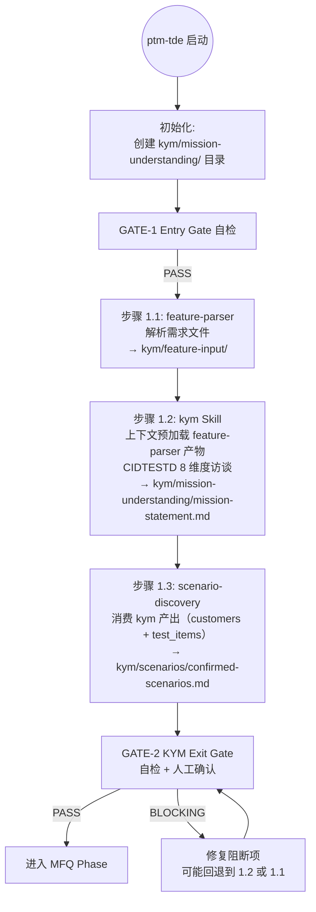

# LLD: STORY-011-04 — Agent 流程更新

> 文件名格式：`STORY-011-04-agent-flow-update-LLD.md`
>
> 本文档是 STORY-011-04 的低层设计（Low-Level Design），需纳入全部目标 Story 的 LLD 统一确认后方可进入实现。

## 1. Goal

更新 `agents/ptm-tde.md`，将 KYM 阶段的步骤顺序改为 feature-parser（1.1）→ kym Skill（1.2）→ scenario-discovery（1.3），初始化流程创建 `kym/mission-understanding/` 目录，追踪链添加 v2 方向注释。Skill 触发词映射表新增 kym Skill 条目。

## 2. Requirements（Functional / Non-Functional）

### 2.1 Functional

- [AC-01] §三阶段框架的 KYM Phase 行：`feature-parser → scenario-discovery` 改为 `feature-parser → kym Skill → scenario-discovery`
- [AC-02] §阶段与 Gate 总览表的 KYM 行：「关键 Skill」列新增 `kym`；「产物目录」列新增 `kym/mission-understanding/`
- [AC-03] §运行时工作目录的 `kym/` 描述新增 `mission-understanding/`（使命理解产物）
- [AC-04] §目录结构图中 `kym/` 下新增 `mission-understanding/` 子目录条目
- [AC-05] §初始化流程第 1 步新增 `kym/mission-understanding/` 目录创建
- [AC-06] §Skill 触发词映射表新增 `kym` 行（位于 `feature-parser` 和 `scenario-discovery` 之间）
- [AC-07] §追踪链下方添加 v2 方向注释（◇ 设计前瞻），标注 KYM 前置节点、TSP 节点、CAE-R 节点及各自实现归属
- [AC-08] 更新 `process/STATE.yaml` 初始化示例中的步骤描述（若涉及）
- [AC-09] 不修改 MFQ 阶段、PPDCS 阶段、GATE-3/4/5、公共因子库、约束等章节

### 2.2 Non-Functional

- [NF-01] 所有修改保持文档格式一致性（Markdown 表格列对齐、Mermaid 图语法完整）
- [NF-02] v2 追踪链注释使用 `◇` 标记和 `fill:#fff3cd,stroke:#ffc107,stroke-dasharray:5 5` 样式与 HLD-CR-011.md 保持一致
- [NF-03] 不修改 `directory-structure.md` 或任何 Skill 的 SKILL.md（归属 STORY-011-01/02）
- [NF-04] 预计净增 20-25 行

## 3. 模块拆分与职责

| 模块 / 文件组 | 职责 | 说明 |
|---|---|---|
| `agents/ptm-tde.md` §三阶段框架 | KYM Phase 行描述 kym Skill 的集成 | 修改 1 处（约第 50 行） |
| `agents/ptm-tde.md` §阶段与 Gate 总览 | 「关键 Skill」和「产物目录」列新增 kym 和 mission-understanding 信息 | 修改 1 行（约第 63 行） |
| `agents/ptm-tde.md` §运行时工作目录 + §目录结构图 | kym/ 目录树新增 mission-understanding/ | 修改 2 处（约第 116 行、第 133-136 行） |
| `agents/ptm-tde.md` §初始化流程 | 第 1 步新增 `kym/mission-understanding/` 创建 | 修改 1 行（约第 305 行） |
| `agents/ptm-tde.md` §Skill 触发词映射 | 新增 kym 行 | 修改 1 处（在 feature-parser 和 scenario-discovery 之间插入） |
| `agents/ptm-tde.md` §追踪链 | 下方添加 v2 注释 | 修改 1 处（约第 355 行后） |

模块边界：
- 只修改 `agents/ptm-tde.md`，不修改 `skills/kym/SKILL.md`（归属 STORY-011-01）、不修改任何 Skill 文件
- 不修改 MFQ 和 PPDCS 阶段描述
- 追踪链 v2 注释只做标注，不修改现有追踪链箭头
- HARD-GATE 通过步骤顺序强制执行，不修改 GATE-2 的检查逻辑（GATE-2 增强归属 STORY-011-03）

## 4. 代码结构与文件影响范围

> 使用确定性动词（创建 / 修改 / 删除），不允许使用"可能""也许"等模糊描述。

| 动作 | 文件路径 | 变更内容 |
|---|---|---|
| 修改 | `agents/ptm-tde.md` | 共 8 处修改，净增约 20-25 行 |

### 精确修改点

| # | 行号范围 | 修改类型 | 当前内容 | 变更后内容 |
|---|---|---|---|---|
| M1 | 约第 50 行 | 行内修改 | `→ KYM Phase: feature-parser → scenario-discovery` | `→ KYM Phase: feature-parser → kym Skill → scenario-discovery` |
| M2 | 约第 63 行 | 行内修改 | KYM 行「关键 Skill」列：`feature-parser`、`scenario-discovery` | 改为 `feature-parser`、`kym`、`scenario-discovery` |
| M3 | 约第 63 行 | 行内修改 | KYM 行「产物目录」列：`kym/feature-input/`、`kym/scenarios/` | 改为 `kym/feature-input/`、`kym/mission-understanding/`、`kym/scenarios/` |
| M4 | 约第 116 行 | 行内修改 | `- **`kym/`** — KYM（Know Your Mission）阶段产物：`feature-input/`、`scenarios/`。` | 改为 `- **`kym/`** — KYM（Know Your Mission）阶段产物：`feature-input/`、`mission-understanding/`、`scenarios/`。` |
| M5 | 约第 133-136 行 | 区域内插入 | `kym/` 目录树下只有 `feature-input/` 和 `scenarios/` | 在 `feature-input/` 和 `scenarios/` 之间插入 `│   ├── mission-understanding/                  # 使命理解产物（kym Skill 写入）` |
| M6 | 约第 305 行 | 行内修改 | `- `kym/feature-input/`、`kym/scenarios/`` | 改为 `- `kym/feature-input/`、`kym/mission-understanding/`、`kym/scenarios/`` |
| M7 | 约第 281-282 行 | 行间插入 | `feature-parser` 和 `scenario-discovery` 行之间 | 新增行：`\| `kym` \| 使命理解、KYM、Know Your Mission、特性访谈 \| KYM \| KYM \|` |
| M8 | 约第 355 行后 | 尾部追加 | 追踪链结束后无 v2 注释 | 追加 v2 追踪链注释（见 §8） |

## 5. 数据模型与持久化设计

无新增数据模型 / 持久化变更。本 Story 只修改 Agent 流程描述文档的文本内容。

## 6. API / Interface 设计

| 接口 / 入口 | 输入 | 输出 | 调用方 | 说明 |
|---|---|---|---|---|
| kym Skill 步骤集成 | feature-parser 完成信号 + `kym/feature-input/` 产物 | kym Skill 启动，产出 `kym/mission-understanding/mission-statement.md` | 主 Agent（ptm-tde） | 主 Agent 在 feature-parser 成功后自动调用 kym Skill |
| kym → scenario-discovery 交接 | kym Skill 完成信号 + `kym/mission-understanding/mission-statement.md` | scenario-discovery 启动，读取 kym 产出（customers 优先级 + test_items 边界） | 主 Agent（ptm-tde） | kym 产出缺失时不阻断 scenario-discovery |
| 初始化目录创建 | 项目根目录状态 | 创建 `kym/mission-understanding/` | 主 Agent（ptm-tde） | 初始化流程第 1 步执行；若已存在则跳过 |

**关键接口契约**：
- 主 Agent 按固定顺序 1.1 → 1.2 → 1.3 调度，这是 HARD-GATE 的强制机制
- kym Skill 的触发通过自然语言（`使命理解`、`KYM`、`Know Your Mission`、`特性访谈`），主 Agent 在步骤描述中明确调用 kym Skill
- scenario-discovery 消费 kym 产出为 pull 模式（可选读取），mission-statement.md 不存在时不阻断

## 7. 核心处理流程

### 7.1 修改后的 KYM 阶段完整流程



### 7.2 HARD-GATE 强制机制

```
用户试图跳过 kym Skill
    │
    ▼
主 Agent 检测步骤顺序不完整
    │
    ├── 若跳过 1.1（feature-parser）→ 阻断，必须先从需求解析开始
    ├── 若跳过 1.2（kym Skill）→ 阻断，提示"请先完成使命理解访谈"并返回 KYM 步骤
    └── 若跳过 1.3（scenario-discovery）→ 阻断，提示"请先完成场景发现"
    │
    ▼
GATE-2 N1 作为第二道防线：
    ├── 检查 kym/mission-understanding/mission-statement.md 存在
    └── 不存在 → BLOCKING → 提示执行 kym Skill
```

## 8. 技术设计细节

### 8.1 M1-M6 修改：文本替换

M1-M6 为纯文本替换或插入，不涉及格式变化。每处修改保持与所在表格/列表的列对齐和 Markdown 语法一致。

**M5 细节**：目录结构图中的插入位置

当前：
```text
├── kym/                                      # KYM 阶段产物
│   ├── feature-input/                        # 解析后的结构化需求与目录
│   └── scenarios/                            # 已确认场景、Topology、atomic-ops
```

修改后：
```text
├── kym/                                      # KYM 阶段产物
│   ├── feature-input/                        # 解析后的结构化需求与目录
│   ├── mission-understanding/                # 使命理解产物（kym Skill 写入）
│   └── scenarios/                            # 已确认场景、Topology、atomic-ops
```

### 8.2 M7 修改：Skill 触发词映射表新增

在 `feature-parser` 和 `scenario-discovery` 之间插入一行：

```markdown
| `kym` | 使命理解、KYM、Know Your Mission、特性访谈 | KYM | KYM |
```

完整上下文：
```markdown
| Skill | 触发词 | PPDCS | 阶段 |
|-------|--------|-------|------|
| `feature-parser` | 解析特性、解析需求、导入特性文件 | KYM | KYM |
| `kym` | 使命理解、KYM、Know Your Mission、特性访谈 | KYM | KYM |
| `scenario-discovery` | 场景分析、搜索场景、应用场景、场景链 | KYM | KYM |
```

### 8.3 M8 修改：追踪链 v2 方向注释

在当前追踪链（约第 351-355 行）下方追加：

```markdown
### v2 追踪链方向（◇ 设计前瞻）

> 以下为 v2 追踪链的设计前瞻，标注 ◇ 的节点归属后续 CR，当前不实现。

```
v2 追踪链:
  需求文档 → KYM → 场景发现 → SR → M → TSP → Model(LC) → Factor → CAE-R → PC → 原子操作
  ★(CR-011) ★(CR-011) ★(CR-011)           ◇(CR-012) ◇(CR-012)  ◇(因子CR) ◇(CR-012/013)
```

| 节点 | 当前状态 | v2 目标 | 实现归属 |
|------|---------|--------|---------|
| 需求文档 → KYM | 不存在 | kym Skill 消费需求文档产出 mission-statement | **CR-011**（本 CR） |
| KYM → 场景发现 | 不存在 | customers 优先级 + test_items 边界消费 | **CR-011**（本 CR） |
| SR → M | 已有 | 不变 | — |
| M → TSP | 不存在 | m-analyzer 步骤 2 后插入 TSP 三元组 | CR-012 |
| TSP → Model(LC) | 不存在 | TSP purpose 引导 PPDCS 特征选择 | CR-012/013 |
| Model(LC) → Factor | 已有（隐式） | Factor 作为显式节点（factor_type 标注） | 后续因子库 CR |
| Factor → CAE-R | 已有（CAE） | CAE → CAE-R（增加 R 追溯） | CR-012/013 |
| CAE-R → PC | 已有（CAE → PC） | CAE-R 实例化为 PC | CR-013 |
| PC → 原子操作 | 已有（隐式） | PC 步骤显式映射原子操作 op_id | 后续 CR |
```

> **CR-011 定位**：CR-011 覆盖追踪链最前端（需求文档 → KYM → 场景发现），确立 KYM 产出作为所有下游消费的起点。

### 8.4 依赖选择与复用点

- 本 Story 的修改内容严格引用 HLD-CR-011.md §14.1（KYM 阶段完整流程）和 §11.4（完整追踪链）
- kym Skill 的触发词来自 STORY-011-01 LLD §2.2 NF-03（`使命理解、KYM、Know Your Mission、特性访谈`）
- 追踪链 v2 注释的节点→CR 映射表直接引用 HLD-CR-011.md §11.4 的实现归属表
- 不引入新的共享片段

### 8.5 兼容性处理

- 目录结构图中 `mission-understanding/` 插入在 `feature-input/` 和 `scenarios/` 之间（ASCII 树形结构的自然位置）
- 初始化流程中 `kym/mission-understanding/` 插入在 `kym/feature-input/` 和 `kym/scenarios/` 之间
- 所有修改均为增量添加，不删除或替换任何现有功能描述

## 9. 安全与性能设计

| 维度 | 设计措施 | 验证方式 |
|---|---|---|
| 安全 | 无安全相关变更。本 Story 只修改 Agent 流程描述文档。 | 人工审查修改后的文档，确认未引入敏感信息。 |
| 性能 | 无性能影响。文档修改不涉及运行时。 | `git diff --check` 通过即可。 |

## 10. 测试设计

| 测试场景 | 前置条件 | 操作 | 预期结果 | 验证方式 |
|---|---|---|---|---|
| T-01: 三阶段框架含 kym Skill | ptm-tde.md 已修改 | `grep "kym Skill" agents/ptm-tde.md` | 在 KYM Phase 行找到 `feature-parser → kym Skill → scenario-discovery` | grep |
| T-02: 阶段总览表含 kym | ptm-tde.md 已修改 | `grep -A2 "KYM" agents/ptm-tde.md \| grep "kym"` | KYM 行的「关键 Skill」列包含 `kym` | grep |
| T-03: 工作目录描述含 mission-understanding | ptm-tde.md 已修改 | `grep "mission-understanding" agents/ptm-tde.md` | 在 kym/ 目录描述和目录结构图中找到 2 处引用 | grep（预期 ≥2） |
| T-04: 目录结构图含 mission-understanding | ptm-tde.md 已修改 | `grep "mission-understanding" agents/ptm-tde.md \| head -1` | 在 kym/ 目录树下有 `├── mission-understanding/` | grep |
| T-05: 初始化流程含 mission-understanding | ptm-tde.md 已修改 | `grep -A5 "初始化流程" agents/ptm-tde.md \| grep "mission-understanding"` | 第 1 步指令包含 `kym/mission-understanding/` | grep |
| T-06: Skill 映射表含 kym | ptm-tde.md 已修改 | `grep "\`kym\`" agents/ptm-tde.md` | 在 §Skill 触发词映射表中找到 `kym` 行，位于 `feature-parser` 和 `scenario-discovery` 之间 | grep |
| T-07: 追踪链 v2 注释存在 | ptm-tde.md 已修改 | `grep "v2 追踪链" agents/ptm-tde.md` | 找到 v2 追踪链注释，包含 ★(CR-011) 和 ◇(CR-012) 标注 | grep |
| T-08: v2 注释节点→CR 映射表完整 | ptm-tde.md 已修改 | `grep -c "CR-011\|CR-012\|CR-013" agents/ptm-tde.md` | 在 v2 注释区域找到多个 CR 归属引用 | grep |
| T-09: 不影响 MFQ/PPDCS 描述 | ptm-tde.md 已修改 | `grep -n "MFQ Phase\|PPDCS Phase" agents/ptm-tde.md` | MFQ/PPDCS 阶段描述不含 kym Skill 引用 | grep + 人工审查 |
| T-10: 旧引用已更新 | ptm-tde.md 已修改 | `grep "feature-parser → scenario-discovery" agents/ptm-tde.md` | 三阶段框架中不再出现旧顺序（或仅在非 KYM 上下文出现） | grep |

## 11. 实施步骤

> 严格使用 TASK-ID + 确定性动词。

| TASK-ID | 动作 | 目标文件 | 详细描述 | 对应测试 |
|---|---|---|---|---|
| TASK-011-04-01 | 修改 | `agents/ptm-tde.md` | §三阶段框架（约第 50 行）：将 `feature-parser → scenario-discovery` 改为 `feature-parser → kym Skill → scenario-discovery` | T-01 |
| TASK-011-04-02 | 修改 | `agents/ptm-tde.md` | §阶段与 Gate 总览表 KYM 行（约第 63 行）：「关键 Skill」列新增 `kym`；「产物目录」列新增 `kym/mission-understanding/` | T-02 |
| TASK-011-04-03 | 修改 | `agents/ptm-tde.md` | §运行时工作目录（约第 116 行）：`kym/` 描述中 `feature-input/`、`scenarios/` 改为 `feature-input/`、`mission-understanding/`、`scenarios/` | T-03 |
| TASK-011-04-04 | 修改 | `agents/ptm-tde.md` | §目录结构图（约第 133-136 行）：在 `kym/feature-input/` 和 `kym/scenarios/` 之间插入 `│   ├── mission-understanding/                  # 使命理解产物（kym Skill 写入）` | T-04 |
| TASK-011-04-05 | 修改 | `agents/ptm-tde.md` | §初始化流程第 1 步（约第 305 行）：在 `kym/feature-input/`、之后增加 `kym/mission-understanding/`、 | T-05 |
| TASK-011-04-06 | 修改 | `agents/ptm-tde.md` | §Skill 触发词映射表（约第 281-282 行）：在 `feature-parser` 和 `scenario-discovery` 行之间插入 `kym` 行（触发词：使命理解、KYM、Know Your Mission、特性访谈；PPDCS：KYM；阶段：KYM） | T-06 |
| TASK-011-04-07 | 修改 | `agents/ptm-tde.md` | §追踪链（约第 355 行后）：追加 v2 追踪链方向注释（含 Mermaid 文本图 + 节点→CR 映射表 + CR-011 定位说明） | T-07, T-08 |
| TASK-011-04-08 | 验证 | `agents/ptm-tde.md` | 执行 T-09 和 T-10 验证：确认 MFQ/PPDCS 描述不受影响，旧 `feature-parser → scenario-discovery` 引用已全部更新 | T-09, T-10 |

## 12. 风险、难点与预研建议

### 12.1 实现灰区与取舍记录

| Clarification ID | 问题 | 选项与推荐 | 决策 / 答案 | 影响面 | 证据 | 重访条件 |
|---|---|---|---|---|---|---|
| LCQ-STORY-011-04-01 | §初始化流程 第 1 步的目录创建指令格式：当前用 `kym/feature-input/`、`kym/scenarios/` 逗号分隔列出。新增 `kym/mission-understanding/` 后应保持现有格式（逗号分隔列表）还是改为项目符号列表？ | **推荐方案**：保持现有逗号分隔格式不变，在 `kym/feature-input/`、 之后插入 `kym/mission-understanding/`、。理由：最小化格式变化，兼容现有文档风格。备选方案：改为项目符号列表，每个目录一行。 | 推荐方案已采用 | 文档一致性 | TASK-011-04-05 备注"保持现有逗号分隔格式" | 若后续 CR 要求初始化流程改为项目符号列表，可统一修改 |

| 风险 / 难点 | 影响 | 缓解措施 / 预研建议 |
|---|---|---|
| R1: 步骤顺序描述与 Skill 映射表不一致 | 若三阶段框架中写了 `kym Skill` 但 Skill 触发词映射表中漏加 `kym` 行，用户按触发词找不到 kym Skill | TASK-011-04-06 在 Skill 映射表中新增 kym 行；T-06 测试验证映射表完整性 |
| R2: v2 追踪链注释过长影响文档可读性 | v2 注释若包含完整映射表和 Mermaid 图，可能导致追踪链章节过长 | 当前设计的 v2 注释为 ~20 行纯文本 + 表格，不引入 Mermaid 图，控制在可读范围 |

### OPEN / Spike 跟踪

无 OPEN 或 Spike 项。本 Story 的所有修改点为文本更新，无技术不确定性。

## 13. 回滚与发布策略

- **发布方式**：直接修改 `agents/ptm-tde.md` 文件。
- **回滚触发条件**：
  - M1-M8 中任一修改导致文档格式错误（如 Markdown 表格列不对齐）
  - 三阶段框架与 §初始化流程 的步骤顺序不一致
  - Skill 触发词映射表缺少 kym 条目
- **回滚动作**：`git revert` 本 Story 的提交，恢复 `agents/ptm-tde.md` 到修改前状态。由于所有修改为增量追加或行内修改，回滚不会影响其他 Story 对 `agents/ptm-tde.md` 的修改（本 Story 是唯一修改 `agents/ptm-tde.md` 的 Story）。

## 14. Definition of Done

- [ ] §三阶段框架 KYM Phase 行含 `kym Skill`
- [ ] §阶段与 Gate 总览表 KYM 行含 `kym` 和 `kym/mission-understanding/`
- [ ] §运行时工作目录的 `kym/` 描述含 `mission-understanding/`
- [ ] §目录结构图中 `kym/` 下有 `mission-understanding/` 条目
- [ ] §初始化流程第 1 步含 `kym/mission-understanding/` 创建
- [ ] §Skill 触发词映射表含 `kym` 行
- [ ] §追踪链下方有 v2 方向注释（含节点→CR 映射表）
- [ ] 所有 10 项测试验证通过
- [ ] MFQ/PPDCS 阶段描述和 GATE-3/4/5 内容未被修改
- [ ] `confirmed=false` 时不进入实现

## 人工确认区

> **CP5 — Story LLD 可实现性门**
> meta-dev 先写入 `process/checks/CP5-STORY-011-04-agent-flow-update-LLD-IMPLEMENTABILITY.md` 自动预检结果。
> meta-po 收齐全部目标 Story 的 LLD、CP4 自动预检摘要和 CP5 自动预检后，再生成并提示用户审查 `checkpoints/CP5-ALL-STORIES-LLD-BATCH-CR-011.md`。
> 用户统一确认全部目标 Story 的 LLD 后，仍需满足当前 Wave、依赖门控与文件所有权门控方可进入实现。

**CP5 checklist 摘要**：

| # | 检查项 | 状态 | 证据 |
|---|---|---|---|
| 1 | LLD 覆盖 AC | 待检查 | §2 / §10 / §14 |
| 2 | 与 HLD / ADR 一致 | 待检查 | §3 / §8 / §12 |
| 3 | 文件影响范围明确 | 待检查 | §4 / §11 |
| 4 | 接口契约完整 | 待检查 | §6 |
| 5 | 测试与 dev_gate 可计算 | 待检查 | §10 / §14 |
| 6 | clarification queue 已收敛 | 待检查 | §12.1 |

**人工确认回复**：

请直接回复以下任一整行：

```text
approve
修改: <具体修改点>
reject
```

- `approve`：LLD 设计合理，允许进入实现。
- `修改: <具体修改点>`：指出具体修改点后由 meta-dev 更新重提。
- `reject`：设计方向有根本问题，需重新设计。
