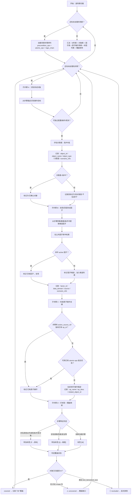

# LLD: STORY-012-03 — M 分析器 v3.0 重写（场景步骤驱动）

> 文件名格式：`STORY-012-03-m-analyzer-v3-rewrite-LLD.md`，其中 `story_slug` 复用 Story 卡片中的 `m-analyzer-v3-rewrite`。
>
> 本文档是 STORY-012-03 的低层设计（Low-Level Design），需纳入全部目标 Story 的 LLD 统一确认，并满足当前 Wave 的 `dev_gate` 后方可进入实现。

---

## 1. Goal

对 `skills/m-analyzer/SKILL.md` 执行全量重写，从 v2 的 7 步"逐模块功能分析"模式升级为 v3.0 的 7 步"场景步骤驱动的逐步发现"模式。引入 Scenario-TSP 覆盖矩阵（实体 H）和场景步骤标签（实体 G）两个新数据实体，增加测试对象关联度评估、因子/原子操作的"已有 vs 候选"区分、TSP 覆盖段追踪（`covered_scenario_segments` + `f_tags` + `q_tags`），以及四维覆盖初检机制。重写完成后 old-path `analysis/` 在新 SKILL.md 中零残留，所有路径使用 `mfq/m-analysis/` 前缀。

---

## 2. Requirements（Functional / Non-Functional）

### 2.1 Functional

- **FR01**：SKILL.md 包含 7 个步骤标题（步骤 1-7），分别对应：加载输入、场景步骤驱动发现、TSP 描述生成、PPDCS 特征标注、测试点生成、覆盖初检、写入 M 分析产物
- **FR02**：步骤 2（场景步骤驱动发现）包含 4 个子步骤：A 识别测试对象（含关联度评估）、B 发现/匹配测试因子（已有 vs 候选）、C 检查原子操作支撑（已有 vs 候选）、D 打标签 [M]/[F→]/[Q→] + 建立 Scenario→TSP 覆盖映射
- **FR03**：输出 Scenario-TSP 覆盖矩阵（`mfq/m-analysis/scenario-tsp-coverage.md`），含视角 A（场景→TSP）+ 视角 B（目录→场景）+ F/Q 线索汇总表
- **FR04**：TSP YAML schema 新增 `covered_scenario_segments`、`f_tags`、`q_tags` 三个字段
- **FR05**：测试点生成按对象关联度分级：高关联度全部生成、中关联度选择性生成（至少正常功能）、低关联度不生成测试点但记录供 F 分析参考
- **FR06**：产出因子候选列表（`candidate-factor-proposals.yaml`）和原子操作候选列表（`candidate-atomic-ops.yaml`）
- **FR07**：步骤 6 覆盖初检执行四维检查：需求覆盖 + 场景步骤覆盖 + 对象覆盖 + 原子操作覆盖，未覆盖项显式标记 ⚠️ 待补充
- **FR08**：步骤 1 加载输入增强：展开场景步骤序列（`precondition_operations` + `atomic_operations` + `minimal_logic_chain`），建立需求→目录映射，校验场景完整性
- **FR09**：YAML frontmatter 保留 `name: m-analyzer`，`description` 更新为包含 "v3.0" 和 "场景步骤驱动"
- **FR10**：输出目录全部使用 `mfq/m-analysis/`，输入路径使用 `kym/`（上游 KYM 产出）

### 2.2 Non-Functional

- **NFR01（可维护性）**：SKILL.md 行数 ≥ 400，≤ 550。步骤编号连续（1-7），子步骤使用字母编号（A/B/C/D）
- **NFR02（一致性）**：`analysis/` 旧路径在重写后的 SKILL.md 中零残留（不含注释中的路径说明引用）
- **NFR03（可追溯性）**：覆盖矩阵双视角（场景→TSP + 目录→场景）数据一致，视角 A 的 covered + uncovered + excluded = total_steps
- **NFR04（HARD-STOP）**：步骤 6 覆盖初检结果必须显式标注 ⚠️ 未覆盖项，禁止 Agent 自行判定"覆盖完成"。步骤 7 写入前必须校验目标父目录存在且为目录，禁止 Agent 手动 `mkdir`
- **NFR05（兼容性）**：CAE 三元组字段约束（C/A/E）、PPDCS 五特征定义表、MFQ 分层概念（测试因子/拓扑角色/真实组网对象）、拓扑/因子分层 Guardrail 完整保留
- **NFR06（门控强制）**：引用 GATE-3 HARD-STOP 规则：人工确认项必须等待用户回复 `approve` / `修改: ...` / `reject`，禁止 Agent 自行判定通过

---

## 3. 模块拆分与职责

由于本 Story 仅修改单文件 `skills/m-analyzer/SKILL.md`，模块拆分聚焦于 SKILL.md 内部的章节职责划分。

| 模块 / 文件组 | 职责 | 说明 |
|---|---|---|
| frontmatter | Skill 注册与触发词 | 保留 `name: m-analyzer`；更新 `description` 为 v3.0 描述 |
| 理论基础章节 | MFQ 方法论 + PPDCS 五特征 | 从旧版复用：MFQ 起源、M/F/Q 三维度、PPDCS 五特征表、区分规则、MFQ 分层概念 |
| 适用范围章节 | 输入/输出路径声明 | 更新：全部路径使用 `kym/` / `mfq/` |
| 前置条件章节 | 输入文件完整性校验 | 更新：路径迁移为 `kym/` + `mfq/`，增加全局 atomic-ops 检查 |
| 场景输入契约章节 | 上游字段消费契约 | 从旧版复用：`Scenario Chain`、`atomic_operations`、`Knowledge Reference`、`TOPO` 等字段契约 |
| 步骤 1：加载输入 | 输入数据索引化 | 增强：展开场景步骤序列，建立需求→目录映射，校验场景完整性 |
| 步骤 2：场景步骤驱动发现 | 核心发现逻辑 | 完全重写：子步骤 A/B/C/D，产出对象、因子、原子操作、标签、覆盖映射 |
| 步骤 3：TSP 描述生成 | TSP 实体生成 | 增强：新增 `covered_scenario_segments` + `f_tags` + `q_tags` |
| 步骤 4：PPDCS 特征标注 | 特征分类 | 增强：`TSP.purpose` 引导特征判断 |
| 步骤 5：测试点生成 | CAE 三元组生成 | 增强：按对象关联度分级生成 |
| 步骤 6：覆盖初检 | 四维覆盖检查 | 新增：需求 + 场景步骤 + 对象 + 原子操作 |
| 步骤 7：写入 M 分析产物 | 文件输出 | 增强：输出从 3 文件扩展到 8 文件 |
| 公共因子库补充契约 | 因子库消费规范 | 从旧版复用，更新路径为 `mfq/factor-usage/` |
| 拓扑绑定补充契约 | 拓扑绑定规范 | 从旧版复用，更新路径为 `kym/scenarios/` |
| Gotchas | 常见陷阱 | 从旧版复用，新增 v3.0 特有陷阱 |
| 验收标准 | M 分析完成标准 | 完全重写：对齐设计文档 §3 的 13 项验收标准 |

---

## 4. 代码结构与文件影响范围

| 动作 | 文件路径 | 变更内容 |
|---|---|---|
| 修改 | `skills/m-analyzer/SKILL.md` | 全量重写。从 v2 7 步 357 行升级为 v3.0 7 步 ~480 行。保留 frontmatter `name: m-analyzer`；保留理论基础/PPDCS 五特征表/CAE 约束/MFQ 分层概念/公共因子库契约/拓扑绑定契约/Gotchas 骨架；重写执行流程（步骤 1-7 全部按设计文档 §3 重写）；新增覆盖矩阵 + 步骤标签 + 候选列表产出；覆盖初检增强为四维检查 |

> 仅修改 1 个文件。无新建文件、无删除文件。不涉及 Python 脚本、MCP 服务、安装脚本。

---

## 5. 数据模型与持久化设计

所有产出均为 Markdown 或 YAML 文件，在 `mfq/m-analysis/` 下写入。无数据库持久化。

### 5.1 产出文件清单

| 文件路径 | 格式 | 内容 |
|---------|------|------|
| `mfq/m-analysis/test-points.md` | Markdown 表格 | 按四级→五级分节，CAE 表格，含 PPDCS 主特征标注 |
| `mfq/m-analysis/ppdcs-annotation.md` | Markdown 表格 | PPDCS 特征标注表 + 统计 |
| `mfq/m-analysis/test-objects-factors.md` | Markdown 表格 | 测试对象表 + 已有因子表 + 因子候选表 + 拓扑角色表 |
| `mfq/m-analysis/scenario-tsp-coverage.md` | Markdown 表格 + 列表 | 覆盖矩阵（视角 A + 视角 B）+ F/Q 线索汇总 |
| `mfq/m-analysis/tsp/<M编号>-tsp.md` | YAML + Markdown | 每个 M 的 TSP 描述，含 `covered_scenario_segments` + `f_tags` + `q_tags` |
| `mfq/m-analysis/factor-resolution-report.md` | Markdown | 公共因子库命中/未命中统计 |
| `mfq/m-analysis/candidate-factor-proposals.yaml` | YAML | 因子候选列表 |
| `mfq/m-analysis/candidate-atomic-ops.yaml` | YAML | 原子操作候选列表 |

### 5.2 覆盖矩阵格式（实体 H）

见设计文档 §2.3。关键结构约束：

- **视角 A「场景→TSP」**：每行 = 一个场景步骤段，含 `步骤范围`、`覆盖状态`（✅/⚠️/⚪）、`TSP`、`所属目录`、`标签`、`备注`
- **视角 B「目录→场景」**：按四级→五级目录组织，每行为 TSP 与其覆盖的场景步骤列表
- **F 分析线索汇总表**：从 `[F→]` 标签提取，含 `来源场景`、`步骤`、`标签`、`目标 M/系统`、`说明`
- **Q 分析线索汇总表**：从 `[Q→]` 标签提取，含 `来源场景`、`步骤`、`标签`、`质量维度`、`说明`
- 覆盖率计算：`covered / (total - excluded)`
- `[Q→]` 标记的步骤不计入 M 覆盖率，由 Q 分析单独统计

### 5.3 TSP YAML Schema（步骤 3 产出）

```yaml
tsp:
  id: "TSP-M<M编号>-NNN"           # 必填
  m_id: "M2"                        # 必填，关联的单功能编号
  topic: "根据优惠规则计算价格..."   # 必填，一句话描述
  scope: "接收校验后商品数据..."     # 必填，输入输出边界
  purpose: "验证买二赠一/95折..."   # 必填，测试意图
  covered_scenario_segments:        # v3.0 新增
    - scenario_ref: "SCN-SHOP-001"
      covered_steps: ["step-5", "step-6"]
      coverage_type: full           # full | partial
      coverage_note: "覆盖优惠规则计算核心步骤"
  f_tags: []                        # v3.0 新增，该 TSP 关联的 [F→] 标签
  q_tags: ["可靠性-数据一致性"]      # v3.0 新增，该 TSP 关联的 [Q→] 标签
```

### 5.4 因子候选 YAML Schema

```yaml
candidate_factors:
  - candidate_id: "FAC-CAND-001"
    factor_name: "服务器数量上限"
    data_domain: "5（上限）/ 可配置"
    related_object_id: "OBJ-LOG-SERVER"
    source: "new-candidate"           # 固定值
    scenario_refs: ["SCN-LOG-001"]
    discovery_step: "Step 4-8"        # 发现该因子的场景步骤
    priority: "high"                  # high | medium | low
```

### 5.5 原子操作候选 YAML Schema

```yaml
candidate_atomic_ops:
  - candidate_id: "AO-CAND-001"
    op_name: "fw_config_log_server_batch"
    op_desc: "批量创建日志服务器配置"
    related_object_id: "OBJ-LOG-SERVER"
    related_step: "Step 4"
    scenario_refs: ["SCN-LOG-001"]
```

### 5.6 场景步骤标签模型（实体 G）

| 标签 | 含义 | 判定条件 |
|------|------|---------|
| `[M]` | 纯单功能步骤 | 步骤仅涉及当前 M 内部逻辑 |
| `[F→目标]` | 暗示跨 M 交互 | 步骤涉及其他 M / 外部系统 / 共享对象 |
| `[Q→维度]` | 暗示质量属性 | 步骤涉及容错、性能、安全等非功能行为 |

一个步骤可同时具有多个标签（如 `[M] [F→外部]`）。

### 5.7 测试对象关联度模型

| 关联度 | 判定条件 | 处理策略 |
|--------|---------|---------|
| 高 | 该对象是特性的核心操作目标 | 已确认对象，必须生成测试点（正常+边界+异常） |
| 中 | 该对象在场景中作为辅助/中间角色 | 已确认对象，选择性生成测试点（至少正常功能） |
| 低 | 该对象仅作为环境/基础设施存在 | 记录但不生成 M 测试点，供 F 分析参考 |

---

## 6. API / Interface 设计

本 Story 不涉及 API、RPC 或程序化接口。数据交换全部通过文件系统（Markdown/YAML）。以下按消费（输入）和生产（输出）两个方向定义接口契约。

### 6.1 输入消费契约

| 接口 / 入口 | 输入文件 | 消费字段 | 用途 | 调用方 |
|---|---|---|---|---|
| 步骤 1 | `kym/feature-input/raw-requirements.md` | 全文 | 需求条目列表 | 用户先行完成 KYM 阶段 |
| 步骤 1 | `kym/feature-input/directory-structure.md` | 四/五级目录层级 | 分析范围 | 用户先行完成 KYM 阶段 |
| 步骤 1 | `kym/scenarios/confirmed-scenarios.md` | Scenario Chain / atomic_operations / minimal_logic_chain / observation_targets / Knowledge Reference / TOPO | 场景上下文 + 步骤序列 | scenario-discovery Skill |
| 步骤 1 | `kym/mission-understanding/mission-statement.md` | `test_items.items` + `dont_test` + `risks[].area/likelihood/impact` + `downstream_guidance.mfq.suggested_m_granularity` | 测试边界 + 风险预填 + 拆分粒度 | kym Skill |
| 步骤 1 | 全局 atomic-ops | `op_id` 列表 | 动作引用基准 | GATE-1 #3 |
| 步骤 2 | 公共因子库 | `factor_id / factor_name / aliases / owner_object` | 匹配已有因子 | 全局静态知识库 |
| 步骤 2 | 步骤 1 的场景步骤序列 | `precondition_operations` + `atomic_operations` + `minimal_logic_chain` | 逐步骤扫描的输入 | 步骤 1 内存产出 |
| 步骤 3 | 步骤 2 的 M 列表 + 测试对象表 | M 名称 / 关联需求 / 关联场景 / object_name / object_type | 为每个 M 生成 TSP | 步骤 2 产出 |
| 步骤 4 | 步骤 2 的已有因子 + 候选因子 | `factor_id` + `data_domain` | 辅助 Data vs Combination 判断 | 步骤 2 产出 |
| 步骤 4 | 步骤 3 的 TSP | **`purpose`** | 引导 PPDCS 主特征判断 | 步骤 3 产出 |
| 步骤 5 | 步骤 2 的已确认测试对象 | 全部（高/中关联度） | 测试点生成源 | 步骤 2 产出 |
| 步骤 5 | 步骤 4 的 PPDCS 特征 | 主特征 + 辅特征 | 标注在测试点上 | 步骤 4 产出 |

### 6.2 输出生产契约（面向下游消费方）

| 接口 / 入口 | 输出文件 | 关键字段 | 消费方 | 说明 |
|---|---|---|---|---|
| 步骤 7 | `mfq/m-analysis/test-points.md` | TP-ID / C / A / E / scenario_refs / action_source_refs / test_object_refs / factor_refs / topology_role_refs / PPDCS | test-point-integrator、design-planner | 按四级→五级分节，CAE 表格 |
| 步骤 7 | `mfq/m-analysis/ppdcs-annotation.md` | 子模块 / PPDCS 主特征 / 辅特征 / 判定依据 | test-point-integrator、design-planner | PPDCS 特征标注表 |
| 步骤 7 | `mfq/m-analysis/test-objects-factors.md` | object_id / factor_id（source=public-library/new-candidate）/ data_domain / topology_role_refs | f-analyzer、q-analyzer、test-point-integrator | 对象 + 因子 + 拓扑角色 |
| 步骤 7 | `mfq/m-analysis/scenario-tsp-coverage.md` | 视角 A 逐场景步骤覆盖 / 视角 B 目录→场景 / F 线索表 / Q 线索表 | **f-analyzer**（消费 F 线索）、**q-analyzer**（消费 Q 线索）、test-point-integrator、coverage-verifier | v3.0 核心新增 |
| 步骤 7 | `mfq/m-analysis/tsp/<M编号>-tsp.md` | `id / m_id / topic / scope / purpose / covered_scenario_segments / f_tags / q_tags` | f-analyzer、q-analyzer、test-point-integrator、design-planner | TSP 实体含覆盖段 + 标签 |
| 步骤 7 | `mfq/m-analysis/factor-resolution-report.md` | 命中/未命中统计 | test-point-integrator | 因子库报表 |
| 步骤 7 | `mfq/m-analysis/candidate-factor-proposals.yaml` | `candidate_id / factor_name / data_domain / source=new-candidate / scenario_refs` | test-point-integrator（候选汇总步骤） | 因子候选列表 |
| 步骤 7 | `mfq/m-analysis/candidate-atomic-ops.yaml` | `candidate_id / op_name / op_desc / related_object_id / scenario_refs` | test-point-integrator（候选汇总步骤） | 原子操作候选列表 |

### 6.3 消费链路总览

```
m-analyzer（本 Story）
  │
  ├──→ test-points.md ────────────→ test-point-integrator（归集）
  ├──→ ppdcs-annotation.md ───────→ test-point-integrator + design-planner
  ├──→ test-objects-factors.md ───→ f-analyzer + q-analyzer + test-point-integrator
  ├──→ scenario-tsp-coverage.md ──→ f-analyzer（F 线索[F→]）
  │                            └─→ q-analyzer（Q 线索[Q→]）
  │                            └─→ test-point-integrator（覆盖链验证）
  ├──→ tsp/<M>-tsp.md ────────────→ f-analyzer + q-analyzer（逐 TSP 驱动）
  │                            └─→ design-planner（covered_scenario_segments）
  ├──→ candidate-factor-proposals.yaml ──→ test-point-integrator（候选汇总）
  └──→ candidate-atomic-ops.yaml ────────→ test-point-integrator（候选汇总）
```

> 本节每个接口条目，在 **第 10 节测试设计** 中找到至少 1 条对应测试（输入消费 → 测试 TC01-TC04，输出生产 → 测试 TC05-TC10）。

---

## 7. 核心处理流程

### 7.1 主流程（10 步 → m-analyzer 执行 7 步，步骤 8-10 在 test-point-integrator）

```
用户启动 m-analyzer
  │
  ▼
步骤 1: 加载输入
  ├─ 读取 raw-requirements.md → 需求条目列表
  ├─ 读取 directory-structure.md → 分析范围（四/五级目录）
  ├─ 读取 confirmed-scenarios.md → 展开场景步骤序列
  │   ├─ precondition_operations（前置步骤）
  │   ├─ atomic_operations（执行步骤）
  │   ├─ minimal_logic_chain（逻辑链）
  │   └─ observation_targets（观察点）
  ├─ 读取 mission-statement.md → test_items / dont_test / risks
  ├─ 建立「需求条目 → 目录节点」映射
  ├─ 建立 scenario_ref → topology_refs → topology_role_refs 可追溯索引
  └─ 校验场景完整性（场景链、atomic-ops、知识引用）
  │
  ▼
步骤 2: 场景步骤驱动的对象与因子发现（核心）
  对每个已确认场景的每个步骤：
  ┌─ 子步骤 A: 识别测试对象
  │   1. 从步骤描述中识别操作目标
  │   2. 判断该目标是否可独立配置/操作/观测
  │   3. 评估关联度（高/中/低）→ 标记"已确认对象"
  │   4. 记录 object_id / object_name / object_type / 关联度 / observation_targets / scenario_refs
  │
  ├─ 子步骤 B: 发现/匹配测试因子
  │   1. 从步骤的配置参数、输入数据、前置条件中提取候选因子
  │   2. 在公共因子库中检索 → 命中=已有因子 / 未命中=因子候选
  │   3. 记录 factor_id / factor_name / source_section / data_domain / related_object_id / source
  │
  ├─ 子步骤 C: 检查原子操作支撑
  │   1. 若 action_source_ref 指向已有 atomic-ops op_id → 已有原子操作
  │   2. 若无支撑且不能用已有 atomic-ops 组合实现 → 原子操作候选
  │   3. 记录 candidate_op_name / candidate_op_desc / related_object_id / scenario_refs
  │
  └─ 子步骤 D: 打标签 + 建立覆盖映射
      1. 对当前步骤打标签：[M] / [F→目标] / [Q→维度]
      2. 判定该步骤被哪个 M 覆盖 → covered / uncovered / excluded
      3. 记录覆盖信息供汇总聚合
  │
  汇总：M 列表 + 测试对象表 + 已有因子/候选因子表 + 原子操作清单/候选 + 标签列表 + 覆盖矩阵
  │
  ▼
步骤 3: TSP 描述生成
  对每个 M：
  ├─ Topic 提炼：一句话描述被测功能
  ├─ Scope 界定：输入输出边界（含排除范围）
  ├─ Purpose 提炼：测试意图（为核心+后续特征选择提供语义引导）
  └─ 写入 covered_scenario_segments + f_tags + q_tags
  │
  ▼
步骤 4: PPDCS 特征标注
  对每个五级目录节点：
  ├─ 优先读取 TSP.purpose 判断测试意图倾向 → Process/Parameter/Data/State/Combination
  ├─ 结合步骤 2 的对象和因子数量验证（加强 S-State 或 C-Combination）
  ├─ 混合特征标注主特征 + 辅特征
  └─ 记录判定依据（引用 TSP.purpose 或需求描述）
  │
  ▼
步骤 5: 测试点生成（按关联度分级）
  对每个测试对象：
  ├─ 高关联度 → 必须生成测试点（正常+边界+异常），使用已有因子填充 C 条件
  ├─ 中关联度 → 选择性生成（至少正常功能），因子不足时用域引用 @domain.xxx
  └─ 低关联度 → 不生成 M 测试点，记录供 F 分析参考
  │
  每个测试点包含：C/A/E + trace + topology + PPDCS + risk_level
  │
  ▼
步骤 6: 覆盖初检（四维）
  ├─ 需求覆盖：每条 SR 至少 1 个 TP → 缺口 ⚠️
  ├─ 场景步骤覆盖：覆盖矩阵中每个 covered 步骤段至少 1 个 TP → 缺口 ⚠️
  ├─ 对象覆盖：每个高关联度对象至少 1 个 TP → 缺口 ⚠️
  └─ 原子操作覆盖：每个已有 op_id 至少 1 个 TP → 缺口 ⚠️
  │
  ▼
步骤 7: 写入 M 分析产物
  ├─ test-points.md（按四级→五级分节，CAE 表格）
  ├─ ppdcs-annotation.md（PPDCS 特征标注表）
  ├─ test-objects-factors.md（对象 + 因子 + 拓扑角色）
  ├─ scenario-tsp-coverage.md（覆盖矩阵双视角 + F/Q 线索）
  ├─ tsp/<M>-tsp.md（每个 M 的 TSP）
  ├─ factor-resolution-report.md（因子库报表）
  ├─ candidate-factor-proposals.yaml（因子候选）
  └─ candidate-atomic-ops.yaml（原子操作候选）
  │
  ▼
⛔ HARD-STOP: 步骤 6 覆盖初检结果中的 ⚠️ 缺口需人工审查
  └─ 输出 M 分析完成摘要 + 覆盖缺口清单 → 等待用户 approve/修改/reject
  │
  ▼
M 分析完成，控制权交还用户
```

### 7.2 步骤 2 详细 Mermaid 流程图

由于步骤 2 跨越场景→步骤→对象→因子→原子操作→标签→覆盖映射 7 个层级，使用 Mermaid 流程图为实现提供精确导航：



### 7.3 因子候选全部降级处理流程（扩展路径）

当测试点的因子全部为候选（`source=new-candidate`）时，降级处理为：

```
1. 该 TP 的 fact_status ← "needs-confirmation"
2. C 条件使用因子域引用（如 @domain.普通）而非具体值
3. 在 test-points.md 中该 TP 标注 [待确认]
4. 确认后由 test-point-integrator 候选汇总步骤回填具体取值
```

---

## 8. 技术设计细节

### 8.1 关键算法 / 规则

#### 8.1.1 场景步骤展开算法（步骤 1）

从 `confirmed-scenarios.md` 提取场景链，展开为线性步骤序列：

```
输入: confirmed-scenarios.md 中每个场景的 Scenario Chain
处理:
  1. 提取 precondition_operations[] → 前置步骤组
  2. 提取 atomic_operations[] → 执行步骤组
  3. 提取 minimal_logic_chain → 逻辑链步骤组
  4. 按原始顺序拼接：precondition_ops → atomic_ops → logic_chain
  5. 为每个步骤分配 step_index（场景内顺序号）
  6. 提取 observation_targets[] → 附加到对应步骤
输出: 每个场景展开为 [Step 1, Step 2, ..., Step N] 序列
```

#### 8.1.2 测试对象关联度判定规则（步骤 2 子步骤 A）

高/中/低关联度的判定需在 SKILL.md 中给出明确的判断指引，供 Agent 依据执行：

| 判定维度 | 高关联 | 中关联 | 低关联 |
|---------|--------|--------|--------|
| 操作频率 | 每个场景路径都操作该对象 | 部分场景操作该对象 | 仅初始化/清理时使用 |
| 结果影响 | 对象状态直接决定测试结果 | 对象影响局部行为 | 对象不影响测试判定 |
| 可替代性 | 不可替代 | 可部分替代（默认值） | 完全可替代 |
| 需求明确度 | SR 明确描述该对象的预期行为 | SR 提及但未详述 | SR 未单独提及 |

综合判定：满足 ≥2 条的高关联条件 → 高；满足 ≥2 条的低关联条件 → 低；其余 → 中。

#### 8.1.3 测试点按关联度分级生成规则（步骤 5）

```
高关联度对象：
  ├─ 正常功能测试点：≥1 个
  ├─ 参数边界测试点：≥1 个（所有关键因子取边界值）
  └─ 异常处理测试点：≥1 个（至少覆盖一个可预期的异常）

中关联度对象：
  └─ 正常功能测试点：≥1 个
     若因子全为候选 → 可在 C 条件中使用域引用 @domain.xxx
     如 @domain.普通、@domain.边界、@domain.无效

低关联度对象：
  └─ 不生成 M 测试点，记录到对象表，供 F/Q 分析参考
```

#### 8.1.4 覆盖矩阵一致性规则（步骤 2 子步骤 D + 步骤 6）

```
视角 A（场景→TSP）每行四个状态：
  ✅ covered   → 有归属 TSP
  ⚠️ uncovered → 无归属 TSP，但在 scope 内
  ⚪ excluded  → 超出 test_items/dont_test/纯UI操作

视角 B（目录→场景）：视角 A 的 covered 行按 TSP 反向聚合

一致性约束：
  sum_A(covered + uncovered + excluded) = total_steps（每个场景）
  sum_B(TSP 覆盖步骤数) = count_A(covered 步骤)
  [Q→] 标记步骤不计入 M 覆盖率
```

#### 8.1.5 标签判定规则（步骤 2 子步骤 D）

```
判定 [F→目标]：
  · 操作目标属于其他 M 的测试对象
  · 操作参数引用了其他 M 的配置
  · 步骤涉及外部系统/接口交互
  · 步骤共享了其他 M 的 atomic-ops op_id

判定 [Q→维度]：
  · 涉及异常恢复（掉电、重启、主备切换）→ [Q→可靠性]
  · 涉及性能约束（响应时间、并发数、吞吐量）→ [Q→性能]
  · 涉及安全校验（权限、加密、审计）→ [Q→安全性]
  · 涉及长期运行/资源泄漏 → [Q→可靠性]
  · 涉及版本升级/迁移 → [Q→可维护性]
```

### 8.2 依赖选择与复用点

| 复用来源 | 复用内容 | 是否修改 | 说明 |
|---------|---------|---------|------|
| 旧版理论基础 | MFQ 起源与三维度、PPDCS 五特征表、区分规则（Process vs State 等）、MFQ 分层概念 | 否 | 方法论基础不变 |
| 旧版 CAE 字段约束 | CAE 三元组字段约束表、E="待定"批注规则 | 否 | 约束规则不变 |
| 旧版 拓扑/因子分层 Guardrail | 测试因子/拓扑角色/真实组网对象的分层输出规则 | 否 | 分层规则不变 |
| 旧版 公共因子库补充契约 | 因子库查找顺序、factor_bindings 约束 | 更新路径 | `analysis/` → `mfq/` |
| 旧版 拓扑绑定补充契约 | 拓扑角色约束、topology_binding_status | 更新路径 | `analysis/` → `kym/` |
| 旧版 Gotchas | 大部分陷阱规则 | 新增 3 条 | 新增 v3.0 特有陷阱 |
| 设计文档 §3 | 步骤 2 子步骤 A/B/C/D 完整逻辑 | 翻译为 SKILL.md 执行语言 | 源头方法论 |
| 设计文档 §2.3 | 覆盖矩阵格式 + 标签体系 | 翻译为 SKILL.md 模板 | 数据实体定义 |
| HLD §11 STOP-01~05 | 硬停止规则 | 在步骤 6/7 引用 | 执行协议 |

### 8.3 兼容性处理

| 兼容项 | 处理方式 |
|--------|---------|
| 与 STORY-012-01 路径迁移的兼容 | 本 Story 重写后使用新路径 `mfq/m-analysis/`，不依赖 STORY-012-01 对 m-analyzer 的 sed 替换。但实施时 Wave B 在 Wave A 之后，需在 STORY-012-01 已修改的 m-analyzer 基础上执行全量重写（直接覆盖） |
| 与 F/Q 分析器 v3.0 的兼容 | 产出覆盖矩阵中的 F/Q 线索汇总表是 F/Q 分析器的种子输入。格式已在设计文档 §2.3 定义，STORY-012-04/05 LLD 消费此格式 |
| 与 test-point-integrator 的兼容 | TSP 新增字段（`covered_scenario_segments`、`f_tags`、`q_tags`）不影响 integrator 对 TSP 核心字段（`id/topic/scope/purpose`）的消费。候选列表格式与 integrator 候选汇总步骤对齐 |
| 与 design-planner 的兼容 | `covered_scenario_segments` 是增量字段，design-planner 可选消费；不消费时不影响现有逻辑 |
| 旧版 CAE 字段约束保留 | C/A/E 字段约束、E="待定"批注规则、拓扑角色占位规则完整保留，不修改 |
| PPDCS 五特征定义完整性 | PPDCS 五特征表（含识别条件和对应建模技术）完整保留在理论基础章节，步骤 4 引用此表 |

### 8.4 图示类型选择

- **步骤 2 流程图**：Mermaid flowchart（已在上方 §7.2 提供），覆盖步骤 2 的 4 个子步骤和 8 个决策分支。实现时将此图翻译为 SKILL.md 中的伪代码步骤序列。

---

## 9. 安全与性能设计

| 维度 | 设计措施 | 验证方式 |
|---|---|---|
| 安全 | **路径写入前校验**：步骤 7 写入每个文件前校验目标父目录（`mfq/m-analysis/`、`mfq/m-analysis/tsp/`、`mfq/factor-usage/`）存在且为目录。若父目录不存在或为普通文件，fail fast 并提示用户。**禁止 Agent 手动 mkdir** | AC 检查 SKILL.md 中无 `mkdir` 命令；Dry-run 写入验证 |
| 安全 | **GATE-3 HARD-STOP**：步骤 6 覆盖初检结果中的 ⚠️ 缺口必须显式标注，禁止 Agent 自行判定"覆盖完成"。步骤 7 输出后必须显式标记等待人工审查 | 检查 SKILL.md 中步骤 6 和步骤 7 是否包含 HARD-STOP 标注 |
| 安全 | **上游数据完整性校验**：步骤 1 校验每个场景是否包含场景链、atomic-ops、知识引用。缺失项不静默吞掉，写入 `confirmation_gap_refs` | AC 检查步骤 1 是否包含校验逻辑 |
| 安全 | **因子域引用降级**：候选因子不提供具体取值时，C 条件使用 `@domain.xxx` 域引用而非编造取值 | 检查步骤 2 子步骤 B 和步骤 5 是否描述域引用规则 |
| 安全 | **禁止自行确认候选**：步骤 2 产出的候选列表不附带"建议全部确认"等自行判定语句。候选状态保持 `new-candidate`，由 test-point-integrator 统一展示给用户确认 | 检查步骤 2/7 无"建议确认"类语句 |
| 性能 | **逐场景步骤扫描**：最坏情况复杂度 O(S × P × F)，其中 S=场景数（≤20），P=每场景步骤数（≤20），F=每步骤因子数（≤10）。最大操作数 ~4000，在 LLM 文本处理中可接受 | 不适用（纯 LLM 文本处理，无程序化性能要求） |
| 性能 | **覆盖矩阵手动维护**：覆盖矩阵由 Agent 在步骤 2 子步骤 D 中逐步构建，步骤 6 做一致性校验。不涉及程序化覆盖率计算 | 步骤 6 包含视角 A/B 一致性检查 |

---

## 10. 测试设计

| 测试场景 | 前置条件 | 操作 | 预期结果 | 验证方式 |
|---|---|---|---|---|
| **TC01：输入加载完整性** | `kym/scenarios/confirmed-scenarios.md` 存在且包含 2+ 场景 | 执行步骤 1 | 场景步骤序列已展开；需求→目录映射已建立；场景完整性校验通过（或无缺失项的 gap 记录） | 检查 SKILL.md 步骤 1 是否包含"校验每个场景是否包含必需的场景链、atomic-ops、知识引用"逻辑 |
| **TC02：对象关联度判定** | 场景步骤中包含核心操作目标和辅助对象的描述 | 执行步骤 2 子步骤 A | 核心操作目标标记为高关联度；辅助对象标记为中关联度；基础设施标记为低关联度 | 检查 SKILL.md 是否包含高/中/低关联度的明确判定条件和处理策略 |
| **TC03：因子公共库匹配** | 公共因子库中存在 `FAC-PORT`（端口号），场景步骤涉及端口配置 | 执行步骤 2 子步骤 B | `FAC-PORT` 标记为"已有因子"（`source=public-library`）；未匹配的因子标记为"因子候选"（`source=new-candidate`） | 检查 SKILL.md 步骤 2 子步骤 B 是否包含"公共因子库检索→命中/未命中→source 字段标注"完整分支 |
| **TC04：原子操作候选生成** | 场景步骤无 `action_source_ref` 指向已有 op_id | 执行步骤 2 子步骤 C | 生成原子操作候选：`candidate_op_name` + `candidate_op_desc` + `related_object_id` + `scenario_refs` | 检查 SKILL.md 步骤 2 子步骤 C 是否包含候选生成的条件和格式要求 |
| **TC05：标签附着正确性** | 场景步骤涉及外部系统交互（如日志发送到外部服务器） | 执行步骤 2 子步骤 D | 该步骤获得 `[F→外部]` 标签 | 检查 SKILL.md 步骤 2 子步骤 D 是否包含 `[F→]` 标签的判定条件（"操作目标属于其他 M / 外部系统 / 共享对象"） |
| **TC06：TSP 新字段产出** | 步骤 2 已识别 M 列表和覆盖信息 | 执行步骤 3 | 每个 TSP 包含 `covered_scenario_segments`（含 `scenario_ref` + `covered_steps` + `coverage_type`）、`f_tags`、`q_tags` 三个新增字段 | 检查 SKILL.md 步骤 3 是否包含新的 TSP YAML schema |
| **TC07：PPDCS 目的引导** | TSP.purpose = "验证买二赠一/95折/冲突处理规则计算正确" | 执行步骤 4 | PPDCS 主特征倾向 P-Parameter（规则输入输出正确性） | 检查 SKILL.md 步骤 4 是否包含 "TSP.purpose 引导特征判断" 逻辑 |
| **TC08：关联度分级生成** | 步骤 2 产出的对象含高/中/低三类关联度 | 执行步骤 5 | 高关联度对象的测试点覆盖正常+边界+异常；中关联度至少覆盖正常功能；低关联度记录但不生成测试点 | 检查 SKILL.md 步骤 5 是否按关联度分级描述生成策略 |
| **TC09：四维覆盖检查** | 步骤 5 产出 TP 清单 + 步骤 2 产出覆盖矩阵 | 执行步骤 6 | 输出四维检查结果：需求覆盖（每条 SR→TP 映射）+ 场景步骤覆盖 + 对象覆盖（每个高关联对象→TP）+ 原子操作覆盖。未覆盖项显式 ⚠️ | 检查 SKILL.md 步骤 6 是否包含四个维度的检查项和 ⚠️ 标记规则 |
| **TC10：写入路径校验** | `mfq/m-analysis/` 父目录存在 | 执行步骤 7 | 8 个文件全部成功写入（或父目录不存在时 fail fast 并提示） | grep 检查 SKILL.md 中 `mfq/m-analysis/` 出现次数 ≥ 8；grep 检查无 `mkdir` |
| **TC11：AC 验收标准覆盖** | 重写完成 | grep 验证 13 项 AC | AC01（步骤标题 7-10）、AC02（`mfq/m-analysis/` 路径）、AC03（覆盖矩阵引用）、AC04（候选概念）、AC05（标签定义）、AC06（关联度规则）、AC07（关联度文字）、AC08（CAE 字段约束）、AC09（E="待定"批注）、AC10（PPDCS 五特征）、AC11（frontmatter 不变+description 更新）、AC12（行数≥400）、AC13（标签消费方说明） | grep + wc -l + 人工审阅 |

---

## 11. 实施步骤

> 严格使用 TASK-ID + 确定性动词（创建 / 修改 / 删除）。由于本 Story 是全量重写单文件，TASK-ID 按重写的逻辑次序编排。每个 TASK 修改 `skills/m-analyzer/SKILL.md` 中的特定章节/段落。

| TASK-ID | 动作 | 目标文件 | 详细描述 | 对应测试 |
|---|---|---|---|---|
| TASK-012-03-01 | 修改 | `skills/m-analyzer/SKILL.md` | **更新 frontmatter**：保留 `name: m-analyzer`、`user-invokable: true`、`status: active`、`argument-hint`；更新 `description` 为 v3.0 描述（包含"v3.0"和"场景步骤驱动"关键词）；其余字段保持不变 | TC11 |
| TASK-012-03-02 | 修改 | `skills/m-analyzer/SKILL.md` | **重写「目标」「理论基础」「适用范围」「前置条件」「场景输入契约」章节**：目标改为 v3.0 描述；理论基础保留 MFQ 三维度 + PPDCS 五特征表 + 区分规则 + MFQ 分层概念；适用范围更新路径为 `kym/` / `mfq/`；前置条件更新路径；场景输入契约从旧版复用 | TC01 |
| TASK-012-03-03 | 修改 | `skills/m-analyzer/SKILL.md` | **重写步骤 1「加载输入」**：增加消费字段（`test_items.items` / `dont_test` / `risks[]` / `downstream_guidance.mfq.suggested_m_granularity`）；增加场景步骤展开逻辑（`precondition_operations` + `atomic_operations` + `minimal_logic_chain` + `observation_targets`）；增加需求→目录映射建立；增加 scenario_ref→topology_refs 可追溯索引建立；增加场景完整性校验（场景链/atomic-ops/知识引用缺失 → confirmation_gap_refs） | TC01 |
| TASK-012-03-04 | 修改 | `skills/m-analyzer/SKILL.md` | **重写步骤 2「场景步骤驱动的对象与因子发现」**：包含完整的 4 个子步骤。子步骤 A（识别测试对象+关联度评估）：对象识别条件、关联度判定维度表（高/中/低）、对象记录字段（object_id/object_name/object_type/关联度/observation_targets/scenario_refs）。子步骤 B（发现/匹配测试因子）：候选因子提取方法（配置参数/数据字段/状态值/约束条件）、公共因子库检索路径（`mfq/factor-usage/`）、命中/未命中分支（source=public-library vs new-candidate）、因子记录字段。子步骤 C（检查原子操作支撑）：已有 op_id→直接引用、无支撑→候选生成（candidate_op_name/candidate_op_desc/related_object_id/related_step/scenario_refs）、候选语义约束（动词+对象+参数，非描述性文字）。子步骤 D（打标签+覆盖映射）：三类标签定义和判定条件、覆盖状态判定（covered/uncovered/excluded）、覆盖信息记录字段 | TC02, TC03, TC04, TC05 |
| TASK-012-03-05 | 修改 | `skills/m-analyzer/SKILL.md` | **重写步骤 3「TSP 描述生成」**：保留旧版 Topic/Scope/Purpose 提炼逻辑；新增 TSP YAML schema（含 `covered_scenario_segments`、`f_tags`、`q_tags` 字段）；新增覆盖信息汇总逻辑（从步骤 2 子步骤 D 的覆盖记录聚合到 TSP）；新增标签汇总逻辑（将场景步骤标签按 M 聚合到 `f_tags` / `q_tags`）；更新消费方说明（design-planner 消费 `covered_scenario_segments`） | TC06 |
| TASK-012-03-06 | 修改 | `skills/m-analyzer/SKILL.md` | **重写步骤 4「PPDCS 特征标注」**：保留旧版 PPDCS 五特征优先级判断顺序（S-State > P-Process > P-Parameter > C-Combination > D-Data）；新增 `TSP.purpose` 引导规则表（Purpose 关注什么→倾向什么特征）；保留混合特征标注规则（主特征+辅特征）；更新判定依据记录（引用 TSP.purpose 或需求描述） | TC07 |
| TASK-012-03-07 | 修改 | `skills/m-analyzer/SKILL.md` | **重写步骤 5「测试点生成」**：保留 CAE 三元组字段约束（C/A/E 规则）+ trace chain 字段约束；新增按对象关联度分级生成策略（高→全部+已有因子具体域，中→选择性+候选因子域引用 @domain.xxx，低→不生成）；新增因子全为候选时的降级处理（fact_status=needs-confirmation + C 条件使用域引用）；保留 risk_level 预填逻辑和 R 字段预填规则 | TC08 |
| TASK-012-03-08 | 修改 | `skills/m-analyzer/SKILL.md` | **重写步骤 6「覆盖初检」**：四维检查——①需求覆盖（每条 SR→≥1 TP，遍历 SR 列表）；②场景步骤覆盖（覆盖矩阵中每个 covered 步骤段→≥1 TP）；③对象覆盖（每个高关联度对象→≥1 TP）；④原子操作覆盖（每个已有 op_id→≥1 TP）。未覆盖项显式标记 ⚠️ 待补充。包含 GATE-3 HARD-STOP 标注：⛔ 禁止 Agent 自行判定"覆盖完成"，等待人工审查 | TC09 |
| TASK-012-03-09 | 修改 | `skills/m-analyzer/SKILL.md` | **重写步骤 7「写入 M 分析产物」**：输出 8 个文件清单（test-points.md、ppdcs-annotation.md、test-objects-factors.md、scenario-tsp-coverage.md、tsp/<M>-tsp.md、factor-resolution-report.md、candidate-factor-proposals.yaml、candidate-atomic-ops.yaml）。每个文件含格式示例/模板。包含路径写入前校验（父目录存在且为目录→写入；否则→fail fast 提示用户）。包含 HARD-STOP 标注：⛔ 写入完成后等待人工审查覆盖初检结果。更新追踪链（SR→Scenario Chain→步骤级发现→M→TSP→覆盖矩阵→TP→LC→TD→PC） | TC10 |
| TASK-012-03-10 | 修改 | `skills/m-analyzer/SKILL.md` | **重写「测试点生成原则」「公共因子库补充契约」「拓扑绑定补充契约」「Gotchas」「验收标准」章节**：测试点生成原则更新为 v3.0（增加关联度分级原则）；公共因子库契约更新路径为 `mfq/factor-usage/`；拓扑绑定契约更新路径为 `kym/scenarios/`；Gotchas 保留旧版陷阱 + 新增 3 条（步骤 2 遗漏标签→F/Q 分析线索缺失、候选因子/原子操作禁止自行确认、覆盖矩阵视角 A/B 数据不一致）。验收标准重写为 13 项（对齐设计文档 §3 M 分析验收标准） | TC11 |

> 每个 TASK-ID 对应 1 个文件影响项（`skills/m-analyzer/SKILL.md` 的不同章节）。TASK-012-03-01 到 TASK-012-03-10 按重写逻辑的依赖顺序排列：先 frontmatter 和基础章节，再逐步骤重写，最后收尾章节。

---

## 12. 风险、难点与预研建议

### 12.1 实现灰区与取舍记录

| Clarification ID | 问题 | 选项与推荐 | 决策 / 答案 | 影响面 | 证据 | 重访条件 |
|---|---|---|---|---|---|---|
| LCQ-STORY-012-03-01 | 步骤 7 输出的 `scenario-tsp-coverage.md` 的视角 B（目录→场景反向索引）是否必须与视角 A 数据一致（自动化校验），还是允许手动一致性标注？ | **推荐方案 A**：在 SKILL.md 中描述一致性约束规则（`sum(covered+uncovered+excluded)=total_steps`，`sum_B(TSP 覆盖)=count_A(covered)`），由 Agent 在步骤 6 执行人工一致性检查。不依赖脚本自动化。**备选方案 B**：仅描述格式要求，不强制一致性检查。**备选方案 C**：写 Python 脚本自动校验视角 A/B 一致性 | 待用户决策 | 测试设计 TC09 / 覆盖初检逻辑 / 覆盖矩阵格式 | 设计文档 §2.3（视角 A/B 格式已定义）；HLD §12 NFR 可追溯性要求 | 若 CP7 验证发现视角 A/B 数据不一致率高，考虑引入脚本校验 |
| LCQ-STORY-012-03-02 | 步骤 2 子步骤 B 中公共因子库的搜索路径是否沿用旧版的 `PTM_TEAM_RESOURCE_HOME/factor-libraries` → `~/.ptm-team/resource/factor-libraries` → `resource/factor-libraries` 三层回退，还是简化为单一路径？ | **推荐方案 A（沿用三层回退）**：与旧版公共因子库补充契约保持一致，不改变因子库查找逻辑。**备选方案 B**：简化为 `resource/factor-libraries` 单一路径。**备选方案 C**：从 Skill 中移除搜索路径，让 Agent 通过全局上下文自行发现因子库 | 待用户决策 | 公共因子库补充契约章节 / 步骤 2 子步骤 B 的检索逻辑 | 旧版 m-analyzer §公共因子库补充契约（保留三层回退）；HLD 未要求修改因子库查找逻辑 | 若 CR-013 统一因子库管理策略，需同步更新 |

| 风险 / 难点 | 影响 | 缓解措施 / 预研建议 |
|---|---|---|
| **R1：旧版隐性知识遗漏** | 高。旧版 m-analyzer (357 行) 中的 Gotchas、边界处理、拓扑/因子分层 Guardrail 细节可能在重写时被遗漏，导致 v3.0 缺少关键约束 | **缓解**：TASK-012-03-10 明确要求对照旧版逐章检查。实施时以旧版为对照表，确保 PPDCS 区分规则（Process vs State、Parameter vs Data、Data vs Combination）、拓扑角色 vs 真实组网对象分层规则、因子库查找三层回退逻辑完整保留。**预研**：重写前先提取旧版的 Gotchas 清单，逐条映射到 v3.0 的对应章节 |
| **R2：步骤 2 逻辑过长导致 SKILL.md 超 550 行** | 中。步骤 2 包含 4 个子步骤，每子步骤含判定表和分支逻辑，可能导致 SKILL.md 超出可维护性上限 | **缓解**：步骤 2 使用紧凑的伪代码块 + 表格代替冗长的自然语言描述。子步骤 B 和 D 的表格可合并减少重复。实施时监控行数，若超过 530 行则压缩示例和解释性文本。**备选**：若必须超 550 行，将步骤 2 的原子操作候选格式定义移到附录 |
| **R3：覆盖矩阵格式被下游 Skill 消费时出现解析歧义** | 中。覆盖矩阵是 v3.0 新实体，F/Q 分析器和 test-point-integrator 对矩阵格式的解析预期可能与实际产出不一致 | **缓解**：在 SKILL.md 步骤 7 的覆盖矩阵模板中明确字段名和结构。与 STORY-012-04/05/06 LLD 交叉核对消费格式。**预研**：在实现前与 STORY-012-04/05/06 的 LLD 设计者对齐覆盖矩阵的列名和标签格式 |
| **R4：STOP 协议执行依赖 Agent 自觉** | 低。HARD-STOP 标记是纯文档约束，Agent 可能忽略 | **缓解**：在步骤 6 和步骤 7 使用醒目的 `⛔ HARD-STOP` 标记（含加粗和代码块）。在验收标准中增加 "HARD-STOP 标记存在" 检查项。**接受**：纯文档约束是本 Story 范围内可达的最大门控力度（HLD §11 STOP-01 评估结论） |

### OPEN / Spike 跟踪

| ID | 类型 | 问题 | 下一动作 | 责任方 |
|---|---|---|---|---|
| O-01 | OPEN | LCQ-STORY-012-03-01：覆盖矩阵视角 A/B 一致性检查是手动还是脚本自动化 | 等待 CP5 人工确认时由用户决策 | meta-po / 用户 |
| O-02 | OPEN | LCQ-STORY-012-03-02：公共因子库搜索路径策略（三层回退 vs 单一） | 等待 CP5 人工确认时由用户决策 | meta-po / 用户 |

---

## 13. 回滚与发布策略

- **发布方式**：本 Story 产出仅为 `skills/m-analyzer/SKILL.md` 的单文件重写。通过 git commit 发布。在 Story 卡片中将 status 推进到 `ready-for-verification`，等待 meta-qa 的 CP7 验证。

- **回滚触发条件**：
  1. CP7 验证发现 ≥3 项 AC 验收标准 FAIL（特别是 AC08 CAE 字段约束、AC10 PPDCS 五特征定义、AC12 行数不达标）
  2. 用户发现 v3.0 缺少旧版关键功能且无法通过小修补充
  3. 下游 STORY-012-04/05/06 实施时发现覆盖矩阵格式无法消费，且修改成本 > 重新设计

- **回滚动作**：
  1. `git revert <STORY-012-03 commit>` — 回退到旧版 357 行 m-analyzer SKILL.md
  2. 若旧版已因 STORY-012-01 路径迁移被修改，回退到 STORY-012-01 修改后的版本（即路径已迁移但方法论仍为 v2）
  3. 重新评估是否需要增量演进策略（HLD §15 方案 B）

- **回退后的恢复路径**：以旧版 v2 为基础，按设计文档 §3 做增量修改而非全量重写。重点新增覆盖矩阵和标签功能，保留已验证的旧版执行流程。

---

## 14. Definition of Done

- [ ] 14 个章节全部填写完成
- [ ] 文件影响范围（`skills/m-analyzer/SKILL.md` 全量重写）、接口（8 个输出文件 + 10 个输入消费契约）、测试（11 项测试场景）与实施步骤（10 个 TASK-ID）可直接指导编码
- [ ] 实现灰区与取舍记录已回填 2 项 clarification item（LCQ-STORY-012-03-01、LCQ-STORY-012-03-02），状态为 OPEN 等待用户决策
- [ ] `confirmed=false` 时不进入实现
- [ ] 人工确认意见已收敛
- [ ] frontmatter 已填写 `tier: "M"`
- [ ] OPEN / Spike 已清点：O-01（覆盖矩阵一致性脚本化）、O-02（因子库搜索路径策略）
- [ ] 第 6 节接口条目与第 10 节测试条目已配对：TC01-TC04 对应输入消费，TC05-TC10 对应输出生产
- [ ] 第 7 节异常路径已覆盖：场景链不完整终止（步骤 1）、因子全为候选降级（步骤 5）、父目录不存在 fail fast（步骤 7）、覆盖缺口 ⚠️ 标记（步骤 6）
- [ ] 第 11 节 TASK-ID 与第 4 节文件影响范围一一对应：10 个 TASK 均修改 `skills/m-analyzer/SKILL.md`
- [ ] 覆盖矩阵格式（第 5.2 节）与设计文档 §2.3 对齐
- [ ] TSP YAML schema（第 5.3 节）包含 3 个新增字段
- [ ] GATE-3 HARD-STOP 标注在步骤 6 和步骤 7 中引用
- [ ] 重写策略（全量重写 + 可复用章节保留）在第 8.2 节明确定义

---

## 人工确认区

> **CP5 — Story LLD 可实现性门**
> meta-dev 先写入 `process/checks/CP5-STORY-012-03-m-analyzer-v3-rewrite-LLD-IMPLEMENTABILITY.md` 自动预检结果。
> meta-po 收齐全部目标 Story 的 LLD、CP4 自动预检摘要和 CP5 自动预检后，再生成并提示用户审查 `checkpoints/CP5-ALL-STORIES-LLD-BATCH.md`。
> 用户统一确认全部目标 Story 的 LLD 后，仍需满足当前 Wave、依赖门控与文件所有权门控方可进入实现。

**CP5 checklist 摘要**：

| # | 检查项 | 状态 | 证据 |
|---|---|---|---|
| 1 | LLD 覆盖 AC | 待检查 | 第 2 / 10 / 14 节：FR01-FR10 + 13 项 AC 全部覆盖 |
| 2 | 与 HLD / ADR 一致 | 待检查 | 第 3 / 8 / 12 节：AGA-01（候选汇总→test-point-integrator）、AGA-02（全量重写）、AGA-03（覆盖矩阵独立文件）、AGA-04（标签嵌入覆盖矩阵）、AGA-05（GATE-3 HARD-STOP）全部落实 |
| 3 | 文件影响范围明确 | 待检查 | 第 4 / 11 节：仅修改 `skills/m-analyzer/SKILL.md`，10 个 TASK-ID 全部覆盖 |
| 4 | 接口契约完整 | 待检查 | 第 6 节：10 个输入消费契约 + 8 个输出生产契约，含消费链路图 |
| 5 | 测试与 dev_gate 可计算 | 待检查 | 第 10 / 14 节：11 项测试场景，dev_gate = Wave A 完成 + 全量 CP5 通过 |
| 6 | clarification queue 已收敛 | 待检查 | 第 12.1 节：2 项 LCQ 已记录，均不阻断 LLD（blocks_lld=false），转换为 O-01/O-02 等待 CP5 人工决策 |

**人工确认回复**：

请直接回复以下任一整行：

```text
approve
修改: <具体修改点>
reject
```

- `approve`：LLD 设计合理，允许进入实现。
- `修改: <具体修改点>`：指出具体修改点后由 meta-dev 更新重提。
- `reject`：设计方向有根本问题，需重新设计。

**人工审查结果回填**：

- 结论：`approved | changes_requested | rejected`
- 审查人：
- 审查时间：
- 修改意见：
- 风险接受项：
