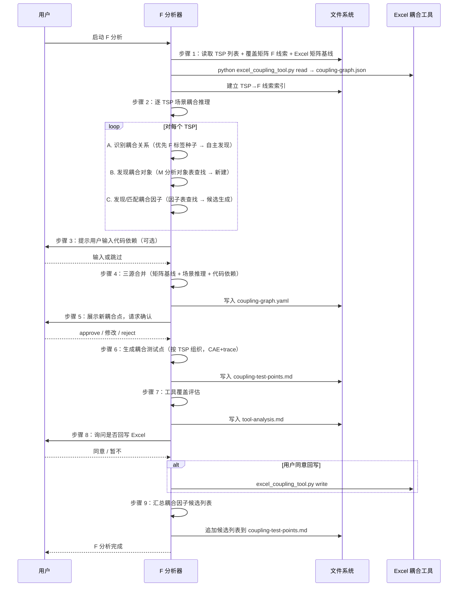

# LLD: STORY-012-04 — F 分析器 v3.0 重写（逐 TSP 驱动耦合分析）

> 文件名：`STORY-012-04-f-analyzer-v3-rewrite-LLD.md`
>
> 本文档是 `STORY-012-04` 的低层设计（Low-Level Design），需纳入 CR-012 全部 8 个目标 Story 的 LLD 统一确认，并满足 Wave C 的 `dev_gate` 后方可进入实现。
>
> 设计蓝本：`mfq-analysis-step-by-step.md` v3.0 §4（F 分析 — 功能交互/耦合分析，9 步）。

---

## 1. Goal

对 `skills/f-analyzer/SKILL.md`（314 行 v2）进行全量重写，从 8 步 v2「三源合并耦合分析」模式升级为 9 步 v3.0「逐 TSP 驱动耦合分析」模式。核心变化：消费 M 分析产出的 TSP 列表和覆盖矩阵中的 `[F→]` 标签作为种子线索，逐 TSP 识别耦合关系、发现耦合对象/因子、三源合并、生成按 TSP 组织的耦合测试点、产出耦合因子候选列表。

完成后 F 分析器将具备：TSP 驱动分析能力、标签种子线索消费能力、耦合对象/因子发现能力、`discovery_source` 区分（`f-tag-seed` / `scenario-inference`）和耦合因子候选汇总能力。

## 2. Requirements（Functional / Non-Functional）

### 2.1 Functional

- **FR-01**：步骤 1 加载 M 分析的 TSP 列表（含 `f_tags`）、覆盖矩阵中的 F 线索列表（`[F→]` 标签）和 Excel 耦合矩阵基线
- **FR-02**：步骤 2 逐 TSP 执行场景耦合推理，包含子步骤 A（识别耦合关系，优先从 F 标签种子出发，再自主发现）、子步骤 B（发现耦合对象）、子步骤 C（发现/匹配耦合因子）
- **FR-03**：步骤 2 中每个耦合关系标注 `discovery_source`（`f-tag-seed` 或 `scenario-inference`）
- **FR-04**：步骤 3 保留旧版可选代码依赖收集
- **FR-05**：步骤 4 三源合并：以 `(source_feature, target_feature)` 为 key 去重，耦合强度取最高值，保留所有来源标注
- **FR-06**：步骤 5 保留旧版候选耦合点用户确认流程
- **FR-07**：步骤 6 耦合测试点按 TSP 组织，若耦合因子全为候选则 `fact_status` 降级为 `needs-confirmation`
- **FR-08**：步骤 7 保留旧版工具覆盖评估（Existing Tool Summary + Tool Capability Gap）
- **FR-09**：步骤 8 保留旧版可选 Excel 回写
- **FR-10**：步骤 9（新增）输出耦合因子候选列表汇总，标注 `tsp_ref` 供候选汇总消费

### 2.2 Non-Functional

- **NFR-01**：Skill 总行数控制在 500 行以内（净增 ~150 行，预计 ~450 行）
- **NFR-02**：输出路径全部使用 `mfq/f-analysis/` 前缀（零 `analysis/` 残留）
- **NFR-03**：路径写入前校验目标父目录存在且为目录（STOP-04 规则）
- **NFR-04**：候选确认步骤遵循 STOP-02 规则：禁止 Agent 自行判定候选全部确认
- **NFR-05**：拓扑/因子分层 Guardrail 保留（逻辑因子与真实组网对象分离）
- **NFR-06**：CAE 耦合测试点约束保留（A 动作不得直接操作耦合目标）
- **NFR-07**：三源合并逻辑保留且增强（新增 `discovery_source` 字段追踪）

## 3. 模块拆分与职责

| 模块 / 文件组 | 职责 | 说明 |
|---|---|---|
| `skills/f-analyzer/SKILL.md` | F 分析的完整执行流程（9 步） | 全量重写，从 YAML frontmatter 到验收标准全部覆盖。是唯一的修改文件。 |

> 本 Story 为单文件全量重写，不涉及跨文件模块拆分。共享设计片段引用：HLD-CR-012.md §9（F 分析器模块职责）、§11（关键流程）、mfq-analysis-step-by-step.md §4（逐步骤处理逻辑）。

## 4. 代码结构与文件影响范围

| 动作 | 文件路径 | 变更内容 |
|---|---|---|
| 修改（全量重写） | `skills/f-analyzer/SKILL.md` | v2 314 行 → v3.0 ~450 行。9 步执行流程全量替换：步骤 1 新增 TSP+F 线索加载；步骤 2 改为逐 TSP 耦合推理（含耦合对象/因子发现）；步骤 3-5 保留增强；步骤 6 测试点按 TSP 组织；步骤 7-8 保留；步骤 9 新增耦合因子候选列表汇总。frontmatter `description` 更新为 v3.0 描述，`name: f-analyzer` 不变。 |

> 不改动：YAML frontmatter 的 `name` 字段；Excel 耦合工具调用方式（`python scripts/excel_coupling_tool.py`）；三源数据模型；耦合类型定义（顺序/数据/容错/接口资源）；拓扑/因子分层 Guardrail；CAE 耦合特有约束。

## 5. 数据模型与持久化设计

### 5.1 消费数据（输入）

| 对象 / 字段 | 来源 | 约束 | 说明 |
|---|---|---|---|
| TSP 列表 | `mfq/m-analysis/tsp/*.md` | M 分析步骤 3 产出，每个 TSP 含 `id / m_id / topic / scope / purpose / f_tags / covered_scenario_segments` | F 分析的核心驱动单元 |
| 覆盖矩阵 F 线索 | `mfq/m-analysis/scenario-tsp-coverage.md` → 「F 分析线索汇总」表 | 每行含 `来源场景 / 步骤 / 标签（[F→目标]）/ 目标 M/系统 / 说明` | 耦合分析的种子线索 |
| 测试对象表 | `mfq/m-analysis/test-objects-factors.md` | 含 `object_id / object_name / object_type / 关联度 / scenario_refs` | 耦合对象查找来源 |
| 因子表 | `mfq/m-analysis/test-objects-factors.md` | 含已有因子和候选因子，`factor_id / data_domain / related_object_id / source` | 耦合因子匹配来源 |
| 已确认场景 | `kym/scenarios/confirmed-scenarios.md` | 含 `atomic_operations / minimal_logic_chain` | 场景耦合推理的来源 |
| 耦合矩阵 Excel | 用户指定或配置文件 | 已有耦合关系基线 | 三源之一（矩阵基线） |
| 公共因子库 | `resource/factor-library/` | 公共因子定义 | 补充检索 |
| 代码依赖 | 用户手动输入 | 可选 | 三源之一（代码依赖） |

### 5.2 生产数据（输出）

| 对象 / 字段 | 类型 | 约束 | 说明 |
|---|---|---|---|
| `coupling-graph.yaml` | YAML 文件 | 路径 `mfq/f-analysis/coupling-graph.yaml` | 三源合并后的完整耦合图（标注 tsp_ref + discovery_source） |
| `coupling-test-points.md` | Markdown 文件 | 路径 `mfq/f-analysis/coupling-test-points.md`，按 TSP 组织 | 耦合测试点 CAE+trace |
| `tool-analysis.md` | Markdown 文件 | 路径 `mfq/f-analysis/tool-analysis.md` | Existing Tool Summary + Tool Capability Gap |
| `new-coupling-points.json` | JSON 文件 | 路径 `mfq/f-analysis/new-coupling-points.json` | 新发现的耦合点（用于回写），仅当用户同意回写时生成 |
| `matrix-baseline.yaml` | YAML 文件 | 路径 `mfq/f-analysis/matrix-baseline.yaml` | Excel 矩阵基线摘要 |
| 耦合对象列表 | 内存（嵌入 `coupling-graph.yaml`） | `coupled_object_id / tsp_ref / object_role_in_coupling / source（M-analysis / new-coupling-discovery）` | 步骤 2 子步骤 B 产出 |
| 耦合因子候选列表 | 嵌入 `coupling-test-points.md` 末尾 | `factor_id / factor_name / data_domain / tsp_ref / coupling_ref / source=new-coupling-candidate / discovery_source` | 步骤 9 汇总产出，供候选汇总消费 |

> 无持久化变更（非数据库，输出的 Markdown/YAML/JSON 文件由文件系统持久化）。

## 6. API / Interface 设计

> 本 Story 修改的是 Claude Code Skill 文件，不存在传统 API。这里的"接口"指 Skill 的输入消费契约和输出生产契约。

### 6.1 输入消费契约

| 接口 / 入口 | 输入 | 调用方 | 说明 |
|---|---|---|---|
| `mfq/m-analysis/tsp/*.md` | TSP 实体列表（YAML frontmatter 格式） | M 分析器 | 步骤 1 加载，建立 `TSP → M` 映射。消费字段：`id / m_id / topic / scope / purpose / f_tags / covered_scenario_segments` |
| `mfq/m-analysis/scenario-tsp-coverage.md` → F 线索表 | Markdown 表格（`来源场景 / 步骤 / 标签 / 目标 M/系统 / 说明`） | M 分析器 | 步骤 1 加载，建立 `TSP → [F→标签列表]` 索引 |
| `mfq/m-analysis/test-objects-factors.md` | Markdown 表格（测试对象表 + 因子表） | M 分析器 | 步骤 2 子步骤 B-C 查找耦合对象和因子 |
| `kym/scenarios/confirmed-scenarios.md` | 场景链 + atomic_operations | KYM 阶段 | 步骤 2 场景耦合推理的场景来源 |
| `python scripts/excel_coupling_tool.py` | CLI 调用：`read` 子命令生成图模型，`query` 子命令提取当前特性耦合点 | Excel 耦合矩阵 | 步骤 1 读取矩阵基线 |
| 用户输入 | 手动输入的代码依赖关系 | 用户 | 步骤 3（可选） |

### 6.2 输出生产契约

| 接口 / 入口 | 输出 | 消费方 | 说明 |
|---|---|---|---|
| `mfq/f-analysis/coupling-graph.yaml` | 三源合并后的完整耦合图，标注 `tsp_ref` + `discovery_source` | test-point-integrator（STORY-012-06） | 耦合关系完整记录 |
| `mfq/f-analysis/coupling-test-points.md` | 按 TSP 组织的 CAE+trace 耦合测试点表 | test-point-integrator（STORY-012-06） | 每个 TSP 下列出其耦合关系和测试点 |
| `mfq/f-analysis/tool-analysis.md` | Existing Tool Summary + Tool Capability Gap | test-point-integrator（STORY-012-06） | 工具覆盖评估 |
| 耦合因子候选列表 | 嵌入 `coupling-test-points.md` 末尾的候选汇总节 | test-point-integrator → 候选汇总（STORY-012-07） | 标注 `tsp_ref / coupling_ref / discovery_source` |

> 本节每个接口条目必须在第 10 节测试设计中找到至少 1 条对应测试。

## 7. 核心处理流程

### 7.1 主流程（9 步序列）



### 7.2 步骤 2 详细子流程（逐 TSP 耦合推理）

```
对每个 TSP（TSP-M1, TSP-M2, TSP-M3, ...）：
  ┌─ TSP 级交互分析 ─────────────────────────────────────────┐
  │                                                            │
  │ 【子步骤 A：识别该 TSP 的耦合关系】                          │
  │   1. 优先从 F 种子线索出发：                                 │
  │      - 读取该 TSP 对应的 [F→] 标签（M 分析已标记的跨 M 交互）│
  │      - 先展开这些已标记耦合点，验证并补充细节                │
  │      - 标注 discovery_source=f-tag-seed                     │
  │                                                            │
  │   2. 再自主发现未标记的耦合关系：                             │
  │      - 查找当前 TSP 关联的操作步骤（covered_scenario_segments）│
  │      - 判断每个步骤是否与其他 TSP/外部系统/共享对象交互       │
  │      - 标注 discovery_source=scenario-inference             │
  │                                                            │
  │   3. 确定耦合类型和强度：                                    │
  │      - A→B 配置传播 → 顺序耦合（strong/normal/weak）         │
  │      - 数据在模块间传递 → 数据耦合                          │
  │      - 异常路径故障隔离 → 容错耦合                          │
  │      - 共享 atomic-ops op_id 或测试对象 → 接口/资源耦合     │
  │                                                            │
  │ 【子步骤 B：发现该 TSP 的耦合对象】                          │
  │   对每条耦合关系：                                          │
  │     1. 从 M 分析的测试对象表中查找已有对象                   │
  │     2. 已有 → 直接引用（source=M-analysis）                 │
  │     3. 无对应 → 新建耦合对象记录（source=new-coupling-discovery）│
  │                                                            │
  │ 【子步骤 C：发现/匹配该 TSP 的耦合因子】                     │
  │   对每个耦合对象：                                          │
  │     1. 从 M 分析因子表查找已有因子 → 直接引用                │
  │     2. 从候选因子中查找 → 引用并标记 source=candidate        │
  │     3. 无对应因子 → 从耦合步骤参数/数据中提取                │
  │        → 公共因子库检索 → 未命中 → 生成耦合因子候选           │
  │     4. 记录候选：factor_id / data_domain / tsp_ref /         │
  │        coupling_ref / source=new-coupling-candidate          │
  └────────────────────────────────────────────────────────────┘
```

### 7.3 三源合并规则（步骤 4）

1. 以 `(source_tsp, target_tsp)` 为 key 去重
2. 同 key 多源合并，保留所有来源标注
3. 耦合强度取最高值：**strong > normal > weak**
4. `confirmation_gap_refs` 取并集；存在 gap 时不提升为"已确认"
5. `discovery_source` 取并集（例如同一耦合关系既被 F 标签标记又自主发现 → `[f-tag-seed, scenario-inference]`）

### 7.4 耦合因子全候选降级规则（步骤 6）

当某个耦合测试点的所有关联因子 `source` 均为 `new-coupling-candidate`（即无已有因子支撑）：
- 该 TP 的 `fact_status` 降级为 `needs-confirmation`
- C 条件中使用因子域引用（如 `@domain.普通`）而非具体值
- 在候选汇总确认前，测试点标记为 `[待确认]`

## 8. 技术设计细节

### 8.1 关键算法 / 规则

- **F 线索索引构建**：步骤 1 解析覆盖矩阵「F 分析线索汇总」表中的每一行，提取 `TSP → [F→标签]` 映射。若 F 线索指向不存在的 TSP，标记为 `confirmation_gap`，不阻断流程。
- **TSP 驱动循环**：步骤 2 以 TSP 列表为迭代器，每个 TSP 独立执行子步骤 A→B→C。同一耦合关系可能被多个 TSP 发现（如 TSP-M1→TSP-M2 同时被 M1 和 M2 的分析发现），以 `(source_tsp, target_tsp)` 为 key 去重。
- **耦合强度计算**：三源合并时，同 key 取最高强度；若矩阵基线标为 `strong` 但场景推理给出 `normal`，最终为 `strong`。
- **discovery_source 聚合**：同一耦合关系多源发现时，`discovery_source` 取并集。仅在 F 标签种子中发现 → `[f-tag-seed]`；仅自主推理发现 → `[scenario-inference]`；两者皆有 → `[f-tag-seed, scenario-inference]`。

### 8.2 依赖选择与复用点

| 复用项 | 来源 | 说明 |
|---|---|---|
| 三源数据模型 | 旧版 §三源数据模型 | 矩阵基线 + 场景耦合 + 代码依赖，结构保留 |
| 耦合类型定义 | 旧版 §耦合分析维度 | 特性内耦合、特性间耦合分类保留 |
| Excel 工具调用 | `scripts/excel_coupling_tool.py` | `read` / `query` / `write` 子命令不变 |
| 拓扑/因子分层 Guardrail | 旧版 §拓扑/因子分层 Guardrail | 全文保留 |
| CAE 耦合约束 | 旧版 §CAE 字段约束（耦合测试点） | A 动作不得直接操作耦合目标；E 待定必须附批注 |
| 工具评估格式 | 旧版 §Existing Tool Summary + Tool Capability Gap | 字段名原样保留 |
| 确认选项格式 | HLD v1.1 STOP-05 | 使用 `( )` 单选标记区分 |

### 8.3 兼容性处理

- **与 STORY-012-03（M 分析器）的接口**：消费 M 分析产出的 TSP 列表（含 `f_tags` 字段）和覆盖矩阵中的 F 线索表。若 M 分析未产出 `f_tags` 或覆盖矩阵不含 F 线索表，F 分析步骤 1 将仅加载 TSP 列表和 Excel 矩阵基线，步骤 2 子步骤 A 全部使用 `scenario-inference`（降级为无种子线索模式）。
- **与 STORY-012-06（test-point-integrator）的接口**：耦合测试点按 TSP 组织（每个 TSP 一个子节），与 v2 的"按四/五级目录分节"不同。integrator 适配在 STORY-012-06 中处理。
- **向后兼容**：全量重写后不存在新旧混合问题。旧版 `analysis/` 路径全部替换为 `mfq/`。
- **旧版内容保留**：Gotchas 章节保留（新增 v3.0 特有 Gotchas）、验收标准更新、前置条件更新（新增 TSP + 覆盖矩阵可用性检查）。

### 8.4 图示类型选择

- **时序图**：步骤 1 ↗ 步骤 9 的主流程序列（见 §7.1）
- **伪代码/流程图**：步骤 2 子步骤 A→B→C 的处理逻辑（见 §7.2）
- **数据结构图**：TSP 列表 → F 线索索引 → 耦合关系 → 耦合对象 → 耦合因子的实体关系（见 §5 数据模型）

## 9. 安全与性能设计

| 维度 | 设计措施 | 验证方式 |
|---|---|---|
| 安全（路径写入） | 写入前校验目标父目录 `mfq/f-analysis/` 存在且为目录（非普通文件）。遵循 STOP-04 规则，禁止 Agent 手动 mkdir 创建目录 | grep `mkdir` 在 SKILL.md 中返回 0 |
| 安全（门控强制） | 候选确认步骤（步骤 5）遵循 STOP-02 规则：⛔ HARD-STOP，禁止 Agent 自行判定候选全部确认。必须展示候选表并等待用户回复 | 检查步骤 5 是否包含 HARD-STOP 标记和 `( )` 单选选项 |
| 安全（确认选项） | 候选确认使用 `( )` 单选标记区分选项（STOP-05），不使用纯数字列表 | grep `( )` + `选项` 返回 > 0 |
| 性能 | Skill 为声明式 Markdown 文档，无运行时性能要求 | N/A |
| 可维护性 | 9 步序列清晰、步骤编号连续（1-9）、子步骤使用字母编号（A/B/C）。每个步骤明确标注"📥 消费"和"📤 生产"表格 | 人工审阅步骤结构 |

## 10. 测试设计

### 10.1 验收标准映射表

| AC | 测试目标 | 验证方式 | 对应接口 / 流程 |
|---|---|---|---|
| AC01 | TSP 驱动模式已落地 | `grep TSP skills/f-analyzer/SKILL.md \| wc -l` >= 5 | §6.1（TSP 消费契约） |
| AC02 | `[F→]` 标签消费逻辑 | grep `\[F→\]` 或 `F 线索` 或 `F标签` 返回 > 0 | §7.2 步骤 2 子步骤 A |
| AC03 | 覆盖矩阵引用 | grep `scenario-tsp-coverage.md` 或 `覆盖矩阵` 返回 > 0 | §6.1（覆盖矩阵消费） |
| AC04 | 输出路径正确 | `grep mfq/f-analysis/ skills/f-analyzer/SKILL.md \| wc -l` > 0 | §5.2（输出路径） |
| AC05 | 耦合对象发现 | grep `耦合对象` 或 `coupled_object` 或 `coupling.*object` 返回 > 0 | §7.2 步骤 2 子步骤 B |
| AC06 | 耦合因子候选概念 | grep `候选` 或 `candidate` 返回 > 0（且在耦合分析上下文中） | §7.4（候选降级规则） |
| AC07 | discovery_source 区分 | grep `discovery_source` 或 `f-tag-seed` 或 `scenario-inference` 返回 > 0 | §8.1（算法细节） |
| AC08 | CAE 耦合约束保留 | grep `不得直接操作耦合目标` 返回 > 0 | §8.2（复用点） |
| AC09 | 三源合并逻辑保留 | grep `三源合并` 返回 > 0 | §7.3（三源合并规则） |
| AC10 | frontmatter name 不变 | grep `^name: f-analyzer$` 返回 > 0 | §4（文件影响范围） |

### 10.2 关键流程测试

| 测试场景 | 前置条件 | 操作 | 预期结果 | 验证方式 |
|---|---|---|---|---|
| TSP 驱动循环完整性 | M 分析产出 3 个 TSP，覆盖矩阵含 2 条 F 线索 | 执行 F 分析步骤 1→2 | 步骤 2 循环体执行 3 次（每个 TSP 一次），2 条 F 线索被作为种子优先展开 | 人工审阅 LLD §7.2 |
| F 线索缺失降级 | M 分析未产出覆盖矩阵或 F 线索表为空 | 执行 F 分析步骤 1→2 | 步骤 1 仅加载 TSP 列表和 Excel 基线；步骤 2 所有发现标注 `scenario-inference` | 人工审阅 LLD §8.3 |
| 耦合因子全候选降级 | 某耦合关系无已有因子支撑 | 执行步骤 6 测试点生成 | 该 TP 的 `fact_status=needs-confirmation`，C 条件使用因子域引用 | 人工审阅 LLD §7.4 |
| 用户确认 HARD-STOP | 步骤 4 产出的新耦合点列表 | 执行步骤 5 | 必须展示候选表并使用 `( )` 单选选项，不可自行判定通过 | 人工审阅 LLD §9（安全设计） |
| 路径写入前置校验 | 目标目录 `mfq/f-analysis/` 不存在 | 步骤 7/9 尝试写入 | 不得执行 mkdir；提示用户目录不存在并停止 | 人工审阅 LLD §9（安全设计） |

## 11. 实施步骤

> 全量重写为单任务（TASK-012-04-00），因为 Skill 文件作为完整执行流程，前后步骤紧密耦合，不适合拆分为多个独立提交。重写基于旧版 SKILL.md 的骨架和设计文档 §4 的新增处理逻辑。

| TASK-ID | 动作 | 目标文件 | 详细描述 | 对应测试 |
|---|---|---|---|---|
| TASK-012-04-01 | 修改 | `skills/f-analyzer/SKILL.md` | 更新 YAML frontmatter：`description` 更新为 v3.0 描述（逐 TSP 驱动耦合分析，9 步，消费覆盖矩阵 F 线索），其余字段（`name`、`argument-hint`、`user-invokable`、`status`）不变 | AC10 |
| TASK-012-04-02 | 修改 | `skills/f-analyzer/SKILL.md` | 重写「目标」「适用范围」章节：体现 TSP 驱动、F 标签线索消费、耦合对象/因子发现、候选列表产出 | AC01-AC03 |
| TASK-012-04-03 | 修改 | `skills/f-analyzer/SKILL.md` | 更新「前置条件」：新增 M 分析的 TSP 列表可用、覆盖矩阵可用、测试对象/因子可用 | AC01、AC03 |
| TASK-012-04-04 | 修改 | `skills/f-analyzer/SKILL.md` | 保留「拓扑/因子分层 Guardrail」章节（全文不变） | AC08 |
| TASK-012-04-05 | 修改 | `skills/f-analyzer/SKILL.md` | 重写「步骤 1」：从"矩阵基线读取"改为"加载 TSP 列表、覆盖矩阵与矩阵基线"。增加 TSP 列表加载（含 `f_tags`）、覆盖矩阵 F 线索提取、F 线索索引建立（`TSP → [F→标签列表]`）。保留 Excel 工具调用（`read` + `query`） | AC01、AC02、AC03、AC09 |
| TASK-012-04-06 | 修改 | `skills/f-analyzer/SKILL.md` | 重写「步骤 2」：从"场景耦合推理"改为"逐 TSP 场景耦合推理"。新增处理逻辑：子步骤 A（优先 F 标签种子 → 自主发现，标注 `discovery_source`）、子步骤 B（从 M 分析对象表查找耦合对象 → 新建）、子步骤 C（从 M 分析因子表匹配 → 生成耦合因子候选，标注 `tsp_ref / coupling_ref / source=new-coupling-candidate`） | AC01、AC05、AC06、AC07 |
| TASK-012-04-07 | 修改 | `skills/f-analyzer/SKILL.md` | 保留「步骤 3：代码依赖收集（可选）」章节（旧版内容保留，路径更新为 `mfq/`） | AC09 |
| TASK-012-04-08 | 修改 | `skills/f-analyzer/SKILL.md` | 增强「步骤 4：三源合并」：新增 `discovery_source` 取并集规则；保留以 `(source_tsp, target_tsp)` 为 key 去重、耦合强度取最高值、`confirmation_gap_refs` 取并集 | AC07、AC09 |
| TASK-012-04-09 | 修改 | `skills/f-analyzer/SKILL.md` | 保留「步骤 5：候选耦合点确认」：用户确认流程不变。增加 STOP-02 HARD-STOP 标记（禁止 Agent 自行判定），确认选项使用 `( )` 单选标记 | AC08 |
| TASK-012-04-10 | 修改 | `skills/f-analyzer/SKILL.md` | 增强「步骤 6：耦合测试点生成」：测试点按 TSP 组织（每个 TSP 一个子节，其下列出耦合关系和 CAE+trace）。新增耦合因子全候选降级规则（fact_status=needs-confirmation，C 使用因子域引用）。保留 CAE 字段约束和 trace 字段定义 | AC01、AC06、AC08 |
| TASK-012-04-11 | 修改 | `skills/f-analyzer/SKILL.md` | 保留「步骤 7：工具覆盖评估」：Existing Tool Summary + Tool Capability Gap 格式不变，路径更新为 `mfq/` | AC04 |
| TASK-012-04-12 | 修改 | `skills/f-analyzer/SKILL.md` | 保留「步骤 8：可选回写」：Excel 回写流程不变，`new-coupling-points.json` 路径更新为 `mfq/` | AC04 |
| TASK-012-04-13 | 修改 | `skills/f-analyzer/SKILL.md` | 新增「步骤 9：耦合因子候选列表汇总」。汇总步骤 2 中所有 `source=new-coupling-candidate` 的因子候选，按 TSP 组织成表格（`factor_id / factor_name / data_domain / tsp_ref / coupling_ref / discovery_source`），追加到 `coupling-test-points.md` 末尾 | AC01、AC06、AC07 |
| TASK-012-04-14 | 修改 | `skills/f-analyzer/SKILL.md` | 更新「输出文件」章节：路径全部更新为 `mfq/f-analysis/`。输出文件清单增加「耦合因子候选列表」条目 | AC04 |
| TASK-012-04-15 | 修改 | `skills/f-analyzer/SKILL.md` | 更新「Gotchas」章节：保留旧版所有条目（Excel 批注过滤、名称规范化、场景耦合误报、反向耦合、confirmation_gaps、工具评估限制、拓扑/因子分离）。新增 v3.0 特有 Gotchas：F 线索指向不存在 TSP 的处理、同一耦合关系多 TSP 视角的去重、全候选降级的确认依赖 | AC01-AC09 |
| TASK-012-04-16 | 修改 | `skills/f-analyzer/SKILL.md` | 更新「验收标准」章节：替换旧版 AC 为 v3.0 验收标准（10 条，与 Story 卡片 AC01-AC10 对齐）。新增：TSP 列表已加载、F 线索索引已建立、耦合对象已发现、耦合因子候选列表已产出、discovery_source 已标注、路径前缀为 `mfq/` | AC01-AC10 |

> 每个 TASK-ID 至少覆盖 1 个文件影响项；唯一的文件影响项（`skills/f-analyzer/SKILL.md`）被 16 个 TASK-ID 覆盖（对应 16 个修改区块）。

## 12. 风险、难点与预研建议

### 12.1 实现灰区与取舍记录

| Clarification ID | 问题 | 选项与推荐 | 决策 / 答案 | 影响面 | 证据 | 重访条件 |
|---|---|---|---|---|---|---|
| LCQ-STORY-012-04-01 | 步骤 2 子步骤 B：新建耦合对象时，`object_role_in_coupling` 的取值是否需要枚举约束？ | **A（推荐）**：使用枚举 `触发方 / 受影响方 / 共享资源`，与设计文档 §4 子步骤 B 一致；**B**：自由文本描述。推荐 A，保证下游消费时语义明确 | 待 CP5 确认 | 接口（test-point-integrator 消费耦合对象时需解析 object_role） | 设计文档 §4 子步骤 B 定义了 `object_role_in_coupling` | A 不能覆盖实际耦合角色时切换 B |
| LCQ-STORY-012-04-02 | F 线索指向不存在的 TSP 时，是否仅记录 `confirmation_gap` 而不阻断？ | **A（推荐）**：记录 `confirmation_gap` + 警告，不阻断流程（与设计文档 §4 SIM-02 一致）；**B**：阻断并提示用户修正 M 分析。推荐 A，因为 F 分析不应因上游数据完整性问题而整体阻断 | 待 CP5 确认 | 跨 Story 契约（STORY-012-03 M 分析器） | HLD §7 SIM-02 结论：标记 confirmation_gap，不阻断流程 | 上游数据错误导致大量 TSP 不可用时需重新考虑阻断策略 |

### 12.2 风险与难点

| 风险 / 难点 | 影响 | 缓解措施 / 预研建议 |
|---|---|---|
| 旧版 Skill 中的隐性知识未被设计文档 §4 覆盖 | 重写后丢失旧版中未文档化的要点（如特定 Excel 批注格式处理技巧） | 实施时逐章对照旧版 Gotchas 和注意事项，确保全部迁移。旧版 11 条 Gotchas 全部在新版 Gotchas 章节中保留并补增 v3.0 特有项 |
| 逐 TSP 循环体中耦合关系重复发现 | 同一 `(source_tsp, target_tsp)` 耦合关系被多个 TSP 视角发现导致重复 | 步骤 4 三源合并以 `(source_tsp, target_tsp)` 去重；步骤 2 汇总阶段先按此 key 做内部去重 |
| 测试点按 TSP 组织 vs v2 按目录组织的格式兼容 | test-point-integrator（STORY-012-06）可能无法直接消费新格式 | STORY-012-06 专门负责上下游适配，F 分析器 v3.0 只需确保输出含 tsp_ref 字段 |
| 步骤 9 候选列表与步骤 6 测试点重复引用 | 耦合因子候选在步骤 2 子步骤 C 记录，步骤 6 引用，步骤 9 汇总，可能导致信息不一致 | 步骤 9 汇总时从步骤 2 原始记录中提取，不重新计算；若步骤 6 中部分候选被确认，步骤 9 汇总仅列出未确认候选 |

### OPEN / Spike 跟踪

| ID | 类型 | 问题 | 下一动作 | 责任方 |
|---|---|---|---|---|
| — | — | — | 目前无 OPEN/Spike 项。若有实现灰区无法在 LLD 阶段自行解决，将在实施前通过 clarification queue 上报 | — |

## 13. 回滚与发布策略

- **发布方式**：单文件全量重写 `skills/f-analyzer/SKILL.md`。提交为单一 commit，message 格式：`feat: F 分析器 v3.0 重写（逐 TSP 驱动耦合分析，9步）`。
- **回滚触发条件**：CP7 验证未通过；STORY-012-06（test-point-integrator）适配时发现 F 分析器 v3.0 产出格式不可消费且无法在 integrator 侧解决；用户反馈 v3.0 方法论与旧版存在关键行为差异。
- **回滚动作**：`git revert <commit-hash>` 恢复旧版 `skills/f-analyzer/SKILL.md`（314 行 v2）。回滚不影响其他 Story（M 分析器、Q 分析器的 v3.0 重写独立于 F 分析器）。

## 14. Definition of Done

- [ ] 14 个章节全部填写完成
- [ ] 文件影响范围（§4）、接口（§6）、测试（§10）与实施步骤（§11）可直接指导编码
- [ ] 实现灰区与取舍记录（§12.1）已回填所有相关 clarification item，或显式写"无"
- [ ] `confirmed=false` 时不进入实现
- [ ] 人工确认意见已收敛（CP5 全量 LLD 统一确认）
- [ ] frontmatter 已填写 `tier=M`
- [ ] OPEN / Spike 已清点或显式写"无"
- [ ] 所有 10 条 AC 在实施步骤中有对应 TASK-ID
- [ ] 旧版 11 条 Gotchas 全部迁移到新版 Gotchas 章节
- [ ] 新版步骤 1-9 编号连续，子步骤使用字母编号
- [ ] 输出路径全部为 `mfq/f-analysis/` 前缀，零 `analysis/` 残留
- [ ] STOP-02（候选确认 HARD-STOP）和 STOP-04（路径写入前置校验）已落地

---

## 人工确认区

> **CP5 — Story LLD 可实现性门**
> meta-dev 先写入 `process/checks/CP5-STORY-012-04-f-analyzer-v3-rewrite-LLD-IMPLEMENTABILITY.md` 自动预检结果。
> meta-po 收齐全部 8 个目标 Story 的 LLD、CP4 自动预检摘要和 CP5 自动预检后，再生成并提示用户审查 `checkpoints/CP5-ALL-STORIES-LLD-BATCH-CR-012.md`。
> 用户统一确认全部目标 Story 的 LLD 后，仍需满足 Wave C 的依赖门控（STORY-012-01 + STORY-012-03 已完成）与文件所有权门控方可进入实现。

**CP5 checklist 摘要**：

| # | 检查项 | 状态 | 证据 |
|---|---|---|---|
| 1 | LLD 覆盖 AC | 待检查 | §2.1 FR-01 至 FR-10 / §10 测试设计 |
| 2 | 与 HLD / 设计文档一致 | 待检查 | §3 / §8 / §12；与 HLD-CR-012.md §9（F 分析器模块职责）和 mfq-analysis-step-by-step.md §4 对齐 |
| 3 | 文件影响范围明确 | 待检查 | §4 / §11（16 个 TASK-ID 覆盖 1 文件） |
| 4 | 接口契约完整 | 待检查 | §6.1 输入消费契约 + §6.2 输出生产契约 |
| 5 | 测试与 dev_gate 可计算 | 待检查 | §10 / §14 / Story Card AC01-AC10 |
| 6 | clarification queue 已收敛 | 待检查 | §12.1（2 项 LCQ，均不阻断 LLD） |

**人工确认回复**：

请直接回复以下任一整行：

```text
approve
修改: <具体修改点>
reject
```

- `approve`：LLD 设计合理，允许进入实现。
- `修改: <具体修改点>`：指出具体修改点后由 meta-dev 更新重提。
- `reject`：设计方向有根本问题，需重新设计。

**人工审查结果回填**：

- 结论：`approved | changes_requested | rejected`
- 审查人：
- 审查时间：
- 修改意见：
- 风险接受项：
