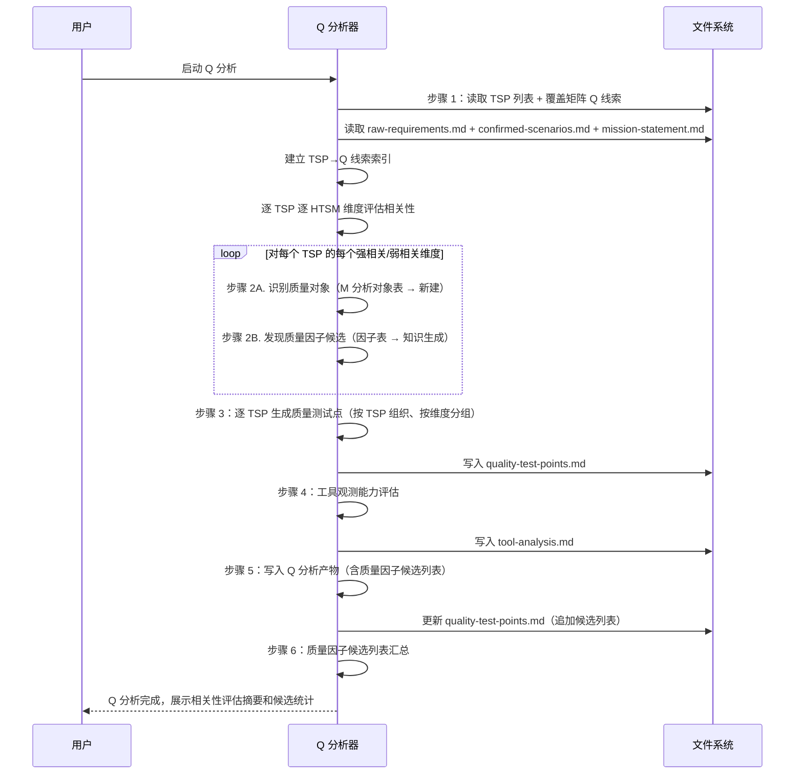

# LLD: STORY-012-05 — Q 分析器 v3.0 重写（逐 TSP 驱动质量分析）

> 文件名：`STORY-012-05-q-analyzer-v3-rewrite-LLD.md`
>
> 本文档是 `STORY-012-05` 的低层设计（Low-Level Design），需纳入 CR-012 全部 8 个目标 Story 的 LLD 统一确认，并满足 Wave C 的 `dev_gate` 后方可进入实现。
>
> 设计蓝本：`mfq-analysis-step-by-step.md` v3.0 §5（Q 分析 — 质量属性分析，6 步）。

---

## 1. Goal

对 `skills/q-analyzer/SKILL.md`（257 行 v2）进行全量重写，从 5 步 v2「HTSM 维度相关性评估 + 展开分析 + 测试点生成」模式升级为 6 步 v3.0「逐 TSP 驱动质量分析」模式。核心变化：消费 M 分析产出的 TSP 列表和覆盖矩阵中的 `[Q→]` 标签作为相关性评估的补充依据，逐 TSP 逐 HTSM 维度评估相关性、发现质量对象/因子、生成按 TSP 组织且按质量维度分组的质量测试点、产出质量因子候选列表。

完成后 Q 分析器将具备：TSP 驱动分析能力、Q 标签线索消费能力、逐维度质量对象/因子发现能力、`generation_basis` 标注能力和质量因子候选汇总能力。

## 2. Requirements（Functional / Non-Functional）

### 2.1 Functional

- **FR-01**：步骤 1 加载 M 分析的 TSP 列表（含 `q_tags`）、覆盖矩阵中的 Q 线索列表（`[Q→]` 标签），逐 TSP 逐 HTSM 维度评估相关性。`[Q→]` 标签标记的维度至少弱相关起评，可提升为强相关
- **FR-02**：步骤 2 逐 TSP 对每个强相关/弱相关维度展开：子步骤 A 识别质量对象、子步骤 B 发现/匹配质量因子候选。无对应因子时基于知识生成候选，标注 `generation_basis`（行业标准/经验推断/需求推断）
- **FR-03**：步骤 3 质量测试点按 TSP 组织、按质量维度分组，标注 `tsp_ref`。若质量因子全为候选则 `fact_status` 降级为 `needs-confirmation`
- **FR-04**：步骤 4 保留旧版工具观测能力评估（Existing Tool Summary + Tool Capability Gap）
- **FR-05**：步骤 5 输出清单扩展：增加质量因子候选列表（标注 `tsp_ref`），写入 `mfq/q-analysis/`
- **FR-06**：步骤 6（新增）质量因子候选列表汇总，供候选汇总消费

### 2.2 Non-Functional

- **NFR-01**：Skill 总行数控制在 400 行以内（净增 ~120 行，预计 ~370 行）
- **NFR-02**：输出路径全部使用 `mfq/q-analysis/` 前缀（零 `analysis/` 残留）
- **NFR-03**：路径写入前校验目标父目录存在且为目录（STOP-04 规则）
- **NFR-04**：相关性评估中不确定项标记为 OPEN，不自行判定
- **NFR-05**：拓扑/因子分层 Guardrail 保留（逻辑因子与真实组网对象分离）
- **NFR-06**：HTSM 维度定义表保留（CRUSSPICSTML，至少含可靠性/性能/安全性等维度）
- **NFR-07**：CAE 质量测试点约束保留（C 字段含质量约束基线；E="待定"附批注）

## 3. 模块拆分与职责

| 模块 / 文件组 | 职责 | 说明 |
|---|---|---|
| `skills/q-analyzer/SKILL.md` | Q 分析的完整执行流程（6 步） | 全量重写，从 YAML frontmatter 到验收标准全部覆盖。是唯一的修改文件。 |

> 本 Story 为单文件全量重写，不涉及跨文件模块拆分。共享设计片段引用：HLD-CR-012.md §9（Q 分析器模块职责）、§11（关键流程）、mfq-analysis-step-by-step.md §5（逐步骤处理逻辑）。

## 4. 代码结构与文件影响范围

| 动作 | 文件路径 | 变更内容 |
|---|---|---|
| 修改（全量重写） | `skills/q-analyzer/SKILL.md` | v2 257 行 → v3.0 ~370 行。6 步执行流程全量替换：步骤 1 新增 TSP+Q 线索加载+逐 TSP 相关性评估；步骤 2 改为逐 TSP 质量对象与因子发现（含子步骤 A/B）；步骤 3 测试点按 TSP 组织+按质量维度分组；步骤 4 保留；步骤 5 扩展输出清单（+质量因子候选列表）；步骤 6 新增候选汇总。frontmatter `description` 更新为 v3.0 描述，`name: q-analyzer` 不变。 |

> 不改动：YAML frontmatter 的 `name` 字段；HTSM 维度定义表（CRUSSPICSTML）；拓扑/因子分层 Guardrail；CAE 质量测试点约束；确认选项视觉区分规则。

## 5. 数据模型与持久化设计

### 5.1 消费数据（输入）

| 对象 / 字段 | 来源 | 约束 | 说明 |
|---|---|---|---|
| TSP 列表 | `mfq/m-analysis/tsp/*.md` | M 分析步骤 3 产出，每个 TSP 含 `id / m_id / topic / scope / purpose / q_tags / covered_scenario_segments` | Q 分析的核心驱动单元 |
| 覆盖矩阵 Q 线索 | `mfq/m-analysis/scenario-tsp-coverage.md` → 「Q 分析线索汇总」表 | 每行含 `来源场景 / 步骤 / 标签（[Q→维度]）/ 质量维度 / 说明` | 相关性评估的补充依据 |
| 测试对象表 | `mfq/m-analysis/test-objects-factors.md` | 含 `object_id / object_name / object_type / 关联度 / scenario_refs` | 质量对象查找来源 |
| 因子表 | `mfq/m-analysis/test-objects-factors.md` | 含已有因子和候选因子，`factor_id / data_domain / related_object_id / source` | 质量因子匹配来源 |
| 已确认场景 | `kym/scenarios/confirmed-scenarios.md` | 含 Scenario Chain / atomic_operations / 观察点 / 预期状态 | 质量场景回链 |
| KYM 产出 | `kym/mission-understanding/mission-statement.md` | 含 `risks[].area / test_items.items` | 风险关联 + 测试边界 |
| 需求条目 | `kym/feature-input/raw-requirements.md` | 全文 | 检查是否提及质量维度 |
| 公共因子库 | `resource/factor-library/` | 公共因子定义 | 补充检索 |
| HTSM 维度定义 | Skill 内置（CRUSSPICSTML） | 7 个质量维度（去掉功能性） | 评估框架 |

### 5.2 生产数据（输出）

| 对象 / 字段 | 类型 | 约束 | 说明 |
|---|---|---|---|
| `quality-test-points.md` | Markdown 文件 | 路径 `mfq/q-analysis/quality-test-points.md`，按 TSP 组织，每个 TSP 下按质量维度分组 | HTSM 相关性评估表 + CAE 质量测试点 |
| `tool-analysis.md` | Markdown 文件 | 路径 `mfq/q-analysis/tool-analysis.md` | Existing Tool Summary + Tool Capability Gap |
| 逐 TSP 相关性评估表 | 嵌入 `quality-test-points.md` | `tsp_ref → [(quality_dimension, relevance（strong/weak/not-applicable）, rationale), ...]` | 步骤 1 产出 |
| 质量对象列表 | 嵌入 `quality-test-points.md` | `quality_object_id / quality_object_name / tsp_ref / quality_dimension / source（M-analysis / new-quality-discovery）` | 步骤 2 子步骤 A 产出 |
| 质量因子候选列表 | 嵌入 `quality-test-points.md` 末尾 | `factor_id / factor_name / data_domain / tsp_ref / quality_dimension / related_quality_object_id / source=new-quality-candidate / generation_basis` | 步骤 6 汇总产出，供候选汇总消费 |

> 无持久化变更（非数据库，输出的 Markdown 文件由文件系统持久化）。

## 6. API / Interface 设计

> 本 Story 修改的是 Claude Code Skill 文件，不存在传统 API。这里的"接口"指 Skill 的输入消费契约和输出生产契约。

### 6.1 输入消费契约

| 接口 / 入口 | 输入 | 调用方 | 说明 |
|---|---|---|---|
| `mfq/m-analysis/tsp/*.md` | TSP 实体列表（YAML frontmatter 格式） | M 分析器 | 步骤 1 加载，建立 `TSP → M` 映射。消费字段：`id / m_id / topic / scope / purpose / q_tags / covered_scenario_segments` |
| `mfq/m-analysis/scenario-tsp-coverage.md` → Q 线索表 | Markdown 表格（`来源场景 / 步骤 / 标签 / 质量维度 / 说明`） | M 分析器 | 步骤 1 加载，建立 `TSP → [Q→标签列表]` 索引，作为相关性评估的补充依据 |
| `mfq/m-analysis/test-objects-factors.md` | Markdown 表格（测试对象表 + 因子表） | M 分析器 | 步骤 2 子步骤 A-B 查找质量对象和因子 |
| `kym/scenarios/confirmed-scenarios.md` | Scenario Chain / atomic_operations / 观察点 / 预期状态 / Knowledge Reference | KYM 阶段 | 步骤 1 相关性评估依据 + 步骤 2 质量场景回链 |
| `kym/mission-understanding/mission-statement.md` | `risks[].area` + `likelihood` + `impact` + `test_items.items` | KYM 阶段 | 步骤 1 风险关联 + 测试边界 |
| 公共因子库 | 全部 factor_id / factor_name / aliases / owner_object | 公共资源 | 步骤 2 补充检索 |

### 6.2 输出生产契约

| 接口 / 入口 | 输出 | 消费方 | 说明 |
|---|---|---|---|
| `mfq/q-analysis/quality-test-points.md` | 按 TSP 组织、按质量维度分组的 CAE+trace 质量测试点，含 HTSM 相关性评估表 | test-point-integrator（STORY-012-06） | 格式：TSP 为一级分节，质量维度为二级分组，CAE 表格为三级内容 |
| `mfq/q-analysis/tool-analysis.md` | Existing Tool Summary + Tool Capability Gap | test-point-integrator（STORY-012-06） | 工具覆盖评估 |
| 质量因子候选列表 | 嵌入 `quality-test-points.md` 末尾的候选汇总节 | test-point-integrator → 候选汇总（STORY-012-07） | 标注 `tsp_ref / quality_dimension / generation_basis` |

> 本节每个接口条目必须在第 10 节测试设计中找到至少 1 条对应测试。

## 7. 核心处理流程

### 7.1 主流程（6 步序列）



### 7.2 步骤 1 详细子流程（逐 TSP 相关性评估）

```
1. 加载 TSP 列表：TSP-M1, TSP-M2, TSP-M3, ...

2. 加载覆盖矩阵中的 Q 分析线索列表：
   - 这些线索是 M 分析步骤 2 中从场景步骤提取的 [Q→] 标签
   - 场景中已明确涉及的质量维度 → 至少弱相关起评
   - 建立 TSP → [Q→标签维度的集合] 索引

3. 对每个 TSP，逐个 HTSM 维度评估相关性：

   判定逻辑：
   ├── 该 TSP 的 q_tags 中有关联此维度的 [Q→] 标签
   │   → 至少弱相关起评（可升级为强相关）
   ├── TSP.purpose 明确涉及该质量维度 → 强相关
   ├── TSP 关联的场景链中该维度的观察点 → 弱相关或强相关
   ├── TSP 关联的 Knowledge Reference 有显式依据 → 按引用强度判定
   ├── 防火墙设备通用质量要求 → 弱相关
   └── 无任何依据 → 不适用

4. 归类：
   ├── 强相关（strong） → 该维度是此 TSP 的核心质量要求，深度分析
   ├── 弱相关（weak）   → 该维度与此 TSP 有一定关系，简要分析
   ├── 不适用（not-applicable） → 标注，不展开
   └── 功能性 → 不在此展开（M 分析已覆盖）

5. 不确定项标记为 OPEN，记录不确定原因，不自行判定
```

### 7.3 步骤 2 详细子流程（逐 TSP 质量对象与因子发现）

```
对每个 TSP：
  ┌─ TSP 级 Q 分析 ──────────────────────────────────────────┐
  │                                                            │
  │ 对该 TSP 的每个强相关/弱相关维度：                           │
  │                                                            │
  │   【子步骤 A：识别该 TSP 在此质量维度下的质量对象】           │
  │   1. 确定该质量维度在 TSP 范围内关注的对象：                  │
  │      - 可靠性 → TSP 输出结果的数据一致性、恢复能力           │
  │      - 性能   → TSP 关键路径的响应时间、吞吐量               │
  │      - 安全性 → TSP 输入数据的校验完整性、权限控制           │
  │      - 可维护性 → TSP 相关日志/诊断信息的可分析性            │
  │   2. 从 M 分析的测试对象表中查找已有对象 → 直接引用           │
  │   3. 无对应对象 → 新建"质量对象"，标注 tsp_ref + quality_dimension │
  │   4. 记录：quality_object_id / quality_object_name /        │
  │      tsp_ref / quality_dimension /                          │
  │      source（M-analysis / new-quality-discovery）           │
  │                                                            │
  │   【子步骤 B：发现/匹配该 TSP 在此维度下的质量因子】          │
  │   对每个质量对象：                                          │
  │     1. 从 M 分析的因子表中查找关联因子：                      │
  │        - 已有因子 → 直接引用                                │
  │        - 候选因子 → 引用并标记 source=candidate             │
  │     2. 若质量对象无对应因子：                                │
  │        → 基于质量维度的知识和经验生成"质量因子候选"           │
  │        → 结合 TSP 的 scope 和 purpose 设定合理的取值域       │
  │        → 在公共因子库中检索确认是否已有                      │
  │        → 未命中 → 加入"质量因子候选列表"                     │
  │     3. 记录质量因子候选：                                   │
  │        - factor_id / factor_name / data_domain              │
  │        - tsp_ref（所属 TSP）                                 │
  │        - related_quality_object_id                          │
  │        - quality_dimension                                  │
  │        - source=new-quality-candidate                       │
  │        - generation_basis（行业标准/经验推断/需求推断）       │
  │        - scenario_refs / knowledge_refs                     │
  └────────────────────────────────────────────────────────────┘

汇总（所有 TSP 分析完成后）：
  - 同一质量对象/因子被多个 TSP 引用时合并来源
  - 按 TSP 组织输出，每个 TSP 一组 Q 分析结果
```

### 7.4 质量因子全候选降级规则（步骤 3）

当某个质量测试点的所有关联质量因子 `source` 均为 `new-quality-candidate`（即无已有因子支撑）：
- 该 TP-Q 的 `fact_status` 降级为 `needs-confirmation`
- C 条件中使用因子域引用（如 `@domain.典型值`）或基于理解预设典型值并标注 `[待确认]`
- E 预期含量化预期并标注 `[待确认]`

### 7.5 相关性评估中 [Q→] 标签的提升规则

| 场景 | 初始判定 | [Q→] 标签影响 | 最终判定 |
|---|---|---|---|
| TSP.purpose 和场景链中无任何可靠性依据 | 不适用 | `[Q→可靠性]` 标记 | **弱相关**（标签强制起评） |
| 场景链中有掉电恢复的观察点 | 弱相关 | `[Q→可靠性]` 标记 | **强相关**（标签提升） |
| TSP.purpose 明确涉及安全校验 | 强相关 | 无 [Q→] 标签 | 强相关（自主判定） |

> [Q→] 标签的作用：不降级（已有强相关不收窄），可提升或起评（弱相关→强相关，不适用→弱相关）。

## 8. 技术设计细节

### 8.1 关键算法 / 规则

- **Q 线索索引构建**：步骤 1 解析覆盖矩阵「Q 分析线索汇总」表中的每一行，提取 `TSP → [Q→维度]` 映射。若 Q 线索指向不存在的 TSP，记录 `confirmation_gap`，不阻断流程。
- **相关性评估矩阵**：以 TSP 为行、HTSM 维度为列，填值 `strong / weak / not-applicable`。强相关和弱相关的维度标记 `rationale`（判定依据）。`[Q→]` 标签作为提升/起评依据。
- **TSP 驱动循环（步骤 2）**：对每个 TSP，仅展开其强相关和弱相关维度。不适用维度跳过。功能性维度跳过（M 分析已覆盖）。
- **generation_basis 枚举**：
  - `行业标准`：质量因子来源于 ISO 25010、IEC 61508、OWASP 等公认标准
  - `经验推断`：基于防火墙设备测试经验的通用质量因子
  - `需求推断`：从使命陈述、场景描述或风险清单中推断的质量因子
- **质量维度跳过规则**：「功能性」维度不在 Q 分析中展开（M 分析已覆盖）；若 HTSM 中不含「功能性」，此规则不影响任何维度。

### 8.2 依赖选择与复用点

| 复用项 | 来源 | 说明 |
|---|---|---|
| HTSM 质量属性维度定义 | 旧版 §HTSM 质量属性维度 | CRUSSPICSTML 维度表保留（去掉功能性后的 7 个维度），每个维度的防火墙典型关注点保留 |
| 拓扑/因子分层 Guardrail | 旧版 §拓扑/因子分层 Guardrail | 全文保留 |
| CAE 质量约束 | 旧版 §CAE 字段约束（质量测试点） | C 含质量约束基线；E="待定"附批注；A 施加质量压力/触发场景 |
| 工具评估格式 | 旧版 §Existing Tool Summary + Tool Capability Gap | 字段名原样保留 |
| 输出格式框架 | 旧版 §输出 | 按四级/五级目录分节的格式框架保留，增加 TSP 分节层 |
| Gotchas | 旧版 §Gotchas | 全文保留，新增 v3.0 特有 Gotchas |
| 确认选项格式 | HLD v1.1 STOP-05 | 使用 `( )` 单选标记区分 |

### 8.3 兼容性处理

- **与 STORY-012-03（M 分析器）的接口**：消费 M 分析产出的 TSP 列表（含 `q_tags` 字段）和覆盖矩阵中的 Q 线索表。若 M 分析未产出 `q_tags` 或覆盖矩阵不含 Q 线索表，Q 分析步骤 1 将仅基于 TSP.purpose、场景链和需求文档评估相关性（降级为无种子线索模式，不影响相关性评估的正确性）。
- **与 STORY-012-06（test-point-integrator）的接口**：质量测试点按 TSP 组织、按质量维度分组（与 v2 的"按四/五级目录分节、每节按质量维度组织"不同）。integrator 适配在 STORY-012-06 中处理。
- **向后兼容**：全量重写后不存在新旧混合问题。旧版 `analysis/` 路径全部替换为 `mfq/`。
- **旧版内容保留**：HTSM 维度定义、Gotchas（7 条全部保留）、CAE 约束全部迁移到新版。

### 8.4 图示类型选择

- **时序图**：步骤 1 ↗ 步骤 6 的主流程序列（见 §7.1）
- **伪代码/流程图**：步骤 1 相关性评估逻辑（见 §7.2）+ 步骤 2 子步骤 A→B 处理逻辑（见 §7.3）
- **决策矩阵**：[Q→] 标签提升规则表（见 §7.5）

## 9. 安全与性能设计

| 维度 | 设计措施 | 验证方式 |
|---|---|---|
| 安全（路径写入） | 写入前校验目标父目录 `mfq/q-analysis/` 存在且为目录（非普通文件）。遵循 STOP-04 规则，禁止 Agent 手动 mkdir 创建目录 | grep `mkdir` 在 SKILL.md 中返回 0 |
| 安全（相关性评估） | 相关性评估中不确定项标记为 OPEN，记录不确定原因，不自行判定为强相关/弱相关。遵循「不确定性显式暴露」原则 | 检查相关性评估章节是否含 OPEN 标记说明 |
| 安全（确认选项） | 确认选项使用 `( )` 单选标记区分（STOP-05），不使用纯数字列表 | grep `( )` + `选项` 返回 > 0 |
| 性能 | Skill 为声明式 Markdown 文档，无运行时性能要求 | N/A |
| 可维护性 | 6 步序列清晰、步骤编号连续（1-6）、子步骤使用字母编号（A/B）。每个步骤明确标注"📥 消费"和"📤 生产"表格 | 人工审阅步骤结构 |

## 10. 测试设计

### 10.1 验收标准映射表

| AC | 测试目标 | 验证方式 | 对应接口 / 流程 |
|---|---|---|---|
| AC01 | TSP 驱动模式已落地 | `grep TSP skills/q-analyzer/SKILL.md \| wc -l` >= 3 | §6.1（TSP 消费契约） |
| AC02 | `[Q→]` 标签消费逻辑 | grep `\[Q→\]` 或 `Q 线索` 或 `Q标签` 返回 > 0 | §7.2 步骤 1 + §7.5 提升规则 |
| AC03 | 覆盖矩阵引用 | grep `scenario-tsp-coverage.md` 或 `覆盖矩阵` 返回 > 0 | §6.1（覆盖矩阵消费） |
| AC04 | 输出路径正确 | `grep mfq/q-analysis/ skills/q-analyzer/SKILL.md \| wc -l` > 0 | §5.2（输出路径） |
| AC05 | 质量对象发现 | grep `质量对象` 或 `quality_object` 返回 > 0 | §7.3 步骤 2 子步骤 A |
| AC06 | 质量因子候选概念 | grep `候选` 或 `candidate` 返回 > 0（且在 Q 分析上下文中） | §7.4（候选降级规则） |
| AC07 | generation_basis 概念 | grep `generation_basis` 或 `生成依据` 返回 > 0 | §8.1（枚举定义） |
| AC08 | HTSM 维度定义保留 | grep `可靠性\|性能\|安全性\|可维护性\|可用性` 返回 >= 5 | §8.2（复用点） |
| AC09 | 逐维度相关性评估 | grep `强相关\|弱相关\|不相关` 或 `strong\|weak\|not-applicable` 返回 > 0 | §7.2 步骤 1 + §7.5 |
| AC10 | frontmatter name 不变 | grep `^name: q-analyzer$` 返回 > 0 | §4（文件影响范围） |

### 10.2 关键流程测试

| 测试场景 | 前置条件 | 操作 | 预期结果 | 验证方式 |
|---|---|---|---|---|
| TSP 驱动循环完整性 | M 分析产出 3 个 TSP，覆盖矩阵含 1 条 Q 线索（TSP-M2 含 `[Q→可靠性]`） | 执行 Q 分析步骤 1→2 | 步骤 1 对 3 个 TSP 分别评估；TSP-M2 的可靠性维度至少弱相关起评；步骤 2 对每个相关维度展开 | 人工审阅 LLD §7.2-7.3 |
| Q 线索缺失降级 | M 分析未产出覆盖矩阵或 Q 线索表为空 | 执行 Q 分析步骤 1 | 步骤 1 仅基于 TSP.purpose、场景链和需求文档评估相关性，不依赖 Q 线索 | 人工审阅 LLD §8.3 |
| 质量因子全候选降级 | TSP-M1 + 安全性维度的质量对象无已有因子 | 执行步骤 3 测试点生成 | 该 TP-Q 的 `fact_status=needs-confirmation`，E 预期标注 `[待确认]` | 人工审阅 LLD §7.4 |
| [Q→] 标签提升规则 | TSP-M1 无明显可靠性依据，但 q_tags 含 `[Q→可靠性]` | 执行步骤 1 相关性评估 | 可靠性从"不适用"提升为"弱相关"（起评规则），不降级已有判定 | 人工审阅 LLD §7.5 |
| generation_basis 标注 | TSP-M1 + 可靠性维度的质量因子基于防火墙掉电恢复经验生成 | 执行步骤 2 子步骤 B | 质量因子候选标注 `generation_basis=经验推断` | 人工审阅 LLD §8.1 |
| 路径写入前置校验 | 目标目录 `mfq/q-analysis/` 不存在 | 步骤 5 尝试写入 | 不得执行 mkdir；提示用户目录不存在并停止 | 人工审阅 LLD §9（安全设计） |

## 11. 实施步骤

> 全量重写约 ~120 行净增。Skill 文件作为完整执行流程，前后步骤紧密耦合，不适合拆分为多个独立提交。16 个 TASK-ID 对应文件内的 16 个修改区块。

| TASK-ID | 动作 | 目标文件 | 详细描述 | 对应测试 |
|---|---|---|---|---|
| TASK-012-05-01 | 修改 | `skills/q-analyzer/SKILL.md` | 更新 YAML frontmatter：`description` 更新为 v3.0 描述（逐 TSP 驱动质量分析，6 步，消费覆盖矩阵 Q 线索），其余字段（`name`、`argument-hint`、`user-invokable`、`status`）不变 | AC10 |
| TASK-012-05-02 | 修改 | `skills/q-analyzer/SKILL.md` | 重写「目标」「适用范围」章节：体现 TSP 驱动、Q 标签线索消费、逐维度质量对象/因子发现、候选列表产出 | AC01-AC03 |
| TASK-012-05-03 | 修改 | `skills/q-analyzer/SKILL.md` | 更新「前置条件」：新增 M 分析的 TSP 列表可用（含 `q_tags`）、覆盖矩阵可用（含 Q 线索表） | AC01、AC03 |
| TASK-012-05-04 | 修改 | `skills/q-analyzer/SKILL.md` | 保留「拓扑/因子分层 Guardrail」章节（全文不变） | AC08 |
| TASK-012-05-05 | 修改 | `skills/q-analyzer/SKILL.md` | 保留「HTSM 质量属性维度」定义表（CRUSSPICSTML 7 个维度 + 防火墙典型关注点，全文不变） | AC08 |
| TASK-012-05-06 | 修改 | `skills/q-analyzer/SKILL.md` | 重写「步骤 1」：从"相关性评估"改为"加载 TSP 列表、覆盖矩阵与相关性评估"。增加 TSP 列表加载（含 `q_tags`）、覆盖矩阵 Q 线索提取、Q 线索索引建立。改为逐 TSP 逐 HTSM 维度评估相关性：[Q→] 标签维度至少弱相关起评、可提升至强相关；不确定项标记 OPEN | AC01、AC02、AC03、AC09 |
| TASK-012-05-07 | 修改 | `skills/q-analyzer/SKILL.md` | 重写「步骤 2」：从"展开分析"改为"逐 TSP 质量对象与因子发现"。新增处理逻辑：子步骤 A（识别质量对象，从 M 分析对象表查找或新建，标注 tsp_ref + quality_dimension + source）、子步骤 B（发现/匹配质量因子，已有引用或基于知识生成候选，标注 generation_basis + tsp_ref） | AC01、AC05、AC06、AC07 |
| TASK-012-05-08 | 修改 | `skills/q-analyzer/SKILL.md` | 增强「步骤 3」：测试点按 TSP 组织（每个 TSP 一个子节），按质量维度分组（每个维度一个子小節）。新增质量因子全候选降级规则（fact_status=needs-confirmation）。增加 tsp_ref 标注。保留 CAE 字段约束和 trace 字段定义 | AC01、AC04、AC06、AC08 |
| TASK-012-05-09 | 修改 | `skills/q-analyzer/SKILL.md` | 保留「步骤 4：工具观测能力评估」：Existing Tool Summary + Tool Capability Gap 格式不变，路径更新为 `mfq/` | AC04 |
| TASK-012-05-10 | 修改 | `skills/q-analyzer/SKILL.md` | 扩展「步骤 5」：从"输出"改为"写入 Q 分析产物"。输出文件路径更新为 `mfq/q-analysis/`。输出文件清单增加「质量因子候选列表」条目（标注 tsp_ref） | AC04、AC06 |
| TASK-012-05-11 | 修改 | `skills/q-analyzer/SKILL.md` | 新增「步骤 6：质量因子候选列表汇总」。汇总步骤 2 中所有 `source=new-quality-candidate` 的因子候选，按 TSP 组织成表格（`factor_id / factor_name / data_domain / tsp_ref / quality_dimension / generation_basis`），追加到 `quality-test-points.md` 末尾 | AC01、AC06、AC07 |
| TASK-012-05-12 | 修改 | `skills/q-analyzer/SKILL.md` | 更新「输出文件」章节（Skill 末尾的输出文件汇总）：路径全部更新为 `mfq/q-analysis/`。输出格式示例体现 TSP 组织和质量维度分组 | AC04 |
| TASK-012-05-13 | 修改 | `skills/q-analyzer/SKILL.md` | 更新「Gotchas」章节：保留旧版所有条目（功能性不展开、防火墙可靠性/安全性大概率强相关、性能聚焦功能相关、不过度展开不相关维度、缺失工具不默认可观察、知识引用缺失保留不确定性、拓扑/因子分离）。新增 v3.0 特有 Gotchas：Q 线索缺失不阻断、相关性评估不确定项的 OPEN 标记规则、generation_basis 取值约束、质量对象跨 TSP 去重合并 | AC01-AC09 |
| TASK-012-05-14 | 修改 | `skills/q-analyzer/SKILL.md` | 更新「验收标准」章节：替换旧版 AC 为 v3.0 验收标准（10 条，与 Story 卡片 AC01-AC10 对齐）。新增：TSP 列表已加载、Q 线索索引已建立、逐维度相关性评估已执行（含 OPEN 标记规则）、质量对象已发现、质量因子候选列表已产出（含 generation_basis）、路径前缀为 `mfq/` | AC01-AC10 |
| TASK-012-05-15 | 修改 | `skills/q-analyzer/SKILL.md` | 更新「输出格式」示例（`quality-test-points.md` 模板）：展示按 TSP 组织、按质量维度分组的 CAE 表结构，以及 HTSM 相关性评估汇总表 | AC04、AC08、AC09 |
| TASK-012-05-16 | 修改 | `skills/q-analyzer/SKILL.md` | 更新「输出格式」示例（`tool-analysis.md` 模板）：路径更新为 `mfq/q-analysis/tool-analysis.md` | AC04 |

> 每个 TASK-ID 至少覆盖 1 个文件影响项；唯一的文件影响项（`skills/q-analyzer/SKILL.md`）被 16 个 TASK-ID 覆盖（对应 16 个修改区块）。

## 12. 风险、难点与预研建议

### 12.1 实现灰区与取舍记录

| Clarification ID | 问题 | 选项与推荐 | 决策 / 答案 | 影响面 | 证据 | 重访条件 |
|---|---|---|---|---|---|---|
| LCQ-STORY-012-05-01 | `generation_basis` 枚举是否需要扩展到 5 类（新增「公共库推断」和「场景回链」）？ | **A（推荐）**：保持设计文档 §5 的 3 类（行业标准/经验推断/需求推断），简洁且覆盖主要场景；**B**：扩展到 5 类增加细粒度。推荐 A，3 类已覆盖"已知来源→推演→推断"的完整光谱，细粒度增加维护成本 | 待 CP5 确认 | 接口（候选汇总时 generation_basis 决定质量因子可信度排序） | 设计文档 §5 步骤 2 子步骤 B 定义了 3 类 generation_basis | 候选因子超过 20 个且 3 类无法区分可信度时重新评估 |
| LCQ-STORY-012-05-02 | 相关性评估中 OPEN 标记的不确定项，是否需要在 Q 分析完成后汇总给用户统一确认？ | **A（推荐）**：步骤 1 末尾汇总所有 OPEN 项，以单次消息展示给用户，等待确认后再进入步骤 2；**B**：仅记录 OPEN 并继续执行，在最终输出中暴露不确定项。推荐 A，与 HLD v1.1 STOP-01/02 的硬停止原则一致 | 待 CP5 确认 | 接口（STOP 协议执行一致性）/ 用户交互（可能增加中断次数） | Story 卡片 §6 实施注意事项 — "相关性评估中不确定项标记为 OPEN，不自行判定" | 若 OPEN 项过多（>5/TSP）造成确认疲劳，改为方案 B 汇总展示但不阻断 |

### 12.2 风险与难点

| 风险 / 难点 | 影响 | 缓解措施 / 预研建议 |
|---|---|---|
| 旧版 Skill 中的隐性知识未被设计文档 §5 覆盖 | 重写后丢失旧版中未文档化的 HTSM 细粒度判断经验 | 实施时逐章对照旧版 Gotchas 和 HTSM 维度说明，确保全部迁移。旧版 7 条 Gotchas 全部在新版 Gotchas 章节中保留并补增 v3.0 特有项 |
| 逐 TSP 逐维度的质量对象可能大量重复 | 多个 TSP 在相同质量维度下引用同一质量对象，导致输出冗余 | 步骤 2 汇总阶段以 `(quality_object_id, quality_dimension)` 为 key 去重，保留所有 tsp_refs |
| 测试点按 TSP 组织 vs v2 按目录组织的格式兼容 | test-point-integrator（STORY-012-06）可能无法直接消费新格式 | STORY-012-06 专门负责上下游适配，Q 分析器 v3.0 只需确保输出含 tsp_ref 字段 |
| 质量因子基于知识生成的可靠性 | `generation_basis=经验推断` 的因子可能不够严谨或与已有公共因子重叠 | 生成候选前先检索公共因子库；标注 generation_basis 让候选汇总阶段的用户确认时有足够上下文判断 |

### OPEN / Spike 跟踪

| ID | 类型 | 问题 | 下一动作 | 责任方 |
|---|---|---|---|---|
| — | — | — | 目前无 OPEN/Spike 项。若有实现灰区无法在 LLD 阶段自行解决，将在实施前通过 clarification queue 上报 | — |

## 13. 回滚与发布策略

- **发布方式**：单文件全量重写 `skills/q-analyzer/SKILL.md`。提交为单一 commit，message 格式：`feat: Q 分析器 v3.0 重写（逐 TSP 驱动质量分析，6步）`。
- **回滚触发条件**：CP7 验证未通过；STORY-012-06（test-point-integrator）适配时发现 Q 分析器 v3.0 产出格式不可消费且无法在 integrator 侧解决；用户反馈 v3.0 方法论与旧版存在关键行为差异。
- **回滚动作**：`git revert <commit-hash>` 恢复旧版 `skills/q-analyzer/SKILL.md`（257 行 v2）。回滚不影响其他 Story（M 分析器、F 分析器的 v3.0 重写独立于 Q 分析器）。

## 14. Definition of Done

- [ ] 14 个章节全部填写完成
- [ ] 文件影响范围（§4）、接口（§6）、测试（§10）与实施步骤（§11）可直接指导编码
- [ ] 实现灰区与取舍记录（§12.1）已回填所有相关 clarification item，或显式写"无"
- [ ] `confirmed=false` 时不进入实现
- [ ] 人工确认意见已收敛（CP5 全量 LLD 统一确认）
- [ ] frontmatter 已填写 `tier=M`
- [ ] OPEN / Spike 已清点或显式写"无"
- [ ] 所有 10 条 AC 在实施步骤中有对应 TASK-ID
- [ ] 旧版 7 条 Gotchas 全部迁移到新版 Gotchas 章节
- [ ] HTSM 维度定义表（CRUSSPICSTML）保留完整
- [ ] 新版步骤 1-6 编号连续，子步骤使用字母编号
- [ ] 输出路径全部为 `mfq/q-analysis/` 前缀，零 `analysis/` 残留
- [ ] STOP-04（路径写入前置校验）已落地
- [ ] 相关性评估包含 OPEN 标记规则和 [Q→] 标签提升/起评规则

---

## 人工确认区

> **CP5 — Story LLD 可实现性门**
> meta-dev 先写入 `process/checks/CP5-STORY-012-05-q-analyzer-v3-rewrite-LLD-IMPLEMENTABILITY.md` 自动预检结果。
> meta-po 收齐全部 8 个目标 Story 的 LLD、CP4 自动预检摘要和 CP5 自动预检后，再生成并提示用户审查 `checkpoints/CP5-ALL-STORIES-LLD-BATCH-CR-012.md`。
> 用户统一确认全部目标 Story 的 LLD 后，仍需满足 Wave C 的依赖门控（STORY-012-01 + STORY-012-03 已完成）与文件所有权门控方可进入实现。

**CP5 checklist 摘要**：

| # | 检查项 | 状态 | 证据 |
|---|---|---|---|
| 1 | LLD 覆盖 AC | 待检查 | §2.1 FR-01 至 FR-06 / §10 测试设计 |
| 2 | 与 HLD / 设计文档一致 | 待检查 | §3 / §8 / §12；与 HLD-CR-012.md §9（Q 分析器模块职责）和 mfq-analysis-step-by-step.md §5 对齐 |
| 3 | 文件影响范围明确 | 待检查 | §4 / §11（16 个 TASK-ID 覆盖 1 文件） |
| 4 | 接口契约完整 | 待检查 | §6.1 输入消费契约 + §6.2 输出生产契约 |
| 5 | 测试与 dev_gate 可计算 | 待检查 | §10 / §14 / Story Card AC01-AC10 |
| 6 | clarification queue 已收敛 | 待检查 | §12.1（2 项 LCQ，均不阻断 LLD） |

**人工确认回复**：

请直接回复以下任一整行：

```text
approve
修改: <具体修改点>
reject
```

- `approve`：LLD 设计合理，允许进入实现。
- `修改: <具体修改点>`：指出具体修改点后由 meta-dev 更新重提。
- `reject`：设计方向有根本问题，需重新设计。

**人工审查结果回填**：

- 结论：`approved | changes_requested | rejected`
- 审查人：
- 审查时间：
- 修改意见：
- 风险接受项：
