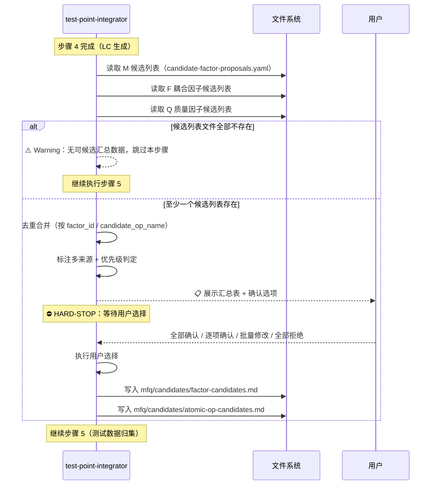

# LLD: STORY-012-07 — 候选汇总 + skill-references 更新 + STOP 协议落地

> 文件名格式：`STORY-012-07-candidate-summary-stop-protocol-LLD.md`，`story_slug` 复用 Story 卡片中的 `candidate-summary-stop-protocol`。
>
> 本文档是 `STORY-012-07` 的低层设计（Low-Level Design），需纳入全部目标 Story 的 LLD 统一确认，并满足当前 Wave D 的 `dev_gate` 后方可进入实现。

## 1. Goal

在 `test-point-integrator` Skill 中内嵌候选汇总步骤，实现 M/F/Q 三源候选列表的去重合并与用户批量确认；更新 `skill-references.md` 反映 MFQ 阶段 v3.0 能力变化；将 HLD §11 的 STOP-02/03/04 执行协议落地到各 MFQ Skill 的操作章节中。

完成后效果：用户通过一次交互即可确认所有 MFQ 分析阶段发现的候选因子和原子操作，MFQ 各 Skill 的 STOP 标记形成一致的执行护栏。

## 2. Requirements（Functional / Non-Functional）

### 2.1 Functional

- **FR1：候选归集与去重合并** — 从 M/F/Q 三源候选列表读取候选因子和原子操作，以 `factor_id` 或 `candidate_op_name` 为 key 去重合并，标注多来源（M 分析 / F 分析 / Q 分析）。
- **FR2：优先级判定** — 根据来源和关联度分类为高/中/低三级：高（M 分析高关联度对象）、中（F 分析关键耦合或 Q 分析强相关维度）、低（中关联度或弱相关维度）。
- **FR3：用户批量确认** — 展示因子候选汇总表和原子操作候选汇总表，提供 4 个 `( )` 单选选项（全部确认 / 逐项确认 / 批量修改 / 全部拒绝），禁止 Agent 自行判定。
- **FR4：确认后回写** — 确认的候选因子写入 `mfq/candidates/factor-candidates.md`，确认的原子操作写入 `mfq/candidates/atomic-op-candidates.md`。拒绝的候选在汇总表中保留决定记录。
- **FR5：skill-references.md 版本更新** — 将 M/F/Q 分析器职责描述更新为 v3.0，将 test-point-integrator 描述增加「候选汇总与用户确认」，新增 `mfq/candidates/` 路径说明段落。
- **FR6：STOP 协议落地** — 在 test-point-integrator 候选汇总步骤标注 STOP-02（⛔ HARD-STOP）；在 m-analyzer 标注 STOP-03（禁止绕过 Skill）+ STOP-04（路径写入校验）；在 f-analyzer/q-analyzer 标注 STOP-03。

### 2.2 Non-Functional

- **NFR1：容错降级** — M/F/Q 候选列表文件不存在时，跳过候选汇总步骤，仅输出 Warning，不阻断 LC 生成主流程。
- **NFR2：格式一致性** — STOP 标记统一使用 `⛔ HARD-STOP：` 前缀格式，与 HLD §11 STOP-01~05 定义一致。
- **NFR3：向后兼容** — test-point-integrator 现有步骤 1-8 的编号、内容和输出格式不变，候选汇总作为新步骤插入到 LC 生成之后、输出步骤之前。
- **NFR4：候选列表格式容错** — 三源候选列表格式不一致时降级为 Warning，展示原始内容给用户，不中断流程。

## 3. 模块拆分与职责

| 模块 / 文件组 | 职责 | 说明 |
|---|---|---|
| `skills/test-point-integrator/SKILL.md` | 新增「候选汇总与用户确认」步骤，实现三源去重合并、优先级判定、用户交互和确认后回写 | 在现有步骤 4（LC 生成）之后、步骤 5（测试数据）之前插入；约 30 行 |
| `docs/ptm-tde/skill-references.md` | 更新 MFQ 阶段 Skill 职责描述为 v3.0，补充候选汇总段落和 `mfq/candidates/` 路径 | 约 10 行修改 |
| `skills/m-analyzer/SKILL.md` | 在步骤 1（输入加载）和输出步骤中分别标注 STOP-03（禁止绕过）和 STOP-04（路径校验） | 约 4 行 |
| `skills/f-analyzer/SKILL.md` | 在前置条件或步骤 1 中标注 STOP-03（禁止绕过） | 约 2 行 |
| `skills/q-analyzer/SKILL.md` | 在前置条件或步骤 1 中标注 STOP-03（禁止绕过） | 约 2 行 |

> 无共享设计片段引用。

## 4. 代码结构与文件影响范围

| 动作 | 文件路径 | 变更内容 |
|---|---|---|
| 修改 | `skills/test-point-integrator/SKILL.md` | 在步骤 4（LC 生成）之后新增步骤「候选汇总与用户确认」；更新输出章节增加 `mfq/candidates/` 输出；更新 Gotchas；总计约 60 行新增 |
| 修改 | `docs/ptm-tde/skill-references.md` | 更新 m-analyzer/f-analyzer/q-analyzer 职责描述为 v3.0；更新 test-point-integrator 描述增加候选汇总；新增「MFQ 候选汇总」段落；约 15 行修改 |
| 修改 | `skills/m-analyzer/SKILL.md` | 在步骤 1 增加 STOP-03 标记（禁止绕过 Skill）；在输出步骤增加 STOP-04 标记（路径写入校验）；约 6 行 |
| 修改 | `skills/f-analyzer/SKILL.md` | 在前置条件或步骤 1 增加 STOP-03 标记；约 3 行 |
| 修改 | `skills/q-analyzer/SKILL.md` | 在前置条件或步骤 1 增加 STOP-03 标记；约 3 行 |

> 文件所有权：5 个文件均为 Story 卡片声明的 `file_ownership` 范围。`skills/README.md` 在 Story 卡片 §4 中标记为「检查」（无需修改）。

## 5. 数据模型与持久化设计

无新增持久化变更。候选汇总步骤消费以下临时数据结构：

### 5.1 候选因子条目（内存中）

| 字段 | 类型 | 约束 | 说明 |
|---|---|---|---|
| `factor_id` | string | 唯一 key | 因子标识，来自 M/F/Q 候选列表或生成 |
| `factor_name` | string | 必填 | 因子可读名称 |
| `value_domain` | string | 必填 | 因子取值范围描述 |
| `source` | enum[M, F, Q] | 必填，可多值合并 | 来源分析器 |
| `priority` | enum[high, medium, low] | 必填 | 优先级 |
| `decision` | enum[confirmed, rejected, modified] | 初始为空，用户确认后填写 | 确认结果 |

### 5.2 候选原子操作条目（内存中）

| 字段 | 类型 | 约束 | 说明 |
|---|---|---|---|
| `candidate_op_name` | string | 唯一 key | 原子操作候选名称 |
| `description` | string | 必填 | 操作描述 |
| `source` | enum[M, F, Q] | 必填，可多值合并 | 来源分析器 |
| `decision` | enum[confirmed, rejected, modified] | 初始为空，用户确认后填写 | 确认结果 |

### 5.3 最终输出文件

| 文件路径 | 内容 |
|---|---|
| `mfq/candidates/factor-candidates.md` | 确认后的因子候选列表（含来源、优先级、最终决定） |
| `mfq/candidates/atomic-op-candidates.md` | 确认后的原子操作候选列表（含来源、最终决定） |

## 6. API / Interface 设计

本 Story 不涉及 API 或 MCP 接口。所有交互为 Skill 内部步骤间数据传递和 Skill-to-file 读写。

| 接口 / 入口 | 输入 | 输出 | 调用方 | 说明 |
|---|---|---|---|---|
| 候选汇总步骤 | M/F/Q 候选列表文件（YAML，路径见下表） | 内存候选表 → 用户交互 → `mfq/candidates/*.md` | test-point-integrator 步骤 4→5 之间 | 步骤内嵌，不独立暴露 |
| skill-references 更新 | 现有 skill-references.md + Story 卡片规格 | 更新后的 skill-references.md | 下游文档消费（STORY-012-08） | 文档级引用 |
| STOP 标记 | HLD §11 STOP-01~05 定义 | 各 Skill 中的 ⛔ HARD-STOP 标记 | Agent 执行时遵循 | 文档级约束 |

### 6.1 候选列表输入文件路径

| 来源 | 文件路径 | 格式 |
|---|---|---|
| M 分析 | `mfq/m-analysis/candidate-factor-proposals.yaml` | YAML，字段：`factor_id`, `factor_name`, `value_domain`, `relevance` |
| M 分析 | `mfq/m-analysis/candidate-atomic-ops.yaml` | YAML，字段：`candidate_op_name`, `description` |
| F 分析 | `mfq/f-analysis/` 耦合因子候选列表 | 由 STORY-012-06 适配后确定确切路径和文件名 |
| Q 分析 | `mfq/q-analysis/` 质量因子候选列表 | 由 STORY-012-06 适配后确定确切路径和文件名 |

> 对应测试入口：见第 10 节 TC-SRC-01（三源候选读取）、TC-DEDUP-01（去重合并）。

## 7. 核心处理流程

### 7.1 候选汇总主流程



### 7.2 去重合并算法

1. 遍历 M/F/Q 三源候选列表，提取所有候选因子条目。
2. 以 `factor_id` 为主 key 合并：同 `factor_id` 的条目合并为一条，`source` 字段记录所有来源（如 `M, Q`）。
3. 以 `candidate_op_name` 为主 key 合并原子操作候选。
4. 合并时保留各源的所有字段；若同 key 条目在不同源中描述或取值域不同，保留差异并标记 `[待用户裁决]`。

### 7.3 优先级判定规则

| 条件 | 优先级 |
|---|---|
| M 分析来源，且 `relevance=high` | **高** |
| F 分析来源，且标记为关键耦合（critical coupling） | **中** |
| Q 分析来源，且标记为强相关维度（strong relevance） | **中** |
| M 分析来源，`relevance=medium` | **中** |
| M 分析来源，`relevance=low` | **低** |
| F/Q 分析来源，非关键/非强相关 | **低** |

## 8. 技术设计细节

### 8.1 候选汇总步骤在 test-point-integrator 中的插入位置

候选汇总作为独立步骤插入在现有步骤 4（逻辑用例结构化输出）之后、现有步骤 5（测试数据归集）之前。原步骤 5-8 的步骤编号保持不变且内容不变，候选汇总以独立命名步骤存在：

```
步骤 1：测试点归集
步骤 2：覆盖检查
步骤 3：CAE 聚合规则与逻辑用例生成
步骤 3.5：组网绑定
步骤 4：逻辑用例结构化输出
步骤 4.5：候选汇总与用户确认（新增）  ← STOP-02 在此
步骤 5：测试数据归集
步骤 6：工具分析归并
步骤 7：覆盖矩阵输出
步骤 8：输出
```

> 设计决策：使用 `步骤 4.5` 而非重新编号步骤 5-8，理由是：最小化对现有步骤编号的冲击；候选汇总在逻辑上从属于“整合”步骤序列中；避免下游引用（如 agent 流程文档）中的步骤编号失效。

### 8.2 候选汇总步骤正文结构

```markdown
### 步骤 4.5：候选汇总与用户确认

⛔ HARD-STOP（STOP-02）：禁止 Agent 自行判定候选因子/原子操作为"全部确认"。必须展示候选汇总表，等待用户选择确认选项。候选表必须使用 `( )` 单选标记区分选项。

#### 4.5.1 三源候选归集

从以下路径读取候选列表：
- M 分析：`mfq/m-analysis/candidate-factor-proposals.yaml`
- M 分析：`mfq/m-analysis/candidate-atomic-ops.yaml`
- F 分析：[具体路径由 STORY-012-06 确定]
- Q 分析：[具体路径由 STORY-012-06 确定]

若以上文件全部不存在，输出 `⚠️ Warning：无可候选汇总数据，跳过本步骤` 并继续步骤 5。
若部分文件存在但格式不一致，输出 Warning 并展示原始内容，继续流程。

#### 4.5.2 去重合并与优先级判定

以 `factor_id` 为 key 合并因子候选；以 `candidate_op_name` 为 key 合并原子操作候选。
同 key 条目合并时，`source` 字段记录所有来源。
优先级判定：[引用 §7.3 规则表]

#### 4.5.3 用户批量确认

展示两张汇总表后，输出确认选项：

选项：
( ) ✅ 全部确认 — 所有候选转为已确认
( ) ✏️ 逐项确认 — 逐项标记确认/拒绝/修改
( ) 📝 批量修改 — 提供修改意见，统一调整后确认
( ) ❌ 全部拒绝 — 所有候选丢弃

⛔ HARD-STOP：禁止 Agent 自行判定。必须展示汇总表并等待用户选择。

#### 4.5.4 确认后回写

- 确认/修改后的因子候选 → `mfq/candidates/factor-candidates.md`
- 确认/修改后的原子操作候选 → `mfq/candidates/atomic-op-candidates.md`
- 拒绝的候选在汇总表中保留决定记录，不写入最终产物
```

### 8.3 STOP 协议落地位置与内容

#### STOP-02（候选确认硬停止）

| 落地文件 | 位置 | 标记内容 |
|---|---|---|
| `skills/test-point-integrator/SKILL.md` | 步骤 4.5 开头 | `⛔ HARD-STOP（STOP-02）：禁止 Agent 自行判定候选因子/原子操作为"全部确认"。必须展示候选汇总表，等待用户选择确认选项。` |

#### STOP-03（禁止绕过 Skill）

| 落地文件 | 位置 | 标记内容 |
|---|---|---|
| `skills/m-analyzer/SKILL.md` | 前置条件章节末尾 | `⛔ HARD-STOP（STOP-03）：禁止 Agent 绕过本 Skill 直接生成 M 分析产物。M 分析必须通过 m-analyzer Skill 调用执行。` |
| `skills/f-analyzer/SKILL.md` | 前置条件章节末尾 | `⛔ HARD-STOP（STOP-03）：禁止 Agent 绕过本 Skill 直接生成 F 分析产物。F 分析必须通过 f-analyzer Skill 调用执行。` |
| `skills/q-analyzer/SKILL.md` | 前置条件章节末尾 | `⛔ HARD-STOP（STOP-03）：禁止 Agent 绕过本 Skill 直接生成 Q 分析产物。Q 分析必须通过 q-analyzer Skill 调用执行。` |

> m-analyzer 的 STOP-03 额外要求：不仅禁止绕过 Skill，还要求「不得跳过子步骤 A/B/C/D 中的任一步，不得使用旧版 v2.0 的"逐模块功能分析"模式替代场景步骤驱动模式」。

#### STOP-04（路径写入校验）

| 落地文件 | 位置 | 标记内容 |
|---|---|---|
| `skills/m-analyzer/SKILL.md` | 步骤 7（输出）开头 | `⛔ HARD-STOP（STOP-04）：写入产物前必须校验目标父目录存在且为目录（非普通文件）。禁止 Agent 手动 mkdir 创建目录。若父目录不存在，输出错误信息并终止，等待用户确认目录结构。` |

> 说明：在 test-point-integrator 中，候选汇总步骤同样写文件到 `mfq/candidates/`，也需要路径校验，但由于 test-point-integrator 的步骤 8（输出）已有路径写入，路径校验逻辑可复用该步骤的现有校验；若步骤 8 尚无 STOP-04 标记，则在候选汇总步骤的 4.5.4 中也加上 STOP-04。

### 8.4 skill-references.md 变更细则

**变更 1：m-analyzer 职责更新**

旧：
```
| MFQ | `m-analyzer` | 执行 M 分析；提取测试因子前先读取公共因子库，复用 active 因子，输出 factor bindings、扩展建议和候选提案；CAE 只引用 `topology_role_refs`，不写真实端口。 |
```

新：
```
| MFQ | `m-analyzer` | 执行 M 分析 v3.0（场景步骤驱动）：逐场景步骤发现测试对象/因子/原子操作，产出 TSP + Scenario-TSP 覆盖矩阵 + 场景步骤标签 + CAE 测试点 + 候选列表。CAE 只引用 `topology_role_refs`，不写真实端口。 |
```

**变更 2：f-analyzer 职责更新**

旧：
```
| MFQ | `f-analyzer` | 执行 F 分析，合并耦合矩阵、场景耦合和可选代码依赖，生成 CAE 耦合测试点。 |
```

新：
```
| MFQ | `f-analyzer` | 执行 F 分析 v3.0（逐 TSP 驱动）：消费覆盖矩阵中 [F→] 标签线索，逐 TSP 场景耦合推理 + 代码依赖 + 耦合矩阵三源合并，生成 CAE 耦合测试点与耦合因子候选。 |
```

**变更 3：q-analyzer 职责更新**

旧：
```
| MFQ | `q-analyzer` | 执行 Q 分析，基于 HTSM 质量属性维度生成 CAE 质量测试点和工具覆盖评估。 |
```

新：
```
| MFQ | `q-analyzer` | 执行 Q 分析 v3.0（逐 TSP 驱动）：消费覆盖矩阵中 [Q→] 标签线索，逐 TSP 逐 HTSM 维度评估，生成 CAE 质量测试点、工具覆盖评估与质量因子候选。 |
```

**变更 4：test-point-integrator 职责更新**

旧：
```
| MFQ | `test-point-integrator` | 整合 M/F/Q 测试点，消费 `factor_bindings`，从 `kym/scenarios/confirmed-scenarios.md` 生成 LC `topology_bindings`，输出逻辑用例、测试数据、工具分析归并和覆盖关系。 |
```

新：
```
| MFQ | `test-point-integrator` | 整合 M/F/Q 测试点，消费 `factor_bindings`，从 `kym/scenarios/confirmed-scenarios.md` 生成 LC `topology_bindings`，输出逻辑用例、测试数据、工具分析归并和覆盖关系。执行候选汇总：三源候选去重合并与用户批量确认。 |
```

**变更 5：新增「MFQ 候选汇总」段落**

在 F 分析器 → Q 分析器 → test-point-integrator 行之后，新增：

```markdown
### MFQ 候选汇总

test-point-integrator 在整合 M/F/Q 测试点后，将三源候选列表（M 分析的因子候选+原子操作候选、F 分析的耦合因子候选、Q 分析的质量因子候选）去重合并，提交给用户批量确认。确认后的候选因子和原子操作存放在 `mfq/candidates/` 目录。
```

## 9. 安全与性能设计

| 维度 | 设计措施 | 验证方式 |
|---|---|---|
| 安全 | 候选汇总步骤不涉及凭据、外部接口或数据写入；STOP-03 防止 Agent 绕过 Skill 直接生成产物 | AC07 grep 验证 STOP 标记存在 |
| 安全 | STOP-04 路径写入前校验父目录存在且为目录，防止写入到错误位置 | m-analyzer SKILL.md 中 grep 校验 |
| 性能 | 候选列表通常 ≤50 条因子 + ≤20 条原子操作，去重合并 O(n) 复杂度，无性能瓶颈 | 人工判断候选列表规模 |

## 10. 测试设计

| 测试场景 ID | 测试场景 | 前置条件 | 操作 | 预期结果 | 验证方式 | 对应 AC |
|---|---|---|---|---|---|---|
| TC-SRC-01 | 三源候选正常读取 | M/F/Q 三个候选列表文件均存在且格式正确 | 执行 test-point-integrator 步骤 4.5 | 三源候选全部读入，source 字段正确 | 检查汇总表中 source 列 | AC01, AC02 |
| TC-DEDUP-01 | 同 factor_id 去重合并 | M 和 Q 候选列表中均有 `FAC-TIMEOUT`，但取值域略有不同 | 执行去重合并 | 输出一条条目，source=M,Q，保留差异标记 `[待用户裁决]` | 检查汇总表中合并条目 | AC02 |
| TC-PRIORITY-01 | 优先级判定 | M 候选 `relevance=high`，F 候选 `critical=true`，Q 候选 `strong=true` | 执行优先级判定 | 分别标记为高/中/中 | 检查汇总表中 priority 列 | (隐式) |
| TC-CONFIRM-01 | 用户选择「全部确认」 | 展示汇总表后用户输入 `( ) ✅ 全部确认` | 选择全部确认 | 所有候选 decision=confirmed，写入 `mfq/candidates/` | 检查输出文件 | AC03 |
| TC-CONFIRM-02 | 用户选择「全部拒绝」 | 展示汇总表后用户输入 `( ) ❌ 全部拒绝` | 选择全部拒绝 | 所有候选 decision=rejected，不写入最终产物 | 检查无输出文件或文件为空 | AC03 |
| TC-SKIP-01 | 候选列表全部不存在 | M/F/Q 候选列表文件均不存在 | 执行步骤 4.5 | 输出 Warning，跳过步骤，继续步骤 5 | 检查流程不中断 | NFR1 |
| TC-FORMAT-01 | 候选列表格式不一致 | M 候选列表 YAML 格式正常，F 候选列表格式错误 | 执行去重合并 | 输出 Warning 展示原始内容，不中断流程 | 检查流程不中断 | NFR4 |
| TC-STOP-02 | STOP-02 标记存在 | — | `grep "⛔ HARD-STOP\|HARD.STOP\|禁止.*自行" skills/test-point-integrator/SKILL.md` | 返回 > 0 | grep 命令 | AC08 |
| TC-STOP-03 | STOP-03 标记存在 | — | `grep -rn "STOP-0[3]" skills/m-analyzer/SKILL.md skills/f-analyzer/SKILL.md skills/q-analyzer/SKILL.md` | 返回 > 0 | grep 命令 | AC07 |
| TC-STOP-04 | STOP-04 标记存在 | — | `grep "STOP-04\|路径.*校验\|父目录" skills/m-analyzer/SKILL.md` | 返回 > 0 | grep 命令 | AC07 |
| TC-SR-01 | skill-references m-analyzer 更新 | — | `grep "v3.0\|场景步骤驱动\|覆盖矩阵" docs/ptm-tde/skill-references.md` | 返回 > 0 | grep 命令 | AC04 |
| TC-SR-02 | skill-references test-point-integrator 更新 | — | `grep "候选汇总\|candidate" docs/ptm-tde/skill-references.md` | 返回 > 0 | grep 命令 | AC05 |
| TC-SR-03 | skill-references mfq/candidates/ 路径 | — | `grep "mfq/candidates/" docs/ptm-tde/skill-references.md` | 返回 > 0 | grep 命令 | AC06 |

> 每项接口（第 6 节）对应测试：
> - 候选汇总步骤 → TC-SRC-01, TC-DEDUP-01, TC-CONFIRM-01, TC-CONFIRM-02, TC-SKIP-01, TC-FORMAT-01
> - skill-references 更新 → TC-SR-01, TC-SR-02, TC-SR-03
> - STOP 标记 → TC-STOP-02, TC-STOP-03, TC-STOP-04

## 11. 实施步骤

| TASK-ID | 动作 | 目标文件 | 详细描述 | 对应测试 |
|---|---|---|---|---|
| TASK-012-07-01 | 修改 | `skills/test-point-integrator/SKILL.md` | 1) 在步骤 4 之后插入「步骤 4.5：候选汇总与用户确认」章节（约 40 行），含去重合并、优先级判定、用户确认选项（4 个 `( )` 单选）、确认后回写；2) 在步骤 4.5 开头和用户确认环节分别标注 STOP-02 ⛔ HARD-STOP；3) 在步骤 8（输出）中加入 `mfq/candidates/` 输出路径 | TC-SRC-01, TC-DEDUP-01, TC-PRIORITY-01, TC-CONFIRM-01, TC-CONFIRM-02, TC-SKIP-01, TC-FORMAT-01, TC-STOP-02 |
| TASK-012-07-02 | 修改 | `docs/ptm-tde/skill-references.md` | 1) 更新 m-analyzer 职责描述为 v3.0（含「场景步骤驱动」「覆盖矩阵」）；2) 更新 f-analyzer 职责描述为 v3.0（含「逐 TSP 驱动」「耦合因子候选」）；3) 更新 q-analyzer 职责描述为 v3.0（含「逐 TSP 驱动」「质量因子候选」）；4) 更新 test-point-integrator 职责描述增加「候选汇总」；5) 新增「MFQ 候选汇总」段落并包含 `mfq/candidates/` 路径 | TC-SR-01, TC-SR-02, TC-SR-03 |
| TASK-012-07-03 | 修改 | `skills/m-analyzer/SKILL.md` | 1) 在前置条件末尾增加 STOP-03 ⛔ HARD-STOP 标记（禁止绕过 Skill，不得使用 v2.0 旧模式）；2) 在步骤 7（输出）开头增加 STOP-04 ⛔ HARD-STOP 标记（路径写入校验） | TC-STOP-03, TC-STOP-04 |
| TASK-012-07-04 | 修改 | `skills/f-analyzer/SKILL.md` + `skills/q-analyzer/SKILL.md` | 各在前置条件末尾增加 STOP-03 ⛔ HARD-STOP 标记（禁止绕过 Skill） | TC-STOP-03 |

> TASK-ID 与文件影响的对应关系：
> - TASK-012-07-01 → test-point-integrator SKILL.md（主要改动）
> - TASK-012-07-02 → skill-references.md
> - TASK-012-07-03 → m-analyzer SKILL.md
> - TASK-012-07-04 → f-analyzer SKILL.md + q-analyzer SKILL.md

> 执行顺序：TASK-012-07-01 和 TASK-012-07-02 可并行（不同文件）；TASK-012-07-03 和 TASK-012-07-04 可并行（不同文件）。但建议按顺序执行以降低风险（先完成核心改造，再做标记补充）。

## 12. 风险、难点与预研建议

### 12.1 实现灰区与取舍记录

| Clarification ID | 问题 | 选项与推荐 | 决策 / 答案 | 影响面 | 证据 | 重访条件 |
|---|---|---|---|---|---|---|
| — | 无实现灰区，三项工作均有明确 Story 规格和 HLD 约束 | — | — | — | — | — |

> 本 Story 的三项工作（候选汇总、skill-references 更新、STOP 协议）在 Story 卡片和 HLD 中均有明确规格和示例内容，无需要澄清的实现灰区。

| 风险 / 难点 | 影响 | 缓解措施 / 预研建议 |
|---|---|---|
| R1：候选列表文件路径不确定 | F/Q 分析器的候选列表确切文件名和路径由 STORY-012-06 确定。若 STORY-012-06 尚未完成，路径可能变化 | 在 LLD 中使用占位符 `[具体路径由 STORY-012-06 确定]`；实现时读取 STORY-012-06 的最终产出确认确切路径。若 STORY-012-06 先完成，则直接使用其产出路径 |
| R2：STOP 标记可能被 Agent 忽略 | ⛔ HARD-STOP 仅为文档级约束，无法绝对阻止 AGI Agent 绕过 | 这是整个 STOP-01~05 体系共有的基础假设（见 HLD R5）；双重防御：Skill 文档标记 + checkpoint-manager 自检脚本校验人工确认回填。本 Story 只负责文档标记落地 |
| R3：test-point-integrator SKILL.md 篇幅膨胀 | 新增 ~40 行后，SKILL.md 可能接近 430 行 | HLD §12 NFR 限制 ≤500 行，当前范围可控。若未来超过 500 行，通过后续 CR 拆分 |
| R4：候选汇总步骤编号 `4.5` 的约定性 | 非标准编号，维护者可能困惑 | 在步骤标题下增加 note 说明编号理由；若 Codex 或平台规范要求整数编号，改为 `步骤 5` 并将原步骤 5-8 重新编号为 6-9 |

### OPEN / Spike 跟踪

| ID | 类型（OPEN / Spike） | 问题 | 下一动作 | 责任方 |
|---|---|---|---|---|
| O-01 | OPEN | F/Q 候选列表确切的文件名和路径需等待 STORY-012-06 完成后确定 | 实现 TASK-012-07-01 时以 STORY-012-06 最终产出为准 | meta-dev（本 Story 实现者） |

## 13. 回滚与发布策略

- **发布方式**：直接修改项目仓库中的 Skill 定义文件和文档文件，无需安装脚本或部署步骤。修改随 Git commit 生效。
- **回滚触发条件**：CP7 验证发现候选汇总逻辑错误（去重遗漏、优先级误判）、STOP 标记位置错误导致 Agent 行为异常、skill-references 描述与实际 Skill 能力不一致。
- **回滚动作**：`git revert` 本 Story 的 commit，整体回退 5 个文件的修改。因改动量小（~90 行）且无数据库或配置依赖，单 commit revert 即可完全回退。

## 14. Definition of Done

- [ ] AC01：`skills/test-point-integrator/SKILL.md` 包含「候选汇总」或「candidate.*summary」章节 — TASK-012-07-01
- [ ] AC02：候选汇总章节包含去重合并逻辑描述（`去重` 或 `dedup` 或 `合并.*factor_id`）— TASK-012-07-01
- [ ] AC03：候选汇总章节包含用户确认选项（至少 2 个可选选项，使用 `( )` 单选标记）— TASK-012-07-01
- [ ] AC04：`docs/ptm-tde/skill-references.md` 中 m-analyzer 描述包含 `v3.0` 或 `场景步骤驱动` 或 `覆盖矩阵` — TASK-012-07-02
- [ ] AC05：`docs/ptm-tde/skill-references.md` 中 test-point-integrator 描述包含 `候选汇总` 或 `candidate` — TASK-012-07-02
- [ ] AC06：`docs/ptm-tde/skill-references.md` 包含 `mfq/candidates/` 路径引用 — TASK-012-07-02
- [ ] AC07：`grep -rn "STOP-0[1-5]" skills/m-analyzer/SKILL.md skills/f-analyzer/SKILL.md skills/q-analyzer/SKILL.md skills/test-point-integrator/SKILL.md skills/design-planner/SKILL.md` 返回 > 0 或各 Skill 有等价的行为约束描述 — TASK-012-07-03, TASK-012-07-04
- [ ] AC08：`grep "⛔ HARD-STOP\|HARD.STOP\|禁止.*自行" skills/test-point-integrator/SKILL.md` 返回 > 0 — TASK-012-07-01
- [ ] 14 个章节全部填写完成
- [ ] 文件影响范围、接口、测试与实施步骤可直接指导编码
- [ ] 实现灰区与取舍记录已覆盖（显式写「无」）
- [ ] `confirmed=false` 时不进入实现
- [ ] OPEN / Spike 已清点（O-01 已登记）
- [ ] frontmatter `tier=M` 已填写
- [ ] F/Q 候选列表路径不确定性（R1）在实现时有明确处理

## 人工确认区

> **CP5 — Story LLD 可实现性门**
> meta-dev 先写入 `process/checks/CP5-012-07-candidate-summary-stop-protocol-LLD-IMPLEMENTABILITY.md` 自动预检结果。
> meta-po 收齐全部目标 Story 的 LLD、CP4 自动预检摘要和 CP5 自动预检后，再生成并提示用户审查 `checkpoints/CP5-ALL-STORIES-LLD-BATCH.md`。
> 用户统一确认全部目标 Story 的 LLD 后，仍需满足当前 Wave D、依赖门控与文件所有权门控方可进入实现。

**CP5 checklist 摘要**：

| # | 检查项 | 状态 | 证据 |
|---|---|---|---|
| 1 | LLD 覆盖 AC | 待检查 | 第 2 / 10 / 14 节，AC01-AC08 均有对应测试入口和 DoD 映射 |
| 2 | 与 HLD / ADR 一致 | 待检查 | 第 3 节模块职责匹配 HLD §9；第 7 节流程匹配 HLD §11；STOP-02/03/04 匹配 HLD §11 执行协议；ADR-012-02（候选汇总内嵌）已落实 |
| 3 | 文件影响范围明确 | 待检查 | 第 4 节列出 5 个文件，第 11 节 TASK-ID 与文件一一对应 |
| 4 | 接口契约完整 | 待检查 | 第 6 节列出候选列表输入路径、输出路径和 STOP 标记位置 |
| 5 | 测试与 dev_gate 可计算 | 待检查 | 第 10 节 13 项测试场景，每项有对应 AC 和验证命令 |
| 6 | clarification queue 已收敛 | 待检查 | 第 12.1 节显式写「无实现灰区」；O-01 仅依赖上游路径确定，不阻断 LLD |

**人工确认回复**：

请直接回复以下任一整行：

```text
approve
修改: <具体修改点>
reject
```

- `approve`：LLD 设计合理，允许进入实现。
- `修改: <具体修改点>`：指出具体修改点后由 meta-dev 更新重提。
- `reject`：设计方向有根本问题，需重新设计。

**人工审查结果回填**：

- 结论：`approved | changes_requested | rejected`
- 审查人：
- 审查时间：
- 修改意见：
- 风险接受项：
