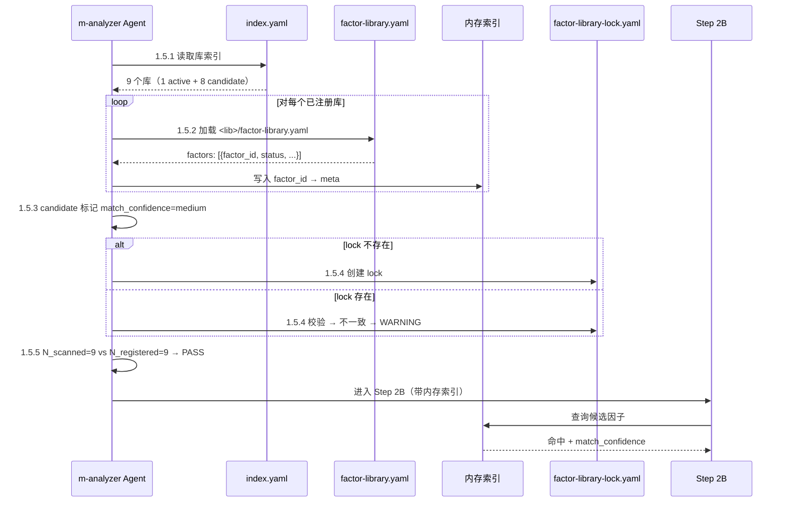

# LLD: STORY-017-01 — m-analyzer 因子库发现机制修复

> 文件名：`STORY-017-01-factor-library-discovery-LLD.md`
>
> 本文档是 `STORY-017-01` 的低层设计（Low-Level Design），基于 `process/HLD-CR-017.md` v1.0 推荐方案 A 产出。统一确认后方可进入实现。

## 1. Goal

在 m-analyzer 的 Step 1（加载 KYM 输入）和 Step 2（场景步骤分析）之间插入 **Step 1.5「因子库清单加载」**（5 个子步骤），修改 Step 2B 匹配规则支持 candidate 状态因子的 `match_confidence` 分级匹配，在 test-point-integrator Step 4.5 中新增因子库反查去重子步骤，在 gate-spec.md GATE-3 中新增 M8 扫描完整性检查项。

完成后，m-analyzer 能发现全部 9 个已注册因子库（当前仅 2 个），消除 18 个假阳性候选因子（51%），候选精度从 49% 提升到 >90%。

## 2. Requirements（Functional / Non-Functional）

### 2.1 Functional

- [F1] 新增 Step 1.5.1：读取 `resource/factor-libraries/index.yaml`，获取全部已注册库的 library_id / status / path
- [F2] 新增 Step 1.5.2：遍历索引中每个库（无论 active/candidate），加载其 `factor-library.yaml`，解析所有因子
- [F3] 新增 Step 1.5.3：构建内存索引（factor_id → {library_id, library_status, factor_status, factor_group, ...}），candidate 状态标记 match_confidence=medium
- [F4] 新增 Step 1.5.4：若 `mfq/factor-usage/factor-library-lock.yaml` 不存在则创建；若存在则校验一致性，不一致输出 WARNING 继续
- [F5] 新增 Step 1.5.5：扫描完整性校验（N_scanned vs N_registered），不等则 HARD-STOP 阻断
- [F6] 修改 Step 2B：匹配时使用 Step 1.5 内存索引，命中 candidate 状态因子标记 source=public-library + match_confidence=medium
- [F7] 新增 Step 4.5.1.5（test-point-integrator）：候选汇总前重建因子库索引反查去重，已存在者降级/移除
- [F8] 新增 GATE-3 M8：校验 factor-resolution-report 中 N_scanned 等于 index.yaml N_registered

### 2.2 Non-Functional

- [NF1] STOP-04 兼容：不新增 Agent mkdir，目录由主 Agent 初始化流程创建
- [NF2] CR-016 兼容：Step 1.5 命名为「因子库清单加载」，为 CR-016 的 Step 1.6「原子操作清单加载」留出扩展点
- [NF3] 向后兼容：新逻辑是旧逻辑的超集，不改变除因子匹配外的任何行为
- [NF4] 全量 9 库 <200 因子，纯内存操作，对分析性能无可感知影响

## 3. 模块拆分与职责

| 模块 / 文件组 | 职责 | 说明 |
|---|---|---|
| `skills/m-analyzer/SKILL.md` Step 1.5（新增） | 因子库清单加载：发现全部已注册库、构建内存索引、管理 lock 文件、扫描完整性校验 | 5 个子步骤，~60 行。是本 Story 的核心变更 |
| `skills/m-analyzer/SKILL.md` Step 2B（修改） | 在匹配逻辑中引入 match_confidence 字段，区分 active/candidate 命中 | ~15 行修改（子步骤 2 的查找顺序和命中标记） |
| `skills/m-analyzer/SKILL.md` Step 7（修改） | 输出文件从 8 个增至 9 个（新增 factor-library-lock.yaml）；factor-resolution-report 新增 N_scanned 字段 | ~5 行修改 |
| `skills/m-analyzer/SKILL.md` 消费表 + Gotchas + 验收标准（修改） | 公共因子库补充契约更新、Gotchas 新增、验收标准新增 | ~5 行修改 |
| `skills/test-point-integrator/SKILL.md` Step 4.5.1.5（新增） | 因子库反查去重：重建索引 → 反查候选 → 降级/移除已存在项 | ~25 行 |
| `docs/ptm-tde/gate-spec.md` GATE-3（修改） | Checklist 新增 M8：因子库扫描完整性 | ~8 行 |

> 引用共享设计片段：无。本 Story 是增量修改，不涉及 `process/shared/` 片段。

## 4. 代码结构与文件影响范围

| 动作 | 文件路径 | 变更内容 |
|---|---|---|
| 修改 | `skills/m-analyzer/SKILL.md` | ① Step 1 和 Step 2 之间插入 Step 1.5（5 个子步骤：索引读取→遍历加载→状态处理→锁文件→完整性校验）；② Step 2B 子步骤 2 修改匹配逻辑（match_confidence 字段）；③ Step 7 输出文件清单从 8→9（新增 factor-library-lock.yaml）；④ 公共因子库补充契约引用更新；⑤ Gotchas + 验收标准新增项 |
| 修改 | `skills/test-point-integrator/SKILL.md` | Step 4.5.1 之后插入 Step 4.5.1.5「因子库反查去重」；Step 4.5.2 去重合并增加 factor-library 来源参考 |
| 修改 | `docs/ptm-tde/gate-spec.md` | GATE-3 Checklist 新增 M8；GATE-3 Entry Criteria 公共因子库消费记录条目更新 |

**净增行数**：~108 行（m-analyzer ~75 + test-point-integrator ~25 + gate-spec ~8）

## 5. 数据模型与持久化设计

### 内存索引结构（非持久化）

```
factor_index: dict[str, dict]
  key: factor_id (str)
  value:
    library_id: str       # 所属库 ID
    library_status: str   # active | candidate
    library_display_name: str
    factor_status: str    # active | candidate
    factor_name: str
    aliases: list[str]
    owner_object: str
    factor_group: str
    data_domain: str      # 若有
    match_confidence: str # high (active) | medium (candidate)
```

### 新增持久化文件

| 文件 | 格式 | 内容 |
|------|------|------|
| `mfq/factor-usage/factor-library-lock.yaml` | YAML | 锁定当前运行时因子库版本快照 |

**lock 文件 Schema**：

```yaml
lock_version: 1
created_at: "<iso timestamp>"
updated_at: "<iso timestamp>"
scanned_libraries: 9
libraries:
  - library_id: "common-network"
    version: "0.1.0"
    status: "active"
    factor_count: 15
    checksum: "pending"
  - library_id: "ngfw-ipv4-route"
    version: "0.1.0"
    status: "candidate"
    factor_count: 23
    checksum: "pending"
  # ... 其余 7 个库
```

### 修改已有文件

| 文件 | 新增字段 | 说明 |
|------|---------|------|
| `mfq/m-analysis/factor-resolution-report.md` | `N_scanned: 9` | 新增扫描库数量字段，供 GATE-3 M8 校验 |
| `mfq/m-analysis/test-objects-factors.md`（已有因子表） | `match_confidence: high \| medium` | Step 2B 匹配时写入 |

> 无新增数据库表、无 schema migration。

## 6. API / Interface 设计

> 本 Story 不涉及 API、CLI 或 SDK 接口。所有变更为 SKILL.md 指令文本的增改。接口契约均为 SKILL.md 步骤间的内部数据流转。

| 接口 / 入口 | 输入 | 输出 | 调用方 | 说明 |
|---|---|---|---|---|
| m-analyzer Step 1.5 → Step 2B | 内存索引（factor_index dict） | 用于 Step 2B 因子匹配查询 | m-analyzer 内部步骤调用 | 纯内存传递，非文件 I/O |
| m-analyzer Step 1.5.4 → 文件系统 | 当前库版本快照 | `mfq/factor-usage/factor-library-lock.yaml` | m-analyzer 自身（下次运行） | 首次创建，后续校验 |
| m-analyzer factor-resolution-report → test-point-integrator | `mfq/m-analysis/factor-resolution-report.md`（含 N_scanned） | 用于反查去重和 GATE-3 校验 | test-point-integrator Step 4.5.1.5 / checkpoint-manager GATE-3 | 现有文件，新增字段 |
| m-analyzer factor-resolution-report → GATE-3 | N_scanned 字段 | GATE-3 M8 自检判定（PASS/FAIL） | checkpoint-manager | 新增检查项 |

> 每个接口条目在第 10 节测试设计中均有对应测试场景。

## 7. 核心处理流程

### 7.1 主流程：Step 1.5 因子库清单加载

```
Step 1（加载 KYM 输入）完成
         │
         ▼
┌─────────────────────────────────────────┐
│ Step 1.5：因子库清单加载               │
│                                         │
│ 1.5.1 读取资源索引                      │
│   读取 resource/factor-libraries/       │
│   index.yaml                           │
│   → 获取 9 个库的 library_id / status  │
│     / path                             │
│   确认 component-resource-links.yaml    │
│   声明 library_id=all                  │
│         │                               │
│         ▼                               │
│ 1.5.2 遍历加载                          │
│   对 index 中每个库（无论 active/       │
│   candidate）：                         │
│     → 进入子目录                        │
│     → 加载 factor-library.yaml          │
│     → 解析所有 factor                   │
│     → 写入内存索引                      │
│   单个库解析失败 → WARNING, 跳过        │
│         │                               │
│         ▼                               │
│ 1.5.3 candidate 状态处理               │
│   library_status=candidate →            │
│     库中所有因子 match_confidence=      │
│     medium                             │
│   factor_status=candidate →             │
│     该因子 match_confidence=medium     │
│   active → match_confidence=high        │
│         │                               │
│         ▼                               │
│ 1.5.4 Lock 文件管理                     │
│   lock 不存在？→ 创建 lock             │
│   lock 已存在？→ 校验一致性            │
│     一致 → OK                           │
│     不一致 → ⚠️ WARNING，继续          │
│         │                               │
│         ▼                               │
│ 1.5.5 扫描完整性校验                    │
│   N_scanned == N_registered？           │
│     是 → PASS → 进入 Step 2            │
│     否 → ⛔ HARD-STOP                   │
│         "因子库扫描不完整:               │
│          扫描 2/9，缺少 7 个库"         │
└─────────────────────────────────────────┘
         │ (PASS)
         ▼
Step 2（场景步骤驱动的对象与因子发现）
```

### 7.2 修改流程：Step 2B 匹配规则变更

**变更前**（当前行为）：
```
2. 在公共因子库中检索每个候选因子：
   查找顺序：三层路径回退（PTM_TEAM_RESOURCE_HOME → ~/.ptm-team → resource/）
   按 factor_id / factor_name / aliases / owner_object 检索
   - 命中 active 因子 → source=public-library
   - 未命中 → source=new-candidate
```

**变更后**（CR-017 实现）：
```
2. 在公共因子库中检索每个候选因子：
   查找来源：Step 1.5 构建的内存索引（已覆盖全部 9 个库）
   按 factor_id / factor_name / aliases / owner_object 检索
   - 命中 → source=public-library
       factor_status=active → match_confidence=high，直接复用
       factor_status=candidate → match_confidence=medium，复用但下游需确认
     如值域/样本/约束不足 → 记录扩展建议
   - 未命中 → source=new-candidate，加入候选列表
```

### 7.3 test-point-integrator 反查去重（Step 4.5.1.5 新增）

```
Step 4.5.1 读取候选列表
         │
         ▼
Step 4.5.1.5 🆕 因子库反查去重
  1. 重建因子库索引（读取 index.yaml → 遍历加载 factor-library.yaml）
     或直接读取 factor-resolution-report.md 中的命中记录
  2. 对每个候选因子：
     a. 在索引中按 factor_id / factor_name / aliases 检索
     b. 命中 → 标记"已在公共库中存在"（library_id + factor_id）
        → 降级为 low-priority 或 removable
     c. 未命中 → 保留为候选
  3. 输出反查结果（哪些是全新候选，哪些是扫描遗漏）
         │
         ▼
Step 4.5.2 去重合并与优先级判定（现有逻辑）
```

### 7.4 Mermaid 序列图：关键交互



## 8. 技术设计细节

- **关键算法 / 规则**：
  - match_confidence 判定：`factor_status=active → high`，`factor_status=candidate → medium`。两级，无 low。
  - 锁校验：按 library_id 匹配 → 比较 version → 不一致或不存在的库输出 WARNING。checksum=pending 时不参与比较。
  - 扫描完整性：`N_scanned = len(成功加载的库)`，`N_registered = len(index.yaml 中的库)`。不等时输出"因子库扫描不完整: 扫描 X/Y，缺少：<库名列表>"后阻断。
- **依赖选择与复用点**：
  - 本 Story 无外部依赖。Step 1.5 的 5 个子步骤模式供 CR-016 Step 1.6 复用。
- **兼容性处理**：
  - index.yaml 不可读 → 硬错误阻断（与 GATE-1 #3 atomic-ops 检查一致的硬停止原则）
  - 单个库的 factor-library.yaml 解析失败 → WARNING + 跳过该库，不影响其他库
  - 所有库解析失败（N_scanned=0）→ 与 index.yaml 不可读同等处理，硬错误阻断
- **图示类型选择**：流程图（Step 1.5 内部逻辑）+ 时序图（与外部文件交互）

## 9. 安全与性能设计

| 维度 | 设计措施 | 验证方式 |
|---|---|---|
| 安全 | 纯本地只读操作（index.yaml + factor-library.yaml），无网络调用；lock 写入路径固定 `mfq/factor-usage/`，无路径遍历风险；不修改任何现有因子库文件 | 人工 review 修改内容 |
| 性能 | 全量 9 库 <200 因子，纯内存字典查找 O(1)；与现有 2 库扫描相比增加 7 个 YAML 文件解析（<50ms）；perf 影响可忽略 | 运行 m-analyzer 目视确认无延迟 |

## 10. 测试设计

| 测试场景 | 前置条件 | 操作 | 预期结果 | 验证方式 |
|---|---|---|---|---|
| T1: 首次运行，9 库就位 | KYM 产出完整，index.yaml 注册 9 库，lock 不存在 | 运行 m-analyzer | factor-resolution-report 显示 N_scanned=9；lock 创建；FAC-CAND-001（下一跳类型）命中 ngfw-ipv4-route 的 FAC-RT-NEXT-HOP，source=public-library, match_confidence=medium | 人工检查 factor-resolution-report.md + factor-library-lock.yaml |
| T2: 再次运行，lock 一致 | lock 已存在且与 index.yaml 一致 | 运行 m-analyzer | 无 WARNING 输出，正常完成 | 人工检查无 WARNING |
| T3: lock 不一致（模拟） | 手动修改 lock 中某库 version | 运行 m-analyzer | ⚠️ WARNING 输出但继续执行 | 人工检查输出含 WARNING |
| T4: index.yaml 不存在 | 删除 index.yaml | 运行 m-analyzer | ⛔ 硬错误阻断："未找到 resource/factor-libraries/index.yaml，无法加载因子库" | 删除 index.yaml 后运行 |
| T5: 扫描不完整（个别库 YAML 损坏） | 损坏一个 factor-library.yaml | 运行 m-analyzer | WARNING 跳过该库，N_scanned=8 < 9 → ⛔ HARD-STOP | 损坏一个库的 YAML 后运行 |
| T6: 18 个重复候选不再生成 | KYM 产出涉及路由/DFX/负载均衡/HA 多域 | 运行 m-analyzer | candidate-factor-proposals.yaml 中无 FAC-CAND-001（下一跳类型）等 18 个已存在于库中的候选 | grep 检查候选列表 |
| T7: 真正新候选正常生成 | KYM 产出含库中确实不存在的因子 | 运行 m-analyzer | 全新因子仍以 source=new-candidate 出现在候选列表中 | 人工检查候选列表 |
| T8: integrator 反查去重 | m-analyzer 产出含假阳性候选（已在因子库中存在但 m-analyzer 未正确标记） | 运行 test-point-integrator | 候选汇总表比反查前减少，已存在项降级提示 | 人工检查候选汇总输出 |
| T9: integrator 反查索引导入失败 | index.yaml 不存在 | 运行 test-point-integrator | Warning 输出，跳过反查，按现有逻辑继续 | 删除 index.yaml 后运行 |
| T10: GATE-3 M8 通过 | N_scanned = N_registered | 运行 checkpoint-manager GATE-3 | M8 自检 PASS | 人工检查 GATE-3 输出 |

## 11. 实施步骤

> 严格使用 TASK-ID + 确定性动词。

| TASK-ID | 动作 | 目标文件 | 详细描述 | 对应测试 |
|---|---|---|---|---|
| TASK-017-01-01 | 修改 | `skills/m-analyzer/SKILL.md` | 在 Step 1「加载输入」和 Step 2「场景步骤驱动的对象与因子发现」之间插入 Step 1.5「因子库清单加载」。包含 5 个子步骤：1.5.1 读取库索引、1.5.2 遍历加载、1.5.3 candidate 状态处理、1.5.4 锁文件管理、1.5.5 扫描完整性校验。注意：Step 2 起始位置下移，保持标题编号连续。 | T1-T7 |
| TASK-017-01-02 | 修改 | `skills/m-analyzer/SKILL.md` | 修改 Step 2B 子步骤 2 的匹配规则：① 查找来源从"三层路径回退"改为"Step 1.5 构建的内存索引"；② 命中判定从"active 命中"改为"active→match_confidence=high / candidate→match_confidence=medium"；③ 修改输出表已有因子列增加 match_confidence 字段。 | T1, T6 |
| TASK-017-01-03 | 修改 | `skills/m-analyzer/SKILL.md` | 修改 Step 7「写入 M 分析产物」：① 输出文件清单从 8 个增至 9 个（新增 factor-library-lock.yaml）；② factor-resolution-report.md 内容新增 N_scanned 字段说明；③ 更新写入前校验的描述（校验 mfq/factor-usage/ 父目录存在）。 | T1, T5 |
| TASK-017-01-04 | 修改 | `skills/m-analyzer/SKILL.md` | 修改「公共因子库补充契约」节：① 更新库查找描述（从路径回退改为 index 驱动）；② 新增 match_confidence 说明。修改 Gotchas 新增 1 条（因子库扫描完整性自检）。修改验收标准新增 2 条（扫描库数校验 + match_confidence 标记）。 | — |
| TASK-017-01-05 | 修改 | `skills/test-point-integrator/SKILL.md` | 在 Step 4.5.1「读取候选列表」之后、Step 4.5.2「去重合并与优先级判定」之前，插入 Step 4.5.1.5「因子库反查去重」。3 个子步骤：重建索引 → 反查候选 → 降级标记。修改 Step 4.5.2 去重规则新增因子库来源参考。 | T8, T9 |
| TASK-017-01-06 | 修改 | `docs/ptm-tde/gate-spec.md` | ① GATE-3 Checklist 新增 M8："因子库扫描完整性 — factor-resolution-report.md 中 N_scanned == index.yaml 注册库数 — 不等时阻断"；② GATE-3 Entry Criteria「公共因子库消费记录」条目更新（增加 N_scanned 校验要求）；③ 修订记录新增 v1.x 行。 | T10 |

> 每个 TASK-ID 至少覆盖 1 个文件影响项；每个文件影响项至少被 1 个 TASK-ID 覆盖。确认：m-analyzer（TASK-01~04）、test-point-integrator（TASK-05）、gate-spec（TASK-06）。

## 12. 风险、难点与预研建议

### 12.1 实现灰区与取舍记录

> 本 Story 在并行 LLD 阶段（max_parallel_lld=1，单 Story），无未回答的 clarification queue item。以下为设计过程中已决策的取舍点。

| Clarification ID | 问题 | 选项与推荐 | 决策 / 答案 | 影响面 | 证据 | 重访条件 |
|---|---|---|---|---|---|---|
| LCQ-STORY-017-01-01 | 单个库 YAML 解析失败时的处理 | A: 跳过该库 + WARNING（推荐）/ B: 跳过 + 静默 / C: 全部阻断 | A: 跳过 + WARNING | m-analyzer Step 1.5.2 | HLD §12 NFR「可靠性」：逐库 try/catch，失败跳过不影响其他库 | 若某个关键库频繁解析失败，考虑升级为阻断 |
| LCQ-STORY-017-01-02 | integrator 反查时是重建索引还是消费 m-analyzer 的 factor-resolution-report | A: 重建索引（推荐，独立性强）/ B: 消费 resolution-report（减少重复 I/O） | A: 重建索引，但优先读取 resolution-report 中的命中记录加速 | test-point-integrator Step 4.5.1.5 | HLD §9 模块边界：integrator 独立重建索引或透传 resolution-report | 若 YAML 加载耗时显著，可改为纯消费 resolution-report |

| 风险 / 难点 | 影响 | 缓解措施 / 预研建议 |
|---|---|---|
| m-analyzer SKILL.md 已 552 行，再增 ~75 行接近 630 行 | 可读性下降 | Step 1.5 的 5 个子步骤保持紧凑，每步 ≤10 行；不引入额外概念 |
| Step 编号变更（7→8 步）可能导致跨文档引用不一致 | 其他 Skill 或文档引用 "Step 6 覆盖初检" 等可能失效 | grep 搜索其他文件中的 "Step 6"/"Step 7" 引用，确认无外部硬编码依赖（gate-spec.md GATE-3 引用的是 Checklist 编号 M1-M7，不依赖 Step 编号） |
| 与 CR-016 修改同一文件（m-analyzer SKILL.md）不同区域 | 合并冲突 | 修改区域不同（Step 1.5+2B vs Pre-2C+Step 2C），顺序推进避免冲突。CR-016 承诺承担适配成本 |

### OPEN / Spike 跟踪

| ID | 类型 | 问题 | 下一动作 | 责任方 |
|---|---|---|---|---|
| — | — | 无 OPEN/Spike 项 | — | — |

> 本 Story 范围明确，所有设计决策已在 HLD 阶段完成（CP3 approved），无需要预研或外部确认的未决项。

## 13. 回滚与发布策略

- **发布方式**：修改 3 个产品文件后通过 git commit 发布。不涉及安装器变更。
- **回滚触发条件**：
  - m-analyzer 运行后 factor-resolution-report 扫描库数 ≠ 9
  - candidate 状态因子 match_confidence=medium 导致大量下游误确认
  - 新增逻辑导致 m-analyzer 不可用（如 index.yaml 格式解析错误）
- **回滚动作**：`git revert <commit>` 恢复到 CR-017 前的 m-analyzer/test-point-integrator/gate-spec 版本。回退后行为与当前完全一致（2 库扫描）。

## 14. Definition of Done

- [x] 14 个章节全部填写完成
- [x] 文件影响范围、接口、测试与实施步骤可直接指导编码
- [x] 实现灰区与取舍记录已回填所有相关 clarification item
- [ ] `confirmed=false` 时不进入实现
- [ ] 人工确认意见已收敛
- [x] frontmatter 已填写 `tier=M`
- [x] OPEN / Spike 已清点（无）

## 人工确认区

> **CP5 — Story LLD 可实现性门**
> meta-dev 先写入 `process/checks/CP5-STORY-017-01-factor-library-discovery-LLD-IMPLEMENTABILITY.md` 自动预检结果。
> meta-po 收齐全部目标 Story 的 LLD 和 CP5 自动预检后，再生成并提示用户审查 `checkpoints/CP5-ALL-STORIES-LLD-BATCH-CR-017.md`。
> 统一确认后，满足依赖门控与文件所有权门控方可进入实现。

**CP5 checklist 摘要**：

| # | 检查项 | 状态 | 证据 |
|---|---|---|---|
| 1 | LLD 覆盖 AC | 待检查 | 第 2 / 10 / 14 节 |
| 2 | 与 HLD / ADR 一致 | 待检查 | 第 3 / 8 / 12 节 |
| 3 | 文件影响范围明确 | 待检查 | 第 4 / 11 节 |
| 4 | 接口契约完整 | 待检查 | 第 6 节 |
| 5 | 测试与 dev_gate 可计算 | 待检查 | 第 10 / 14 节 |
| 6 | clarification queue 已收敛 | 待检查 | 第 12.1 节 |

**人工确认回复**：

```text
approve
修改: <具体修改点>
reject
```

- `approve`：LLD 设计合理，允许进入实现。
- `修改: <具体修改点>`：指出具体修改点后由 meta-dev 更新重提。
- `reject`：设计方向有根本问题，需重新设计。

**人工审查结果回填**：

- 结论：`pending`
- 审查人：
- 审查时间：
- 修改意见：
- 风险接受项：
