# TGFW 测试组网图集合

本文按 `TGFW产品测试组网方案和规范.md` 重写全部组网。

约定：

- Mermaid 只展示组网图 ID：`tg1`、`dut1`、`sw1`、`mock1`、`port1`。
- 所有设备节点统一为 device 对象，通过 `node_type` 区分类型。
- 接口统一使用 `port<N>` 命名，不使用 `eth0`、`eth1` 等。
- 接口不需要 `device_id`，因为它是节点的子对象。
- 子图内部使用 `~~~` 隐形链接保证接口顺序不被 Mermaid 重排。
- 两个 port 之间直接用线连接，不插入中间节点。
- `links` 为点到点对象；交换机接入场景通过 SW 节点加多条 link 表达。
- 若源图为了布局把同一台 TG 画在上下两个位置，本文统一合并为 `tg1`，通过不同 `port` 表达连接关系。

## 通用 Mermaid 样式

```mermaid
%%{init: {'flowchart': {'curve': 'linear', 'nodeSpacing': 60, 'rankSpacing': 80}}}%%
flowchart LR
    classDef dut fill:#ffe8cc,stroke:#c46a00,stroke-width:1px,color:#111;
    classDef tg fill:#dff3ff,stroke:#0077a8,stroke-width:1px,color:#111;
    classDef sw fill:#e8f5e9,stroke:#2e7d32,stroke-width:1px,color:#111;
    classDef mock fill:#f3e8ff,stroke:#7b1fa2,stroke-width:1px,color:#111;
```

---

## node2_dut1_tg1_link2

TG 与 DUT 双链路直连，基础性能模型。

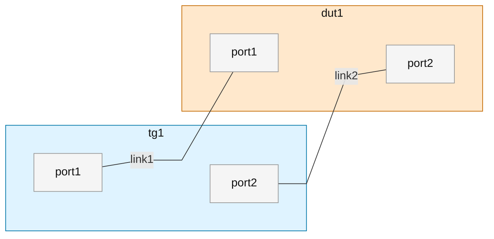

```yaml
metadata:
  version: "0.2"
  topology_id: node2_dut1_tg1_link2
  description: TG 与 DUT 双链路直连，基础性能模型。

nodes:
  tg1:
    logic_id: tg1
    node_type: TG
    sub_type: IXIA
    role: traffic-generator
    management:
      host: "<IP_ADDRESS>"
      api_server: "127.0.0.1"
      port: 22
      username: "<username>"
      password: "<password>"
    interfaces:
      port1:
        chassis_id: null
        board_id: 2
        port_id: 99
        speed_class: GE
        media_type: copper
        default_ip: "3.3.7.5/24"
        default_ipv6: "2001:0:0:1::2/64"
        mac_address: "fa:cc:92:a3:5b:01"
        link: link1
      port2:
        chassis_id: null
        board_id: 2
        port_id: 100
        speed_class: GE
        media_type: copper
        default_ip: "3.3.8.5/24"
        default_ipv6: "2001:0:0:2::2/64"
        mac_address: "fa:cc:92:a3:7b:01"
        link: link2
  dut1:
    logic_id: dut1
    device_id: tgfw-lab-01
    node_type: DUT
    sub_type: c236
    version: v60r001c00spc201
    role: firewall-under-test
    management:
      host: "xx.xx.xx.xx"
      port: 22
      username: "<username>"
      password: "<password>"
      web_username: "<web_username>"
      web_password: "<web_password>"
    interfaces:
      port1:
        speed_class: GE
        media_type: copper
        default_ip: "3.3.7.4/24"
        default_ipv6: "2001:0:0:1::1/64"
        mac_address: "c0:ea:c3:20:71:da"
        link: link1
      port2:
        speed_class: GE
        media_type: copper
        default_ip: "3.3.8.4/24"
        default_ipv6: "2001:0:0:2::1/64"
        mac_address: "c0:ea:c3:20:71:db"
        link: link2

links:
  link1:
    media_type: copper
    mode: routed
    endpoints:
      - node: tg1
        interface: port1
      - node: dut1
        interface: port1
    network:
      ipv4: "3.3.7.0/24"
      ipv6: "2001:0:0:1::/64"
      vlan: null
  link2:
    media_type: copper
    mode: routed
    endpoints:
      - node: tg1
        interface: port2
      - node: dut1
        interface: port2
    network:
      ipv4: "3.3.8.0/24"
      ipv6: "2001:0:0:2::/64"
      vlan: null
```

---

## node2_dut1_tg1_link3

三链路直连，用于吞吐扩展测试。

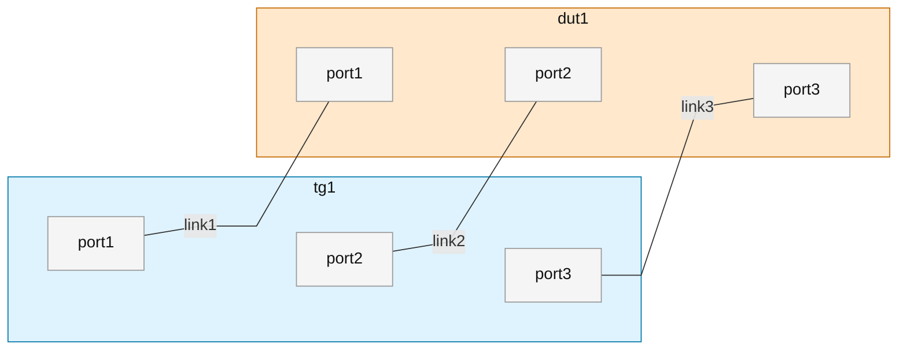

```yaml
metadata:
  version: "0.2"
  topology_id: node2_dut1_tg1_link3
  description: 三链路直连，用于吞吐扩展测试。

nodes:
  tg1:
    logic_id: tg1
    node_type: TG
    sub_type: IXIA
    interfaces:
      port1: {link: link1}
      port2: {link: link2}
      port3: {link: link3}
  dut1:
    logic_id: dut1
    node_type: DUT
    interfaces:
      port1: {link: link1}
      port2: {link: link2}
      port3: {link: link3}

links:
  link1:
    endpoints:
      - {node: tg1, interface: port1}
      - {node: dut1, interface: port1}
  link2:
    endpoints:
      - {node: tg1, interface: port2}
      - {node: dut1, interface: port2}
  link3:
    endpoints:
      - {node: tg1, interface: port3}
      - {node: dut1, interface: port3}
```

---

## node2_dut1_tg1_link5

五链路压测模型，用于性能极限测试。

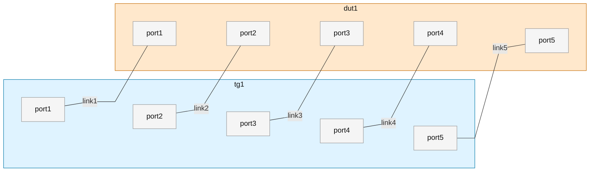

```yaml
metadata:
  version: "0.2"
  topology_id: node2_dut1_tg1_link5
  description: 五链路压测模型，用于性能极限测试。

nodes:
  tg1:
    logic_id: tg1
    node_type: TG
    sub_type: IXIA
    interfaces:
      port1: {link: link1}
      port2: {link: link2}
      port3: {link: link3}
      port4: {link: link4}
      port5: {link: link5}
  dut1:
    logic_id: dut1
    node_type: DUT
    interfaces:
      port1: {link: link1}
      port2: {link: link2}
      port3: {link: link3}
      port4: {link: link4}
      port5: {link: link5}

links:
  link1: {endpoints: [{node: tg1, interface: port1}, {node: dut1, interface: port1}]}
  link2: {endpoints: [{node: tg1, interface: port2}, {node: dut1, interface: port2}]}
  link3: {endpoints: [{node: tg1, interface: port3}, {node: dut1, interface: port3}]}
  link4: {endpoints: [{node: tg1, interface: port4}, {node: dut1, interface: port4}]}
  link5: {endpoints: [{node: tg1, interface: port5}, {node: dut1, interface: port5}]}
```

---

## node3_dut2_tg1_link3

三角拓扑，验证路径转发与基础收敛。

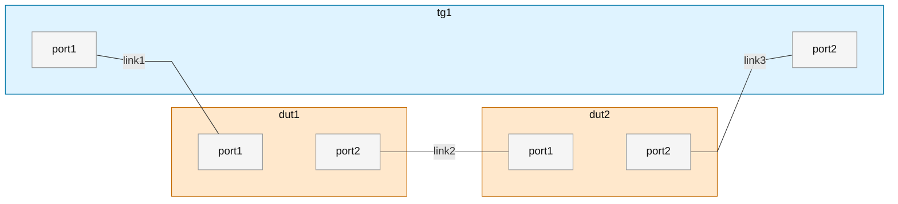

```yaml
metadata:
  version: "0.2"
  topology_id: node3_dut2_tg1_link3
  description: 三角拓扑，验证路径转发与基础收敛。

nodes:
  tg1:
    logic_id: tg1
    node_type: TG
    sub_type: IXIA
    interfaces:
      port1: {link: link1}
      port2: {link: link3}
  dut1:
    logic_id: dut1
    node_type: DUT
    interfaces:
      port1: {link: link1}
      port2: {link: link2}
  dut2:
    logic_id: dut2
    node_type: DUT
    interfaces:
      port1: {link: link2}
      port2: {link: link3}

links:
  link1: {endpoints: [{node: tg1, interface: port1}, {node: dut1, interface: port1}]}
  link2: {endpoints: [{node: dut1, interface: port2}, {node: dut2, interface: port1}]}
  link3: {endpoints: [{node: dut2, interface: port2}, {node: tg1, interface: port2}]}
```

---

## node3_dut2_tg1_link6

双 DUT 多链路互联，测试负载均衡与 HA。

> 源图实际展示 5 条 link。本文按源图重写，不额外补造 `link6`。

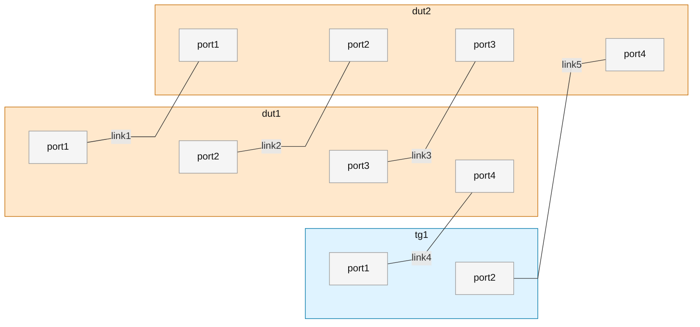

```yaml
metadata:
  version: "0.2"
  topology_id: node3_dut2_tg1_link6
  description: 双 DUT 多链路互联，测试负载均衡与 HA。
  notes:
    - 源图实际展示 5 条 link，topology_id 中的 link6 保留原始命名。

nodes:
  tg1:
    logic_id: tg1
    node_type: TG
    sub_type: IXIA
    interfaces:
      port1: {link: link4}
      port2: {link: link5}
  dut1:
    logic_id: dut1
    node_type: DUT
    interfaces:
      port1: {link: link1}
      port2: {link: link2}
      port3: {link: link3}
      port4: {link: link4}
  dut2:
    logic_id: dut2
    node_type: DUT
    interfaces:
      port1: {link: link1}
      port2: {link: link2}
      port3: {link: link3}
      port4: {link: link5}

links:
  link1: {endpoints: [{node: dut1, interface: port1}, {node: dut2, interface: port1}]}
  link2: {endpoints: [{node: dut1, interface: port2}, {node: dut2, interface: port2}]}
  link3: {endpoints: [{node: dut1, interface: port3}, {node: dut2, interface: port3}]}
  link4: {endpoints: [{node: tg1, interface: port1}, {node: dut1, interface: port4}]}
  link5: {endpoints: [{node: tg1, interface: port2}, {node: dut2, interface: port4}]}
```

---

## node3_dut1_tg1_pppoe_link4

引入 PPPoE Server，验证拨号及接入能力。

> PPPoE Server 按 `Mock` 节点建模，`sub_type: pppoe-server`。

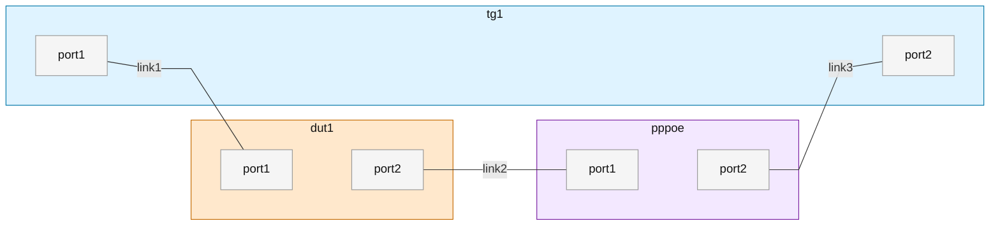

```yaml
metadata:
  version: "0.2"
  topology_id: node3_dut1_tg1_pppoe_link4
  description: 引入 PPPoE Server，验证拨号及接入能力。
  notes:
    - 源图实际展示 3 条 link，topology_id 中的 link4 保留原始命名。

nodes:
  tg1:
    logic_id: tg1
    node_type: TG
    sub_type: IXIA
    interfaces:
      port1: {link: link1}
      port2: {link: link3}
  dut1:
    logic_id: dut1
    node_type: DUT
    interfaces:
      port1: {link: link1}
      port2: {link: link2}
  pppoe:
    logic_id: pppoe
    node_type: Mock
    sub_type: pppoe-server
    role: pppoe-server
    interfaces:
      port1: {link: link2}
      port2: {link: link3}

links:
  link1: {endpoints: [{node: tg1, interface: port1}, {node: dut1, interface: port1}]}
  link2: {endpoints: [{node: dut1, interface: port2}, {node: pppoe, interface: port1}]}
  link3: {endpoints: [{node: pppoe, interface: port2}, {node: tg1, interface: port2}]}
```

---

## node4_dut3_tg1_link7

三 DUT 三角扩展，复杂路径验证。

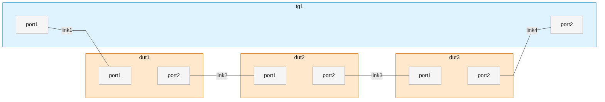

```yaml
metadata:
  version: "0.2"
  topology_id: node4_dut3_tg1_link7
  description: 三 DUT 三角扩展，复杂路径验证。
  notes:
    - 源图实际展示 4 条 link，topology_id 中的 link7 保留原始命名。

nodes:
  tg1:
    logic_id: tg1
    node_type: TG
    sub_type: IXIA
    interfaces:
      port1: {link: link1}
      port2: {link: link4}
  dut1:
    logic_id: dut1
    node_type: DUT
    interfaces:
      port1: {link: link1}
      port2: {link: link2}
  dut2:
    logic_id: dut2
    node_type: DUT
    interfaces:
      port1: {link: link2}
      port2: {link: link3}
  dut3:
    logic_id: dut3
    node_type: DUT
    interfaces:
      port1: {link: link3}
      port2: {link: link4}

links:
  link1: {endpoints: [{node: tg1, interface: port1}, {node: dut1, interface: port1}]}
  link2: {endpoints: [{node: dut1, interface: port2}, {node: dut2, interface: port1}]}
  link3: {endpoints: [{node: dut2, interface: port2}, {node: dut3, interface: port1}]}
  link4: {endpoints: [{node: dut3, interface: port2}, {node: tg1, interface: port2}]}
```

---

## node4_dut2_tg1_sw2_link7

双交换机引入，验证二三层协同。

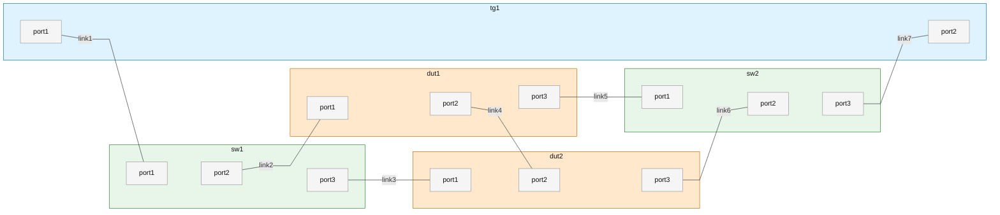

```yaml
metadata:
  version: "0.2"
  topology_id: node4_dut2_tg1_sw2_link7
  description: 双交换机引入，验证二三层协同。

nodes:
  tg1:
    logic_id: tg1
    node_type: TG
    sub_type: IXIA
    interfaces:
      port1: {link: link1}
      port2: {link: link7}
  sw1:
    logic_id: sw1
    node_type: SW
    sub_type: L2
    interfaces:
      port1: {link: link1}
      port2: {link: link2}
      port3: {link: link3}
  dut1:
    logic_id: dut1
    node_type: DUT
    interfaces:
      port1: {link: link2}
      port2: {link: link4}
      port3: {link: link5}
  dut2:
    logic_id: dut2
    node_type: DUT
    interfaces:
      port1: {link: link3}
      port2: {link: link4}
      port3: {link: link6}
  sw2:
    logic_id: sw2
    node_type: SW
    sub_type: L2
    interfaces:
      port1: {link: link5}
      port2: {link: link6}
      port3: {link: link7}

links:
  link1: {endpoints: [{node: tg1, interface: port1}, {node: sw1, interface: port1}]}
  link2: {endpoints: [{node: sw1, interface: port2}, {node: dut1, interface: port1}]}
  link3: {endpoints: [{node: sw1, interface: port3}, {node: dut2, interface: port1}]}
  link4: {endpoints: [{node: dut1, interface: port2}, {node: dut2, interface: port2}]}
  link5: {endpoints: [{node: dut1, interface: port3}, {node: sw2, interface: port1}]}
  link6: {endpoints: [{node: dut2, interface: port3}, {node: sw2, interface: port2}]}
  link7: {endpoints: [{node: sw2, interface: port3}, {node: tg1, interface: port2}]}
```

---

## node4_dut2_tg1_sw1_link6

单交换机接入，OSPF 验证场景。

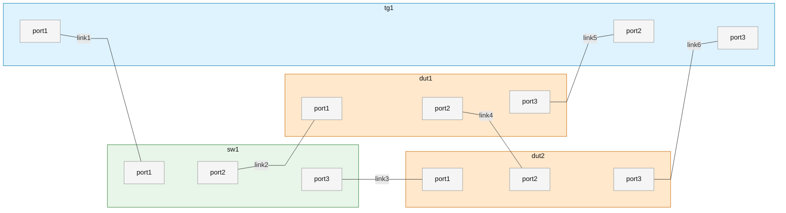

```yaml
metadata:
  version: "0.2"
  topology_id: node4_dut2_tg1_sw1_link6
  description: 单交换机接入，OSPF 验证场景。

nodes:
  tg1:
    logic_id: tg1
    node_type: TG
    sub_type: IXIA
    interfaces:
      port1: {link: link1}
      port2: {link: link5}
      port3: {link: link6}
  sw1:
    logic_id: sw1
    node_type: SW
    sub_type: L2
    interfaces:
      port1: {link: link1}
      port2: {link: link2}
      port3: {link: link3}
  dut1:
    logic_id: dut1
    node_type: DUT
    interfaces:
      port1: {link: link2}
      port2: {link: link4}
      port3: {link: link5}
  dut2:
    logic_id: dut2
    node_type: DUT
    interfaces:
      port1: {link: link3}
      port2: {link: link4}
      port3: {link: link6}

links:
  link1: {endpoints: [{node: tg1, interface: port1}, {node: sw1, interface: port1}]}
  link2: {endpoints: [{node: sw1, interface: port2}, {node: dut1, interface: port1}]}
  link3: {endpoints: [{node: sw1, interface: port3}, {node: dut2, interface: port1}]}
  link4: {endpoints: [{node: dut1, interface: port2}, {node: dut2, interface: port2}]}
  link5: {endpoints: [{node: dut1, interface: port3}, {node: tg1, interface: port2}]}
  link6: {endpoints: [{node: dut2, interface: port3}, {node: tg1, interface: port3}]}
```

---

## node4_dut2_tg1_sw2_link12

双交换机 + 双 DUT + 单 TG，复杂网络稳定性测试。

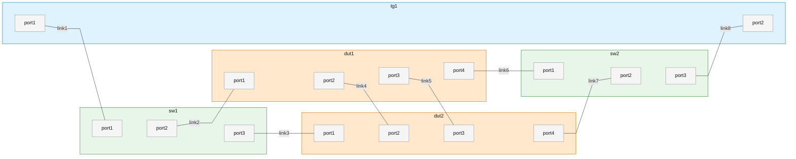

```yaml
metadata:
  version: "0.2"
  topology_id: node4_dut2_tg1_sw2_link12
  description: 双交换机 + 双 DUT + 单 TG，复杂网络稳定性测试。
  notes:
    - 源图实际展示 8 条可明确抽象的 link，topology_id 中的 link12 保留原始命名。

nodes:
  tg1:
    logic_id: tg1
    node_type: TG
    sub_type: IXIA
    interfaces:
      port1: {link: link1}
      port2: {link: link8}
  sw1:
    logic_id: sw1
    node_type: SW
    sub_type: L2
    interfaces:
      port1: {link: link1}
      port2: {link: link2}
      port3: {link: link3}
  dut1:
    logic_id: dut1
    node_type: DUT
    interfaces:
      port1: {link: link2}
      port2: {link: link4}
      port3: {link: link5}
      port4: {link: link6}
  dut2:
    logic_id: dut2
    node_type: DUT
    interfaces:
      port1: {link: link3}
      port2: {link: link4}
      port3: {link: link5}
      port4: {link: link7}
  sw2:
    logic_id: sw2
    node_type: SW
    sub_type: L2
    interfaces:
      port1: {link: link6}
      port2: {link: link7}
      port3: {link: link8}

links:
  link1: {endpoints: [{node: tg1, interface: port1}, {node: sw1, interface: port1}]}
  link2: {endpoints: [{node: sw1, interface: port2}, {node: dut1, interface: port1}]}
  link3: {endpoints: [{node: sw1, interface: port3}, {node: dut2, interface: port1}]}
  link4: {endpoints: [{node: dut1, interface: port2}, {node: dut2, interface: port2}]}
  link5: {endpoints: [{node: dut1, interface: port3}, {node: dut2, interface: port3}]}
  link6: {endpoints: [{node: dut1, interface: port4}, {node: sw2, interface: port1}]}
  link7: {endpoints: [{node: dut2, interface: port4}, {node: sw2, interface: port2}]}
  link8: {endpoints: [{node: sw2, interface: port3}, {node: tg1, interface: port2}]}
```

---

## node5_dut3_tg1_sw1_link6

五节点拓扑，验证复杂网络收敛。

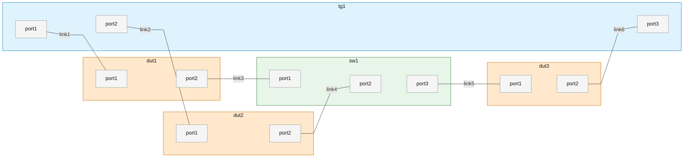

```yaml
metadata:
  version: "0.2"
  topology_id: node5_dut3_tg1_sw1_link6
  description: 五节点拓扑，验证复杂网络收敛。

nodes:
  tg1:
    logic_id: tg1
    node_type: TG
    sub_type: IXIA
    interfaces:
      port1: {link: link1}
      port2: {link: link2}
      port3: {link: link6}
  dut1:
    logic_id: dut1
    node_type: DUT
    interfaces:
      port1: {link: link1}
      port2: {link: link3}
  dut2:
    logic_id: dut2
    node_type: DUT
    interfaces:
      port1: {link: link2}
      port2: {link: link4}
  sw1:
    logic_id: sw1
    node_type: SW
    sub_type: L2
    interfaces:
      port1: {link: link3}
      port2: {link: link4}
      port3: {link: link5}
  dut3:
    logic_id: dut3
    node_type: DUT
    interfaces:
      port1: {link: link5}
      port2: {link: link6}

links:
  link1: {endpoints: [{node: tg1, interface: port1}, {node: dut1, interface: port1}]}
  link2: {endpoints: [{node: tg1, interface: port2}, {node: dut2, interface: port1}]}
  link3: {endpoints: [{node: dut1, interface: port2}, {node: sw1, interface: port1}]}
  link4: {endpoints: [{node: dut2, interface: port2}, {node: sw1, interface: port2}]}
  link5: {endpoints: [{node: sw1, interface: port3}, {node: dut3, interface: port1}]}
  link6: {endpoints: [{node: dut3, interface: port2}, {node: tg1, interface: port3}]}
```

---

## node3_dut1_mock1_link2

链式拓扑，TG 经 DUT 到 Mock 服务，验证基础转发与服务交互。

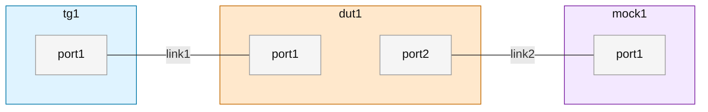

```yaml
metadata:
  version: "0.2"
  topology_id: node3_dut1_mock1_link2
  description: 链式拓扑，TG 经 DUT 到 Mock 服务，验证基础转发与服务交互。

nodes:
  tg1:
    logic_id: tg1
    node_type: TG
    sub_type: IXIA
    interfaces:
      port1: {link: link1}
  dut1:
    logic_id: dut1
    node_type: DUT
    interfaces:
      port1: {link: link1}
      port2: {link: link2}
  mock1:
    logic_id: mock1
    node_type: Mock
    sub_type: generic
    role: mock-server
    interfaces:
      port1: {link: link2}

links:
  link1: {endpoints: [{node: tg1, interface: port1}, {node: dut1, interface: port1}]}
  link2: {endpoints: [{node: dut1, interface: port2}, {node: mock1, interface: port1}]}
```
