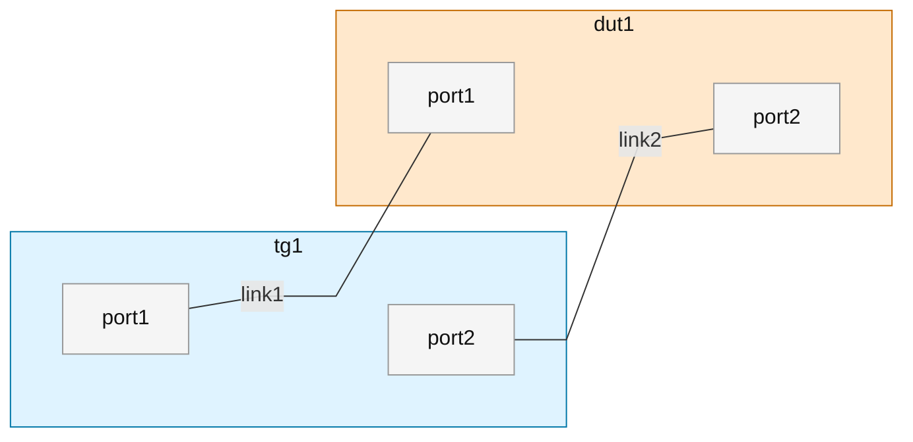
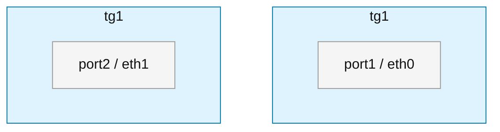
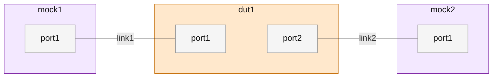

# TGFW 产品测试组网方案和规范

> 版本：v1.0-draft
> 基于：`网络防火墙组网描述方案.md` v0.2
> 最后更新：2026-05-07

---

## 1. 概述

### 1.1 目标

本文档定义 TGFW 产品测试组网的描述方案和设计规范，用于：

- **标准化**：统一测试组网的描述方式，确保文档一致性
- **可读性**：通过 Mermaid 图直观展示组网拓扑
- **可维护性**：通过 YAML 属性描述实现结构化数据管理
- **可扩展性**：支持全场景覆盖（性能、功能、高可用、协议、安全等）

### 1.2 适用范围

| 适用对象 | 说明 |
|----------|------|
| 测试工程师 | 编写和维护测试组网文档 |
| 测试架构师 | 设计测试组网方案 |
| 自动化工具 | 解析 YAML 生成测试配置 |
| 文档评审 | 评审组网设计的合理性和完整性 |

### 1.3 术语定义

| 术语         | 全称                | 说明                           |
| ---------- | ----------------- | ---------------------------- |
| DUT        | Device Under Test | 被测设备，即 TGFW 防火墙              |
| TG         | Traffic Generator | 流量仪，如 IXIA、Spirent           |
| SW         | Switch            | 交换机，二层/三层交换节点                |
| Mock       | Mock Object       | 模拟对象，模拟客户端、服务端或协议端点          |
| link       | Link              | 链路，两个接口之间的点到点网络连接            |
| logic_id   | Logic ID          | 逻辑 ID，YAML 对象的 key 名，用于组网图展示 |
| device_id  | Device ID         | 真实设备映射 ID，用于真实设备、资产映射        |
| chassis_id | Chassis ID        | TG 机箱 ID，用于多机箱场景             |
| board_id   | Board ID          | TG 板卡 ID，用于定位板卡              |
| port_id    | Port ID           | 端口号，TG 接口必选字段                |

---

## 2. 对象模型

### 2.1 对象类型总览

组网由以下对象组成：**device（设备节点）**、**server（服务端）**、**client（客户端）** 和 **link（链路）**。

| 对象 | 类型值 | 用途 | 典型示例 |
|------|--------|------|----------|
| device | `DUT` | 被测设备，网络防火墙、网关等 | c236、TGFW-X86 |
| device | `TG` | 流量仪，测试流量发生与接收设备 | IXIA、Spirent |
| device | `SW` | 交换机，二层/三层交换节点 | L2 交换机、L3 交换机 |
| device | `Mock` | 模拟对象，模拟客户端、服务端或协议端点 | client-host、server-host、pppoe-server |
| server | - | 服务端定义，Mock 节点的服务端点 | http-server、ftp-server |
| client | - | 客户端定义，Mock 节点的客户端 | http-client、ftp-client |
| link | - | 链路，两个接口之间的点到点网络连接 | 物理链路、虚拟链路 |

### 2.2 device（设备节点）

**定义**：组网中的所有设备节点统一为 device 对象，通过 `node_type` 区分类型。

**通用属性**：

| 属性           | 必选  | 说明                                                              |
| ------------ | --- | --------------------------------------------------------------- |
| `logic_id`   | 是   | 逻辑 ID，YAML 对象的 key 名，也是 Mermaid 图中的节点名称（如 `dut1`、`tg1`、`mock1`） |
| `node_type`  | 是   | 设备类型：`DUT`、`TG`、`SW`、`Mock`                                     |
| `sub_type`   | 否   | 设备子类型，如 `c236`、`IXIA`、`L2`、`client-host`                        |
| `device_id`  | 否   | 真实设备映射 ID，用于真实设备、资产映射                                           |
| `version`    | 否   | 软件版本（DUT 常用）                                                    |
| `role`       | 否   | 角色说明，如 `firewall-under-test`、`traffic-generator`                |
| `management` | 否   | 管理面连接信息                                                         |
| `mermaid_fragments` | 否   | Mermaid 拆分子图 ID 列表，仅 TG 允许。当 TG 端口需在 TB 拓扑的首尾分别展示时使用（如 `[tg1__up, tg1__down]`） |
| `interfaces` | 是   | 接口定义                                                            |

**按 node_type 的差异属性**：

| node_type | 差异属性                                 | 说明                                                 |
| --------- | ------------------------------------ | -------------------------------------------------- |
| `DUT`     | `version`                            | 软件版本                                               |
| `TG`      | -                                    | TG 接口采用 `chassis_id` + `board_id` + `port_id` 三级定位 |
| `SW`      | `vendor`、`model`、`vlan_mode`、`vlans` | 交换机特有属性                                            |
| `Mock`    | `servers`、`clients`                  | 服务端/客户端定义                                          |

**备注**：
- `logic_id` 是 YAML 对象的 key 名，也是 Mermaid 图中显示的节点名称
- 组网描述中不强制要求 `device_id` 的准确性
- 测试执行时需要评估 `device_id` 与真实设备的映射正确性
- TG 接口在逻辑组网中 `chassis_id` 和 `board_id` 可以为 `null`，但 `port_id` 不能为空
- **TG 拆分展示**：仅 `node_type: TG` 允许在 Mermaid 中拆分为多个子图。使用双下划线 `__` 连接子图后缀（`tg1__up`、`tg1__down`），与端口名中的单下划线不冲突。拆分后 YAML 仍为一个 node，link endpoints 中的 `node` 引用原始 `logic_id` 不变

### 2.3 server（服务端）

**定义**：Mock 节点的服务端点，用于协议级测试。

**关键属性**：

| 属性 | 必选 | 说明 |
|------|------|------|
| `logic_id` | 是 | 逻辑 ID，YAML 对象的 key 名（如 `http_server1`） |
| `protocol` | 是 | 协议类型：`http`、`ftp`、`tcp`、`udp`、`email`、`custom` |
| `enabled` | 否 | 是否启用，默认 `true` |
| `binding` | 是 | 绑定接口和地址 |
| `options` | 否 | 协议特定选项 |

**binding 属性**：

| 属性 | 必选 | 说明 |
|------|------|------|
| `interface` | 是 | 绑定的接口 ID |
| `address_family` | 否 | 地址族：`ipv4`、`ipv6` |
| `ip` | 是 | 服务监听 IP 地址 |
| `port` | 是 | 服务监听端口 |

### 2.4 client（客户端）

**定义**：Mock 节点的客户端，用于协议级测试。

**关键属性**：

| 属性 | 必选 | 说明 |
|------|------|------|
| `logic_id` | 是 | 逻辑 ID，YAML 对象的 key 名（如 `http_client1`） |
| `protocol` | 是 | 协议类型：`http`、`ftp`、`tcp`、`udp`、`email`、`custom` |
| `enabled` | 否 | 是否启用，默认 `true` |
| `binding` | 是 | 绑定接口和地址 |
| `targets` | 是 | 目标服务引用列表 |
| `options` | 否 | 协议特定选项 |

**binding 属性**：

| 属性 | 必选 | 说明 |
|------|------|------|
| `interface` | 是 | 绑定的接口 ID |
| `address_family` | 否 | 地址族：`ipv4`、`ipv6` |
| `source_ip` | 否 | 源 IP 地址 |
| `source_port` | 否 | 源端口 |

**targets 属性**：

| 属性 | 必选 | 说明 |
|------|------|------|
| `service_ref` | 是 | 目标服务引用，格式：`<mock_id>.servers.<server_id>` |

### 2.5 支持的协议

| 协议 | 说明 |
|------|------|
| `http` | HTTP/HTTPS 协议 |
| `ftp` | FTP 协议 |
| `tcp` | TCP 协议 |
| `udp` | UDP 协议 |
| `email` | SMTP/POP3/IMAP 协议 |
| `custom` | 自定义协议（如 PPPoE、VPN 等） |

### 2.6 management（管理对象）

**定义**：节点的管理面连接信息，用于设备访问和控制。

**属性说明**：

| 属性             | 必选  | value_type              | 说明                     |
| -------------- | --- | ----------------------- | ---------------------- |
| `host`         | 否   | `ip_or_hostname_string` | 管理地址（IPv4、IPv6 或主机名）   |
| `api_server`   | 否   | `ip_or_hostname_string` | TG API 服务地址            |
| `port`         | 否   | `integer`               | 管理端口（1-65535）          |
| `chassis`      | 否   | `string`                | TG 多机箱标识               |
| `username`     | 否   | `string`                | 登录用户名                  |
| `password`     | 否   | `string`                | 登录密码（建议使用占位符或密钥引用）     |
| `web_username` | 否   | `string`                | Web 管理用户名              |
| `web_password` | 否   | `string`                | Web 管理密码（建议使用占位符或密钥引用） |

**凭据安全规则**：
- 文档和入库 YAML 不应保存真实密码
- `password` / `web_password` 建议使用占位符、环境变量引用或密钥引用，例如 `${TG_PASSWORD}`、`secret://<INTERNAL_GIT_PATH>`

### 2.7 interfaces（接口对象）

**定义**：节点的网络接口集合，key 为接口 ID（统一使用 `port<N>` 命名）。

**接口属性说明**：

| 属性                 | 必选  | value_type                                  | 说明                                                               |
| ------------------ | --- | ------------------------------------------- | ---------------------------------------------------------------- |
| `logic_id`         | 否   | `string`                                    | 逻辑 ID，YAML 对象的 key 名，也是 Mermaid 图中 port 的名称。默认等于对象 key，通常不需要显式填写 |
| `chassis_id`       | 否   | `nullable<string>`                          | TG 机箱 ID，无机箱时为 `null`                                            |
| `board_id`         | 否   | `nullable<integer>`                         | TG 板卡 ID，无板卡时为 `null`                                            |
| `port_id`          | 否   | `nullable<integer_or_string>`               | 端口号，TG 接口用于物理定位                                                  |
| `speed_class`      | 否   | `enum_string<GE,TE,XTE,TTE,unknown>`        | 接口速率类别                                                           |
| `media_type`       | 否   | `enum_string<copper,fiber,virtual,unknown>` | 接口介质类型                                                           |
| `default_ip`       | 否   | `ipv4_cidr_string`                          | 默认 IPv4 地址                                                       |
| `default_ipv6`     | 否   | `nullable<ipv6_cidr_string>`                | 默认 IPv6 地址                                                       |
| `mac_address`      | 否   | `nullable<mac_string>`                      | MAC 地址                                                           |
| `parent_interface` | 否   | `ref_id`                                    | 父接口 ID（子接口场景）                                                    |
| `lag_group`        | 否   | `string`                                    | LAG/Bond/Port-Channel 归属                                         |
| `vrf`              | 否   | `string`                                    | VRF 名称                                                           |
| `link`             | 是   | `ref_id`                                    | 接入的链路对象 ID                                                       |

**接口设计规则**：
- 接口是节点（DUT/TG/SW/Mock）的子对象，在 Mermaid 图中作为子图展示
- `logic_id` 就是 YAML 对象的 key 名（如 `port1`、`port2`），也是 Mermaid 图中显示的端口名称
- 接口不需要 `device_id`，因为它是挂在 DUT 或 TG 下的子图
- TG 接口可通过 `chassis_id` + `board_id` + `port_id` 进行物理定位，在逻辑组网中这些字段可以为 `null`

### 2.8 link（链路）

**定义**：两个接口之间的点到点网络连接。

**关键属性**：

| 属性 | 必选 | 说明 |
|------|------|------|
| `name` | 是 | 链路名称 |
| `media_type` | 否 | 介质类型，如 `copper`、`fiber`、`virtual` |
| `mode` | 否 | 链路模式，如 `access`、`trunk`、`routed` |
| `endpoints` | 是 | 端点定义（固定 2 个） |
| `network` | 否 | 网络属性（IPv4/IPv6 网段、VLAN） |
| `description` | 否 | 简短说明 |

**建模规则**：
- link 必须是点到点的，不支持多端共享介质
- 多端共享介质通过 SW 节点加多条 link 表达
- 每条 link 使用独立子网（推荐）

---

## 3. 描述规则

### 3.1 整体结构

每个测试组网由两部分组成：

1. **Markdown + Mermaid**：展示组网拓扑图
2. **YAML**：描述对象属性、接口属性和链路属性

```markdown
## <topology_id>

<Mermaid 图>

<YAML 属性描述>
```

### 3.2 Mermaid 图规则

#### 3.2.1 图形只表达连接关系

**Mermaid 图只放以下信息**：

| 信息类型        | 示例                                    |
| ----------- | ------------------------------------- |
| 测试对象 ID     | `tg1`、`dut1`、`sw1`、`mock1`            |
| 接口 logic_id | `port1`、`port2`（作为设备节点的子图）           |

**Mermaid 图不放以下信息**：

| 信息类型 | 说明 |
|----------|------|
| 登录账号、密码 | 安全敏感信息 |
| 管理地址 | 管理面信息 |
| 软件版本、设备型号 | 设备细节 |
| 设备类型文字 | 如 `TG`、`DUT`、`SW`、`Mock` |
| 测试目的、测试步骤、预期结果 | 测试逻辑 |
| IP、MAC、VLAN | 网络属性 |

#### 3.2.2 节点样式定义

```mermaid
%%{init: {'flowchart': {'curve': 'linear', 'nodeSpacing': 60, 'rankSpacing': 80}}}%%
flowchart LR
    classDef dut fill:#ffe8cc,stroke:#c46a00,stroke-width:1px,color:#111;
    classDef tg fill:#dff3ff,stroke:#0077a8,stroke-width:1px,color:#111;
    classDef sw fill:#e8f5e9,stroke:#2e7d32,stroke-width:1px,color:#111;
    classDef mock fill:#f3e8ff,stroke:#7b1fa2,stroke-width:1px,color:#111;
```

**节点类型与颜色对照表**：

| 节点类型 | classDef | 颜色说明 |
|----------|----------|----------|
| DUT | `dut` | 浅橙色 |
| TG | `tg` | 浅蓝色 |
| SW | `sw` | 浅绿色 |
| Mock | `mock` | 浅紫色 |

#### 3.2.3 节点和边的写法

**设备节点（含子图接口）**：

所有设备节点使用子图展示接口，接口的 `logic_id` 作为子图内的节点 ID。子图内部使用 `~~~` 隐形链接保证接口顺序不被 Mermaid 重排：

```mermaid
subgraph tg1["tg1"]
    tg1_port1["port1"]:::port
    tg1_port1 ~~~ tg1_port2
    tg1_port2["port2"]:::port
end
style tg1 fill:#dff3ff,stroke:#0077a8,stroke-width:1px,color:#111

subgraph dut1["dut1"]
    dut1_port1["port1"]:::port
    dut1_port1 ~~~ dut1_port2
    dut1_port2["port2"]:::port
end
style dut1 fill:#ffe8cc,stroke:#c46a00,stroke-width:1px,color:#111
```

**连接边**：

两个 port 之间直接用线连接，边标签写链路 ID：

```mermaid
tg1_port1 -- "link1" --- dut1_port1
tg1_port2 -- "link2" --- dut1_port2
```

**完整示例**：



#### 3.2.4 整齐度要求

| 规则 | 说明 |
|------|------|
| 固定方向 | 简单直连拓扑使用 `flowchart LR`，上下层级拓扑使用 `flowchart TB` |
| 直连 port | 两个 port 之间直接用线连接，不插入中间节点 |
| 平行链路分行 | 多条平行链路每条独立成行，避免链式堆叠 |
| 标签简短 | 边标签只写链路 ID，例如 `link1`、`link2` |
| 类型着色 | DUT、TG、SW、Mock 使用不同 `classDef` 区分 |
| ID 稳定 | 图中的子图 ID 必须与 YAML 中的 `logic_id` 一致。**例外**：TG 拆分时子图 ID 使用 `{logic_id}__{suffix}` 格式（如 `tg1__up`），子图 label 仍写 `logic_id` |

#### 3.2.5 TG 拆分展示（可选）

当使用 `flowchart TB` 且同一台 TG 的端口需要出现在拓扑的首尾两端时，可将 TG 拆分为多个子图展示。

**限制**：
- **仅 `node_type: TG` 允许拆分**，DUT、SW、Mock 不允许
- YAML 中仍为一个设备节点，所有 port 集中描述
- 拆分后 link endpoints 中的 `node` 仍引用原始 `logic_id`

**命名规则**：

| 元素 | 规则 | 示例 |
|------|------|------|
| Mermaid 子图 ID | `{logic_id}__{suffix}`，双下划线分隔 | `tg1__up`、`tg1__down` |
| Mermaid 子图 label | 写 `logic_id`，两个子图 label 相同 | `"tg1"` |
| Mermaid port ID | `{logic_id}_port<N>`，与 YAML key 一致 | `tg1_port1`、`tg1_port2` |

**YAML 标记**：

```yaml
nodes:
  tg1:
    logic_id: tg1
    node_type: TG
    mermaid_fragments: [tg1__up, tg1__down]   # 列出 Mermaid 中的拆分子图 ID
    interfaces:
      port1: {port_id: eth0, link: link1}     # 展示在 tg1__up
      port2: {port_id: eth1, link: link9}     # 展示在 tg1__down
```

**Mermaid 示例**：



**双下划线 `__` 的作用**：端口名如 `GE0_1` 使用单下划线，`__` 是明确的分隔符，解析时不会与端口名中的单下划线混淆。

### 3.3 YAML 属性规则

#### 3.3.1 顶层结构

```yaml
---
metadata:
  version: "0.2"
  topology_id: <topology_id>
  description: <short_description>

nodes:
  <node_id>: {}

links:
  <link_id>: {}

# optional extension
connections:
  <connection_id>: {}
```

#### 3.3.2 ID 设计原则

**设计原则**：

| ID 类型 | 用途 | 示例 | 适用对象 |
|---------|------|------|----------|
| `logic_id` | 组网图展示和拓扑引用 | `dut1`、`port1` | 所有对象（节点、接口、链路） |
| `device_id` | 真实设备、资产映射 | `tgfw-lab-01` | 节点对象（DUT、TG、SW、Mock） |
| `chassis_id` + `board_id` + `port_id` | TG 物理接口定位 | `null` + `2` + `99` | TG 接口 |

**规则**：
- `logic_id` 就是 YAML 对象的 key 名，用于 Mermaid 展示和拓扑引用
- Mermaid 图只展示 `logic_id`，不展示 `device_id` 或物理定位信息
- 接口对象不需要 `device_id`，因为它是节点的子对象
- 测试执行时需要评估 `device_id` 与真实设备的映射正确性

#### 3.3.3 数据类型命名

| value_type | 说明 | 示例 |
|------------|------|------|
| `string` | 普通字符串 | `"tg1"` |
| `enum_string<T>` | 枚举字符串 | `enum_string<DUT,TG,SW,Mock>` |
| `integer` | 整数 | `22` |
| `boolean` | 布尔值 | `true` |
| `ref_id` | 对象 ID 引用 | `link1` |
| `ipv4_cidr_string` | IPv4 CIDR | `"<IP_ADDRESS>/24"` |
| `ipv6_cidr_string` | IPv6 CIDR | `"2001:0:0:1::/64"` |
| `mac_string` | MAC 地址 | `"fa:cc:92:a3:5b:01"` |
| `object` | YAML 对象 | `management: {...}` |
| `map<object>` | 对象映射 | `interfaces: {port1: {...}}` |
| `list<object>` | 对象列表 | `endpoints: [{...}, {...}]` |
| `nullable<T>` | 可空类型 | `nullable<integer>` |

### 3.4 命名规范

#### 3.4.1 topology_id 命名规则

**格式**：`node<N>_<dut_count>dut<id>_tg<id>[_sw<id>][_<protocol>]_link<count>`

**示例**：

| topology_id | 说明 |
|-------------|------|
| `node2_dut1_tg1_link2` | 2 节点，1 DUT，1 TG，2 条链路 |
| `node3_dut2_tg1_link3` | 3 节点，2 DUT，1 TG，3 条链路 |
| `node4_dut2_tg1_sw1_link6` | 4 节点，2 DUT，1 TG，1 SW，6 条链路 |
| `node3_dut1_tg1_pppoe_link4` | 3 节点，1 DUT，1 TG，PPPoE 场景，4 条链路 |

#### 3.4.2 节点 ID 命名规则

| 节点类型 | 格式 | 示例 |
|----------|------|------|
| DUT | `dut<N>` | `dut1`、`dut2` |
| TG | `tg<N>` | `tg1`、`tg2` |
| SW | `sw<N>` | `sw1`、`sw2` |
| Mock | `mock<N>` | `mock1`、`mock2` |

#### 3.4.3 接口 ID 命名规则

所有设备节点的接口统一使用 `port<N>` 命名：

| 节点类型 | 格式 | 示例 |
|----------|------|------|
| DUT | `port<N>` | `port1`、`port2` |
| TG | `port<N>` | `port1`、`port2` |
| SW | `port<N>` | `port1`、`port2`、`port3` |
| Mock | `port<N>` | `port1`、`port2` |

#### 3.4.4 link ID 命名规则

**格式**：`link<序号>` 或 `link_<nodeA>_<nodeB>`

**示例**：

| link ID | 说明 |
|---------|------|
| `link1`、`link2` | 简单序号命名 |
| `link_tg1_dut1` | 连接 tg1 和 dut1 的链路 |
| `link_mock1_sw1` | 连接 mock1 和 sw1 的链路 |

---

## 4. 组网分类

### 4.1 按节点数量分类

| 分类 | 节点数 | 典型场景 |
|------|--------|----------|
| node2 | 2 | 基础性能测试、简单功能验证 |
| node3 | 3 | 路径转发、多 DUT 测试 |
| node4 | 4 | 复杂拓扑、交换机引入 |
| node5+ | 5+ | 大规模组网、高可用测试 |

### 4.2 按拓扑类型分类

| 分类 | 说明 | 典型场景 |
|------|------|----------|
| 直连 | TG 与 DUT 直接连接 | 基础性能测试 |
| 交换机引入 | 通过 SW 扩展拓扑 | 二三层协同测试 |
| 三角拓扑 | 多 DUT 互联 | 路径转发、收敛测试 |
| 链式拓扑 | 多设备串联 | 端到端测试 |
| 环形拓扑 | 设备环形互联 | 冗余、高可用测试 |

### 4.3 按测试场景分类

| 分类 | 说明 | 优先级 |
|------|------|--------|
| 性能测试 | 吞吐、延迟、并发连接数 | P0 |
| 功能测试 | 安全策略、NAT、路由 | P0 |
| 协议测试 | HTTP、TCP、UDP、PPPoE | P0 |
| 高可用测试 | 主备、主主、集群 | P1 |
| 安全测试 | 入侵防御、防病毒、URL 过滤 | P1 |
| VPN 测试 | IPSec、SSL VPN | P1 |
| IPv6 测试 | IPv6 环境、双栈 | P2 |

---

## 5. 组网设计指南

### 5.1 基础组网设计

#### 5.1.1 最小可用组网

**场景**：基础性能测试、简单功能验证

**拓扑**：TG ↔ DUT（双链路直连）

**示例**：


**YAML 结构**：

```yaml
metadata:
  version: "0.2"
  topology_id: node2_dut1_tg1_link2
  description: TG 与 DUT 双链路直连，基础性能模型

nodes:
  tg1:
    logic_id: tg1
    node_type: TG
    sub_type: IXIA
    interfaces:
      port1: {link: link1}
      port2: {link: link2}
  dut1:
    logic_id: dut1
    node_type: DUT
    interfaces:
      port1: {link: link1}
      port2: {link: link2}

links:
  link1:
    endpoints:
      - {node: tg1, interface: port1}
      - {node: dut1, interface: port1}
  link2:
    endpoints:
      - {node: tg1, interface: port2}
      - {node: dut1, interface: port2}
```

#### 5.1.2 Mock 分离组网

**场景**：协议级测试、客户端/服务端分离

**拓扑**：Mock(client) ↔ DUT ↔ Mock(server)

**示例**：



**YAML 结构**：

```yaml
metadata:
  version: "0.2"
  topology_id: node3_mock1_dut1_mock2_link2
  description: 客户端/服务端分离，协议级测试

nodes:
  mock1:
    logic_id: mock1
    node_type: Mock
    sub_type: client-host
    interfaces:
      port1: {link: link1}
    clients:
      http_client1:
        logic_id: http_client1
        protocol: http
        binding:
          interface: port1
          source_ip: "<IP_ADDRESS>"
        targets:
          - service_ref: mock2.servers.http_server1

  dut1:
    logic_id: dut1
    node_type: DUT
    interfaces:
      port1: {link: link1}
      port2: {link: link2}

  mock2:
    logic_id: mock2
    node_type: Mock
    sub_type: server-host
    interfaces:
      port1: {link: link2}
    servers:
      http_server1:
        logic_id: http_server1
        protocol: http
        binding:
          interface: port1
          ip: "<IP_ADDRESS>"
          port: 80

links:
  link1:
    endpoints:
      - {node: mock1, interface: port1}
      - {node: dut1, interface: port1}
    network:
      ipv4: "<IP_ADDRESS>/24"
  link2:
    endpoints:
      - {node: dut1, interface: port2}
      - {node: mock2, interface: port1}
    network:
      ipv4: "<IP_ADDRESS>/24"
```

### 5.2 高可用组网设计

#### 5.2.1 主备模式

**场景**：防火墙主备高可用测试

**拓扑**：TG ↔ SW ↔ DUT(主) + DUT(备) ↔ SW ↔ TG

**待补充**：HA 组网建模方式

#### 5.2.2 主主模式

**场景**：防火墙主主负载均衡测试

**待补充**

### 5.3 复杂场景组网设计

#### 5.3.1 VPN 组网

**场景**：IPSec/SSL VPN 测试

**待补充**

#### 5.3.2 NAT 组网

**场景**：SNAT/DNAT 测试

**待补充**

#### 5.3.3 多区域组网

**场景**：DMZ、Trust、Untrust 多区域测试

**待补充**

---

## 6. 完整示例

### 6.1 示例 1：基础性能测试组网

**topology_id**: `node2_dut1_tg1_link2`

**说明**：TG 与 DUT 双链路直连，用于吞吐、延迟、并发连接数等基础性能测试。

**Mermaid 图**：


**YAML**：

```yaml
---
metadata:
  version: "0.2"
  topology_id: node2_dut1_tg1_link2
  description: TG 与 DUT 双链路直连，基础性能模型

nodes:
  tg1:
    logic_id: tg1
    device_id: null
    node_type: TG
    sub_type: IXIA
    role: traffic-generator
    management:
      host: "<IP_ADDRESS>"
      api_server: "127.0.0.1"
      port: 22
      username: "<username>"
      password: "<password>"
    interfaces:
      port1:
        chassis_id: null
        board_id: 2
        port_id: 99
        speed_class: GE
        media_type: copper
        default_ip: "3.3.7.5/24"
        default_ipv6: "2001:0:0:1::2/64"
        mac_address: "fa:cc:92:a3:5b:01"
        link: link1
      port2:
        chassis_id: null
        board_id: 2
        port_id: 100
        speed_class: GE
        media_type: copper
        default_ip: "3.3.8.5/24"
        default_ipv6: "2001:0:0:2::2/64"
        mac_address: "fa:cc:92:a3:7b:01"
        link: link2

  dut1:
    logic_id: dut1
    device_id: tgfw-lab-01
    node_type: DUT
    sub_type: c236
    version: v60r001c00spc201
    role: firewall-under-test
    management:
      host: "<IP_ADDRESS>"
      port: 22
      username: "<username>"
      password: "<password>"
      web_username: "<web_username>"
      web_password: "<web_password>"
    interfaces:
      port1:
        speed_class: GE
        media_type: copper
        default_ip: "3.3.7.4/24"
        default_ipv6: "2001:0:0:1::1/64"
        mac_address: "c0:ea:c3:20:71:da"
        link: link1
      port2:
        speed_class: GE
        media_type: copper
        default_ip: "3.3.8.4/24"
        default_ipv6: "2001:0:0:2::1/64"
        mac_address: "c0:ea:c3:20:71:db"
        link: link2

links:
  link1:
    name: link1
    media_type: copper
    mode: routed
    endpoints:
      - node: tg1
        interface: port1
      - node: dut1
        interface: port1
    network:
      ipv4: "3.3.7.0/24"
      ipv6: "2001:0:0:1::/64"
      vlan: null
    description: tg1.port1 到 dut1.port1 的直连链路

  link2:
    name: link2
    media_type: copper
    mode: routed
    endpoints:
      - node: tg1
        interface: port2
      - node: dut1
        interface: port2
    network:
      ipv4: "3.3.8.0/24"
      ipv6: "2001:0:0:2::/64"
      vlan: null
    description: tg1.port2 到 dut1.port2 的直连链路
```

### 6.2 示例 2：HTTP 协议测试组网

**topology_id**: `node3_mock1_dut1_mock2_link2`

**说明**：客户端/服务端分离，用于 HTTP 协议级测试。

**Mermaid 图**：


**YAML**：

```yaml
---
metadata:
  version: "0.2"
  topology_id: node3_mock1_dut1_mock2_link2
  description: 客户端/服务端分离，HTTP 协议测试

nodes:
  mock1:
    logic_id: mock1
    device_id: mock1
    node_type: Mock
    sub_type: client-host
    role: client-host
    interfaces:
      port1:
        speed_class: unknown
        media_type: virtual
        default_ip: "<IP_ADDRESS>/24"
        default_ipv6: null
        mac_address: null
        link: link1
    clients:
      http_client1:
        logic_id: http_client1
        name: http_client1
        protocol: http
        enabled: true
        binding:
          interface: port1
          address_family: ipv4
          source_ip: "<IP_ADDRESS>"
          source_port: null
        targets:
          - service_ref: mock2.servers.http_server1
        options:
          method: GET
          path: "/health"

  dut1:
    logic_id: dut1
    device_id: tgfw-lab-01
    node_type: DUT
    sub_type: c236
    role: firewall-under-test
    interfaces:
      port1:
        speed_class: GE
        media_type: copper
        default_ip: "<IP_ADDRESS>/24"
        default_ipv6: null
        mac_address: null
        link: link1
      port2:
        speed_class: GE
        media_type: copper
        default_ip: "<IP_ADDRESS>/24"
        default_ipv6: null
        mac_address: null
        link: link2

  mock2:
    logic_id: mock2
    device_id: mock2
    node_type: Mock
    sub_type: server-host
    role: server-host
    interfaces:
      port1:
        speed_class: unknown
        media_type: virtual
        default_ip: "<IP_ADDRESS>/24"
        default_ipv6: null
        mac_address: null
        link: link2
    servers:
      http_server1:
        logic_id: http_server1
        name: http_server1
        protocol: http
        enabled: true
        binding:
          interface: port1
          address_family: ipv4
          ip: "<IP_ADDRESS>"
          port: 80
        options:
          tls: false
          path: "/"

links:
  link1:
    name: link1
    media_type: virtual
    mode: routed
    endpoints:
      - node: mock1
        interface: port1
      - node: dut1
        interface: port1
    network:
      ipv4: "<IP_ADDRESS>/24"
      ipv6: null
      vlan: null

  link2:
    name: link2
    media_type: virtual
    mode: routed
    endpoints:
      - node: dut1
        interface: port2
      - node: mock2
        interface: port1
    network:
      ipv4: "<IP_ADDRESS>/24"
      ipv6: null
      vlan: null
```

---

## 7. 待办事项

| 序号 | 事项 | 优先级 | 状态 |
|------|------|--------|------|
| 1 | 补充 HA 组网设计（主备、主主） | P0 | 待完成 |
| 2 | 补充 VPN 组网设计（IPSec、SSL VPN） | P0 | 待完成 |
| 3 | 补充 NAT 组网设计（SNAT、DNAT） | P1 | 待完成 |
| 4 | 补充多区域组网设计（DMZ、Trust、Untrust） | P1 | 待完成 |
| 5 | 补充 IPv6/双栈组网设计 | P2 | 待完成 |
| 6 | 补充集群组网设计 | P2 | 待完成 |
| 7 | 完善组网命名规范 | P1 | 待完成 |
| 8 | 完善组网分类体系 | P1 | 待完成 |

---

## 8. 参考资料

| 资源 | 说明 |
|------|------|
| `网络防火墙组网描述方案.md` | 组网描述方案 v0.2，本文档的基础 |
| `TGFW测试组网图集合.md` | 已有的测试组网图集合 |
| `network-firewall-topology-schema-v0.2.md` | Schema v0.2 定义文档 |

---

*本文档为 TGFW 产品测试组网方案和规范的初稿，待评审和完善。最后更新于 2026-05-07。*
