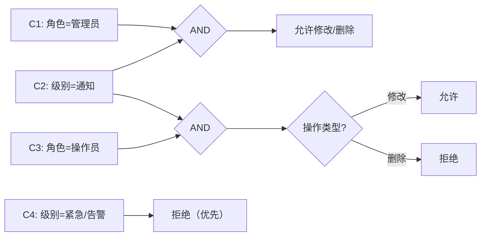

## 目标

对设计计划中 PPDCS 特征为 **P-Parameter** 的逻辑用例，执行五步设计过程，
提取参数规则→约束提取+规则组合矩阵→判定表→LC→规则触发参数组→输出物理用例。

## 理论基础

P-Parameter 是 PPDCS 五特征之一：
> 被测功能的输入参数参与业务规则判定，参数间存在关联关系，
> 不同参数组合导致不同的处理结果。

**识别条件**：需求描述中包含"当...且...则..."、"如果...则...否则..."
等条件-结果逻辑，且规则是确定性的（非概率）。

**关键区分**：
- P-Parameter vs D-Data — 参数间有规则关系？有 = Parameter，无/独立 = Data
- P-Parameter vs C-Combination — 规则确定？确定判定 = Parameter，需组合探索 = Combination
- P-Parameter vs P-Process — 是条件判定还是步骤流程？条件 = Parameter，步骤 = Process

**建模工具**：判定表（Decision Table）/ 因果图（Cause-Effect Graph）/ 决策树（Decision Tree）

## 适用范围

- 适用阶段：MFQ 的 design 阶段
- 输入：`.output/integration/design-plan.md`（PPDCS=P-Parameter 的 LC）
- 输出：`.output/design/<module>/<sub-module>/` 目录下的设计文件

## 前置条件

- [ ] 设计计划已确认
- [ ] 当前逻辑用例的 PPDCS 特征为 P-Parameter

## 五步用例设计过程

读取 `test-point-integrator` 输出的逻辑用例（含因子-取值表和动作路径），执行以下五步：

### 第一步：测试数据（因子-取值表补全）

从整合阶段的因子-取值表出发，补充因子类型和等价类分类：

```markdown
| 因子 | 取值 | 类型 | 等价类 |
|------|------|------|--------|
| 用户角色 | 管理员 | 参数 | 有效 |
| 用户角色 | 操作员 | 参数 | 有效 |
| 用户角色 | 审计员 | 参数 | 有效 |
| 操作类型 | 查看 | 参数 | 有效 |
| 操作类型 | 修改 | 参数 | 有效 |
| 操作类型 | 删除 | 参数 | 有效 |
| 日志级别 | 紧急/告警 | 参数 | 有效（受保护） |
| 日志级别 | 通知/调试 | 参数 | 有效（不受保护） |
```

### 第二步：约束提取+规则组合

**P-Parameter 的核心分析：提取参数约束关系，构建规则组合矩阵**

#### 2.1 约束类型提取

分析因子间的约束关系，按以下类型分类：

| 约束类型 | 含义 | 表示方式 |
|---------|------|---------|
| **互斥（Mutex）** | A=x 时 B 不能=y | IF A=x THEN B≠y |
| **包含（Include）** | A=x 则必须有 B=y | IF A=x THEN B=y |
| **蕴含（Imply）** | A=x 且 B=y → 结论 | IF A=x AND B=y THEN result |
| **与（AND）** | 条件同时成立 | C1 AND C2 → 动作 |
| **或（OR）** | 任一条件成立 | C1 OR C2 → 动作 |

**本用例约束提取**：

```
约束列表：
C-MUTEX-01: 日志级别=紧急/告警 → 不可执行修改/删除操作（无论角色）
C-IMPLY-01: 用户角色=审计员 AND 操作类型=修改/删除 → 拒绝
C-IMPLY-02: 用户角色=操作员 AND 操作类型=删除 → 拒绝
C-IMPLY-03: 用户角色=管理员 AND 日志级别=通知 → 所有操作允许
```

#### 2.2 规则组合矩阵

基于约束提取，构建规则组合矩阵（行=规则ID，列=条件取值，最后列=动作结果）：

| 规则ID | 用户角色 | 操作类型 | 日志级别 | 动作结果 |
|--------|---------|---------|---------|---------|
| R1 | 管理员 | 修改 | 通知 | **允许** |
| R2 | 管理员 | 删除 | 通知 | **允许** |
| R3 | 操作员 | 修改 | 通知 | **允许** |
| R4 | 操作员 | 删除 | 通知 | **拒绝**（权限不足） |
| R5 | 审计员 | 修改/删除 | — | **拒绝**（权限不足） |
| R6 | 任意 | 查看 | — | **允许** |
| R7 | 任意 | 修改/删除 | 紧急/告警 | **拒绝**（日志保护） |

#### 2.3 冗余规则合并

相同动作结果且条件可覆盖的规则应合并，减少冗余用例：

```
合并判断：
- R1（管理员修改通知）和 R2（管理员删除通知）可合并为"管理员×通知级别→允许所有写操作"
- R7 的优先级高于 R1/R2/R3（日志保护规则优先于角色规则）→ 不合并，需单独覆盖
- R5 和 R4 都是"拒绝"，但条件不同（角色不同）→ 不合并
```

#### 2.4 因果图（可选路径）

当逻辑依赖关系复杂（嵌套条件 > 2层、条件间有传递关系）时，可先绘制因果图再转换为规则矩阵：



**P-Parameter 的操作动作通常相同**（无论参数取什么值，操作流程一致，只是结果不同），通常为 1 条路径：

```
路径 P1（唯一路径）：
1. 使用指定角色账号登录
2. 选择目标日志条目
3. 执行指定操作（查看/修改/删除）
4. 观测系统响应
```

若存在多个完全不同的交互模式（如有/无界面的情形），则枚举多条路径，但通常不超过 2 条。

### 第三步：数据组合分析（判定表约束为主）

**P-Parameter 的核心：建立判定表，分析规则约束**

**业务规则提取**：

```
R1: 用户角色=管理员 → 可执行所有操作（查看/修改/删除）
R2: 用户角色=操作员 → 可查看/修改，不可删除
R3: 用户角色=审计员 → 仅可查看
R4: 日志级别=紧急/告警 → 不可修改/删除（无论角色，此规则优先级高于R1/R2）
```

**判定表**（条件组合 × 动作结果）：

| 条件/动作 | 规则1 | 规则2 | 规则3 | 规则4 | 规则5 | 规则6 |
|-----------|-------|-------|-------|-------|-------|-------|
| 用户角色 | 管理员 | 管理员 | 操作员 | 操作员 | 审计员 | 任意 |
| 操作类型 | 修改 | 删除 | 修改 | 删除 | 修改/删除 | 查看 |
| 日志级别 | 通知 | 通知 | 通知 | 通知 | — | — |
| **操作结果** | **成功** | **成功** | **成功** | **失败（权限不足）** | **失败（权限不足）** | **成功** |

**约束规则**（IF...THEN...格式）：

```
IF 日志级别=紧急/告警 → 预期结果=失败（日志保护），与角色无关
IF 用户角色=审计员 AND 操作类型=修改/删除 → 预期结果=失败（权限不足）
IF 用户角色=操作员 AND 操作类型=删除 → 预期结果=失败（权限不足）
其余组合 → 预期结果=成功
```

**全量组合结果**（约束过滤后）：

| 组合编号 | 用户角色 | 操作类型 | 日志级别 | 预期结果 | 备注 |
|---------|---------|---------|---------|---------|------|
| C-01 | 管理员 | 修改 | 通知 | 成功 | 正常路径 |
| C-02 | 管理员 | 删除 | 通知 | 成功 | 正常路径 |
| C-03 | 操作员 | 修改 | 通知 | 成功 | 正常路径 |
| C-04 | 操作员 | 删除 | 通知 | 失败 | 权限不足 |
| C-05 | 审计员 | 查看 | 任意 | 成功 | 仅查看 |
| C-06 | 管理员 | 修改 | 紧急 | 失败 | 日志保护（R4优先） |

### 第四步：规则触发参数组分配

**为每条规则分配实际参数取值**：判定表确定了"哪些条件组合触发哪个结果"，本步骤为每条规则分配可执行的参数值（有效值+边界值+无效值）。

```
分配原则：
1. 有效参数值：选取满足该规则条件的典型代表值
2. 边界参数值：选取规则条件边界（如 "日志级别=告警" 是 "紧急/告警" 类的边界）
3. 无效参数值：验证规则拒绝动作时，使用最能体现拒绝原因的参数值
4. Don't Care 条件：从最典型值/最常用值中选一个
```

**规则触发参数组分配表**：

| 规则ID | 用户角色（实际值） | 操作类型（实际值） | 日志级别（实际值） | 动作结果 |
|--------|----------------|----------------|----------------|---------|
| R1 | admin（管理员账号） | 修改日志描述字段 | 通知级别日志（级别=INFO） | **允许** |
| R2 | admin | 删除日志条目 | 通知级别日志 | **允许** |
| R3 | operator（操作员账号） | 修改日志描述字段 | 通知级别日志 | **允许** |
| R4 | operator | 删除日志条目 | 通知级别日志 | **拒绝**（403 权限不足） |
| R5 | auditor（审计员账号） | 修改日志描述字段 | 任意级别 | **拒绝**（403 权限不足） |
| R6 | admin | 查看日志详情 | 任意级别 | **允许** |
| R7 | admin | 修改日志描述 | 紧急级别日志（级别=CRITICAL） | **拒绝**（日志保护 423） |

**覆盖策略决策**：

| 特性类型 | 策略 |
|---------|------|
| 安全/权限类（高风险） | **全组合**：判定表每条规则 × 路径 |
| 普通参数配置 | **BA组合**：有效等价类合并，无效独立 |
| 简单参数验证 | **典型值** |

**本用例决策**：全组合（权限安全相关）

```
最终用例集 = R1~R7（判定表所有规则均需覆盖）
决策理由：权限规则验证不能遗漏，每条规则对应一条物理用例
```

### 第五步：物理用例输出

```markdown
| 三级目录 | 四级目录 | 五级目录 | 用例名称* | 用例编号 | 用例级别* | 组网描述* | 组网约束 | 预置条件 | 测试步骤* | 预期结果* | 首次创建版本* | 最后变更版本 | 关键词 | 测试类型* | 是否自动化* |
|---------|---------|---------|---------|---------|---------|---------|---------|---------|---------|---------|------------|------------|--------|---------|----------|
| 日志中心 | 日志管理 | 权限管理 | 管理员修改通知级别日志 | PC-LOG-PRM-001 | P1 | 单台防火墙 | | 防火墙已正常启动；存在通知级别的日志记录；管理员账号已登录 | 1.使用管理员账号登录日志管理界面<br>2.选择一条通知级别的日志<br>3.点击"修改"，修改日志描述<br>4.点击"保存" | 1.登录成功<br>2.日志详情显示<br>3.修改框可编辑<br>4.提示"修改成功" | V60R001C01 | | 权限,日志修改 | 功能 | 否 |
| 日志中心 | 日志管理 | 权限管理 | 管理员修改紧急级别日志-日志保护 | PC-LOG-PRM-006 | P1 | 单台防火墙 | | 防火墙已正常启动；存在紧急级别的日志记录；管理员账号已登录 | 1.使用管理员账号登录日志管理界面<br>2.选择一条紧急级别的日志<br>3.点击"修改" | 1.登录成功<br>2.日志详情显示<br>3.系统提示"受保护日志不可修改"，修改按钮不可用 | V60R001C01 | | 权限,日志保护 | 功能 | 否 |
```

## 输出目录结构

```
.output/design/<module>/<sub-module>/
├── ppdcs-profile.md      # P-Parameter 特征详情（含判定表/因果图/决策树）
├── design-process.md      # 五步设计过程（因子表+规则提取+判定表+覆盖策略）
└── physical-cases.md      # 物理用例列表
```

### ppdcs-profile.md 内容

```markdown
# PPDCS 特征详情

- **主特征**：P-Parameter
- **判定依据**：<参数间存在业务规则关系>
- **辅特征**：<如有>
- **参数数**：N
- **业务规则数**：M
- **建模方法**：判定表 / 因果图 / 决策树
- **判定表列数**：K（规则组合数）
- **简化后列数**：J
```

## 建模方法选择

| 条件 | 推荐建模方法 |
|------|------------|
| 参数少（≤4）、规则直观 | 判定表 |
| 参数间有复杂逻辑关系 | 因果图 → 转判定表 |
| 条件有层次结构 | 决策树 |

## 优先级分配规则

| 规则类型 | 优先级 |
|---------|--------|
| 最常见的条件组合（正常路径） | P1 |
| 权限相关的拒绝规则 | P1~P2 |
| 特殊保护规则（如日志保护） | P2 |
| 边界条件组合 | P2~P3 |
| Don't Care 条件的验证 | P3 |

## 判定表完整性检查

1. **条件组合完整性**：所有可能的条件组合在判定表中有对应
2. **一致性**：同一条件组合不应有矛盾的动作
3. **Don't Care 处理**：标记为 `—` 的条件确实不影响结果
4. **冗余检查**：合并相同动作的规则列

## Gotchas

- P-Parameter 关注的是"确定性规则"，不是概率/模糊规则
- 判定表列数过多时（> 32），考虑拆分子表或使用因果图简化
- Don't Care（`—`）意味着"无论取何值结果相同"，需要验证
- 规则优先级：如果存在规则冲突，需要确认优先级
- 与 D-Data 区分：Data 的参数独立无规则关系，Parameter 的参数有规则关系

## 验收标准

- [ ] 第一步因子-取值表含因子类型和等价类
- [ ] 第二步约束提取清单覆盖所有约束类型（互斥/包含/蕴含），以 `IF...THEN...` 格式表达
- [ ] 第二步规则组合矩阵格式正确（行=规则ID，列=条件取值，最后列=动作结果）
- [ ] 第二步冗余规则合并已完成，合并理由已说明
- [ ] 第二步如有复杂逻辑依赖（>2层嵌套），因果图已输出
- [ ] 第三步业务规则完整提取；判定表覆盖所有规则
- [ ] 第三步判定表完整性检查通过（无遗漏条件组合、无冲突）
- [ ] 第四步规则触发参数组分配表：每条规则有对应的实际参数值（有效值+拒绝值）
- [ ] 第四步覆盖策略决策有明确理由
- [ ] 物理用例以表格输出（16列），C→预置条件、A→测试步骤、E→预期结果映射正确
- [ ] `ppdcs-profile.md` 已创建
- [ ] 设计过程文档写入 `.output/design/<module>/<sub>/`
