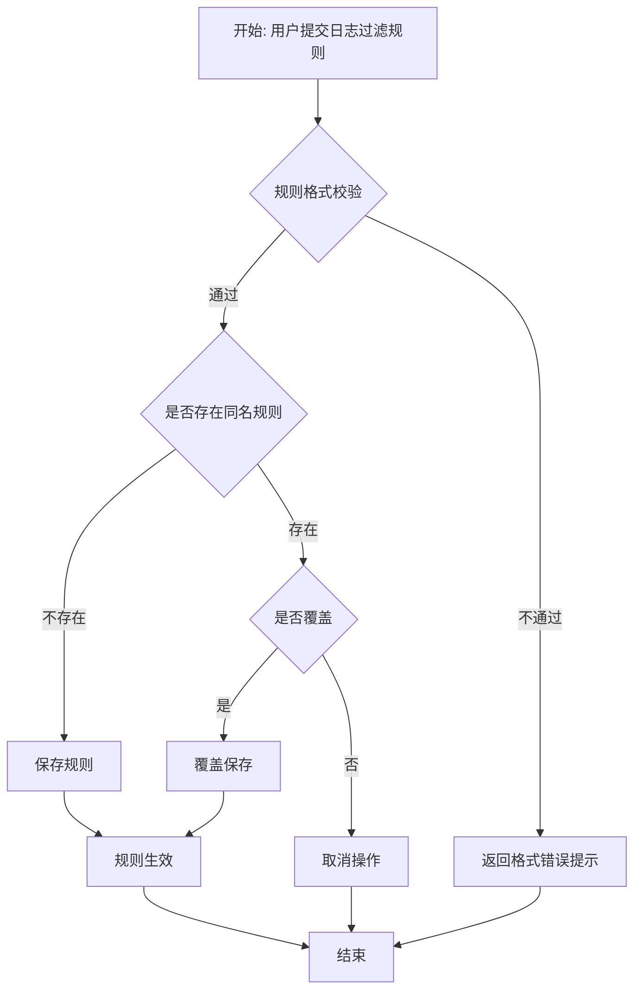

## 目标

对设计计划中 PPDCS 特征为 **P-Process** 的逻辑用例，执行五步设计过程，
建模业务流程→枚举分支路径（含路径枚举表）→路径→LC→路径触发数据→输出物理用例。

## 理论基础

P-Process 是 PPDCS 五特征之一：
> 被测功能有"多步骤、有前后约束"的业务流程含义，
> 流程不可回退（区别于 S-State），步骤间有确定的顺序约束。

**识别条件**：需求描述包含"先...再..."、"如果...则..."、"流程"等词，
且流程不存在状态回退（回退则应使用 S-State）。

**建模工具**：流程图（flowchart）/ 活动图（activity diagram）

## 适用范围

- 适用阶段：MFQ 的 design 阶段
- 输入：`.output/integration/design-plan.md`（PPDCS=P-Process 的 LC）
- 输出：`.output/design/<module>/<sub-module>/` 目录下的设计文件

## 前置条件

- [ ] 设计计划已确认
- [ ] 当前逻辑用例的 PPDCS 特征为 P-Process

## 五步用例设计过程

读取 `test-point-integrator` 输出的逻辑用例（含因子-取值表和动作路径），执行以下五步：

### 第一步：测试数据（因子-取值表补全）

从整合阶段的因子-取值表出发，补充因子类型和等价类分类：

```markdown
| 因子 | 取值 | 类型 | 等价类 |
|------|------|------|--------|
| 过滤规则名称 | rule_new（新名称） | 参数 | 有效 |
| 过滤规则名称 | rule_exist（已存在名称） | 参数 | 边界（重复） |
| 过滤规则名称 | 空 | 参数 | 无效 |
| 规则条件格式 | src_ip=<IP_ADDRESS>（合法格式） | 参数 | 有效 |
| 规则条件格式 | 非法格式（如 abc） | 参数 | 无效 |
| 覆盖选项 | 是 | 参数 | 有效 |
| 覆盖选项 | 否 | 参数 | 有效 |
```

**因子类型说明**：
- **环境状态**：系统预置状态（如"已存在同名规则"）
- **参数**：输入参数取值
- **预期**：预期结果类别（用于约束分析）

### 第二步：分支路径枚举

**P-Process 的动作路径来自流程图的分支**，使用 Mermaid flowchart 建模，然后枚举所有分支路径：



**路径枚举表**（标准化格式，每条分支路径为一行）：

| 路径ID | 分支序列 | 覆盖的功能节点 | 路径类型 |
|--------|---------|--------------|---------|
| P-01 | A→B(通过)→C(不存在)→E→I→J | 格式校验通过/无同名规则/保存规则/规则生效 | 主路径 |
| P-02 | A→B(通过)→C(存在)→F(是)→G→I→J | 格式校验通过/同名规则存在/选择覆盖/覆盖保存 | 分支路径 |
| P-03 | A→B(通过)→C(存在)→F(否)→H→J | 格式校验通过/同名规则存在/取消覆盖 | 分支路径 |
| P-04 | A→B(不通过)→D→J | 格式校验失败/返回格式错误 | 异常路径 |

> **P-Process 路径数量**：通常与判断分支数相同（每个判断节点的每个方向为一条分支），远多于1条。

### 第三步：数据组合分析

**组合策略选择**：

| 条件 | 策略 |
|------|------|
| 路径本身已隔离各分支 | 每条路径选典型数据；各路径数据相互独立 |
| 同一路径内有参数组合 | ≤3 因子用全组合；≥4 因子用 Pairwise |
| 存在守卫条件依赖 | 先分析约束（IF...THEN...格式），再生成组合 |

**组合约束分析**（守卫条件即约束）：

```
P1 约束：规则格式 = 合法 AND 规则名 = 新名称 → 走路径P1
P2 约束：规则格式 = 合法 AND 规则名 = 已存在 AND 覆盖选项 = 是 → 走路径P2
P3 约束：规则格式 = 合法 AND 规则名 = 已存在 AND 覆盖选项 = 否 → 走路径P3
P4 约束：规则格式 = 非法 → 走路径P4（其余因子无关）
```

**全量组合结果**（约束过滤后，每条路径取典型值）：

| 组合编号 | 规则名称 | 规则格式 | 覆盖选项 | 走路径 | 预期结果 |
|---------|---------|---------|---------|--------|---------|
| C-01 | rule_new | 合法 | — | P1 | 创建成功 |
| C-02 | rule_exist | 合法 | 是 | P2 | 覆盖成功 |
| C-03 | rule_exist | 合法 | 否 | P3 | 操作取消 |
| C-04 | 任意 | 非法 | — | P4 | 提示格式错误 |

### 第四步：路径触发数据分配

**为每条路径分配前置条件和触发输入数据**：路径枚举确定了"走哪条路"，本步骤确定"用什么数据进入该路径"。

```
分配原则：
1. 前置条件（C）：描述进入该路径所需的系统状态（如 "规则 rule_exist 已存在"）
2. 触发输入数据（A）：实际配置或操作的参数值（如 "规则名=rule_exist, 格式=合法"）
3. 预期结果（E）：路径走完后的可观测状态变化
4. 每条路径至少一条用例；高风险路径可选2~3条不同典型值
```

**路径触发数据分配表**：

| 路径ID | 前置条件（C） | 触发输入（A） | 预期结果（E） |
|--------|-------------|-------------|-------------|
| P-01 | 无同名规则 rule_new | 规则名=rule_new, 格式=src_ip=<IP_ADDRESS> | 规则创建成功，列表出现 rule_new |
| P-02 | 已存在规则 rule_exist | 规则名=rule_exist, 覆盖=是 | 覆盖成功，规则内容更新 |
| P-03 | 已存在规则 rule_exist | 规则名=rule_exist, 覆盖=否 | 操作取消，规则内容不变 |
| P-04 | 无约束 | 规则格式=非法格式 "abc" | 提示"格式错误"，规则未创建 |

**覆盖策略决策**：

| 特性类型 | 策略 | 说明 |
|---------|------|------|
| 复杂高风险（核心业务流程） | **全组合**：每条路径 × 各路径的所有数据组合 | 充分覆盖 |
| 普通功能（日常配置流程） | **BA组合**：每条路径取有效等价类代表值 + 无效各一条 | 平衡效率 |
| 简单流程（≤2个分支） | **典型值**：每条路径各取一个代表值 | 节省成本 |

**本用例决策**：BA组合（普通配置流程）

```
最终用例集 = C-01（P-01正常创建）+ C-02（P-02覆盖保存）+ C-03（P-03取消）+ C-04（P-04格式错误）
覆盖策略说明：每条路径各取一个代表值，P-01覆盖正常，P-02/P-03覆盖条件分支，P-04覆盖异常
```

### 第五步：物理用例输出

每个最终组合生成一行物理用例，**C→预置条件、A→测试步骤、E→预期结果**：

```markdown
| 三级目录 | 四级目录 | 五级目录 | 用例名称* | 用例编号 | 用例级别* | 组网描述* | 组网约束 | 预置条件 | 测试步骤* | 预期结果* | 首次创建版本* | 最后变更版本 | 关键词 | 测试类型* | 是否自动化* |
|---------|---------|---------|---------|---------|---------|---------|---------|---------|---------|---------|------------|------------|--------|---------|----------|
| 日志中心 | 日志管理 | 日志过滤配置 | 正常创建日志过滤规则 | PC-FLT-RUL-001 | P1 | 单台防火墙 | | 防火墙已正常启动；无同名过滤规则 | 1.进入日志过滤规则配置页面<br>2.点击"新建规则"<br>3.输入规则名=rule_new, 条件=src_ip=<IP_ADDRESS><br>4.点击"确定"<br>5.查看规则列表 | 1.显示规则列表<br>2.显示规则配置表单<br>3.表单接受输入<br>4.提示"规则创建成功"<br>5.rule_new 显示在列表中 | V60R001C01 | | 日志过滤,规则创建 | 功能 | 否 |
| 日志中心 | 日志管理 | 日志过滤配置 | 覆盖已有日志过滤规则 | PC-FLT-RUL-002 | P1 | 单台防火墙 | | 防火墙已正常启动；存在同名规则 rule_exist | 1.进入日志过滤规则配置页面<br>2.点击"新建规则"<br>3.输入规则名=rule_exist，新条件参数<br>4.点击"确定"<br>5.系统询问是否覆盖，选择"是" | 1.显示规则列表<br>2.显示规则配置表单<br>3.表单接受输入<br>4.弹出覆盖确认对话框<br>5.提示"覆盖成功"，规则内容更新 | V60R001C01 | | 日志过滤,规则覆盖 | 功能 | 否 |
```

## 输出目录结构

```
.output/design/<module>/<sub-module>/
├── ppdcs-profile.md      # P-Process 特征详情（含流程图）
├── design-process.md      # 五步设计过程（因子表+流程图+路径枚举+组合分析+覆盖策略）
└── physical-cases.md      # 物理用例列表
```

### ppdcs-profile.md 内容

```markdown
# PPDCS 特征详情

- **主特征**：P-Process
- **判定依据**：<从 .output/m-analysis/ppdcs-annotation.md 引用>
- **辅特征**：<如有>
- **流程节点数**：N
- **判断分支数**：M
- **预估路径数**：K
```

## 优先级分配规则

| 路径类型 | 优先级 |
|---------|--------|
| 主路径（最常用的正常路径） | P0~P1 |
| 关键分支路径 | P1~P2 |
| 异常/错误路径 | P2~P3 |
| 边界条件路径 | P3 |
| 极端/罕见路径 | P4 |

## 复杂度管理

- 节点数 > 15：建议拆分为主流程 + 子流程
- 路径数 > 20：使用分支覆盖作为最低要求，选择性执行路径覆盖
- 循环路径：取 0 次、1 次、N 次三种场景

## Gotchas

- 必须使用标准 Mermaid flowchart 语法，确保可渲染
- 隐式的异常路径也要建模（如超时、网络断开）
- 循环需要设定终止条件
- 路径描述中注明经过哪些判断分支的哪个方向
- **P-Process vs S-State 区分**：流程不可回退 = Process；可回退 = State

## 验收标准

- [ ] 流程图使用 Mermaid flowchart 语法且可渲染
- [ ] 所有判断分支均被路径枚举覆盖（分支覆盖）
- [ ] 第一步因子-取值表含因子类型和等价类
- [ ] 第二步路径枚举表包含标准四列：路径ID/分支序列/覆盖的功能节点/路径类型
- [ ] 第二步每个判断节点的每个方向各对应一条路径
- [ ] 第三步组合约束以"IF...THEN...（走路径PX）"格式表述
- [ ] 第四步路径触发数据分配表包含：路径ID/前置条件/触发输入/预期结果
- [ ] 第四步覆盖策略决策有明确理由（全组合/BA组合/典型值）
- [ ] 物理用例以表格输出（16列），C→预置条件、A→测试步骤、E→预期结果映射正确
- [ ] `ppdcs-profile.md` 已创建
- [ ] 设计过程文档写入 `.output/design/<module>/<sub>/`
