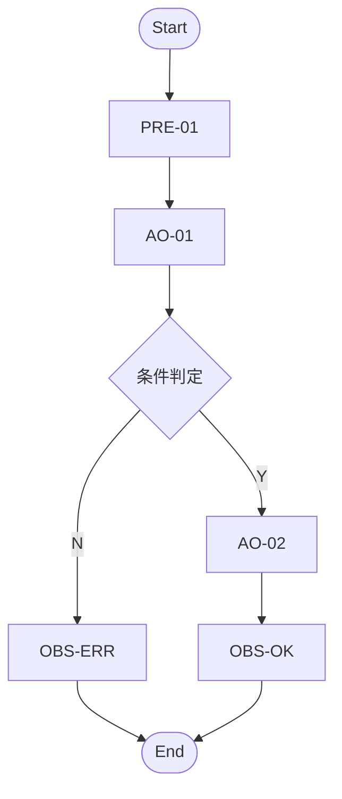

## 目标

对设计计划中推荐为 **P-Process** 的逻辑用例，输出完整图形链工件，而不是只给最终 PC：

1. 读取 `design-plan.md` 与 `design-planner-reasoning.md`；
2. 回链 `logic-cases.md`、`test-data.md`、`confirmed-scenarios.md`；
3. 生成流程图、节点清单、路径枚举表、覆盖策略、路径触发数据/数据叠加表；
4. 在保留 `needs-confirmation` / `confirmation_gap_refs` 的前提下输出物理用例。

## 适用范围

> 统一输出规则：本 Skill 的方法过程写入 `ppdcs/ppdcs/<三级目录>-<四级目录>-<五级目录>-<逻辑用例名>.md`，物理用例写入 `ppdcs/pc/<三级目录>-<四级目录>-<五级目录>-<逻辑用例名>.md`。不得创建 `design/<module>/<sub-module>/` 深目录；同名冲突追加 `-<LC-ID>`。


- 适用阶段：MFQ 的 design 阶段
- 输入：
  - `process/plan/design-plan.md`
  - `process/plan/design-planner-reasoning.md`
  - `mfq/integration/logic-cases.md`
  - `mfq/integration/test-data.md`
  - `kym/scenarios/confirmed-scenarios.md`
  - `process/REQUIREMENTS.md` / `process/HLD.md`（仅作为边界与术语基线）
- 输出：`ppdcs/ppdcs/<basename>.md` 与 `ppdcs/pc/<basename>.md`

## 前置条件

- [ ] 设计计划已确认，且目标 LC 的 `设计Skill = process-design`
- [ ] `design-planner-reasoning.md` 中存在对应 LC 的 reasoning
- [ ] `logic-cases.md` 中保留完整 trace / gap 字段
- [ ] `confirmed-scenarios.md` 中可找到对应 `scenario_refs / scenario_chain_refs`
- [ ] 若 `fact_status=needs-confirmation`，已准备在设计输出中原样保留不确定性

## 必须消费的输入契约

### 1. STORY-05 下游契约

| 来源 | 必收字段 | 用途 |
|------|----------|------|
| `design-plan.md` | `LC-ID`, `逻辑用例标题`, `PPDCS特征`, `推荐方法`, `设计Skill`, `主信号`, `候选特征`, `排除摘要`, `关键trace`, `待确认事项` | 决定 LC 是否进入 `process-design`，并记录设计上下文 |
| `design-planner-reasoning.md` | `recommended_feature`, `recommended_method`, `design_skill`, `fact_status`, `primary_signal`, `candidate_features`, `exclusion_reasons`, `scenario_refs`, `scenario_chain_refs`, `td_refs`, `test_object_refs`, `factor_refs`, `uncertain_facts` | 复核为何采用流程图法，并保留待确认事实 |
| `directory-structure.md` | `### 三级目录`, 四级/五级目录层级映射 | 回查完整 `三级→四级→五级` 层级链，用于构造输出文件名 |

### 2. STORY-04 / 上游场景与 trace 契约

| 来源 | 必收字段 | 用途 |
|------|----------|------|
| `logic-cases.md` | `LC-ID`, `source_tp_ids`, `scenario_refs`, `scenario_chain_refs`, `action_source_refs`, `knowledge_refs`, `confirmation_gap_refs`, `test_object_refs`, `factor_refs`, `topology_bindings`, `trace_refs`, `fact_status`, `动作路径`, `因子-取值表`, `CAE聚合规则`, `关联SR` | 还原 LC 主流程、拓扑绑定目录和 trace 链 |
| `test-data.md` | `TD-ID`, `logic_case_id`, `factor_ref`, `value_set`, `source_section`, `scenario_refs`, `action_source_refs`, `trace_refs`, `confirmation_gap_refs`, `status` | 分析路径触发数据与数据叠加 |
| `confirmed-scenarios.md` | `precondition_operations`, `atomic_operations`, `observation_points`, `expected_state`, `minimal_logic_chain`, `data_overlay_slots`, `ptm-atomic`, `Knowledge Reference`, `confirmation_gaps` | 建图、定节点、识别可叠加数据位置 |

> 若 `design-plan.md`、`design-planner-reasoning.md`、`logic-cases.md` 三者对同一 LC 的主方法结论不一致：
> - 不得自行裁决；
> - 在输出中标记 `[待确认]`；
> - 维持 `fact_status=needs-confirmation`。

## 拓扑绑定边界

- 必须消费 LC 的 `topology_bindings`，并把拓扑角色、真实端口和 TOPO 实例作为路径/PC 的旁路绑定信息处理；
- 流程节点、路径分支、`factor_refs`、`trigger_data.value_set` 只能使用业务条件、动作输入、观察数据或逻辑拓扑角色，不得把 `DUT.port*`、`TG.port*`、link/TOPO 实例当作 factor value；
- PC 阶段物化真实端口时，必须记录 `topology_binding_ref / materialized_object / source_ref / fact_status`；
- 若 LC/TD 中已经把真实组网对象混入因子取值，需移入拓扑绑定目录；来源或绑定关系无法确认时，当前路径或 data overlay 降级为 `needs-confirmation`。

## 执行流程

### 步骤 1：锁定目标 LC 与设计上下文

1. 从 `design-plan.md` 选出 `设计Skill = process-design` 的 LC。
2. 读取同一 LC 在 `design-planner-reasoning.md` 的：
   - `primary_signal`
   - `candidate_features`
   - `exclusion_reasons`
   - `fact_status`
   - `uncertain_facts`
3. 若 reasoning 中 `S-State` 仍为强候选，必须在设计过程文档中保留“为何仍按 Process 落地”的说明，不得静默忽略。

### 步骤 2：建立流程节点模型

从 `confirmed-scenarios.md` 与 LC 动作路径还原流程节点：

- `precondition_operations` → 前置准备节点
- `atomic_operations` → 动作节点
- 条件分流 / 规则命中 → 决策节点
- `observation_points` → 观察节点
- 终态 / 结束观测 → 结束节点

**节点最少字段**：

| 字段 | 说明 |
|------|------|
| `node_id` | 节点编号 |
| `node_type` | `start / precondition / action / decision / observation / end` |
| `source_op_id` | 回链 `PRE-* / AO-*` |
| `decision_condition` | 分支条件；未知则写 `[待确认]` |
| `observation_ref` | 观察点引用 |
| `trace_refs` | 对应 trace |
| `confirmation_gap_refs` | 未确认事实引用 |
| `fact_status` | `confirmed / needs-confirmation` |

图示优先使用 Mermaid `flowchart`。

### 步骤 3：生成路径枚举表

最小覆盖基线：

1. 主路径 1 条；
2. 每个独立决策分支至少 1 条；
3. 仅当需求 / HLD / reasoning 已明确时，才加入异常路径、回退路径、循环路径。

**路径枚举表最少字段**：

| 字段 | 说明 |
|------|------|
| `path_id` | 路径编号 |
| `node_sequence` | 节点序列 |
| `branch_reason` | 分支原因 |
| `coverage_goal` | `main-flow / branch / exception / rollback / loop` |
| `scenario_chain_refs` | 命中的 PRE/AO/Observation |
| `trace_refs` | 关键 trace |
| `confirmation_gap_refs` | 不确定分支 |
| `fact_status` | `confirmed / needs-confirmation` |

### 步骤 4：定义覆盖策略

覆盖策略必须显式写出，而不是默认“全覆盖”：

| 场景 | 最低要求 |
|------|----------|
| 普通流程 | 分支覆盖 |
| 核心主干 / 高风险流程 | 分支覆盖 + 关键路径覆盖 |
| 含明确循环 | `0 / 1 / N` 次循环策略 |
| 异常路径已确认 | 必须单列覆盖 |

**输出要求**：

- 逐条说明每个 `path_id` 是否进入最终 PC 集；
- 被裁剪路径必须给理由；
- 若因上游缺口无法确定是否保留路径，写 `[待确认]`，并将 LC `fact_status` 维持为 `needs-confirmation`。

### 步骤 5：分析路径触发数据与数据叠加

以 `test-data.md` 为准，为每条路径建立 `trigger_data + data_overlay_set`：

1. 从 `factor_refs` 找到候选 TD；
2. 按 `source_section` 判断其属于前置条件、动作输入还是观察数据；
3. 仅将与当前路径相关的数据挂到对应节点 / `data_overlay_slots`；
4. `TD.status=needs-confirmation` 时，不得定值，只能保留 `[待确认]`。
5. 从 LC `topology_bindings` 解析路径所需的拓扑角色绑定；真实端口只作为 PC 物化目标，不写入 `value_set`。

**路径触发数据/叠加表最少字段**：

| 字段 | 说明 |
|------|------|
| `path_id` | 关联路径 |
| `trigger_node_id` | 触发节点 |
| `factor_ref` | 因子引用 |
| `td_ref` | 测试数据引用 |
| `value_set` | 取值；未确认值保留 `[待确认]` |
| `source_section` | `condition / action-input / observation / environment` |
| `data_overlay_set` | 叠加后的路径级数据集编号 |
| `confirmation_gap_refs` | 来自 TD / reasoning / scenario 的缺口 |
| `status` | `ready / needs-confirmation` |

### 步骤 6：生成物理用例

PC 由 `覆盖策略选中的 path × data_overlay_set` 生成。

**与 `state-design` 共用的物理用例骨架**：

| 字段 | 说明 |
|------|------|
| `physical_case_id` | 物理用例编号 |
| `logic_case_id` | 所属 LC |
| `requirement_ids` | 关联需求 / SR |
| `feature_tags` | 功能分类标签 |
| `case_title` | 必填结构化字段；业务可读自然语言；不得等于 `physical_case_id` 或其子串；不得为空；同 LC 内唯一（可区分不同规则/分支）；无法生成时标注 `case_title_gap` 并说明原因，不得用 PC-ID 占位 |
| `priority` | 优先级 |
| `preconditions` | 前置条件 |
| `case_steps` | 结构化步骤清单；每步必须包含 `step_name` 与 `atomic_op` |
| `test_steps` | 由 `case_steps` 渲染出的 16 列表 `测试步骤*` 文本 |
| `expected_results` | 预期结果 |
| `graph_ref` | `path_id` |
| `coverage_goal` | 路径覆盖目标 |
| `trigger_data` | 触发数据摘要 |
| `topology_binding_refs` | PC 物化使用的 LC 拓扑绑定引用；无则写 `—` |
| `trace_refs` | trace 链 |
| `scenario_refs` | 来源场景 |
| `scenario_chain_refs` | PRE/AO 引用 |
| `action_source_refs` | ptm-atomic `op_id` |
| `confirmation_gap_refs` | 未确认事实 |
| `fact_status` | `confirmed / needs-confirmation` |

> 若某条 PC 依赖未确认路径条件或未确认 TD，`test_steps / expected_results / trigger_data` 必须显式保留 `[待确认]`，不得写成确定语气。

**case_title 生成规则**（process-design 方法特定）：

- 格式：`<路径类型>-<流程语义>`
- 示例：`正常路径-批量创建100条并分页查询启停删除全流程`、`异常路径-并发冲突下的状态回滚`
- 禁止用 `physical_case_id` 或 `path_id` 占位；禁止保留路径表内部编号（如 `P1-Step3:`）作为标题主体
- 同 LC 内多条路径 PC 的 case_title 必须可区分（不同路径类型或不同分支）

**PC 步骤结构化契约**：

```yaml
case_steps:
  - step_id: STEP-001
    step_name: 配置策略路由的匹配源地址对象 OBJ_SRC_WEB
    target: DUT
    atomic_op:
      op_id: fw_config_policy_route
      args:
        source_network: OBJ_SRC_WEB
      preconditions:          # op 级：透传自 op yaml inputs.preconditions
        - External orchestration holds a valid session_ref.
    step_preconditions:        # step 级：用例自填的前置数据/状态
      - 源地址对象 OBJ_SRC_WEB 已创建
    expected_result: 策略路由规则成功引用源地址对象 OBJ_SRC_WEB
    trace_refs:
      - TP-001
      - TD-ADDR-001
```

渲染到 16 列物理用例表的 `测试步骤*` 时使用：

```text
1. 配置策略路由的匹配源地址对象 OBJ_SRC_WEB
   执行对象：DUT
   原子操作：fw_config_policy_route source_network=OBJ_SRC_WEB
```

规则：
- `step_name` 表达测试动作意图，不能只复制 `op_id`；
- `atomic_op.op_id` 必须同步进入 `action_source_refs`；
- 原子操作参数来自 TD / data overlay / topology materialization，未确认参数保留 `[待确认]`；
- Markdown 表格中用 `<br>` 换行表达上述多行结构，不新增 16 列之外的列。

## 输出文件结构

```text
ppdcs/ppdcs/<basename>.md
ppdcs/pc/<basename>.md
```

### `ppdcs/ppdcs/<basename>.md`

至少包含：

- `recommended_feature / recommended_method / design_skill`
- `primary_signal`
- `candidate_features`
- `exclusion_reasons`
- `fact_status`
- `test_object_refs / factor_refs`
- Design Context（来自 `design-plan + reasoning`）
- Flow Graph（Mermaid + 节点清单）
- Path Enumeration
- Coverage Strategy
- Trigger Data & Data Overlay
- PC Derivation Summary
- Uncertain Facts / Confirmation Gaps

### `ppdcs/pc/<basename>.md`

只输出最终 PC，但每条 PC 必须回链：

- `graph_ref`
- `topology_binding_refs`（存在真实端口物化时必须填写）
- `trace_refs`
- `scenario_refs`
- `scenario_chain_refs`
- `confirmation_gap_refs`
- `fact_status`

## 输出格式骨架

### Flow Graph



### Path Enumeration

```markdown
| path_id | node_sequence | branch_reason | coverage_goal | confirmation_gap_refs | fact_status |
|---------|---------------|---------------|---------------|-----------------------|-------------|
| PATH-01 | START→PRE1→AO1→D1(Y)→AO2→OBS2→END | 主路径 | main-flow | — | confirmed |
| PATH-02 | START→PRE1→AO1→D1(N)→OBS1→END | 失败分支 | branch | GAP-001 | needs-confirmation |
```

### Trigger Data & Data Overlay

```markdown
| path_id | trigger_node_id | factor_ref | td_ref | value_set | data_overlay_set | status |
|---------|-----------------|------------|-------|-----------|------------------|--------|
| PATH-01 | AO1 | FAC-001 | TD-001 | `valid-a` | OVL-01 | ready |
| PATH-02 | D1 | FAC-002 | TD-002 | `[待确认]` | OVL-02 | needs-confirmation |
```

## Gotchas

- 不得只读 `design-plan.md` 而忽略 `design-planner-reasoning.md`
- 不得把 `confirmation_gap_refs`、`uncertain_facts`、`TD.status=needs-confirmation` 吞掉
- `P-Process` 的“异常路径”只能来自已确认需求、HLD 或明确 reasoning，不得脑补隐含失败流
- 决策节点写不清时，必须标记 `[待确认]`，而不是把“默认成功”当成事实
- 同一 LC 若同时存在强 `S-State` 信号，需在设计上下文中写明为何仍按流程法建模
- 不得把 TOPO 实例或真实端口写成流程分支条件、路径数据或状态值；它们只能通过 `topology_bindings` 旁路进入 PC 物化。
- PC 步骤必须同时有人类可读 `step_name` 和可执行 `atomic_op`；不得只输出原子操作串。

## 方法论细则（用户可定制）

> 以下为设计方法的指导框架。用户可根据项目特点和领域知识补充具体规则。
> 详细的 PPDCS 方法论参见 `ppdcs-analysis-step-by-step.md`。

### 流程图法设计步骤

**目标**：基于逻辑用例的动作路径和场景链，构建可追溯的流程模型，并通过路径枚举实现分支覆盖。

**核心步骤**：
1. 从 LC 动作路径和 confirmed-scenarios 还原流程节点（前置/动作/决策/观察/结束）
2. 建立节点清单，标注节点类型、source_op_id、trace_refs 和 fact_status
3. 绘制 Mermaid flowchart，明确决策点和分支条件
4. 枚举全部路径：主路径 ≥1 条，每个独立决策分支 ≥1 条
5. 为每条路径分配触发数据（来自 test-data.md），形成 data_overlay_set
6. 定义覆盖策略并裁剪路径集，裁剪原因必须显式记录

**关键决策点**：
- 何时加入异常路径、回退路径、循环路径：仅当需求/HLD/reasoning 已明确时
- 路径裁剪标准：被裁剪路径必须给出理由；因上游缺口无法确定的路径标记 `[待确认]`
- TD.status=needs-confirmation 时：不得定值，只能保留 `[待确认]`

**示例**（防火墙领域）：
以日志保存配置为例，流程节点包含：进入配置页面→输入保存天数→输入文件大小→选择备份路径→点击保存→观察结果。决策点为"保存天数是否合法"和"备份路径是否可写"，分别生成有效/无效分支路径。

**下游影响**：
路径枚举表直接决定 PC 生成（path_id × data_overlay_set → PC）；覆盖策略的裁剪决策影响覆盖率验证（coverage-verifier 会检查裁剪理由是否充分）；fact_status=needs-confirmation 的路径在 GATE-4 覆盖率检查中不参与已覆盖计数。

## 验收标准

- [ ] 同时消费 `design-plan.md` 与 `design-planner-reasoning.md`
- [ ] 流程图输出 Mermaid `flowchart`
- [ ] 存在节点清单、路径枚举表、覆盖策略、路径触发数据/叠加表
- [ ] 路径表保留 `scenario_chain_refs / confirmation_gap_refs / fact_status`
- [ ] `TD.status=needs-confirmation` 未被静默定值
- [ ] 物理用例字段骨架与 `state-design` 一致
- [ ] 输出采用 `ppdcs/ppdcs/<basename>.md` 与 `ppdcs/pc/<basename>.md`
- [ ] 已消费 LC `topology_bindings`；真实端口物化保留来源和 `fact_status`，且未进入 factor/data/state value
- [ ] 每条 PC 的 `case_steps` 均包含 `step_name`、`atomic_op.op_id`、`atomic_op.args` 与步骤级 `expected_result`
- [ ] 每条 PC 含非空 `case_title`，且不等于 `physical_case_id`；同 LC 内唯一
