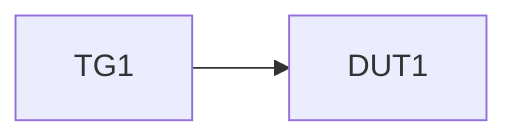

## 目标

生成**准确优先、禁止脑补**的场景分析结果，使每个场景都能落成：

- Scenario Chain（场景目标 / 原理依据 / 前置条件链 / 最小逻辑链）
- Topology（`Topology / Device / Port / Link` + `topology_ref`）
- precondition_operations（前置条件的原子操作拆分）
- atomic_operations（主流程原子操作）
- observation_points（观察点与预期状态）
- Action Source（`rest-api / cli-tool / tool-method`）
- Knowledge Reference（只读知识引用）
- Existing Tool Usage Seed（已有工具使用种子）
- Tool Abstraction Draft（工具抽象草案）
- Confirmation Gaps（待用户补充的问题）

## 适用范围

- 适用阶段：MFQ 分析的 scenario 阶段
- 输入：特性名称 + 基本描述 + 用户提供的 REST API / CLI / tool-method 能力边界
- 输出：`analysis/scenarios/confirmed-scenarios.md` + `analysis/scenarios/<scene-id>/topology.{mmd,yaml}`

## 前置条件

- [ ] feature-parser 已完成，`analysis/feature-input/` 目录存在
- [ ] 特性名称和基本描述已确定
- [ ] 若存在外部动作源，用户已提供 API 配置、CLI 调用方式或工具方法说明

## 核心原则

1. **先确认再展开**：场景目标、前置条件、原子操作、观察点不清楚时必须提问
2. **场景分析必须准确**：禁止根据模糊材料脑补“看起来完整”的逻辑链
3. **知识库只读**：只允许引用 MCP 查询结果，不做写回、索引维护或入库
4. **动作源显式建模**：REST API / CLI Tool / Tool Method 必须以 Action Source 输出
5. **组网先锚定再回链**：场景依赖组网时，必须先产出 Topology 并为最小逻辑链写入 `topology_ref`
6. **缺口显式暴露**：已有工具不能满足场景时，输出 Tool Abstraction Draft，而不是虚构可执行接口

## 知识查询策略（只读 staged query）

按以下固定顺序查询知识参考：

```
1. 领域主场景（domain-scenarios）
2. 特性场景（feature-scenarios）
3. 特性主功能（feature-functions）
```

查询命令示例：

```bash
uv run --python 3.11 python scripts/mcp_query_client.py \
  --stage all \
  --domain firewall \
  --feature "<特性名称>"
```

三态解释：

- `success` / `resolved`：成功返回可引用知识
- `knowledge_missing` / `missing`：接口可用，但当前阶段知识缺失
- `interface_unavailable` / `unavailable`：MCP 接口不可用或未配置

> `knowledge_missing` 与 `interface_unavailable` 必须区分，后续提问和回退策略不同。

## 输入收集优先级

1. `analysis/feature-input/` 中的需求与目录材料
2. 只读 MCP staged query 结果
3. 用户补充的 API / CLI / tool-method 事实
4. Web 搜索（仅在知识缺失或用户明确要求时作为补充参考）

## 执行流程

### 步骤 1：信息收集

1. 读取 `analysis/feature-input/raw-requirements.md` 获取特性概况
2. 调用 `mcp_query_client.py` 执行 staged query
3. 读取用户补充材料中的外部动作源能力说明
4. 若 staged query 返回 `knowledge_missing / interface_unavailable`，保留结果并继续人工确认，不得伪造知识

### 步骤 2：构建 Scenario Chain

对每个候选场景输出以下字段：

| 字段 | 说明 |
|------|------|
| `scenario_goal` | 场景目标 |
| `principle` | 场景原理依据 / 业务依据 |
| `preconditions` | 使用该场景前必须成立的条件 |
| `topology_ref` | 关联 Topology 编号；若场景不依赖组网则填 `n/a` 并说明理由 |
| `precondition_operations` | 将前置条件拆成可执行原子操作 |
| `atomic_operations` | 主流程原子操作序列 |
| `observation_points` | 每个关键节点的观察点 |
| `expected_state` | 每个关键节点对应的预期状态 |
| `minimal_logic_chain` | 最小逻辑链（可直接转后续 LC 步骤骨架） |
| `data_overlay_slots` | 后续可叠加测试数据的位置 |

**precondition_operations / atomic_operations 最低字段**：

| 字段 | 说明 |
|------|------|
| `op_id` | 操作编号 |
| `phase` | `precondition` / `main-flow` |
| `channel` | UI / REST API / CLI / Tool Method / Manual |
| `action_object` | 操作对象 |
| `input_params` | 输入参数 |
| `observation_point` | 该操作完成后的观察点 |
| `expected_state` | 该操作完成后的预期状态 |
| `action_source_ref` | 关联 Action Source 编号（若存在） |

### 步骤 3：建模 Topology / Action Source / Knowledge Reference / Tool 输出

#### 3.0 Topology

对依赖组网的场景，必须在 `analysis/scenarios/<scene-id>/` 下输出：

- `topology.mmd`
- `topology.yaml`
- 设备 / 端口 / 链路三张清单表（可内嵌在确认文档中）

Topology 最低字段：

| 字段 | 说明 |
|------|------|
| `topology_id` | 组网编号 |
| `devices[]` | 设备列表，至少包含 `device_id` / `kind` / `ports[]` |
| `ports[]` | 端口清单，至少包含 `port_id` / `device_id` / `role` |
| `links[]` | 链路清单，至少包含 `link_id` / `endpoints[2]` |
| `validation_status` | `valid / needs-confirmation / invalid` |

最低校验规则：

1. 每条 `Link.endpoints` 必须恰好为两个端口
2. `device_id` / `port_id` / `link_id` 在同一 `topology_id` 内唯一
3. `DUT` 至少包含两个可参与业务的端口
4. Action Source 的 `target` 若指向设备或端口，必须可解析到 `DUT<n>` 或 `DUT<n>.Port<n>`

#### 3.1 Action Source

对所有外部动作源进行显式建模：

| 字段 | 说明 |
|------|------|
| `source_type` | `rest-api` / `cli-tool` / `tool-method` |
| `config_ref` | 用户提供的配置或文档引用 |
| `invoke_contract` | 调用入口、参数、前置条件 |
| `observe_contract` | 调用后如何观测结果 |
| `main_usage` | 已知主要用法 |
| `purpose` | 在当前场景中的用途 |
| `scenario_refs` | 关联场景 |
| `capability_status` | `ready` / `gap` / `unknown` |

> UI/Manual 操作可以出现在 `channel` 中，但**Action Source 只对外部接口对象建模**。

#### 3.2 Knowledge Reference

将 MCP staged query 结果保留为：

| 字段 | 说明 |
|------|------|
| `knowledge_type` | `domain-scenarios` / `feature-scenarios` / `feature-functions` |
| `source_ref` | 知识来源标识 |
| `queried_at` | 查询时间 |
| `availability_status` | `resolved` / `missing` / `unavailable` |

#### 3.3 Existing Tool Usage Seed

若已有工具可用，至少输出：

- 工具名
- 主要用法（main usage）
- 用途（purpose）
- 适用场景（scenario refs）
- 依赖的 Action Source

#### 3.4 Tool Abstraction Draft

当现有工具能力不足时，输出：

| 字段 | 说明 |
|------|------|
| `tool_name` | 待抽象工具名称 |
| `target_interface` | API / CLI / method |
| `function_desc` | 需要支持的能力 |
| `io_behavior_matrix` | 不同输入 / 输出条件下的处理逻辑 |
| `output_contract` | 输出格式与观察点 |
| `scenario_refs` | 关联场景 |

### 步骤 4：缺口识别与用户确认

以下任一项不确定时，必须生成 `confirmation_gaps` 并暂停确认：

- 场景目标不清楚
- 前置条件不清楚
- 原子操作顺序不清楚
- 观察点或预期状态不清楚
- Topology 结构、命名或链路归属不清楚
- Action Source 契约不清楚
- MCP 结果为 `missing / unavailable`

以结构化方式展示候选场景与缺口，使用 `ask_user` 发起确认：

1. ✅ 全部确认 — 场景链、Topology、动作源、知识引用可进入 M 分析
2. ✏️ 修改场景链 — 指定场景编号与修改字段
3. ➕ 补充场景 — 提供新增场景目标 / 前置条件 / 关键操作
4. 🔌 补充动作源 — 提供 API / CLI / tool-method 契约
5. 🌐 补充组网事实 — 补足设备、端口、链路或命名规则
6. 📚 补充知识事实 — 补足知识缺失或修正知识引用
7. 🛠️ 确认工具抽象草案 — 同意作为后续实现输入

### 步骤 5：输出持久化

将确认后的场景写入 `analysis/scenarios/confirmed-scenarios.md`，建议结构：

```markdown
# <特性名> — 已确认应用场景

## 场景概览

| 编号 | 名称 | 场景目标 | 最小逻辑链 | topology_ref | 动作源数 | 待确认项 |
|------|------|---------|-----------|--------------|---------|---------|
| SCN-XXX-001 | ... | ... | 3步 | TOPO-001 | 2 | 0 |

---

## SCN-XXX-001: <场景名称>

### Scenario Chain

| 字段 | 内容 |
|------|------|
| `scenario_goal` | ... |
| `principle` | ... |
| `preconditions` | ... |
| `topology_ref` | TOPO-001 |
| `minimal_logic_chain` | P0 → P1 → P2 |
| `data_overlay_slots` | AO-02, AO-03 |

### Topology



| device_id | kind | ports | attrs |
|-----------|------|-------|-------|
| DUT1 | DUT | Port1, Port2 | hostname=... |

| port_id | device_id | role | attrs |
|---------|-----------|------|-------|
| DUT1.Port1 | DUT1 | ingress | vlan=... |

| link_id | endpoints | purpose | validation_status |
|---------|-----------|---------|-------------------|
| Link1 | TG1.Port1 ↔ DUT1.Port1 | traffic path | valid |

### precondition_operations

| op_id | channel | action_object | input_params | observation_point | expected_state |
|------|---------|---------------|--------------|-------------------|----------------|
| PRE-01 | CLI | ... | ... | ... | ... |

### atomic_operations

| op_id | channel | action_object | input_params | observation_point | expected_state | action_source_ref |
|------|---------|---------------|--------------|-------------------|----------------|-------------------|
| AO-01 | REST API | ... | ... | ... | ... | AS-001 |

### Action Sources

| 编号 | source_type | capability_status | purpose | invoke_contract | scenario_refs |
|------|-------------|-------------------|---------|-----------------|---------------|
| AS-001 | rest-api | ready | ... | POST /... | SCN-XXX-001 |

### Knowledge References

| 编号 | knowledge_type | availability_status | source_ref | queried_at |
|------|----------------|---------------------|------------|------------|
| KR-001 | feature-scenarios | resolved | mcp://... | 2026-... |

### Existing Tool Usage Seed

| 工具名 | main_usage | purpose | scenario_refs | action_source_refs |
|------|------------|---------|---------------|--------------------|
| tool-a | ... | ... | SCN-XXX-001 | AS-002 |

### Tool Abstraction Draft

| tool_name | target_interface | function_desc | output_contract | scenario_refs |
|----------|------------------|---------------|-----------------|---------------|
| tool-b | CLI | ... | stdout/json + return code | SCN-XXX-001 |

### Confirmation Gaps

| gap_type | gap_field | question_text | candidate_draft | user_answer |
|----------|-----------|---------------|-----------------|------------|
| topology | link_endpoints | 缺少 DUT 业务口映射，是否补充？ | `TG1.Port1 ↔ DUT1.Port1` | [待确认] |
| action-source | invoke_contract | 缺少 CLI 参数说明，是否补充？ | `tool-x run --feature ...` | [待确认] |
```

## Gotchas

- `knowledge_missing` ≠ `interface_unavailable`，不可混写为“无结果”
- 对用户未提供的 API / CLI / tool-method 契约，不能自行补全为可执行细节
- 华为产品术语保持原文，不要擅自改写成熟悉但不准确的说法
- 若现有工具描述过粗，优先输出 Tool Abstraction Draft
- 缺口未确认前，不得把场景链当成已确认输入交给 M 分析

## 验收标准

- [ ] 每个场景包含 `scenario_goal / principle / preconditions / precondition_operations / atomic_operations / observation_points / minimal_logic_chain / data_overlay_slots`
- [ ] 外部动作源能区分 `rest-api / cli-tool / tool-method`
- [ ] 知识引用保留 `resolved / missing / unavailable`
- [ ] 不确定信息会进入 `confirmation_gaps`
- [ ] 已有工具 usage seed 和 Tool Abstraction Draft 可输出
- [ ] `confirmed-scenarios.md` 已写入 `analysis/scenarios/`
- [ ] `doc/STATE.md` 更新
