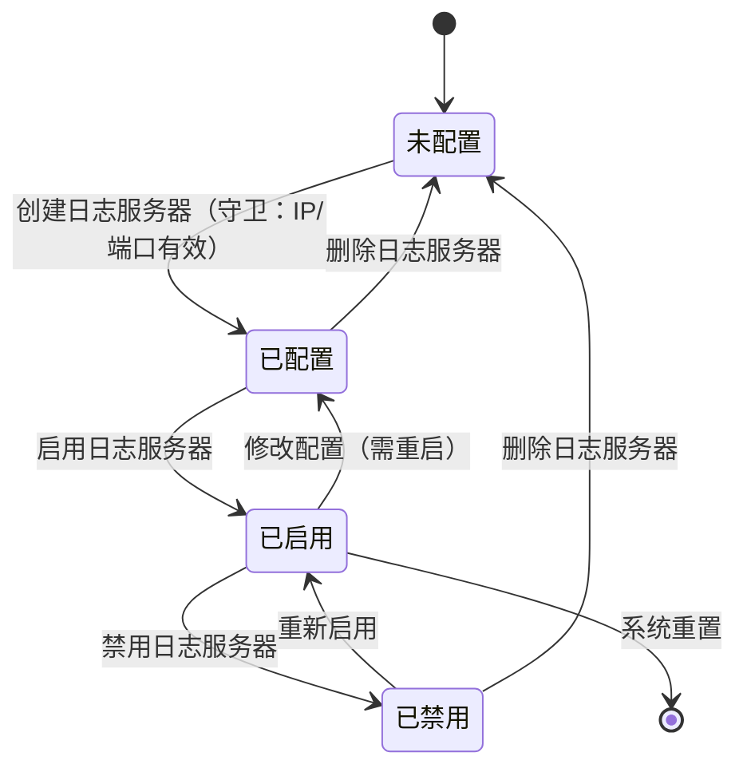

## 目标

对设计计划中 PPDCS 特征为 **S-State** 的逻辑用例，执行五步设计过程，
建模状态图→枚举状态路径（含守卫条件）→路径→LC→迁移触发数据→输出物理用例。

## 理论基础

S-State 是 PPDCS 五特征之一：
> 被测对象有多种状态，状态间可双向迁移（区别于 P-Process 的单向流程），
> 存在状态生命周期，事件驱动状态转换。

**识别条件**：对象有"启用/禁用"、"创建/销毁"、"运行/暂停/停止"等多状态，
且状态间存在回退能力。

**关键区分**：P-Process vs S-State — 流程能否回退？不能=Process，可以=State

**建模工具**：状态图（stateDiagram）/ 状态转换表

## 适用范围

- 适用阶段：MFQ 的 design 阶段
- 输入：`.output/integration/design-plan.md`（PPDCS=S-State 的 LC）
- 输出：`.output/design/<module>/<sub-module>/` 目录下的设计文件

## 前置条件

- [ ] 设计计划已确认
- [ ] 当前逻辑用例的 PPDCS 特征为 S-State

## 五步用例设计过程

读取 `test-point-integrator` 输出的逻辑用例（含因子-取值表和动作路径），执行以下五步：

### 第一步：测试数据（因子-取值表补全）

从整合阶段的因子-取值表出发，提取状态因子（当前状态、触发事件、守卫条件）并补充类型和等价类：

```markdown
| 因子 | 取值 | 类型 | 等价类 |
|------|------|------|--------|
| 当前状态 | 未配置 | 环境状态 | 有效 |
| 当前状态 | 已配置 | 环境状态 | 有效 |
| 当前状态 | 已启用 | 环境状态 | 有效 |
| 当前状态 | 已禁用 | 环境状态 | 有效 |
| 触发事件 | 创建服务器 | 参数 | 有效 |
| 触发事件 | 启用服务器 | 参数 | 有效 |
| 触发事件 | 禁用服务器 | 参数 | 有效 |
| 触发事件 | 删除服务器 | 参数 | 有效 |
| 触发事件 | 修改配置 | 参数 | 有效 |
| IP地址 | <IP_ADDRESS>（合法） | 参数 | 有效（守卫条件） |
| IP地址 | 256.0.0.1（非法） | 参数 | 无效（守卫失败） |
```

### 第二步：状态路径枚举

**S-State 的动作路径来自状态图的迁移路径**，先用 Mermaid stateDiagram 建模，然后枚举覆盖路径：



**状态转换表**（合法 + 非法）：

| 序号 | 当前状态 | 事件/动作 | 守卫条件 | 目标状态 | 转换类型 |
|------|---------|----------|---------|---------|---------|
| T1 | 未配置 | 创建日志服务器 | IP/端口有效 | 已配置 | 合法 |
| T2 | 已配置 | 启用日志服务器 | — | 已启用 | 合法 |
| T3 | 已配置 | 删除日志服务器 | — | 未配置 | 合法 |
| T4 | 已启用 | 禁用日志服务器 | — | 已禁用 | 合法 |
| T5 | 已启用 | 修改配置 | 需重启 | 已配置 | 合法 |
| T6 | 已禁用 | 重新启用 | — | 已启用 | 合法 |
| T7 | 已禁用 | 删除日志服务器 | — | 未配置 | 合法 |
| T8 | 未配置 | 启用日志服务器 | 无配置 | — | **非法** |
| T9 | 未配置 | 禁用日志服务器 | 无配置 | — | **非法** |

**状态路径枚举表**（标准化格式，包含守卫条件列）：

| 路径编号 | 路径描述 | 转换序列 | 路径类型 | 守卫条件 |
|---------|---------|---------|---------|---------|
| SP1 | 完整生命周期 | T1→T2→T4→T6→T7 | 主路径（全周期） | T1: IP/端口有效 |
| SP2 | 创建后修改再启用 | T1→T5→T2 | 分支路径 | T1: IP/端口有效；T5: 需重启 |
| SP3 | 非法启用（未配置） | T8 | 负面路径 | 守卫失败：无配置不允许启用 |
| SP4 | 非法禁用（未配置） | T9 | 负面路径 | 守卫失败：无配置不允许禁用 |
| SP5 | 创建时IP非法 | T1（守卫失败） | 负面路径 | T1: IP格式无效→状态不变 |

### 第三步：数据组合分析

**S-State 组合策略**：每条状态路径选取对应的数据，合法转换充分覆盖，非法转换各取一条：

**组合约束分析**（守卫条件即约束）：

```
T1 约束：IP/端口格式有效 → 创建成功；IP格式无效 → 守卫失败，不转换
T5 约束：修改后需重启生效，状态先回到"已配置"，重启后才到"已启用"
T8/T9：非法迁移，系统应拒绝操作并保持当前状态
```

**全量组合结果**（每条路径×关键守卫条件）：

| 组合编号 | 走路径 | IP地址 | 触发事件序列 | 预期结果 | 覆盖转换 |
|---------|--------|--------|------------|---------|---------|
| C-01 | SP1 | <IP_ADDRESS> | 创建→启用→禁用→重启→删除 | 各步骤状态正确迁移 | T1,T2,T4,T6,T7 |
| C-02 | SP2 | <IP_ADDRESS> | 创建→修改→启用 | 状态：已配置→已配置→已启用 | T1,T5,T2 |
| C-03 | SP3 | — | 未配置时直接启用 | 系统拒绝，提示"请先配置服务器" | T8（非法） |
| C-04 | SP4 | — | 未配置时直接禁用 | 系统拒绝，提示"请先配置服务器" | T9（非法） |
| C-05 | T1 | 256.0.0.1 | 创建（非法IP） | 守卫失败，状态不变；提示"IP格式不合法" | T1守卫失败 |

### 第四步：迁移触发事件+数据分配

**为每条状态路径分配触发事件序列和配套数据**：状态路径确定了"经历哪些状态迁移"，本步骤确定"用什么事件触发这些迁移、配套什么数据"。

```
分配原则：
1. 触发事件序列（A）：按路径中的迁移序列，逐一指定触发该迁移的操作（如 "创建服务器→启用→禁用"）
2. 配套数据（C/A）：每个触发事件需要的具体参数值（如 IP=<IP_ADDRESS>, 端口=514）
3. 守卫条件验证（E）：确认守卫条件是否满足，记录期望的目标状态
4. 非法路径的预期：系统拒绝迁移，状态维持不变
```

**状态路径触发事件分配表**：

| 路径编号 | 触发事件序列 | 配套数据 | 守卫条件验证 |
|---------|------------|---------|------------|
| SP1 | 创建→启用→禁用→重启→删除 | IP=<IP_ADDRESS>, 端口=514 | T1守卫：IP有效→通过 |
| SP2 | 创建→修改配置→启用 | IP=<IP_ADDRESS>, 修改端口为1514 | T1守卫通过；T5需重启确认 |
| SP3 | （未配置状态）直接启用 | — | 守卫失败：无配置项 |
| SP4 | （未配置状态）直接禁用 | — | 守卫失败：无配置项 |
| SP5 | 创建服务器（非法IP） | IP=256.0.0.1 | T1守卫失败：IP格式非法 |

**S-State 覆盖策略**：全组合（所有合法转换 + 所有非法转换均需覆盖）

```
最终用例集 = SP1~SP5
决策理由：状态机的状态完整性至关重要，每条合法/非法转换均需验证，
          守卫条件失败场景也不可遗漏
```

### 第五步：物理用例输出

```markdown
| 三级目录 | 四级目录 | 五级目录 | 用例名称* | 用例编号 | 用例级别* | 组网描述* | 组网约束 | 预置条件 | 测试步骤* | 预期结果* | 首次创建版本* | 最后变更版本 | 关键词 | 测试类型* | 是否自动化* |
|---------|---------|---------|---------|---------|---------|---------|---------|---------|---------|---------|------------|------------|--------|---------|----------|
| 日志中心 | 日志服务器 | 服务器管理 | 日志服务器完整生命周期 | PC-SRV-STA-001 | P1 | 单台防火墙直连日志服务器 | | 防火墙已正常启动；无已配置的日志服务器 | 1.创建日志服务器 IP=<IP_ADDRESS>:514<br>2.启用日志服务器<br>3.禁用日志服务器<br>4.重新启用日志服务器<br>5.删除日志服务器 | 1.状态变为"已配置"<br>2.状态变为"已启用"<br>3.状态变为"已禁用"<br>4.状态变为"已启用"<br>5.状态变为"未配置" | V60R001C01 | | 状态机,生命周期 | 功能 | 否 |
| 日志中心 | 日志服务器 | 服务器管理 | 未配置状态下非法启用服务器 | PC-SRV-STA-003 | P2 | 单台防火墙 | | 防火墙已正常启动；无已配置的日志服务器 | 1.进入日志服务器管理页面<br>2.点击"启用"按钮（当前无服务器） | 1.显示管理页面，无服务器条目<br>2.系统提示"请先配置服务器后再启用"，操作被拒绝，页面状态不变 | V60R001C01 | | 状态机,非法迁移 | 功能 | 否 |
```

## 输出目录结构

```
.output/design/<module>/<sub-module>/
├── ppdcs-profile.md      # S-State 特征详情（含状态图、转换表统计）
├── design-process.md      # 五步设计过程（因子表+状态图+路径枚举+组合+覆盖策略）
└── physical-cases.md      # 物理用例列表
```

### ppdcs-profile.md 内容

```markdown
# PPDCS 特征详情

- **主特征**：S-State
- **判定依据**：<对象有多状态可双向迁移>
- **辅特征**：<如有>
- **状态数**：N
- **合法转换数**：M
- **非法转换数**：K
- **预估路径数**：L
```

## 优先级分配规则

| 路径类型 | 优先级 |
|---------|--------|
| 完整生命周期路径 | P0~P1 |
| 基本合法转换 | P1 |
| 复合合法转换路径 | P2 |
| 非法转换（负面测试） | P2~P3 |
| 状态并发/竞争 | P3~P4 |

## 负面测试生成

自动检测非法转换并生成负面测试用例：

1. 枚举 (状态, 事件) 的全矩阵
2. 不在合法转换表中的组合 → 非法转换
3. 每个非法转换生成一个测试用例
4. 预期结果：系统拒绝操作或保持当前状态

## Gotchas

- 必须使用标准 Mermaid stateDiagram-v2 语法
- 注意状态的"可达性"：每个状态都应可从初始状态到达
- 注意"死状态"：不应存在进入后无法离开的状态（除终止状态外）
- 并发状态（如果有）需要特殊处理
- 守卫条件要明确，避免歧义
- **S-State vs P-Process 区分**：可回退 = State；不可回退 = Process

## 验收标准

- [ ] 第一步因子-取值表包含状态因子（当前状态/触发事件/守卫条件），含类型和等价类
- [ ] 第二步状态图使用 Mermaid stateDiagram-v2 语法且可渲染
- [ ] 第二步状态转换表包含所有合法和主要非法转换
- [ ] 第二步状态路径枚举表包含标准五列：路径编号/路径描述/转换序列/路径类型/守卫条件
- [ ] 第二步状态路径枚举覆盖所有合法转换 + 所有非法转换
- [ ] 第三步守卫条件以"IF...THEN...（转换成功/失败）"格式表述
- [ ] 第四步迁移触发事件+数据分配表包含：路径编号/触发事件序列/配套数据/守卫条件验证
- [ ] 第四步覆盖策略：全组合（状态机完整性要求）
- [ ] 物理用例以表格输出（16列），C→预置条件、A→测试步骤、E→预期结果映射正确
- [ ] `ppdcs-profile.md` 已创建
- [ ] 设计过程文档写入 `.output/design/<module>/<sub>/`
