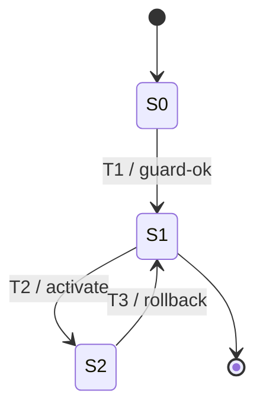

## 目标

对设计计划中推荐为 **S-State** 的逻辑用例，输出完整状态链工件：

1. 消费 `design-plan.md` 与 `design-planner-reasoning.md`；
2. 回链 `logic-cases.md`、`test-data.md`、`confirmed-scenarios.md`；
3. 生成状态图、状态清单、迁移表、迁移路径选择、守卫条件与触发数据叠加；
4. 在保留 `needs-confirmation` / `confirmation_gap_refs` 的前提下输出物理用例。

## 适用范围

> 统一输出规则：本 Skill 的方法过程写入 `design/ppdcs/<三级目录>-<四级目录>-<五级目录>-<逻辑用例名>.md`，物理用例写入 `design/pc/<三级目录>-<四级目录>-<五级目录>-<逻辑用例名>.md`。不得创建 `design/<module>/<sub-module>/` 深目录；同名冲突追加 `-<LC-ID>`。


- 适用阶段：MFQ 的 design 阶段
- 输入：
  - `analysis/integration/design-plan.md`
  - `analysis/plan/design-planner-reasoning.md`
  - `analysis/integration/logic-cases.md`
  - `analysis/integration/test-data.md`
  - `analysis/scenarios/confirmed-scenarios.md`
  - `process/REQUIREMENTS.md` / `process/HLD.md`（仅作为状态边界与术语基线）
- 输出：`design/ppdcs/<basename>.md` 与 `design/pc/<basename>.md`

## 前置条件

- [ ] 设计计划已确认，且目标 LC 的 `设计Skill = state-design`
- [ ] `design-planner-reasoning.md` 中存在对应 LC 的 reasoning
- [ ] LC / TD 中保留状态相关 trace、guard 缺口与 `fact_status`
- [ ] 场景链中能回链到对象生命周期、预期状态或状态迁移线索
- [ ] 若状态集合不稳定，准备以 `needs-confirmation` 显式保留，而不是伪造状态机

## 必须消费的输入契约

### 1. STORY-05 下游契约

| 来源 | 必收字段 | 用途 |
|------|----------|------|
| `design-plan.md` | `LC-ID`, `逻辑用例标题`, `PPDCS特征`, `推荐方法`, `设计Skill`, `主信号`, `候选特征`, `排除摘要`, `关键trace`, `待确认事项` | 确认 LC 应进入 `state-design` |
| `design-planner-reasoning.md` | `recommended_feature`, `recommended_method`, `design_skill`, `fact_status`, `primary_signal`, `candidate_features`, `exclusion_reasons`, `scenario_refs`, `scenario_chain_refs`, `td_refs`, `test_object_refs`, `factor_refs`, `uncertain_facts` | 解释为何采用状态图法，并保留未确认事实 |

### 2. STORY-04 / 上游场景与 trace 契约

| 来源 | 必收字段 | 用途 |
|------|----------|------|
| `logic-cases.md` | `LC-ID`, `source_tp_ids`, `scenario_refs`, `scenario_chain_refs`, `action_source_refs`, `knowledge_refs`, `confirmation_gap_refs`, `test_object_refs`, `factor_refs`, `topology_bindings`, `trace_refs`, `fact_status`, `动作路径`, `因子-取值表`, `CAE聚合规则`, `关联SR` | 识别状态主体、迁移动作、拓扑绑定目录与 trace 链 |
| `test-data.md` | `TD-ID`, `logic_case_id`, `factor_ref`, `value_set`, `source_section`, `scenario_refs`, `action_source_refs`, `trace_refs`, `confirmation_gap_refs`, `status` | 分析守卫条件、迁移触发数据与非法迁移 |
| `confirmed-scenarios.md` | `precondition_operations`, `atomic_operations`, `observation_points`, `expected_state`, `minimal_logic_chain`, `data_overlay_slots`, `atomic-ops`, `Knowledge Reference`, `confirmation_gaps` | 推导稳定状态、迁移与观察点 |

> 若某状态、迁移方向或守卫条件仅能从模糊表述猜测：
> - 不得脑补；
> - 写 `[待确认]`；
> - 保留 `confirmation_gap_refs` 与 `fact_status=needs-confirmation`。

## 拓扑绑定边界

- 必须消费 LC 的 `topology_bindings`，但拓扑实例不构成状态集合；
- `state_name`、迁移守卫、`value_set` 和 `factor_refs` 不得使用 `DUT.port*`、`TG.port*`、link/TOPO 实例作为状态值或因子值；
- 状态只能来自对象稳定生命周期或可观察状态；真实端口、link 和 TOPO 实例只能作为 PC 物化目标或绑定上下文；
- PC 阶段物化真实端口时，必须记录 `topology_binding_ref / materialized_object / source_ref / fact_status`；
- 若上游将 TOPO 实例混入状态、守卫或 TD 取值，必须移入拓扑绑定目录；绑定来源不清时，对应状态路径降级为 `needs-confirmation`。

## 执行流程

### 步骤 1：锁定目标 LC 与状态上下文

1. 从 `design-plan.md` 选出 `设计Skill = state-design` 的 LC。
2. 读取 reasoning 中的：
   - `primary_signal`
   - `candidate_features`
   - `exclusion_reasons`
   - `fact_status`
   - `uncertain_facts`
3. 若 reasoning 里 `P-Process` 仍是强候选，必须在设计过程文档中保留区分理由。

### 步骤 2：建立状态/迁移模型

状态必须来自**对象稳定状态**，不是瞬时动作。

- `expected_state` / 观察点 → 状态候选
- `atomic_operations` / 事件 → 迁移动作
- `preconditions` / TD 取值 → 守卫条件
- `E` 中的保持/拒绝/回退 → 非法迁移或状态保持

**状态最少字段**：

| 字段 | 说明 |
|------|------|
| `state_id` | 状态编号 |
| `state_name` | 状态名称 |
| `entry_conditions` | 进入条件 |
| `exit_observations` | 离开状态时的观察点 |
| `trace_refs` | 对应 trace |
| `confirmation_gap_refs` | 未确认状态语义 |
| `fact_status` | `confirmed / needs-confirmation` |

**迁移最少字段**：

| 字段 | 说明 |
|------|------|
| `transition_id` | 迁移编号 |
| `from` | 起始状态 |
| `to` | 目标状态；未知写 `[待确认]` |
| `event` | 触发事件 / 动作 |
| `guard` | 守卫条件 |
| `effect` | 迁移后可观测结果 |
| `trace_refs` | 关键 trace |
| `confirmation_gap_refs` | 未确认守卫 / 目标态 |
| `fact_status` | `confirmed / needs-confirmation` |

图示优先使用 Mermaid `stateDiagram-v2`。

### 步骤 3：生成迁移表与路径选择

至少输出：

1. 合法迁移表；
2. 已确认的非法迁移 / 守卫失败场景；
3. 迁移路径选择结果。

**迁移路径最小集合**：

| 路径类型 | 说明 |
|---------|------|
| 主生命周期路径 | 典型正常状态流 |
| 关键回退路径 | 状态可逆 / 恢复链 |
| 边界迁移路径 | 关键守卫边界触发 |
| 非法迁移路径 | 需求已定义或可由合法迁移矩阵直接判定 |

**迁移路径表最少字段**：

| 字段 | 说明 |
|------|------|
| `state_path_id` | 路径编号 |
| `transition_sequence` | 迁移序列 |
| `path_type` | 生命周期 / 回退 / 边界 / 非法 |
| `guard_summary` | 路径涉及的守卫 |
| `scenario_chain_refs` | PRE/AO/Observation |
| `trace_refs` | 关键 trace |
| `confirmation_gap_refs` | 未确认路径部分 |
| `fact_status` | `confirmed / needs-confirmation` |

### 步骤 4：分析守卫条件与数据叠加

以 `test-data.md` 为准，为每条迁移或迁移路径挂接数据：

1. 找到影响状态进入/退出的 `factor_ref`；
2. 将 `value_set` 映射到迁移的 `guard` 或 `event`；
3. 输出合法迁移数据与守卫失败数据；
4. `TD.status=needs-confirmation` 时，只能保留 `[待确认]`。
5. 从 LC `topology_bindings` 解析迁移路径所需的拓扑角色绑定；真实端口只在 PC 阶段物化，不进入守卫值域。

**迁移数据/叠加表最少字段**：

| 字段 | 说明 |
|------|------|
| `state_path_id` | 关联路径 |
| `transition_id` | 关联迁移 |
| `factor_ref` | 因子引用 |
| `td_ref` | 测试数据引用 |
| `value_set` | 取值；未确认保留 `[待确认]` |
| `guard_expectation` | 守卫通过 / 失败预期 |
| `data_overlay_set` | 迁移级数据集编号 |
| `confirmation_gap_refs` | 来自 TD / reasoning / scenario 的缺口 |
| `status` | `ready / needs-confirmation` |

### 步骤 5：定义覆盖策略

覆盖策略必须区分“合法迁移完整性”和“非法迁移代表性”：

- 主生命周期路径：必须覆盖
- 关键回退路径：若对象支持回退，必须覆盖
- 边界守卫路径：每个关键守卫至少 1 条通过 / 失败样例
- 非法迁移：只覆盖需求已定义或能直接从合法矩阵推导出的代表性非法迁移

若无法确认某状态是否存在、某迁移是否允许，必须：

- 不生成伪确定路径；
- 在 `design/ppdcs/<basename>.md` 单列 `[待确认]`；
- 维持 `fact_status=needs-confirmation`。

### 步骤 6：生成物理用例

PC 由 `覆盖策略选中的 state_path × data_overlay_set` 生成。

**与 `process-design` 共用的物理用例骨架**：

| 字段 | 说明 |
|------|------|
| `physical_case_id` | 物理用例编号 |
| `logic_case_id` | 所属 LC |
| `requirement_ids` | 关联需求 / SR |
| `feature_tags` | 功能分类标签 |
| `case_title` | 用例标题 |
| `priority` | 优先级 |
| `preconditions` | 前置条件 |
| `test_steps` | 步骤 |
| `expected_results` | 预期结果 |
| `graph_ref` | `state_path_id` |
| `coverage_goal` | 迁移路径覆盖目标 |
| `trigger_data` | 守卫/触发数据摘要 |
| `topology_binding_refs` | PC 物化使用的 LC 拓扑绑定引用；无则写 `—` |
| `trace_refs` | trace 链 |
| `scenario_refs` | 来源场景 |
| `scenario_chain_refs` | PRE/AO 引用 |
| `action_source_refs` | atomic-ops `op_id` |
| `confirmation_gap_refs` | 未确认事实 |
| `fact_status` | `confirmed / needs-confirmation` |

> 若 PC 依赖未确认状态名、迁移方向或守卫条件，`test_steps / expected_results / trigger_data` 必须保留 `[待确认]`。

## 输出文件结构

```text
design/ppdcs/<basename>.md
design/pc/<basename>.md
```

### `design/ppdcs/<basename>.md`

至少包含：

- `recommended_feature / recommended_method / design_skill`
- `primary_signal`
- `candidate_features`
- `exclusion_reasons`
- `fact_status`
- `test_object_refs / factor_refs`
- Design Context（来自 `design-plan + reasoning`）
- State Model（Mermaid + 状态清单）
- Transition Table
- State Path Selection
- Guard Conditions & Data Overlay
- PC Derivation Summary
- Uncertain Facts / Confirmation Gaps

### `design/pc/<basename>.md`

只输出最终 PC，但每条 PC 必须回链：

- `graph_ref`
- `topology_binding_refs`（存在真实端口物化时必须填写）
- `trace_refs`
- `scenario_refs`
- `scenario_chain_refs`
- `confirmation_gap_refs`
- `fact_status`

## 输出格式骨架

### State Model



### Transition Table

```markdown
| transition_id | from | to | event | guard | effect | confirmation_gap_refs | fact_status |
|---------------|------|----|-------|-------|--------|-----------------------|-------------|
| T1 | S0 | S1 | create | valid-input | 状态进入 S1 | — | confirmed |
| T2 | S1 | S2 | activate | `[待确认]` | 状态进入 S2 | GAP-003 | needs-confirmation |
```

### Guard Conditions & Data Overlay

```markdown
| state_path_id | transition_id | factor_ref | td_ref | value_set | guard_expectation | data_overlay_set | status |
|---------------|---------------|------------|-------|-----------|-------------------|------------------|--------|
| SP-01 | T1 | FAC-001 | TD-001 | `valid-a` | pass | OVL-01 | ready |
| SP-02 | T2 | FAC-002 | TD-002 | `[待确认]` | fail | OVL-02 | needs-confirmation |
```

## 公共因子库补充契约

- state-design 必须消费 lock 指定公共库中的 `factor_kind=state` 因子和 `sample_class=transition_*` 样本。
- 优先使用 `factor_bindings` 识别状态主体、迁移、守卫条件和非法迁移。
- 不得把普通范围边界值误判为状态。
- `factor_refs` 仅作兼容摘要。
- `factor_bindings` 只表达状态主体、迁移与守卫的逻辑绑定；真实端口和 TOPO 实例必须通过 LC `topology_bindings` 旁路保留。

## Gotchas

- 不得只读 `design-plan.md` 而忽略 `design-planner-reasoning.md`
- 状态必须是“稳定状态”，不能把瞬时动作直接当状态
- 非法迁移只能来自需求已定义或合法迁移矩阵直接推导，不能主观扩张
- `confirmation_gap_refs`、`uncertain_facts`、`TD.status=needs-confirmation` 不能被吞掉
- 若 `P-Process` 仍是强候选，必须写清“为何此处核心是状态迁移而非步骤流程”
- 不得把 TOPO 实例、link 或真实端口写成状态值、迁移守卫值或测试因子值。

## 验收标准

- [ ] 同时消费 `design-plan.md` 与 `design-planner-reasoning.md`
- [ ] 状态图输出 Mermaid `stateDiagram-v2`
- [ ] 存在状态清单、迁移表、迁移路径选择、守卫条件/数据叠加表
- [ ] 迁移路径保留 `scenario_chain_refs / confirmation_gap_refs / fact_status`
- [ ] `TD.status=needs-confirmation` 未被静默定值
- [ ] 物理用例字段骨架与 `process-design` 一致
- [ ] 输出采用 `design/ppdcs/<basename>.md` 与 `design/pc/<basename>.md`
- [ ] 已消费 LC `topology_bindings`；真实端口物化保留来源和 `fact_status`，且未进入 factor/data/state value
